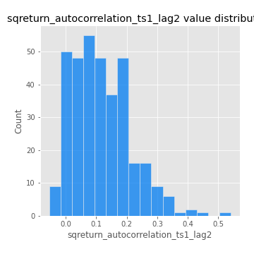

# Exploratory Data Analysis

[<< Go back](../README.md)
## Feature : target
- **Feature type** : categorical
- **Missing** : 0.0%
- **Unique** : 2
- **Count** :347
- **Unique** :2
- **Top** :simulated
- **Freq** :174

## Feature : mean1
- **Feature type** : continous
- **Missing** : 0.0%
- **Unique** : 347
- **Count** :347.0
- **Mean** :0.07395914989343665
- **Std** :0.07795614060665801
- **Min** :-0.22632637961920957
- **25%th Percentile** : 0.02770181926776724
- **50%th Percentile** : 0.07584719613426383
- **75%th Percentile** : 0.11552805071422285
- **Max** :0.37175100008111034

## Feature : mean2
- **Feature type** : continous
- **Missing** : 0.0%
- **Unique** : 347
- **Count** :347.0
- **Mean** :0.08693138733106497
- **Std** :0.08709973671792565
- **Min** :-0.24205418062825398
- **25%th Percentile** : 0.0437677159325527
- **50%th Percentile** : 0.08368210006052922
- **75%th Percentile** : 0.1443789988106982
- **Max** :0.37616608147096464

## Feature : sd1
- **Feature type** : continous
- **Missing** : 0.0%
- **Unique** : 347
- **Count** :347.0
- **Mean** :2.042830997184644
- **Std** :0.7850032023438007
- **Min** :0.73394829844003
- **25%th Percentile** : 1.5542126974592425
- **50%th Percentile** : 1.981518541366544
- **75%th Percentile** : 2.3695509346533052
- **Max** :9.236766377527575

## Feature : sd2
- **Feature type** : continous
- **Missing** : 0.0%
- **Unique** : 347
- **Count** :347.0
- **Mean** :1.9773370743220824
- **Std** :0.7907083370483245
- **Min** :0.8152741395774425
- **25%th Percentile** : 1.4995082935099249
- **50%th Percentile** : 1.8385346126338982
- **75%th Percentile** : 2.22014779138071
- **Max** :6.737618636746393

## Feature : skewness1
- **Feature type** : continous
- **Missing** : 0.0%
- **Unique** : 347
- **Count** :347.0
- **Mean** :-0.15961051365767537
- **Std** :0.5918181729687477
- **Min** :-3.530116233761814
- **25%th Percentile** : -0.3130395912545013
- **50%th Percentile** : -0.1168680550477798
- **75%th Percentile** : 0.04890025149446045
- **Max** :2.5845963767725557

## Feature : skewness2
- **Feature type** : continous
- **Missing** : 0.0%
- **Unique** : 347
- **Count** :347.0
- **Mean** :-0.24614996291155314
- **Std** :0.8205410131810204
- **Min** :-8.801502855292393
- **25%th Percentile** : -0.4006138463687471
- **50%th Percentile** : -0.16310261103686083
- **75%th Percentile** : 0.03428617446783082
- **Max** :2.2606839051517187

## Feature : kurtosis1
- **Feature type** : continous
- **Missing** : 0.0%
- **Unique** : 347
- **Count** :347.0
- **Mean** :3.94148207398662
- **Std** :5.615000577595964
- **Min** :0.157580744166542
- **25%th Percentile** : 1.2090496228909213
- **50%th Percentile** : 1.9677773743006974
- **75%th Percentile** : 3.9686534395105126
- **Max** :36.91113889081053

## Feature : kurtosis2
- **Feature type** : continous
- **Missing** : 0.0%
- **Unique** : 347
- **Count** :347.0
- **Mean** :4.799134494037844
- **Std** :9.861993032663436
- **Min** :-0.09607442861881355
- **25%th Percentile** : 1.3467594367874907
- **50%th Percentile** : 2.2076535242438857
- **75%th Percentile** : 4.591559938436165
- **Max** :143.10871011533666

## Feature : return_autocorrelation_1_lag1
- **Feature type** : continous
- **Missing** : 0.0%
- **Unique** : 347
- **Count** :347.0
- **Mean** :-0.011292114522056456
- **Std** :0.06388513139135
- **Min** :-0.2135576224968752
- **25%th Percentile** : -0.04756682348988446
- **50%th Percentile** : -0.004452624207810848
- **75%th Percentile** : 0.029802328665712648
- **Max** :0.14884242613358584

## Feature : return_autocorrelation_1_lag2
- **Feature type** : continous
- **Missing** : 0.0%
- **Unique** : 347
- **Count** :347.0
- **Mean** :-0.008577029742312264
- **Std** :0.05486294571951514
- **Min** :-0.13309283796645122
- **25%th Percentile** : -0.04430450861974725
- **50%th Percentile** : -0.009750944605521384
- **75%th Percentile** : 0.02535685319109501
- **Max** :0.15846435814570647

## Feature : return_autocorrelation_1_lag3
- **Feature type** : continous
- **Missing** : 0.0%
- **Unique** : 347
- **Count** :347.0
- **Mean** :-0.004635099531880405
- **Std** :0.05972878499946541
- **Min** :-0.1940836867390813
- **25%th Percentile** : -0.044846396333908536
- **50%th Percentile** : -0.0022391306043750177
- **75%th Percentile** : 0.0353957368027029
- **Max** :0.17805869530681923

## Feature : return_autocorrelation_2_lag1
- **Feature type** : continous
- **Missing** : 0.0%
- **Unique** : 347
- **Count** :347.0
- **Mean** :-0.011121225231931422
- **Std** :0.06264045519533885
- **Min** :-0.25075531010123286
- **25%th Percentile** : -0.04224166849200631
- **50%th Percentile** : -0.010518740036997133
- **75%th Percentile** : 0.022726051362417635
- **Max** :0.31863413537898483

## Feature : return_autocorrelation_2_lag2
- **Feature type** : continous
- **Missing** : 0.0%
- **Unique** : 347
- **Count** :347.0
- **Mean** :-0.006894751889579437
- **Std** :0.05665759797610117
- **Min** :-0.15323211089747296
- **25%th Percentile** : -0.04571893415561436
- **50%th Percentile** : -0.009555497467738329
- **75%th Percentile** : 0.02822009585226396
- **Max** :0.20974504043791217

## Feature : return_autocorrelation_2_lag3
- **Feature type** : continous
- **Missing** : 0.0%
- **Unique** : 347
- **Count** :347.0
- **Mean** :-0.01050527610640645
- **Std** :0.054909529317934636
- **Min** :-0.14445408148258618
- **25%th Percentile** : -0.04708614131357031
- **50%th Percentile** : -0.010490735737320202
- **75%th Percentile** : 0.026299153210898957
- **Max** :0.1419999376914021

## Feature : return_correlation_ts1_lag_0
- **Feature type** : continous
- **Missing** : 0.0%
- **Unique** : 347
- **Count** :347.0
- **Mean** :0.3375340727986727
- **Std** :0.11233471226293205
- **Min** :0.005136598099876001
- **25%th Percentile** : 0.2816072959659573
- **50%th Percentile** : 0.3450079047899799
- **75%th Percentile** : 0.39288728613765483
- **Max** :0.7041861626832071

## Feature : return_correlation_ts1_lag_1
- **Feature type** : continous
- **Missing** : 0.0%
- **Unique** : 347
- **Count** :347.0
- **Mean** :-0.0069184351096551345
- **Std** :0.054627873171586475
- **Min** :-0.16985510949917193
- **25%th Percentile** : -0.040299570183780484
- **50%th Percentile** : -0.0065776061526431175
- **75%th Percentile** : 0.029471093619102315
- **Max** :0.16936715416022516

## Feature : return_correlation_ts1_lag_2
- **Feature type** : continous
- **Missing** : 0.0%
- **Unique** : 347
- **Count** :347.0
- **Mean** :-0.001850790681339201
- **Std** :0.05512557525428805
- **Min** :-0.21653581047581763
- **25%th Percentile** : -0.037323361391493816
- **50%th Percentile** : -0.0027026287095217373
- **75%th Percentile** : 0.038698370789987176
- **Max** :0.18526412651961158

## Feature : return_correlation_ts1_lag_3
- **Feature type** : continous
- **Missing** : 0.0%
- **Unique** : 347
- **Count** :347.0
- **Mean** :-0.005200863778461362
- **Std** :0.056376488055798785
- **Min** :-0.14264566853719077
- **25%th Percentile** : -0.04341641553990705
- **50%th Percentile** : -0.007344467411456866
- **75%th Percentile** : 0.03450664505736821
- **Max** :0.1636773216468148

## Feature : return_correlation_ts2_lag_1
- **Feature type** : continous
- **Missing** : 0.0%
- **Unique** : 347
- **Count** :347.0
- **Mean** :-0.00972968376288614
- **Std** :0.055802036717440925
- **Min** :-0.20093919236581337
- **25%th Percentile** : -0.04037841597339083
- **50%th Percentile** : -0.011696645562261448
- **75%th Percentile** : 0.023957052258583737
- **Max** :0.18414368167600778

## Feature : return_correlation_ts2_lag_2
- **Feature type** : continous
- **Missing** : 0.0%
- **Unique** : 347
- **Count** :347.0
- **Mean** :-0.003924795068199698
- **Std** :0.052598110332142345
- **Min** :-0.23751835475804678
- **25%th Percentile** : -0.03980069832590791
- **50%th Percentile** : -0.005562837784737161
- **75%th Percentile** : 0.02673401762698645
- **Max** :0.20772887392904255

## Feature : return_correlation_ts2_lag_3
- **Feature type** : continous
- **Missing** : 0.0%
- **Unique** : 347
- **Count** :347.0
- **Mean** :-0.004426842659948638
- **Std** :0.05555599734276192
- **Min** :-0.18854228636447845
- **25%th Percentile** : -0.03460932049162474
- **50%th Percentile** : -0.0016874913516673263
- **75%th Percentile** : 0.03260280742488626
- **Max** :0.13523139217107155

## Feature : sqreturn_autocorrelation_ts1_lag1
- **Feature type** : continous
- **Missing** : 0.0%
- **Unique** : 347
- **Count** :347.0
- **Mean** :0.12258228334461549
- **Std** :0.08862099627473173
- **Min** :-0.052978649713557625
- **25%th Percentile** : 0.05369579003583498
- **50%th Percentile** : 0.10790166496354664
- **75%th Percentile** : 0.1826849904912065
- **Max** :0.4439086285737898

## Feature : sqreturn_autocorrelation_ts1_lag2
- **Feature type** : continous
- **Missing** : 0.0%
- **Unique** : 347
- **Count** :347.0
- **Mean** :0.11663248718039289
- **Std** :0.09618818585211102
- **Min** :-0.05419304650062953
- **25%th Percentile** : 0.04278830675571359
- **50%th Percentile** : 0.10390452361215542
- **75%th Percentile** : 0.1771896368074965
- **Max** :0.540735851444759

## Feature : sqreturn_autocorrelation_ts1_lag3
- **Feature type** : continous
- **Missing** : 0.0%
- **Unique** : 347
- **Count** :347.0
- **Mean** :0.1076339577228096
- **Std** :0.08933540883033611
- **Min** :-0.05313973583773816
- **25%th Percentile** : 0.03351516853956158
- **50%th Percentile** : 0.10040802789101516
- **75%th Percentile** : 0.16863447758131347
- **Max** :0.44755937369538146

## Feature : sqreturn_autocorrelation_ts2_lag1
- **Feature type** : continous
- **Missing** : 0.0%
- **Unique** : 347
- **Count** :347.0
- **Mean** :0.1213091140550318
- **Std** :0.09029856382903378
- **Min** :-0.08520586663750691
- **25%th Percentile** : 0.05337362321831225
- **50%th Percentile** : 0.11302292654885325
- **75%th Percentile** : 0.16723326536579947
- **Max** :0.46082481547722237

## Feature : sqreturn_autocorrelation_ts2_lag2
- **Feature type** : continous
- **Missing** : 0.0%
- **Unique** : 347
- **Count** :347.0
- **Mean** :0.11202466266819135
- **Std** :0.09505667940907889
- **Min** :-0.04424883229120365
- **25%th Percentile** : 0.0355229114015586
- **50%th Percentile** : 0.10629822513812573
- **75%th Percentile** : 0.16985746858246123
- **Max** :0.5373432415582473

## Feature : sqreturn_autocorrelation_ts2_lag3
- **Feature type** : continous
- **Missing** : 0.0%
- **Unique** : 347
- **Count** :347.0
- **Mean** :0.09543491988364931
- **Std** :0.08171672663579162
- **Min** :-0.049271901244418284
- **25%th Percentile** : 0.02543876877602907
- **50%th Percentile** : 0.09334201072360183
- **75%th Percentile** : 0.15242829303205271
- **Max** :0.3648608926785311

## Feature : sqreturn_correlation_ts1_lag_0
- **Feature type** : continous
- **Missing** : 0.0%
- **Unique** : 347
- **Count** :347.0
- **Mean** :0.3375340727986727
- **Std** :0.11233471226293205
- **Min** :0.005136598099876001
- **25%th Percentile** : 0.2816072959659573
- **50%th Percentile** : 0.3450079047899799
- **75%th Percentile** : 0.39288728613765483
- **Max** :0.7041861626832071

## Feature : sqreturn_correlation_ts1_lag_1
- **Feature type** : continous
- **Missing** : 0.0%
- **Unique** : 347
- **Count** :347.0
- **Mean** :-0.0069184351096551345
- **Std** :0.054627873171586475
- **Min** :-0.16985510949917193
- **25%th Percentile** : -0.040299570183780484
- **50%th Percentile** : -0.0065776061526431175
- **75%th Percentile** : 0.029471093619102315
- **Max** :0.16936715416022516

## Feature : sqreturn_correlation_ts1_lag_2
- **Feature type** : continous
- **Missing** : 0.0%
- **Unique** : 347
- **Count** :347.0
- **Mean** :-0.001850790681339201
- **Std** :0.05512557525428805
- **Min** :-0.21653581047581763
- **25%th Percentile** : -0.037323361391493816
- **50%th Percentile** : -0.0027026287095217373
- **75%th Percentile** : 0.038698370789987176
- **Max** :0.18526412651961158

## Feature : sqreturn_correlation_ts1_lag_3
- **Feature type** : continous
- **Missing** : 0.0%
- **Unique** : 347
- **Count** :347.0
- **Mean** :-0.005200863778461362
- **Std** :0.056376488055798785
- **Min** :-0.14264566853719077
- **25%th Percentile** : -0.04341641553990705
- **50%th Percentile** : -0.007344467411456866
- **75%th Percentile** : 0.03450664505736821
- **Max** :0.1636773216468148

## Feature : sqreturn_correlation_ts2_lag_1
- **Feature type** : continous
- **Missing** : 0.0%
- **Unique** : 347
- **Count** :347.0
- **Mean** :-0.00972968376288614
- **Std** :0.055802036717440925
- **Min** :-0.20093919236581337
- **25%th Percentile** : -0.04037841597339083
- **50%th Percentile** : -0.011696645562261448
- **75%th Percentile** : 0.023957052258583737
- **Max** :0.18414368167600778

## Feature : sqreturn_correlation_ts2_lag_2
- **Feature type** : continous
- **Missing** : 0.0%
- **Unique** : 347
- **Count** :347.0
- **Mean** :-0.003924795068199698
- **Std** :0.052598110332142345
- **Min** :-0.23751835475804678
- **25%th Percentile** : -0.03980069832590791
- **50%th Percentile** : -0.005562837784737161
- **75%th Percentile** : 0.02673401762698645
- **Max** :0.20772887392904255

## Feature : sqreturn_correlation_ts2_lag_3
- **Feature type** : continous
- **Missing** : 0.0%
- **Unique** : 347
- **Count** :347.0
- **Mean** :-0.004426842659948638
- **Std** :0.05555599734276192
- **Min** :-0.18854228636447845
- **25%th Percentile** : -0.03460932049162474
- **50%th Percentile** : -0.0016874913516673263
- **75%th Percentile** : 0.03260280742488626
- **Max** :0.13523139217107155

## Feature : price2_granger_cause_price1
- **Feature type** : continous
- **Missing** : 0.0%
- **Unique** : 347
- **Count** :347.0
- **Mean** :0.3140969677917245
- **Std** :0.3030165770464667
- **Min** :4.772894352322484e-07
- **25%th Percentile** : 0.04849419542404766
- **50%th Percentile** : 0.2263259877257201
- **75%th Percentile** : 0.5249550652022528
- **Max** :0.9885712803689185

## Feature : price1_granger_cause_price2
- **Feature type** : continous
- **Missing** : 0.0%
- **Unique** : 347
- **Count** :347.0
- **Mean** :0.29761988560622454
- **Std** :0.2897838147588517
- **Min** :3.129562904929008e-07
- **25%th Percentile** : 0.037373248520613966
- **50%th Percentile** : 0.21573654946768422
- **75%th Percentile** : 0.5156582458174066
- **Max** :0.9977743569241199

[<< Go back](../README.md)
