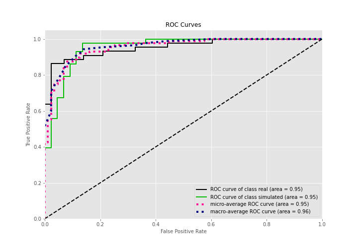

# Summary of 3_Linear

[<< Go back](../README.md)

## Logistic Regression (Linear)
- **n_jobs**: -1
- **explain_level**: 2

## Validation
 - **validation_type**: split
 - **train_ratio**: 0.75
 - **shuffle**: True
 - **stratify**: True

## Optimized metric
accuracy

## Training time

14.5 seconds

## Metric details
|           |    score |     threshold |
|:----------|---------:|--------------:|
| logloss   | 0.301866 | nan           |
| auc       | 0.954017 | nan           |
| f1        | 0.923077 |   0.324604    |
| accuracy  | 0.91954  |   0.324604    |
| precision | 1        |   0.840443    |
| recall    | 1        |   6.19935e-08 |
| mcc       | 0.844858 |   0.324604    |

## Confusion matrix (at threshold=0.324604)
|                      |   Predicted as real |   Predicted as simulated |
|:---------------------|--------------------:|-------------------------:|
| Labeled as real      |                  38 |                        6 |
| Labeled as simulated |                   1 |                       42 |

## Learning curves

## Coefficients
| feature                           |   Learner_1 |
|:----------------------------------|------------:|
| mean1                             |   1.74064   |
| sqreturn_autocorrelation_ts2_lag3 |   1.47575   |
| mean2                             |   1.39202   |
| sqreturn_autocorrelation_ts2_lag2 |   1.21916   |
| sqreturn_autocorrelation_ts2_lag1 |   1.12231   |
| sqreturn_autocorrelation_ts1_lag3 |   1.07037   |
| return_autocorrelation_2_lag1     |   0.866485  |
| sqreturn_autocorrelation_ts1_lag1 |   0.827092  |
| sqreturn_autocorrelation_ts1_lag2 |   0.818999  |
| sqreturn_correlation_ts2_lag_3    |   0.685591  |
| return_correlation_ts2_lag_3      |   0.685591  |
| return_correlation_ts1_lag_1      |   0.587822  |
| sqreturn_correlation_ts1_lag_1    |   0.587822  |
| sqreturn_correlation_ts2_lag_1    |   0.53205   |
| return_correlation_ts2_lag_1      |   0.53205   |
| sd1                               |   0.374714  |
| return_autocorrelation_1_lag3     |   0.355407  |
| return_autocorrelation_1_lag1     |   0.290921  |
| return_autocorrelation_2_lag3     |   0.271771  |
| sqreturn_correlation_ts1_lag_3    |   0.244029  |
| return_correlation_ts1_lag_3      |   0.244029  |
| sd2                               |   0.110966  |
| return_autocorrelation_1_lag2     |   0.0999752 |
| return_autocorrelation_2_lag2     |   0.083508  |
| return_correlation_ts1_lag_0      |  -0.129435  |
| sqreturn_correlation_ts1_lag_0    |  -0.129435  |
| return_correlation_ts2_lag_2      |  -0.174832  |
| sqreturn_correlation_ts2_lag_2    |  -0.174832  |
| price1_granger_cause_price2       |  -0.199601  |
| skewness1                         |  -0.210427  |
| return_correlation_ts1_lag_2      |  -0.213456  |
| sqreturn_correlation_ts1_lag_2    |  -0.213456  |
| skewness2                         |  -0.643856  |
| price2_granger_cause_price1       |  -0.852074  |
| intercept                         |  -1.75792   |
| kurtosis1                         |  -2.80984   |
| kurtosis2                         |  -2.88856   |

## Permutation-based Importance

## Confusion Matrix

## Normalized Confusion Matrix

## ROC Curve

## Kolmogorov-Smirnov Statistic

## Precision-Recall Curve

## Calibration Curve

## Cumulative Gains Curve

## Lift Curve

## SHAP Importance

## SHAP Dependence plots

### Dependence (Fold 1)

## SHAP Decision plots

### Top-10 Worst decisions for class 0 (Fold 1)

### Top-10 Best decisions for class 0 (Fold 1)

### Top-10 Worst decisions for class 1 (Fold 1)

### Top-10 Best decisions for class 1 (Fold 1)

[<< Go back](../README.md)
