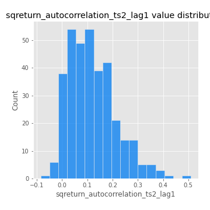

# Exploratory Data Analysis

[<< Go back](../README.md)
## Feature : target
- **Feature type** : categorical
- **Missing** : 0.0%
- **Unique** : 2
- **Count** :347
- **Unique** :2
- **Top** :real
- **Freq** :174

## Feature : mean1
- **Feature type** : continous
- **Missing** : 0.0%
- **Unique** : 347
- **Count** :347.0
- **Mean** :0.08303216052212407
- **Std** :0.0764422875599352
- **Min** :-0.22632637961920957
- **25%th Percentile** : 0.0373393824620476
- **50%th Percentile** : 0.08091392997518863
- **75%th Percentile** : 0.12555127717306336
- **Max** :0.37175100008111034

## Feature : mean2
- **Feature type** : continous
- **Missing** : 0.0%
- **Unique** : 347
- **Count** :347.0
- **Mean** :0.08315062732955734
- **Std** :0.08273639476811559
- **Min** :-0.2144814672643959
- **25%th Percentile** : 0.03916030206698605
- **50%th Percentile** : 0.0836847589537287
- **75%th Percentile** : 0.13441428170938852
- **Max** :0.37616608147096464

## Feature : sd1
- **Feature type** : continous
- **Missing** : 0.0%
- **Unique** : 347
- **Count** :347.0
- **Mean** :2.053725812681935
- **Std** :0.8015675389763784
- **Min** :0.7470080772831957
- **25%th Percentile** : 1.5508143885597074
- **50%th Percentile** : 2.036048747840132
- **75%th Percentile** : 2.3918499825460158
- **Max** :9.236766377527575

## Feature : sd2
- **Feature type** : continous
- **Missing** : 0.0%
- **Unique** : 347
- **Count** :347.0
- **Mean** :1.904276152910826
- **Std** :0.6811099892975834
- **Min** :0.8455946193085045
- **25%th Percentile** : 1.4427792493399545
- **50%th Percentile** : 1.8495041188524242
- **75%th Percentile** : 2.168403422118285
- **Max** :6.737618636746393

## Feature : skewness1
- **Feature type** : continous
- **Missing** : 0.0%
- **Unique** : 347
- **Count** :347.0
- **Mean** :-0.17790736775276342
- **Std** :0.5916934360990013
- **Min** :-3.530116233761814
- **25%th Percentile** : -0.3015747529777852
- **50%th Percentile** : -0.13522894387335366
- **75%th Percentile** : 0.02911252013189383
- **Max** :2.5845963767725557

## Feature : skewness2
- **Feature type** : continous
- **Missing** : 0.0%
- **Unique** : 347
- **Count** :347.0
- **Mean** :-0.27072327015926173
- **Std** :0.7309704962058858
- **Min** :-8.801502855292393
- **25%th Percentile** : -0.39634608619670775
- **50%th Percentile** : -0.1913009332927088
- **75%th Percentile** : -0.01531336701447112
- **Max** :2.2606839051517187

## Feature : kurtosis1
- **Feature type** : continous
- **Missing** : 0.0%
- **Unique** : 347
- **Count** :347.0
- **Mean** :4.079816685959971
- **Std** :5.93096640158661
- **Min** :0.044176471913603965
- **25%th Percentile** : 1.1302424863838159
- **50%th Percentile** : 1.9665377035599358
- **75%th Percentile** : 3.9930614339876844
- **Max** :36.91113889081053

## Feature : kurtosis2
- **Feature type** : continous
- **Missing** : 0.0%
- **Unique** : 347
- **Count** :347.0
- **Mean** :4.478435229152956
- **Std** :9.161876293396459
- **Min** :-0.04217225665585511
- **25%th Percentile** : 1.2118346051989564
- **50%th Percentile** : 2.181476813848588
- **75%th Percentile** : 4.443645217136195
- **Max** :143.10871011533666

## Feature : return_autocorrelation_1_lag1
- **Feature type** : continous
- **Missing** : 0.0%
- **Unique** : 347
- **Count** :347.0
- **Mean** :-0.01392510093918057
- **Std** :0.06163668921144215
- **Min** :-0.21245671666510704
- **25%th Percentile** : -0.05262464371489661
- **50%th Percentile** : -0.00688475987564147
- **75%th Percentile** : 0.030814213991244094
- **Max** :0.12541967001257895

## Feature : return_autocorrelation_1_lag2
- **Feature type** : continous
- **Missing** : 0.0%
- **Unique** : 347
- **Count** :347.0
- **Mean** :-0.001454211583745176
- **Std** :0.053197701842247064
- **Min** :-0.1278827378221524
- **25%th Percentile** : -0.03709899463181016
- **50%th Percentile** : -0.002183858713601296
- **75%th Percentile** : 0.03117747098136248
- **Max** :0.1561488228015672

## Feature : return_autocorrelation_1_lag3
- **Feature type** : continous
- **Missing** : 0.0%
- **Unique** : 347
- **Count** :347.0
- **Mean** :-0.005456518386011809
- **Std** :0.0534056085483481
- **Min** :-0.1940836867390813
- **25%th Percentile** : -0.037057959069835306
- **50%th Percentile** : -0.004670915865281931
- **75%th Percentile** : 0.02799646834744077
- **Max** :0.18110672815320364

## Feature : return_autocorrelation_2_lag1
- **Feature type** : continous
- **Missing** : 0.0%
- **Unique** : 347
- **Count** :347.0
- **Mean** :-0.016814185764528766
- **Std** :0.06038081642604657
- **Min** :-0.25075531010123286
- **25%th Percentile** : -0.05160155800134612
- **50%th Percentile** : -0.01302969649053556
- **75%th Percentile** : 0.023522447830114708
- **Max** :0.19993070804870888

## Feature : return_autocorrelation_2_lag2
- **Feature type** : continous
- **Missing** : 0.0%
- **Unique** : 347
- **Count** :347.0
- **Mean** :-0.003038804566000173
- **Std** :0.056273621758363486
- **Min** :-0.1495113937562178
- **25%th Percentile** : -0.037865510264835076
- **50%th Percentile** : -0.007279986870345327
- **75%th Percentile** : 0.032592807974166804
- **Max** :0.19194471894240445

## Feature : return_autocorrelation_2_lag3
- **Feature type** : continous
- **Missing** : 0.0%
- **Unique** : 347
- **Count** :347.0
- **Mean** :-0.013590078908113128
- **Std** :0.05462610730110018
- **Min** :-0.190929229160193
- **25%th Percentile** : -0.05059094448504261
- **50%th Percentile** : -0.01101988074859781
- **75%th Percentile** : 0.02467521628270007
- **Max** :0.12503647672704823

## Feature : return_correlation_ts1_lag_0
- **Feature type** : continous
- **Missing** : 0.0%
- **Unique** : 347
- **Count** :347.0
- **Mean** :0.33253474145217937
- **Std** :0.11248772778291258
- **Min** :-0.027089510445801036
- **25%th Percentile** : 0.2775131626150168
- **50%th Percentile** : 0.336882256357014
- **75%th Percentile** : 0.39328111328570786
- **Max** :0.7028422087350163

## Feature : return_correlation_ts1_lag_1
- **Feature type** : continous
- **Missing** : 0.0%
- **Unique** : 347
- **Count** :347.0
- **Mean** :-0.00793275354185159
- **Std** :0.05620356480561257
- **Min** :-0.1549695474991776
- **25%th Percentile** : -0.044514075263328394
- **50%th Percentile** : -0.005951005874648678
- **75%th Percentile** : 0.029586483346570255
- **Max** :0.17054215834169745

## Feature : return_correlation_ts1_lag_2
- **Feature type** : continous
- **Missing** : 0.0%
- **Unique** : 347
- **Count** :347.0
- **Mean** :9.975943826216968e-05
- **Std** :0.05398161531326137
- **Min** :-0.1661699133137639
- **25%th Percentile** : -0.0381548548073177
- **50%th Percentile** : -0.002198143922775146
- **75%th Percentile** : 0.038418599700069396
- **Max** :0.1758521093341061

## Feature : return_correlation_ts1_lag_3
- **Feature type** : continous
- **Missing** : 0.0%
- **Unique** : 347
- **Count** :347.0
- **Mean** :-0.0058759990432077636
- **Std** :0.056563877443675165
- **Min** :-0.14363965098801754
- **25%th Percentile** : -0.04243320689492827
- **50%th Percentile** : -0.007344467411456866
- **75%th Percentile** : 0.031650804409083744
- **Max** :0.1636773216468148

## Feature : return_correlation_ts2_lag_1
- **Feature type** : continous
- **Missing** : 0.0%
- **Unique** : 347
- **Count** :347.0
- **Mean** :-0.01098771022982388
- **Std** :0.05430970968022746
- **Min** :-0.2081139431093261
- **25%th Percentile** : -0.04241865948716819
- **50%th Percentile** : -0.009866335752524082
- **75%th Percentile** : 0.024491610522745337
- **Max** :0.12484350753236446

## Feature : return_correlation_ts2_lag_2
- **Feature type** : continous
- **Missing** : 0.0%
- **Unique** : 347
- **Count** :347.0
- **Mean** :0.00048512059710561264
- **Std** :0.051868295756693175
- **Min** :-0.23751835475804678
- **25%th Percentile** : -0.03450077652482667
- **50%th Percentile** : -6.430254566090361e-05
- **75%th Percentile** : 0.03391248369427209
- **Max** :0.20772887392904255

## Feature : return_correlation_ts2_lag_3
- **Feature type** : continous
- **Missing** : 0.0%
- **Unique** : 347
- **Count** :347.0
- **Mean** :-0.005197711657551885
- **Std** :0.0552376147999887
- **Min** :-0.17564076057312866
- **25%th Percentile** : -0.03662946180351652
- **50%th Percentile** : -0.003451645375118328
- **75%th Percentile** : 0.032841404817839856
- **Max** :0.13698166980703036

## Feature : sqreturn_autocorrelation_ts1_lag1
- **Feature type** : continous
- **Missing** : 0.0%
- **Unique** : 347
- **Count** :347.0
- **Mean** :0.11642807692041833
- **Std** :0.0879072629625636
- **Min** :-0.06532118872798363
- **25%th Percentile** : 0.05085353723136024
- **50%th Percentile** : 0.1046471983769949
- **75%th Percentile** : 0.16262094108540154
- **Max** :0.4439086285737898

## Feature : sqreturn_autocorrelation_ts1_lag2
- **Feature type** : continous
- **Missing** : 0.0%
- **Unique** : 347
- **Count** :347.0
- **Mean** :0.10516208292220786
- **Std** :0.09170522303722793
- **Min** :-0.05165593255897504
- **25%th Percentile** : 0.03447971453942569
- **50%th Percentile** : 0.09230812281399668
- **75%th Percentile** : 0.1610042410095135
- **Max** :0.4522162366773919

## Feature : sqreturn_autocorrelation_ts1_lag3
- **Feature type** : continous
- **Missing** : 0.0%
- **Unique** : 347
- **Count** :347.0
- **Mean** :0.09728965770139363
- **Std** :0.08990938713939549
- **Min** :-0.06486026764840777
- **25%th Percentile** : 0.029115933223964937
- **50%th Percentile** : 0.08082222524749573
- **75%th Percentile** : 0.1498104220937045
- **Max** :0.41030914918857014

## Feature : sqreturn_autocorrelation_ts2_lag1
- **Feature type** : continous
- **Missing** : 0.0%
- **Unique** : 347
- **Count** :347.0
- **Mean** :0.11999200781047019
- **Std** :0.09238512672305343
- **Min** :-0.08520586663750691
- **25%th Percentile** : 0.048629439280870726
- **50%th Percentile** : 0.10661768124734439
- **75%th Percentile** : 0.17383840815044516
- **Max** :0.510085647437958

## Feature : sqreturn_autocorrelation_ts2_lag2
- **Feature type** : continous
- **Missing** : 0.0%
- **Unique** : 347
- **Count** :347.0
- **Mean** :0.11272415914974819
- **Std** :0.09748822845888597
- **Min** :-0.051523884196217395
- **25%th Percentile** : 0.032169931044099126
- **50%th Percentile** : 0.09986239303664454
- **75%th Percentile** : 0.17708213861155148
- **Max** :0.45676817892778204

## Feature : sqreturn_autocorrelation_ts2_lag3
- **Feature type** : continous
- **Missing** : 0.0%
- **Unique** : 347
- **Count** :347.0
- **Mean** :0.0967204368371133
- **Std** :0.08726454811170982
- **Min** :-0.06082766359524085
- **25%th Percentile** : 0.024503038410491507
- **50%th Percentile** : 0.08103205854079587
- **75%th Percentile** : 0.15920381752255455
- **Max** :0.3677950279103671

## Feature : sqreturn_correlation_ts1_lag_0
- **Feature type** : continous
- **Missing** : 0.0%
- **Unique** : 347
- **Count** :347.0
- **Mean** :0.33253474145217937
- **Std** :0.11248772778291258
- **Min** :-0.027089510445801036
- **25%th Percentile** : 0.2775131626150168
- **50%th Percentile** : 0.336882256357014
- **75%th Percentile** : 0.39328111328570786
- **Max** :0.7028422087350163

## Feature : sqreturn_correlation_ts1_lag_1
- **Feature type** : continous
- **Missing** : 0.0%
- **Unique** : 347
- **Count** :347.0
- **Mean** :-0.00793275354185159
- **Std** :0.05620356480561257
- **Min** :-0.1549695474991776
- **25%th Percentile** : -0.044514075263328394
- **50%th Percentile** : -0.005951005874648678
- **75%th Percentile** : 0.029586483346570255
- **Max** :0.17054215834169745

## Feature : sqreturn_correlation_ts1_lag_2
- **Feature type** : continous
- **Missing** : 0.0%
- **Unique** : 347
- **Count** :347.0
- **Mean** :9.975943826216968e-05
- **Std** :0.05398161531326137
- **Min** :-0.1661699133137639
- **25%th Percentile** : -0.0381548548073177
- **50%th Percentile** : -0.002198143922775146
- **75%th Percentile** : 0.038418599700069396
- **Max** :0.1758521093341061

## Feature : sqreturn_correlation_ts1_lag_3
- **Feature type** : continous
- **Missing** : 0.0%
- **Unique** : 347
- **Count** :347.0
- **Mean** :-0.0058759990432077636
- **Std** :0.056563877443675165
- **Min** :-0.14363965098801754
- **25%th Percentile** : -0.04243320689492827
- **50%th Percentile** : -0.007344467411456866
- **75%th Percentile** : 0.031650804409083744
- **Max** :0.1636773216468148

## Feature : sqreturn_correlation_ts2_lag_1
- **Feature type** : continous
- **Missing** : 0.0%
- **Unique** : 347
- **Count** :347.0
- **Mean** :-0.01098771022982388
- **Std** :0.05430970968022746
- **Min** :-0.2081139431093261
- **25%th Percentile** : -0.04241865948716819
- **50%th Percentile** : -0.009866335752524082
- **75%th Percentile** : 0.024491610522745337
- **Max** :0.12484350753236446

## Feature : sqreturn_correlation_ts2_lag_2
- **Feature type** : continous
- **Missing** : 0.0%
- **Unique** : 347
- **Count** :347.0
- **Mean** :0.00048512059710561264
- **Std** :0.051868295756693175
- **Min** :-0.23751835475804678
- **25%th Percentile** : -0.03450077652482667
- **50%th Percentile** : -6.430254566090361e-05
- **75%th Percentile** : 0.03391248369427209
- **Max** :0.20772887392904255

## Feature : sqreturn_correlation_ts2_lag_3
- **Feature type** : continous
- **Missing** : 0.0%
- **Unique** : 347
- **Count** :347.0
- **Mean** :-0.005197711657551885
- **Std** :0.0552376147999887
- **Min** :-0.17564076057312866
- **25%th Percentile** : -0.03662946180351652
- **50%th Percentile** : -0.003451645375118328
- **75%th Percentile** : 0.032841404817839856
- **Max** :0.13698166980703036

## Feature : price2_granger_cause_price1
- **Feature type** : continous
- **Missing** : 0.0%
- **Unique** : 347
- **Count** :347.0
- **Mean** :0.3235966570328821
- **Std** :0.29725408928908614
- **Min** :1.0286626493536928e-10
- **25%th Percentile** : 0.05016818551190424
- **50%th Percentile** : 0.2478010777982621
- **75%th Percentile** : 0.5794086466992999
- **Max** :0.9885712803689185

## Feature : price1_granger_cause_price2
- **Feature type** : continous
- **Missing** : 0.0%
- **Unique** : 347
- **Count** :347.0
- **Mean** :0.3013032955667833
- **Std** :0.2958791622395338
- **Min** :4.469324152273661e-10
- **25%th Percentile** : 0.03742488590330564
- **50%th Percentile** : 0.19712117061911075
- **75%th Percentile** : 0.5252454193681737
- **Max** :0.9949440906566768

[<< Go back](../README.md)
