# Summary of 2_DecisionTree

[<< Go back](../README.md)

## Decision Tree
- **n_jobs**: -1
- **criterion**: gini
- **max_depth**: 3
- **explain_level**: 2

## Validation
 - **validation_type**: split
 - **train_ratio**: 0.75
 - **shuffle**: True
 - **stratify**: True

## Optimized metric
accuracy

## Training time

17.6 seconds

## Metric details
|           |    score |   threshold |
|:----------|---------:|------------:|
| logloss   | 1.33473  |  nan        |
| auc       | 0.808668 |  nan        |
| f1        | 0.851064 |    0.597571 |
| accuracy  | 0.83908  |    0.597571 |
| precision | 0.8      |    0.597571 |
| recall    | 0.977273 |    0        |
| mcc       | 0.684169 |    0.597571 |

## Confusion matrix (at threshold=0.597571)
|                      |   Predicted as real |   Predicted as simulated |
|:---------------------|--------------------:|-------------------------:|
| Labeled as real      |                  33 |                       10 |
| Labeled as simulated |                   4 |                       40 |

## Learning curves
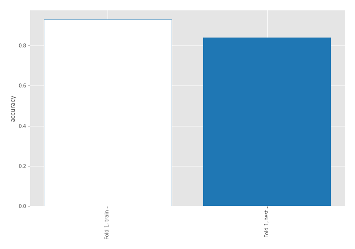

## Decision Tree 

### Tree #1
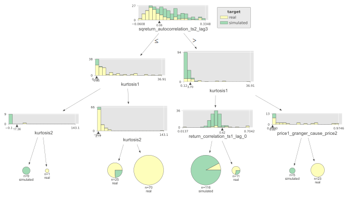

### Rules

if (sqreturn_autocorrelation_ts2_lag3 > 0.063) and (kurtosis1 <= 3.702) and (return_correlation_ts1_lag_0 <= 0.423) then class: simulated (proba: 92.24%) | based on 116 samples

if (sqreturn_autocorrelation_ts2_lag3 <= 0.063) and (kurtosis1 > 0.851) and (kurtosis2 > 2.173) then class: real (proba: 100.0%) | based on 70 samples

if (sqreturn_autocorrelation_ts2_lag3 <= 0.063) and (kurtosis1 > 0.851) and (kurtosis2 <= 2.173) then class: real (proba: 76.0%) | based on 25 samples

if (sqreturn_autocorrelation_ts2_lag3 > 0.063) and (kurtosis1 > 3.702) and (price1_granger_cause_price2 > 0.004) then class: real (proba: 100.0%) | based on 23 samples

if (sqreturn_autocorrelation_ts2_lag3 > 0.063) and (kurtosis1 <= 3.702) and (return_correlation_ts1_lag_0 > 0.423) then class: real (proba: 72.73%) | based on 11 samples

if (sqreturn_autocorrelation_ts2_lag3 <= 0.063) and (kurtosis1 <= 0.851) and (kurtosis2 <= 17.362) then class: simulated (proba: 100.0%) | based on 9 samples

if (sqreturn_autocorrelation_ts2_lag3 > 0.063) and (kurtosis1 > 3.702) and (price1_granger_cause_price2 <= 0.004) then class: simulated (proba: 100.0%) | based on 5 samples

if (sqreturn_autocorrelation_ts2_lag3 <= 0.063) and (kurtosis1 <= 0.851) and (kurtosis2 > 17.362) then class: real (proba: 100.0%) | based on 1 samples

## Permutation-based Importance
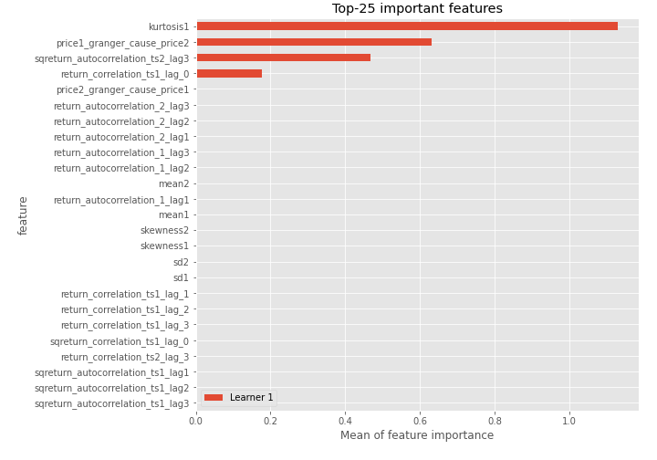
## Confusion Matrix

## Normalized Confusion Matrix

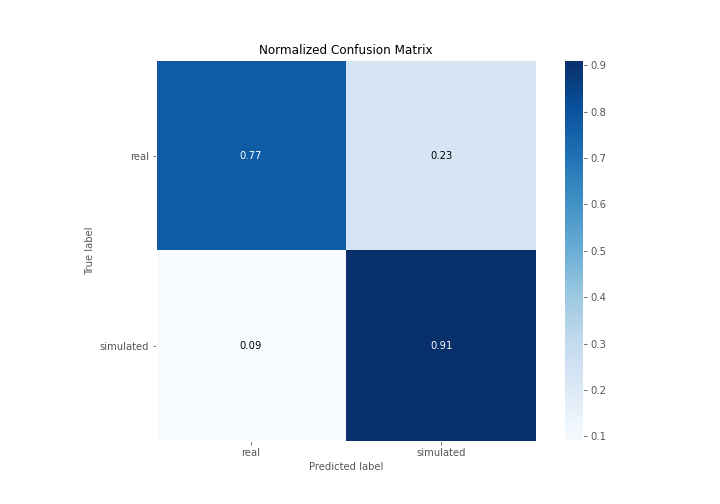

## ROC Curve

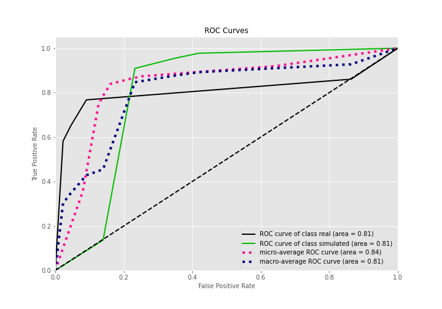

## Kolmogorov-Smirnov Statistic

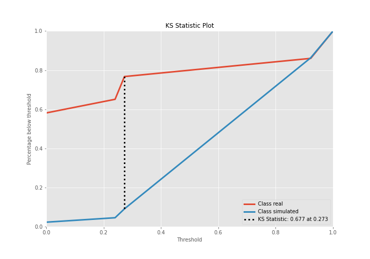

## Precision-Recall Curve

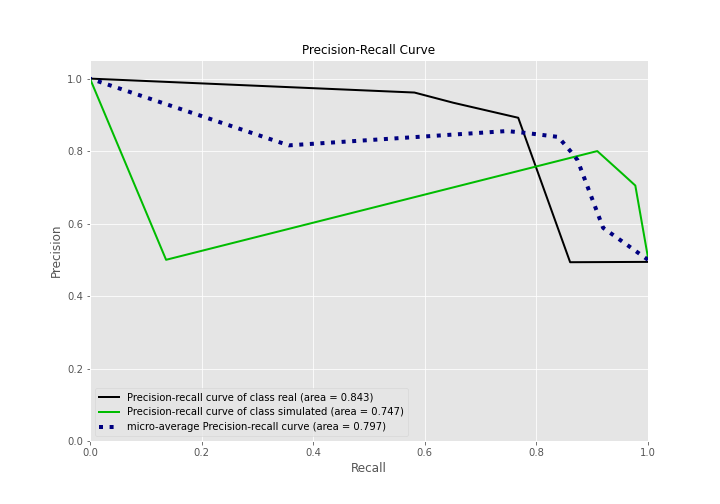

## Calibration Curve

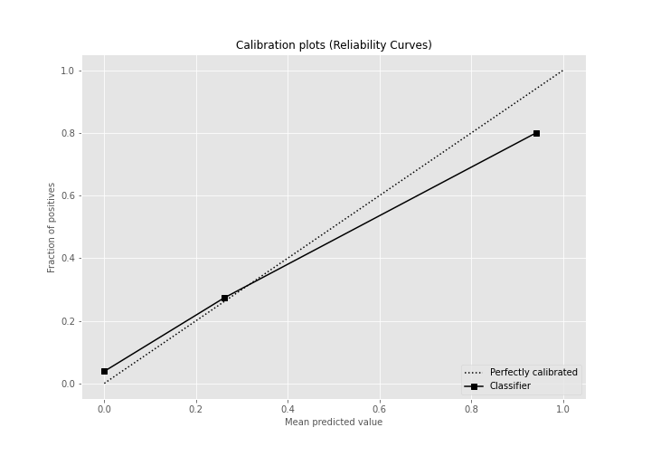

## Cumulative Gains Curve

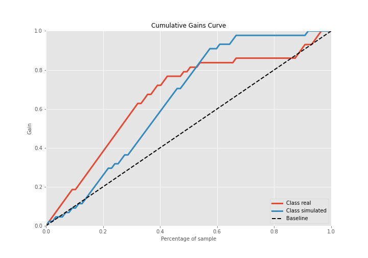

## Lift Curve

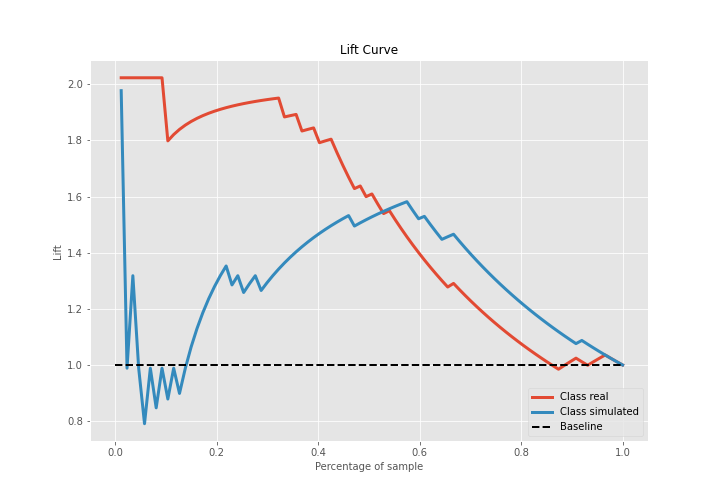

## SHAP Importance
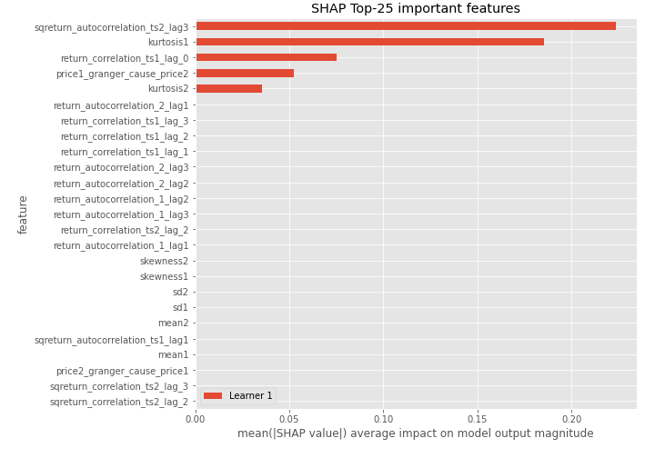

## SHAP Dependence plots

### Dependence (Fold 1)
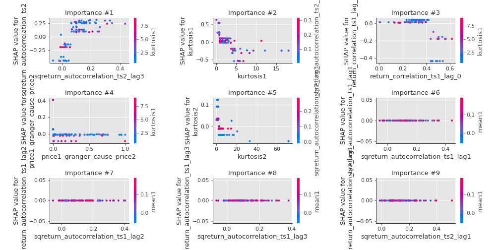

## SHAP Decision plots

### Top-10 Worst decisions for class 0 (Fold 1)
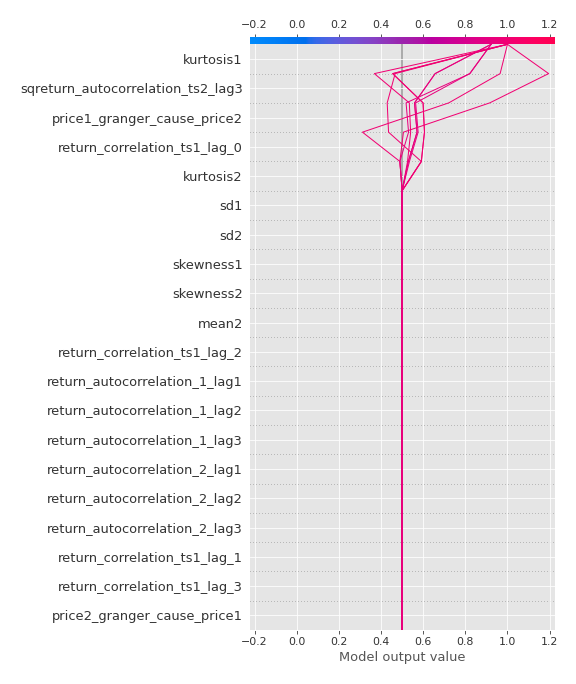
### Top-10 Best decisions for class 0 (Fold 1)
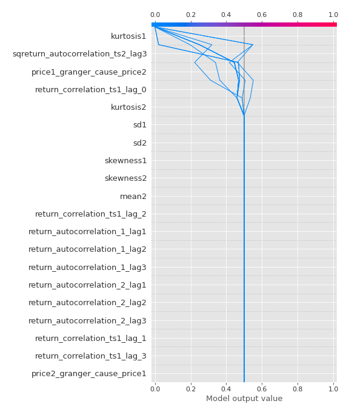
### Top-10 Worst decisions for class 1 (Fold 1)
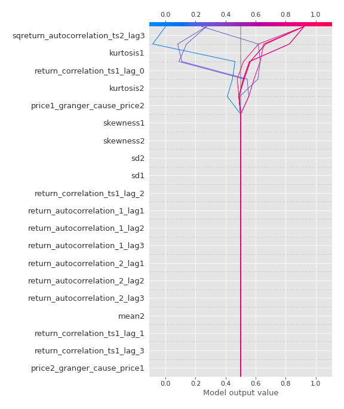
### Top-10 Best decisions for class 1 (Fold 1)
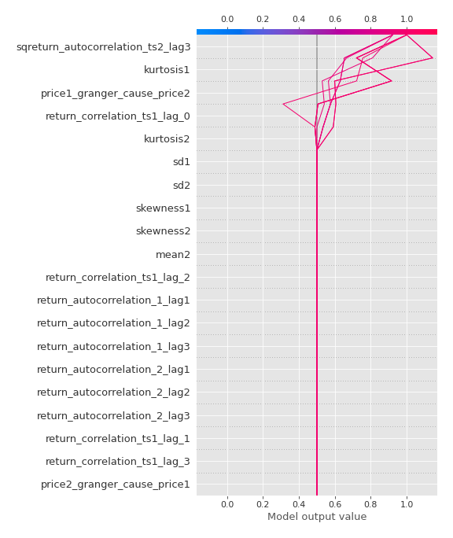

[<< Go back](../README.md)
