# Summary of 3_Linear

[<< Go back](../README.md)

## Logistic Regression (Linear)
- **n_jobs**: -1
- **explain_level**: 2

## Validation
 - **validation_type**: split
 - **train_ratio**: 0.75
 - **shuffle**: True
 - **stratify**: True

## Optimized metric
accuracy

## Training time

15.6 seconds

## Metric details
|           |    score |     threshold |
|:----------|---------:|--------------:|
| logloss   | 0.372273 | nan           |
| auc       | 0.92389  | nan           |
| f1        | 0.86     |   0.535042    |
| accuracy  | 0.83908  |   0.535042    |
| precision | 1        |   0.818773    |
| recall    | 1        |   1.40254e-07 |
| mcc       | 0.704621 |   0.535042    |

## Confusion matrix (at threshold=0.535042)
|                      |   Predicted as real |   Predicted as simulated |
|:---------------------|--------------------:|-------------------------:|
| Labeled as real      |                  30 |                       13 |
| Labeled as simulated |                   1 |                       43 |

## Learning curves
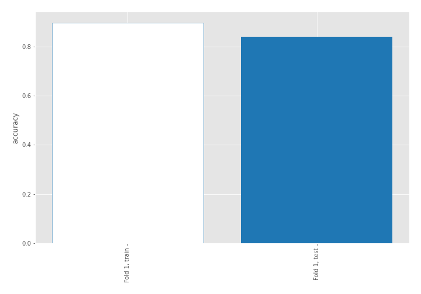

## Coefficients
| feature                           |   Learner_1 |
|:----------------------------------|------------:|
| sqreturn_autocorrelation_ts2_lag3 |   1.89416   |
| mean2                             |   1.77996   |
| sqreturn_autocorrelation_ts1_lag3 |   1.51855   |
| mean1                             |   1.19605   |
| sqreturn_autocorrelation_ts2_lag1 |   0.971729  |
| sqreturn_autocorrelation_ts2_lag2 |   0.927284  |
| sqreturn_autocorrelation_ts1_lag1 |   0.834214  |
| sqreturn_autocorrelation_ts1_lag2 |   0.831948  |
| return_autocorrelation_2_lag1     |   0.567663  |
| return_autocorrelation_2_lag3     |   0.483847  |
| return_autocorrelation_1_lag1     |   0.459753  |
| sqreturn_correlation_ts1_lag_1    |   0.366624  |
| return_correlation_ts1_lag_1      |   0.366624  |
| return_autocorrelation_1_lag3     |   0.35072   |
| sqreturn_correlation_ts2_lag_3    |   0.350175  |
| return_correlation_ts2_lag_3      |   0.350175  |
| return_autocorrelation_1_lag2     |   0.323465  |
| sd1                               |   0.295592  |
| return_correlation_ts1_lag_3      |   0.287212  |
| sqreturn_correlation_ts1_lag_3    |   0.287212  |
| sqreturn_correlation_ts2_lag_1    |   0.230582  |
| return_correlation_ts2_lag_1      |   0.230582  |
| return_autocorrelation_2_lag2     |   0.0913637 |
| return_correlation_ts1_lag_2      |   0.0457301 |
| sqreturn_correlation_ts1_lag_2    |   0.0457301 |
| return_correlation_ts2_lag_2      |  -0.0854609 |
| sqreturn_correlation_ts2_lag_2    |  -0.0854609 |
| sd2                               |  -0.108448  |
| price1_granger_cause_price2       |  -0.184436  |
| sqreturn_correlation_ts1_lag_0    |  -0.321937  |
| return_correlation_ts1_lag_0      |  -0.321937  |
| skewness2                         |  -0.350582  |
| skewness1                         |  -0.784479  |
| price2_granger_cause_price1       |  -1.02301   |
| intercept                         |  -1.6462    |
| kurtosis2                         |  -2.62061   |
| kurtosis1                         |  -2.97165   |

## Permutation-based Importance
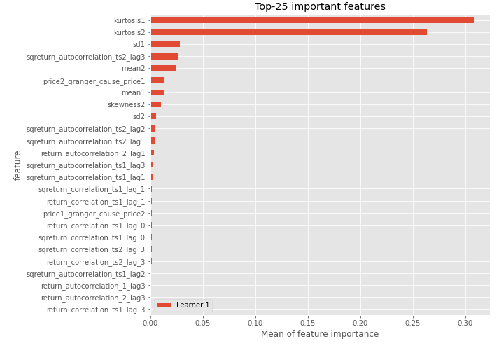
## Confusion Matrix

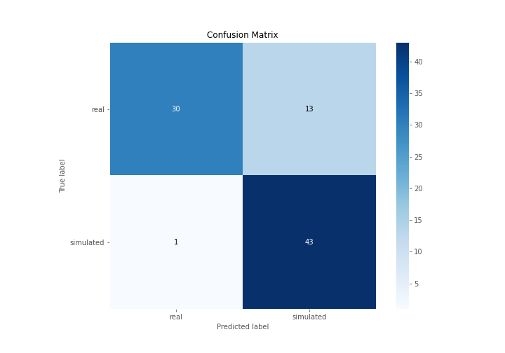

## Normalized Confusion Matrix

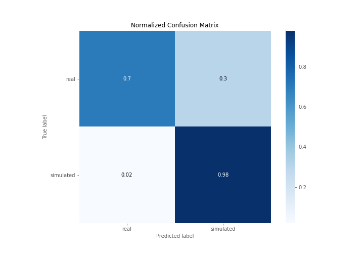

## ROC Curve

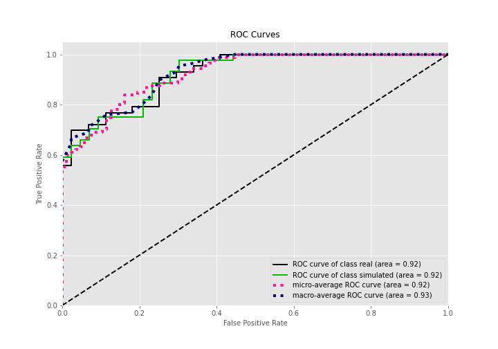

## Kolmogorov-Smirnov Statistic

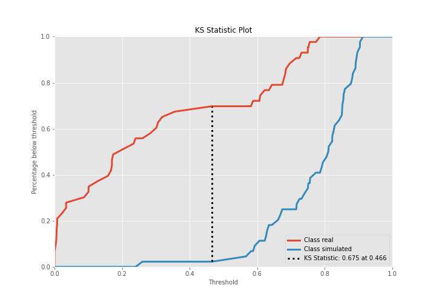

## Precision-Recall Curve

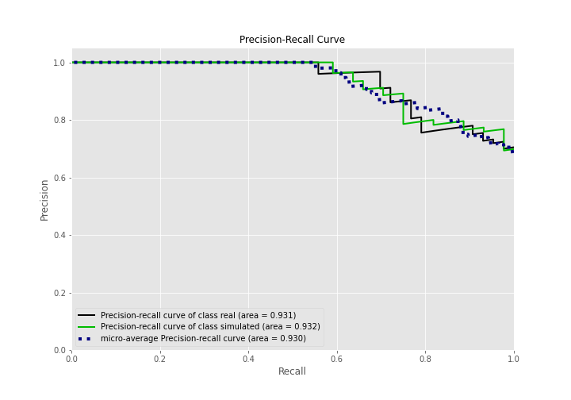

## Calibration Curve

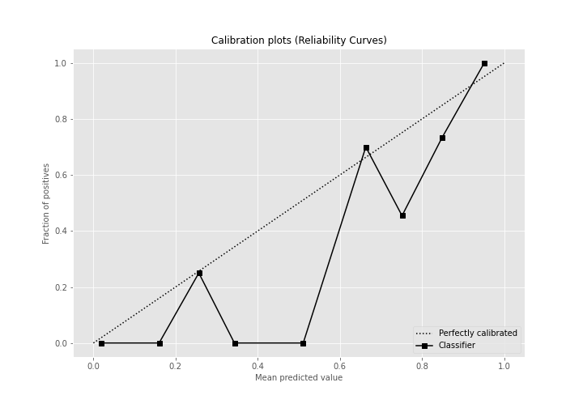

## Cumulative Gains Curve

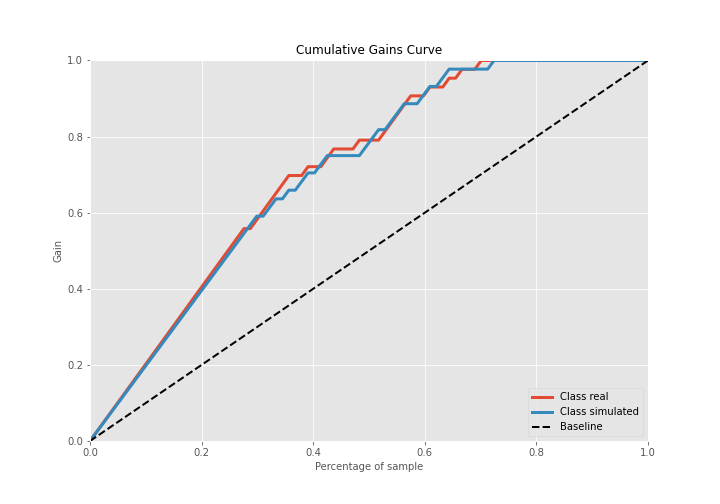

## Lift Curve

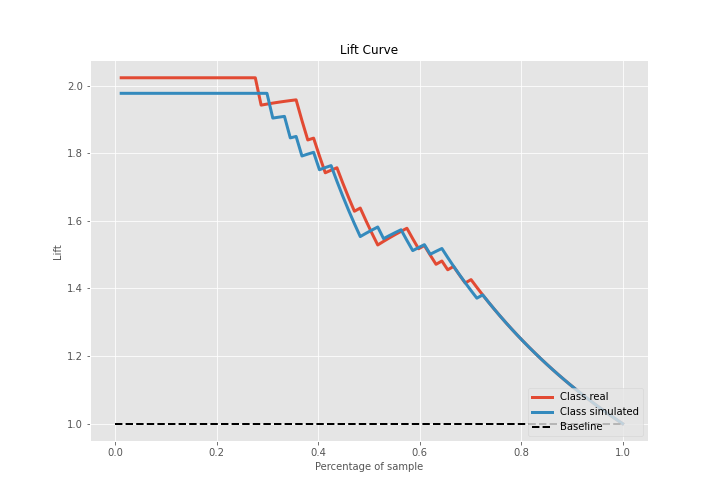

## SHAP Importance
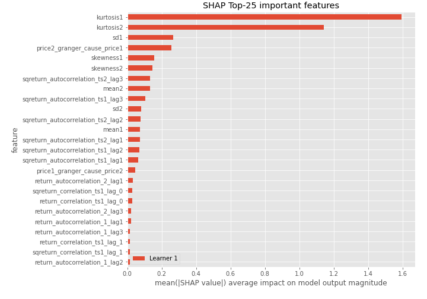

## SHAP Dependence plots

### Dependence (Fold 1)
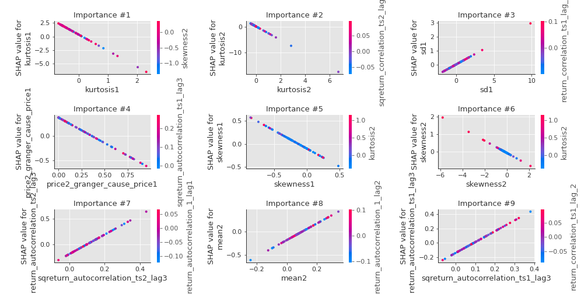

## SHAP Decision plots

### Top-10 Worst decisions for class 0 (Fold 1)
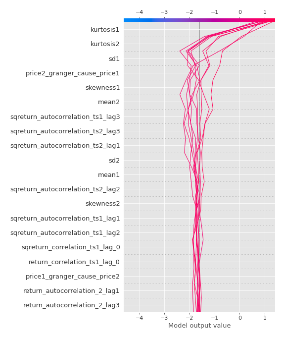
### Top-10 Best decisions for class 0 (Fold 1)
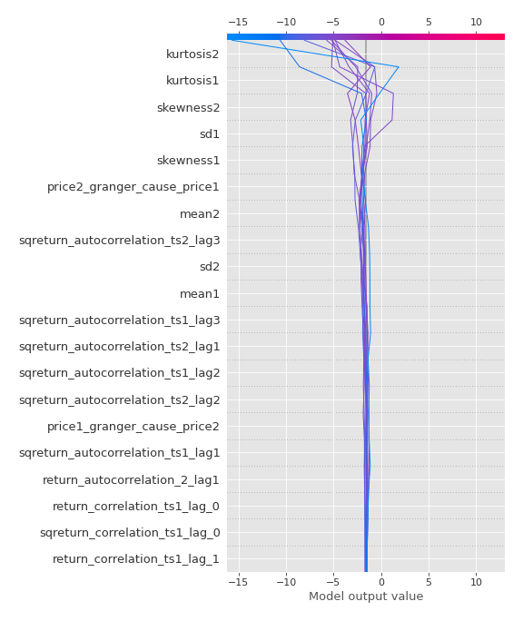
### Top-10 Worst decisions for class 1 (Fold 1)
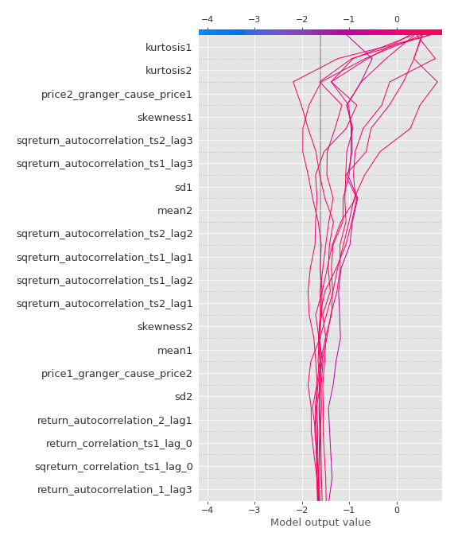
### Top-10 Best decisions for class 1 (Fold 1)
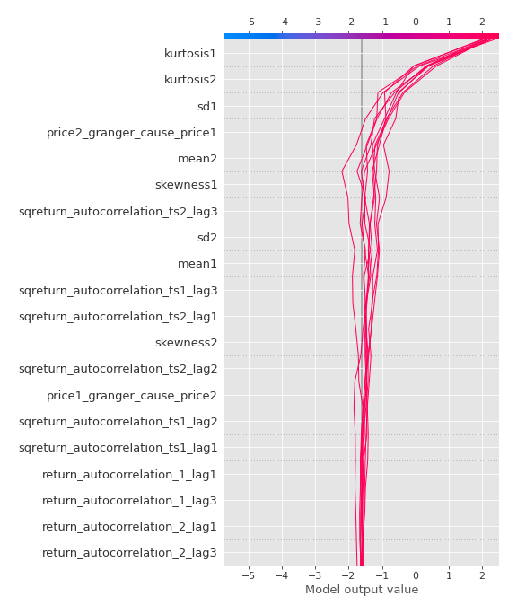

[<< Go back](../README.md)
