# Exploratory Data Analysis

[<< Go back](../README.md)
## Feature : target
- **Feature type** : categorical
- **Missing** : 0.0%
- **Unique** : 2
- **Count** :347
- **Unique** :2
- **Top** :simulated
- **Freq** :174

## Feature : mean1
- **Feature type** : continous
- **Missing** : 0.0%
- **Unique** : 347
- **Count** :347.0
- **Mean** :0.08404025713812362
- **Std** :0.08209571320312305
- **Min** :-0.22632637961920957
- **25%th Percentile** : 0.03173068379765791
- **50%th Percentile** : 0.08106546589209986
- **75%th Percentile** : 0.1282667218075802
- **Max** :0.37277261077116425

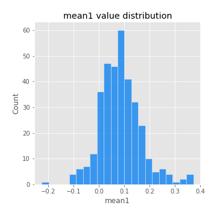
## Feature : mean2
- **Feature type** : continous
- **Missing** : 0.0%
- **Unique** : 347
- **Count** :347.0
- **Mean** :0.09165418946506863
- **Std** :0.09068096860307263
- **Min** :-0.24205418062825398
- **25%th Percentile** : 0.044249344569738704
- **50%th Percentile** : 0.09124537565685446
- **75%th Percentile** : 0.14570163436234232
- **Max** :0.37616608147096464

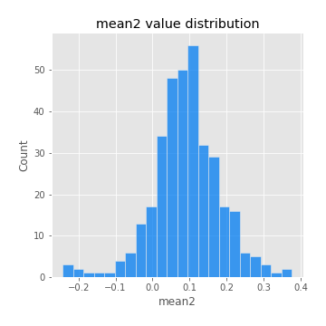
## Feature : sd1
- **Feature type** : continous
- **Missing** : 0.0%
- **Unique** : 347
- **Count** :347.0
- **Mean** :2.0726237182333835
- **Std** :0.8279946835283182
- **Min** :0.7470080772831957
- **25%th Percentile** : 1.5224658659175598
- **50%th Percentile** : 1.977227515015615
- **75%th Percentile** : 2.504330800665385
- **Max** :9.236766377527575

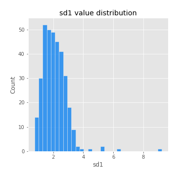
## Feature : sd2
- **Feature type** : continous
- **Missing** : 0.0%
- **Unique** : 347
- **Count** :347.0
- **Mean** :1.980495415595524
- **Std** :0.8252536955099039
- **Min** :0.8592887433004143
- **25%th Percentile** : 1.4202889025434402
- **50%th Percentile** : 1.811221229295349
- **75%th Percentile** : 2.356175006972415
- **Max** :6.737618636746393

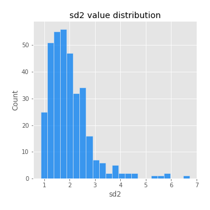
## Feature : skewness1
- **Feature type** : continous
- **Missing** : 0.0%
- **Unique** : 347
- **Count** :347.0
- **Mean** :-0.1449759898553107
- **Std** :0.5873079620351924
- **Min** :-3.530116233761814
- **25%th Percentile** : -0.308759817404311
- **50%th Percentile** : -0.12951596072577773
- **75%th Percentile** : 0.05290538183712272
- **Max** :2.5845963767725557

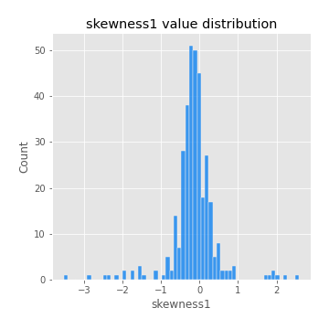
## Feature : skewness2
- **Feature type** : continous
- **Missing** : 0.0%
- **Unique** : 347
- **Count** :347.0
- **Mean** :-0.23991456805143516
- **Std** :0.7963036021300264
- **Min** :-8.801502855292393
- **25%th Percentile** : -0.37768186537505954
- **50%th Percentile** : -0.18333546777951193
- **75%th Percentile** : 0.008913398057040629
- **Max** :2.2606839051517187

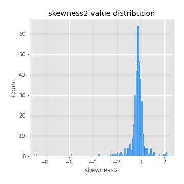
## Feature : kurtosis1
- **Feature type** : continous
- **Missing** : 0.0%
- **Unique** : 347
- **Count** :347.0
- **Mean** :3.91986706642373
- **Std** :5.480643522245583
- **Min** :0.03477879299249054
- **25%th Percentile** : 1.118203809212241
- **50%th Percentile** : 1.977438236093731
- **75%th Percentile** : 4.028030879417009
- **Max** :36.91113889081053

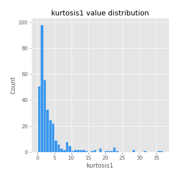
## Feature : kurtosis2
- **Feature type** : continous
- **Missing** : 0.0%
- **Unique** : 347
- **Count** :347.0
- **Mean** :4.591983733841
- **Std** :9.688013548353643
- **Min** :-0.06401912579179703
- **25%th Percentile** : 1.3403483301408854
- **50%th Percentile** : 2.0907655700069774
- **75%th Percentile** : 4.3612884611668505
- **Max** :143.10871011533666

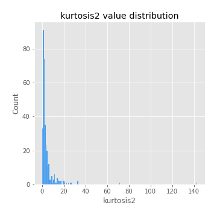
## Feature : return_autocorrelation_1_lag1
- **Feature type** : continous
- **Missing** : 0.0%
- **Unique** : 347
- **Count** :347.0
- **Mean** :-0.016681835208299595
- **Std** :0.059264856248441966
- **Min** :-0.20673896439036124
- **25%th Percentile** : -0.05783706487428488
- **50%th Percentile** : -0.010914393888152778
- **75%th Percentile** : 0.024836872991765492
- **Max** :0.1253959753011446

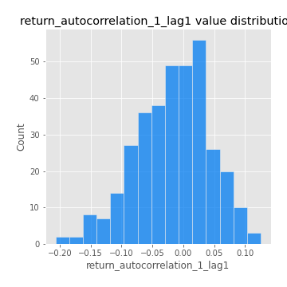
## Feature : return_autocorrelation_1_lag2
- **Feature type** : continous
- **Missing** : 0.0%
- **Unique** : 347
- **Count** :347.0
- **Mean** :-0.004408763577586166
- **Std** :0.05704767433417258
- **Min** :-0.14679399904621093
- **25%th Percentile** : -0.042705742234932786
- **50%th Percentile** : -0.005767071814010877
- **75%th Percentile** : 0.02888002673929059
- **Max** :0.1561488228015672

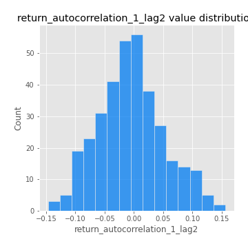
## Feature : return_autocorrelation_1_lag3
- **Feature type** : continous
- **Missing** : 0.0%
- **Unique** : 347
- **Count** :347.0
- **Mean** :-0.0031883554339193635
- **Std** :0.056235482736061895
- **Min** :-0.1940836867390813
- **25%th Percentile** : -0.04203086067092683
- **50%th Percentile** : -0.003936401126660996
- **75%th Percentile** : 0.034247793494546874
- **Max** :0.18894599984827723

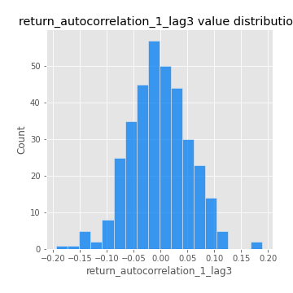
## Feature : return_autocorrelation_2_lag1
- **Feature type** : continous
- **Missing** : 0.0%
- **Unique** : 347
- **Count** :347.0
- **Mean** :-0.014911704918095972
- **Std** :0.06700075686076723
- **Min** :-0.25075531010123286
- **25%th Percentile** : -0.056743456735695655
- **50%th Percentile** : -0.014470613405157364
- **75%th Percentile** : 0.025530492247996257
- **Max** :0.31863413537898483

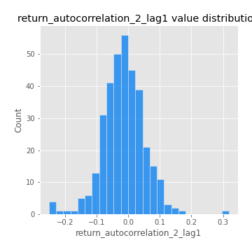
## Feature : return_autocorrelation_2_lag2
- **Feature type** : continous
- **Missing** : 0.0%
- **Unique** : 347
- **Count** :347.0
- **Mean** :-0.0038336098799491214
- **Std** :0.06078106875719121
- **Min** :-0.17336597317030228
- **25%th Percentile** : -0.04191473593908163
- **50%th Percentile** : -0.0073636174765752006
- **75%th Percentile** : 0.038013037620828416
- **Max** :0.20974504043791217

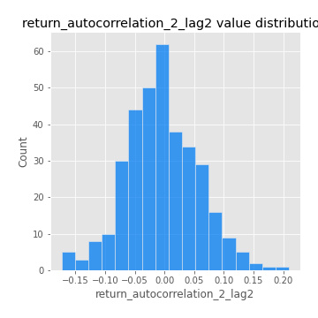
## Feature : return_autocorrelation_2_lag3
- **Feature type** : continous
- **Missing** : 0.0%
- **Unique** : 347
- **Count** :347.0
- **Mean** :-0.003458865791937057
- **Std** :0.058585224081984744
- **Min** :-0.15815398047762586
- **25%th Percentile** : -0.0427641509830838
- **50%th Percentile** : -0.004785330675609946
- **75%th Percentile** : 0.031855988621074444
- **Max** :0.1876945772141177

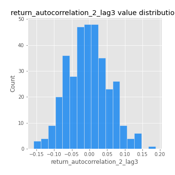
## Feature : return_correlation_ts1_lag_0
- **Feature type** : continous
- **Missing** : 0.0%
- **Unique** : 347
- **Count** :347.0
- **Mean** :0.33023503451673003
- **Std** :0.10996867722878943
- **Min** :0.005136598099876001
- **25%th Percentile** : 0.27371239886957427
- **50%th Percentile** : 0.3381388202960955
- **75%th Percentile** : 0.3834885065787768
- **Max** :0.7041861626832071

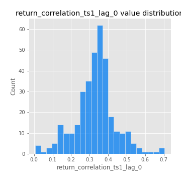
## Feature : return_correlation_ts1_lag_1
- **Feature type** : continous
- **Missing** : 0.0%
- **Unique** : 347
- **Count** :347.0
- **Mean** :-0.009978089655924694
- **Std** :0.055753805603363106
- **Min** :-0.16494237654614036
- **25%th Percentile** : -0.04718519302063791
- **50%th Percentile** : -0.005171590184683453
- **75%th Percentile** : 0.028968422856546314
- **Max** :0.15499424718508623

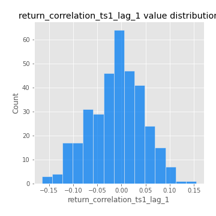
## Feature : return_correlation_ts1_lag_2
- **Feature type** : continous
- **Missing** : 0.0%
- **Unique** : 347
- **Count** :347.0
- **Mean** :-0.0077293737174233155
- **Std** :0.054798875788391134
- **Min** :-0.1457429885241517
- **25%th Percentile** : -0.045027798614976494
- **50%th Percentile** : -0.007022577146460084
- **75%th Percentile** : 0.02683973833559693
- **Max** :0.16592411526679832

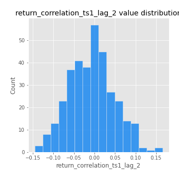
## Feature : return_correlation_ts1_lag_3
- **Feature type** : continous
- **Missing** : 0.0%
- **Unique** : 347
- **Count** :347.0
- **Mean** :-0.0011991145379084238
- **Std** :0.05640218608718877
- **Min** :-0.17518585308118925
- **25%th Percentile** : -0.038951200995201524
- **50%th Percentile** : -0.0014573215147489639
- **75%th Percentile** : 0.03162186794448271
- **Max** :0.1636773216468148

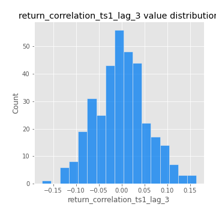
## Feature : return_correlation_ts2_lag_1
- **Feature type** : continous
- **Missing** : 0.0%
- **Unique** : 347
- **Count** :347.0
- **Mean** :-0.016036903564833022
- **Std** :0.05636454659327395
- **Min** :-0.2081139431093261
- **25%th Percentile** : -0.05044819943963178
- **50%th Percentile** : -0.01494079308561306
- **75%th Percentile** : 0.020494136437322705
- **Max** :0.17208763791364762

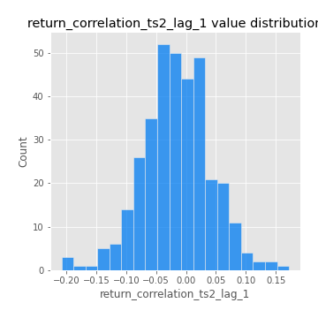
## Feature : return_correlation_ts2_lag_2
- **Feature type** : continous
- **Missing** : 0.0%
- **Unique** : 347
- **Count** :347.0
- **Mean** :0.0007964127979826247
- **Std** :0.05608637265044991
- **Min** :-0.15697081785825495
- **25%th Percentile** : -0.03834647277398194
- **50%th Percentile** : 2.0902935526737838e-05
- **75%th Percentile** : 0.0350766902590227
- **Max** :0.20772887392904255

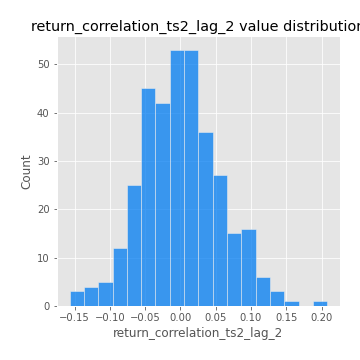
## Feature : return_correlation_ts2_lag_3
- **Feature type** : continous
- **Missing** : 0.0%
- **Unique** : 347
- **Count** :347.0
- **Mean** :-0.001730633717416163
- **Std** :0.05446911144801047
- **Min** :-0.1889651432067188
- **25%th Percentile** : -0.0313074473433719
- **50%th Percentile** : -0.003436767461443836
- **75%th Percentile** : 0.03508426076347068
- **Max** :0.16653068642522262

## Feature : sqreturn_autocorrelation_ts1_lag1
- **Feature type** : continous
- **Missing** : 0.0%
- **Unique** : 347
- **Count** :347.0
- **Mean** :0.1194933455308472
- **Std** :0.09250832619770968
- **Min** :-0.06532118872798363
- **25%th Percentile** : 0.05501037265154826
- **50%th Percentile** : 0.10540439035600148
- **75%th Percentile** : 0.16550039565090824
- **Max** :0.49414293176447355

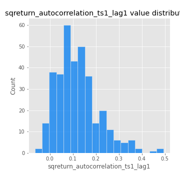
## Feature : sqreturn_autocorrelation_ts1_lag2
- **Feature type** : continous
- **Missing** : 0.0%
- **Unique** : 347
- **Count** :347.0
- **Mean** :0.11569360100170833
- **Std** :0.09883362721027197
- **Min** :-0.05419304650062953
- **25%th Percentile** : 0.043452088770630753
- **50%th Percentile** : 0.09618598250911219
- **75%th Percentile** : 0.17572837520168938
- **Max** :0.540735851444759

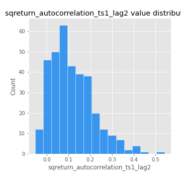
## Feature : sqreturn_autocorrelation_ts1_lag3
- **Feature type** : continous
- **Missing** : 0.0%
- **Unique** : 347
- **Count** :347.0
- **Mean** :0.10478678326160794
- **Std** :0.09045458677033487
- **Min** :-0.06486026764840777
- **25%th Percentile** : 0.03257117285305183
- **50%th Percentile** : 0.09749727548472467
- **75%th Percentile** : 0.15771697300069498
- **Max** :0.44755937369538146

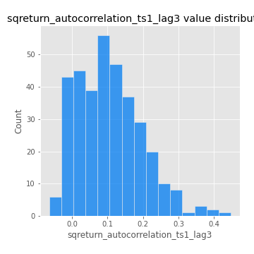
## Feature : sqreturn_autocorrelation_ts2_lag1
- **Feature type** : continous
- **Missing** : 0.0%
- **Unique** : 347
- **Count** :347.0
- **Mean** :0.12305048219887604
- **Std** :0.09283999254970432
- **Min** :-0.08520586663750691
- **25%th Percentile** : 0.0542894813085896
- **50%th Percentile** : 0.10756976340136955
- **75%th Percentile** : 0.1749978394291027
- **Max** :0.510085647437958

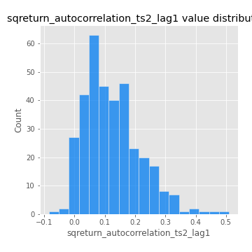
## Feature : sqreturn_autocorrelation_ts2_lag2
- **Feature type** : continous
- **Missing** : 0.0%
- **Unique** : 347
- **Count** :347.0
- **Mean** :0.11303933023524575
- **Std** :0.09928464654755378
- **Min** :-0.051523884196217395
- **25%th Percentile** : 0.03314115601712525
- **50%th Percentile** : 0.09582626262417798
- **75%th Percentile** : 0.17456932458554458
- **Max** :0.5373432415582473

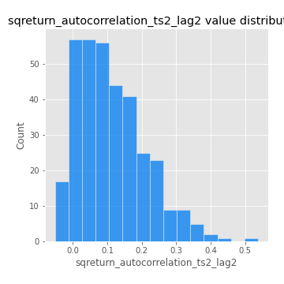
## Feature : sqreturn_autocorrelation_ts2_lag3
- **Feature type** : continous
- **Missing** : 0.0%
- **Unique** : 347
- **Count** :347.0
- **Mean** :0.10261547141947
- **Std** :0.08931254442305092
- **Min** :-0.06082766359524085
- **25%th Percentile** : 0.03160416720421947
- **50%th Percentile** : 0.09321605023322158
- **75%th Percentile** : 0.1579653290265461
- **Max** :0.4368840799615405

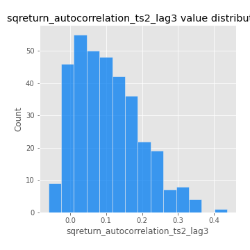
## Feature : sqreturn_correlation_ts1_lag_0
- **Feature type** : continous
- **Missing** : 0.0%
- **Unique** : 347
- **Count** :347.0
- **Mean** :0.33023503451673003
- **Std** :0.10996867722878943
- **Min** :0.005136598099876001
- **25%th Percentile** : 0.27371239886957427
- **50%th Percentile** : 0.3381388202960955
- **75%th Percentile** : 0.3834885065787768
- **Max** :0.7041861626832071

## Feature : sqreturn_correlation_ts1_lag_1
- **Feature type** : continous
- **Missing** : 0.0%
- **Unique** : 347
- **Count** :347.0
- **Mean** :-0.009978089655924694
- **Std** :0.055753805603363106
- **Min** :-0.16494237654614036
- **25%th Percentile** : -0.04718519302063791
- **50%th Percentile** : -0.005171590184683453
- **75%th Percentile** : 0.028968422856546314
- **Max** :0.15499424718508623

## Feature : sqreturn_correlation_ts1_lag_2
- **Feature type** : continous
- **Missing** : 0.0%
- **Unique** : 347
- **Count** :347.0
- **Mean** :-0.0077293737174233155
- **Std** :0.054798875788391134
- **Min** :-0.1457429885241517
- **25%th Percentile** : -0.045027798614976494
- **50%th Percentile** : -0.007022577146460084
- **75%th Percentile** : 0.02683973833559693
- **Max** :0.16592411526679832

## Feature : sqreturn_correlation_ts1_lag_3
- **Feature type** : continous
- **Missing** : 0.0%
- **Unique** : 347
- **Count** :347.0
- **Mean** :-0.0011991145379084238
- **Std** :0.05640218608718877
- **Min** :-0.17518585308118925
- **25%th Percentile** : -0.038951200995201524
- **50%th Percentile** : -0.0014573215147489639
- **75%th Percentile** : 0.03162186794448271
- **Max** :0.1636773216468148

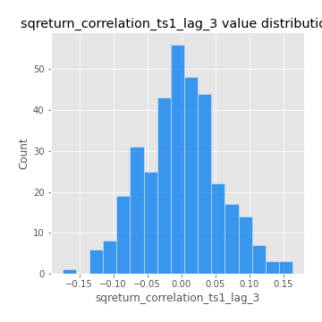
## Feature : sqreturn_correlation_ts2_lag_1
- **Feature type** : continous
- **Missing** : 0.0%
- **Unique** : 347
- **Count** :347.0
- **Mean** :-0.016036903564833022
- **Std** :0.05636454659327395
- **Min** :-0.2081139431093261
- **25%th Percentile** : -0.05044819943963178
- **50%th Percentile** : -0.01494079308561306
- **75%th Percentile** : 0.020494136437322705
- **Max** :0.17208763791364762

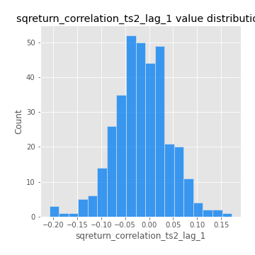
## Feature : sqreturn_correlation_ts2_lag_2
- **Feature type** : continous
- **Missing** : 0.0%
- **Unique** : 347
- **Count** :347.0
- **Mean** :0.0007964127979826247
- **Std** :0.05608637265044991
- **Min** :-0.15697081785825495
- **25%th Percentile** : -0.03834647277398194
- **50%th Percentile** : 2.0902935526737838e-05
- **75%th Percentile** : 0.0350766902590227
- **Max** :0.20772887392904255

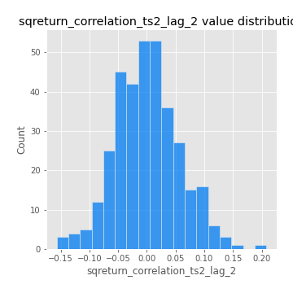
## Feature : sqreturn_correlation_ts2_lag_3
- **Feature type** : continous
- **Missing** : 0.0%
- **Unique** : 347
- **Count** :347.0
- **Mean** :-0.001730633717416163
- **Std** :0.05446911144801047
- **Min** :-0.1889651432067188
- **25%th Percentile** : -0.0313074473433719
- **50%th Percentile** : -0.003436767461443836
- **75%th Percentile** : 0.03508426076347068
- **Max** :0.16653068642522262

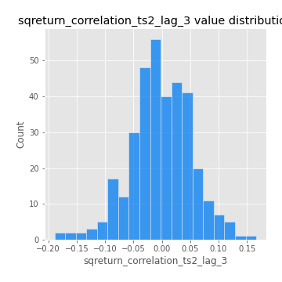
## Feature : price2_granger_cause_price1
- **Feature type** : continous
- **Missing** : 0.0%
- **Unique** : 347
- **Count** :347.0
- **Mean** :0.3004948745023105
- **Std** :0.3004478607678506
- **Min** :5.636928241530423e-31
- **25%th Percentile** : 0.0370101680370349
- **50%th Percentile** : 0.19863362397221462
- **75%th Percentile** : 0.49114511497217345
- **Max** :0.9944240490129201

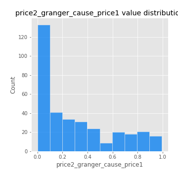
## Feature : price1_granger_cause_price2
- **Feature type** : continous
- **Missing** : 0.0%
- **Unique** : 347
- **Count** :347.0
- **Mean** :0.3025282348598197
- **Std** :0.29563131542149274
- **Min** :1.5550140652528176e-13
- **25%th Percentile** : 0.03658665977084834
- **50%th Percentile** : 0.2050962711887762
- **75%th Percentile** : 0.5239951702691669
- **Max** :0.9969536702252588

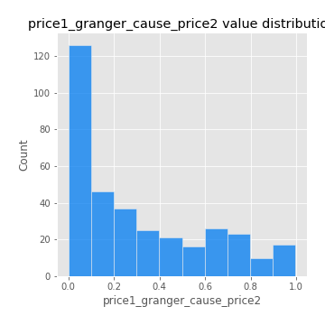

[<< Go back](../README.md)
