# Summary of 2_DecisionTree

[<< Go back](../README.md)

## Decision Tree
- **n_jobs**: -1
- **criterion**: gini
- **max_depth**: 3
- **explain_level**: 2

## Validation
 - **validation_type**: split
 - **train_ratio**: 0.75
 - **shuffle**: True
 - **stratify**: True

## Optimized metric
accuracy

## Training time

5.2 seconds

## Metric details
|           |    score |   threshold |
|:----------|---------:|------------:|
| logloss   | 1.2615   |  nan        |
| auc       | 0.881342 |  nan        |
| f1        | 0.870588 |    0.472222 |
| accuracy  | 0.873563 |    0.472222 |
| precision | 1        |    0.944444 |
| recall    | 0.840909 |    0        |
| mcc       | 0.749075 |    0.472222 |

## Confusion matrix (at threshold=0.472222)
|                      |   Predicted as real |   Predicted as simulated |
|:---------------------|--------------------:|-------------------------:|
| Labeled as real      |                  39 |                        4 |
| Labeled as simulated |                   7 |                       37 |

## Learning curves

## Decision Tree 

### Tree #1
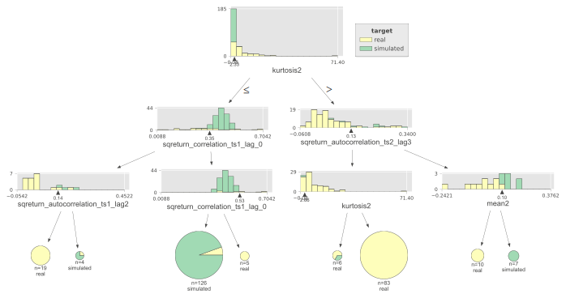

### Rules

if (kurtosis2 <= 2.332) and (sqreturn_correlation_ts1_lag_0 > 0.354) and (sqreturn_correlation_ts1_lag_0 <= 0.526) then class: simulated (proba: 94.44%) | based on 126 samples

if (kurtosis2 > 2.332) and (sqreturn_autocorrelation_ts2_lag3 <= 0.13) and (kurtosis2 > 2.658) then class: real (proba: 100.0%) | based on 83 samples

if (kurtosis2 <= 2.332) and (sqreturn_correlation_ts1_lag_0 <= 0.354) and (sqreturn_autocorrelation_ts1_lag2 <= 0.139) then class: real (proba: 100.0%) | based on 19 samples

if (kurtosis2 > 2.332) and (sqreturn_autocorrelation_ts2_lag3 > 0.13) and (mean2 <= 0.1) then class: real (proba: 100.0%) | based on 10 samples

if (kurtosis2 > 2.332) and (sqreturn_autocorrelation_ts2_lag3 > 0.13) and (mean2 > 0.1) then class: simulated (proba: 100.0%) | based on 7 samples

if (kurtosis2 > 2.332) and (sqreturn_autocorrelation_ts2_lag3 <= 0.13) and (kurtosis2 <= 2.658) then class: real (proba: 66.67%) | based on 6 samples

if (kurtosis2 <= 2.332) and (sqreturn_correlation_ts1_lag_0 > 0.354) and (sqreturn_correlation_ts1_lag_0 > 0.526) then class: real (proba: 100.0%) | based on 5 samples

if (kurtosis2 <= 2.332) and (sqreturn_correlation_ts1_lag_0 <= 0.354) and (sqreturn_autocorrelation_ts1_lag2 > 0.139) then class: simulated (proba: 75.0%) | based on 4 samples

## Permutation-based Importance
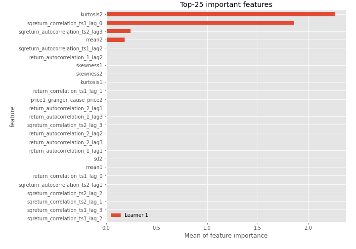
## Confusion Matrix

## Normalized Confusion Matrix

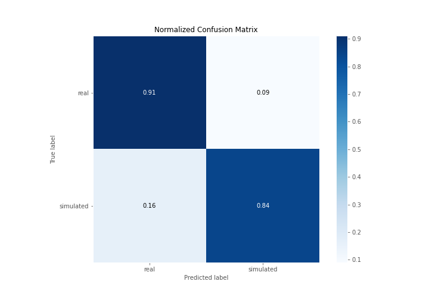

## ROC Curve

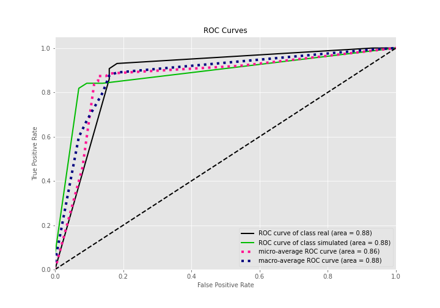

## Kolmogorov-Smirnov Statistic

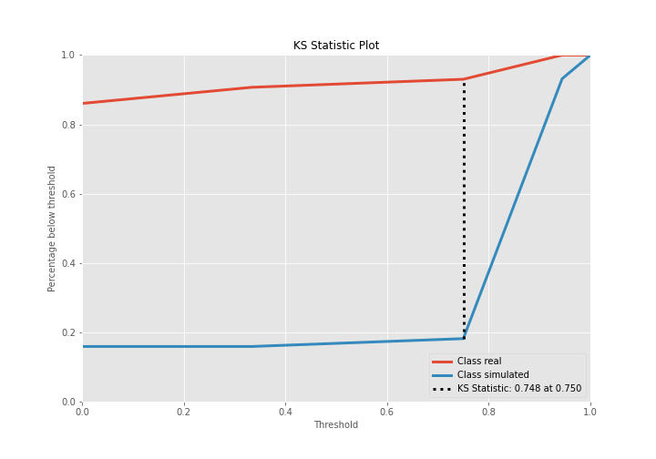

## Precision-Recall Curve

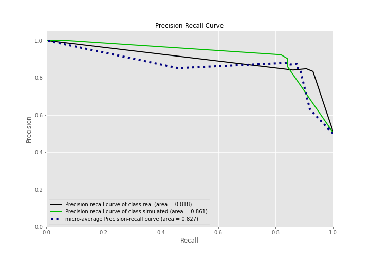

## Calibration Curve

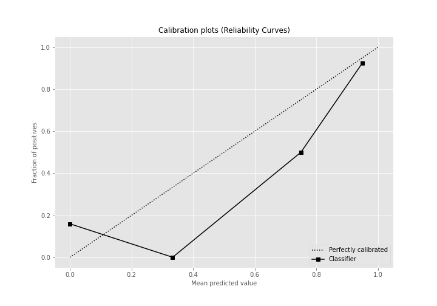

## Cumulative Gains Curve

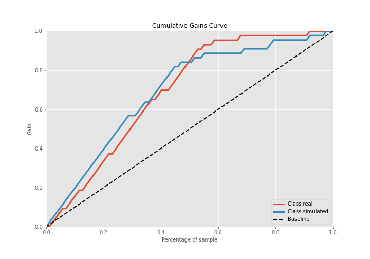

## Lift Curve

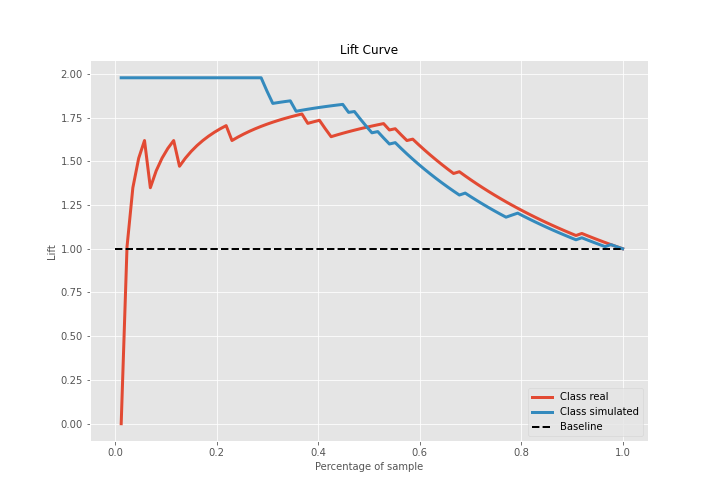

## SHAP Importance
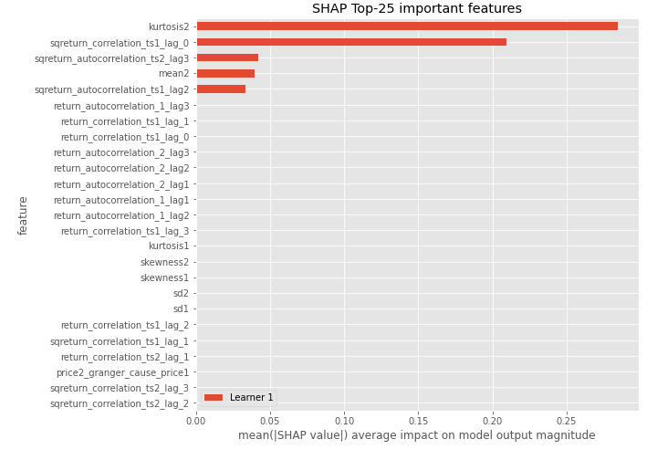

## SHAP Dependence plots

### Dependence (Fold 1)
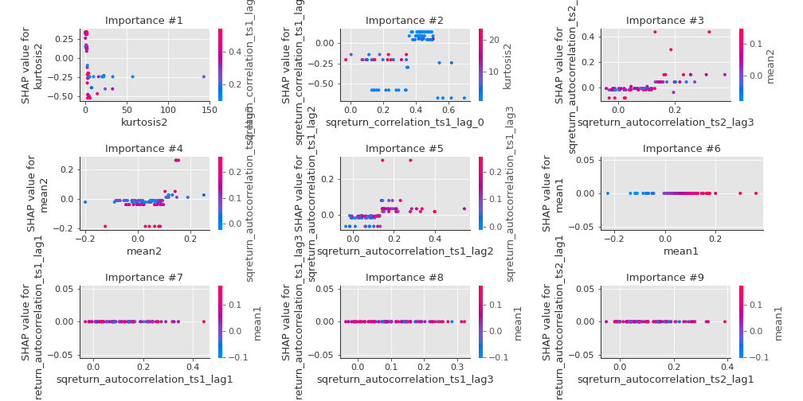

## SHAP Decision plots

### Top-10 Worst decisions for class 0 (Fold 1)
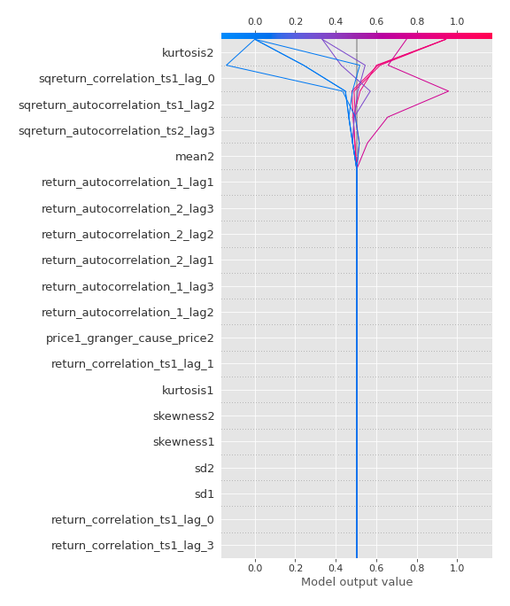
### Top-10 Best decisions for class 0 (Fold 1)
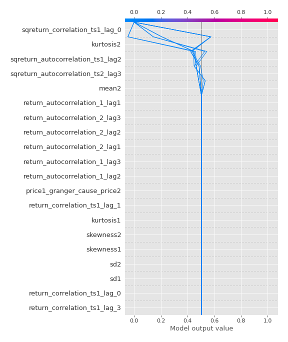
### Top-10 Worst decisions for class 1 (Fold 1)
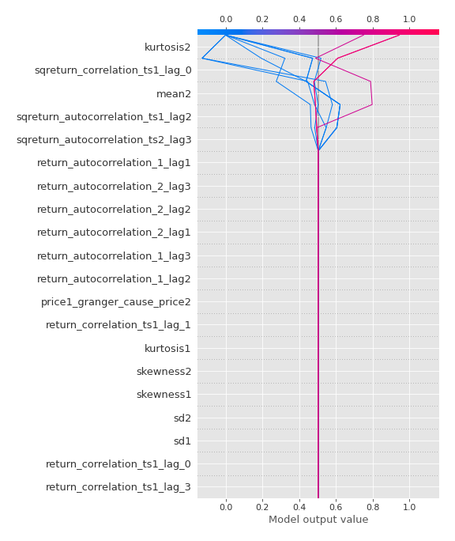
### Top-10 Best decisions for class 1 (Fold 1)
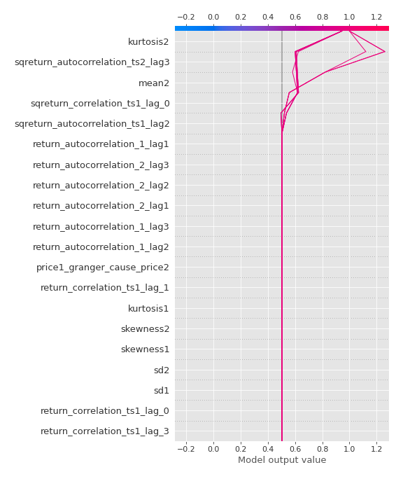

[<< Go back](../README.md)
