# Summary of 3_Linear

[<< Go back](../README.md)

## Logistic Regression (Linear)
- **n_jobs**: -1
- **explain_level**: 2

## Validation
 - **validation_type**: split
 - **train_ratio**: 0.75
 - **shuffle**: True
 - **stratify**: True

## Optimized metric
accuracy

## Training time

3.0 seconds

## Metric details
|           |    score |     threshold |
|:----------|---------:|--------------:|
| logloss   | 0.217409 | nan           |
| auc       | 0.976216 | nan           |
| f1        | 0.945055 |   0.587383    |
| accuracy  | 0.942529 |   0.738161    |
| precision | 1        |   0.917649    |
| recall    | 1        |   4.15613e-29 |
| mcc       | 0.887243 |   0.738161    |

## Confusion matrix (at threshold=0.738161)
|                      |   Predicted as real |   Predicted as simulated |
|:---------------------|--------------------:|-------------------------:|
| Labeled as real      |                  42 |                        1 |
| Labeled as simulated |                   4 |                       40 |

## Learning curves
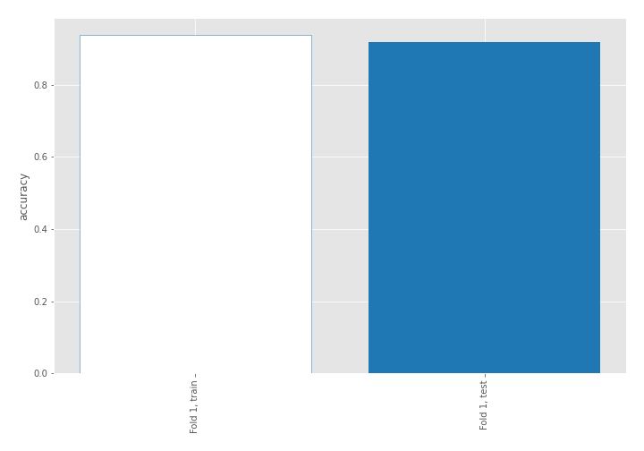

## Coefficients
| feature                           |   Learner_1 |
|:----------------------------------|------------:|
| sqreturn_autocorrelation_ts1_lag3 |   1.33157   |
| sqreturn_autocorrelation_ts2_lag3 |   1.05384   |
| return_correlation_ts1_lag_0      |   1.04059   |
| sqreturn_correlation_ts1_lag_0    |   1.04059   |
| sqreturn_autocorrelation_ts1_lag2 |   1.03788   |
| sqreturn_autocorrelation_ts1_lag1 |   0.850715  |
| return_autocorrelation_2_lag1     |   0.755955  |
| sqreturn_correlation_ts1_lag_1    |   0.607859  |
| return_correlation_ts1_lag_1      |   0.607859  |
| sd1                               |   0.571767  |
| sqreturn_autocorrelation_ts2_lag2 |   0.555923  |
| sqreturn_correlation_ts2_lag_1    |   0.541898  |
| return_correlation_ts2_lag_1      |   0.541898  |
| mean1                             |   0.513396  |
| sqreturn_correlation_ts2_lag_3    |   0.454206  |
| return_correlation_ts2_lag_3      |   0.454206  |
| sqreturn_autocorrelation_ts2_lag1 |   0.319883  |
| return_autocorrelation_2_lag3     |   0.312627  |
| return_autocorrelation_1_lag3     |   0.300847  |
| return_autocorrelation_1_lag1     |   0.269459  |
| return_correlation_ts1_lag_2      |   0.267667  |
| sqreturn_correlation_ts1_lag_2    |   0.267667  |
| return_autocorrelation_1_lag2     |   0.223021  |
| sqreturn_correlation_ts1_lag_3    |   0.221202  |
| return_correlation_ts1_lag_3      |   0.221202  |
| return_autocorrelation_2_lag2     |   0.0670657 |
| return_correlation_ts2_lag_2      |  -0.0843868 |
| sqreturn_correlation_ts2_lag_2    |  -0.0843868 |
| price2_granger_cause_price1       |  -0.370934  |
| price1_granger_cause_price2       |  -0.418699  |
| mean2                             |  -0.593878  |
| skewness2                         |  -0.845307  |
| skewness1                         |  -0.849403  |
| sd2                               |  -1.57257   |
| kurtosis1                         |  -2.64009   |
| intercept                         |  -3.14651   |
| kurtosis2                         |  -3.34232   |

## Permutation-based Importance
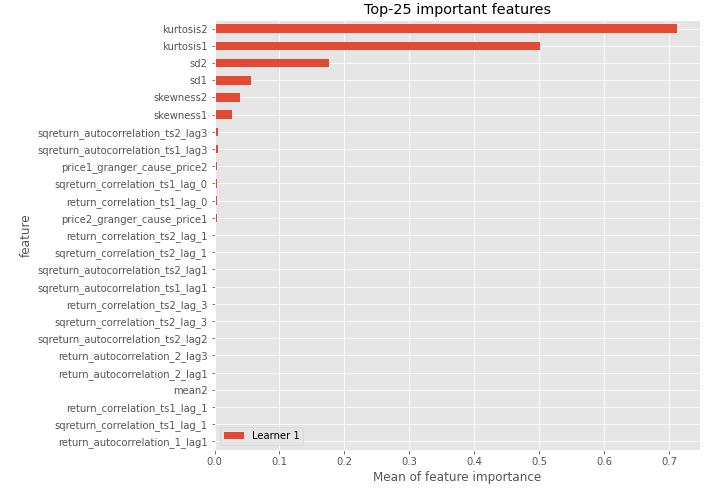
## Confusion Matrix

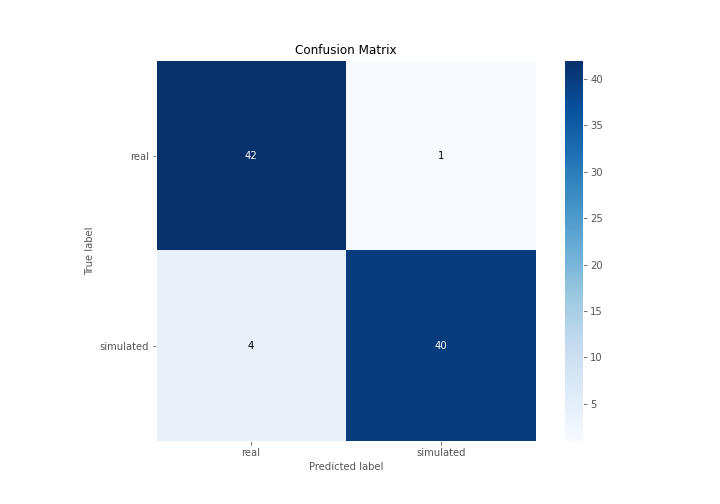

## Normalized Confusion Matrix

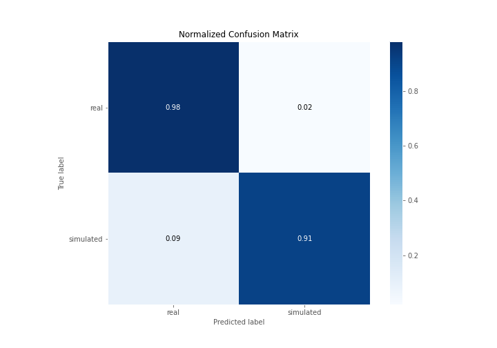

## ROC Curve

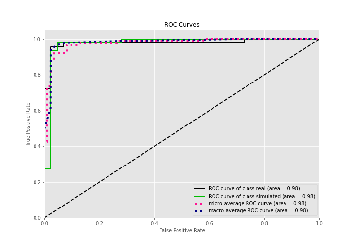

## Kolmogorov-Smirnov Statistic

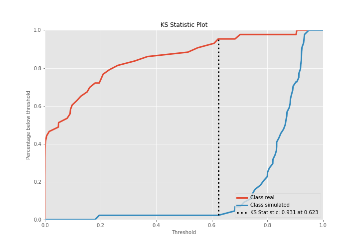

## Precision-Recall Curve

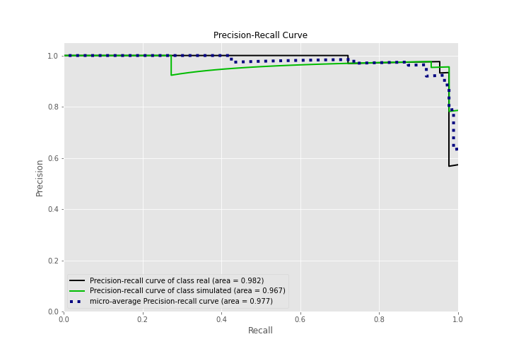

## Calibration Curve

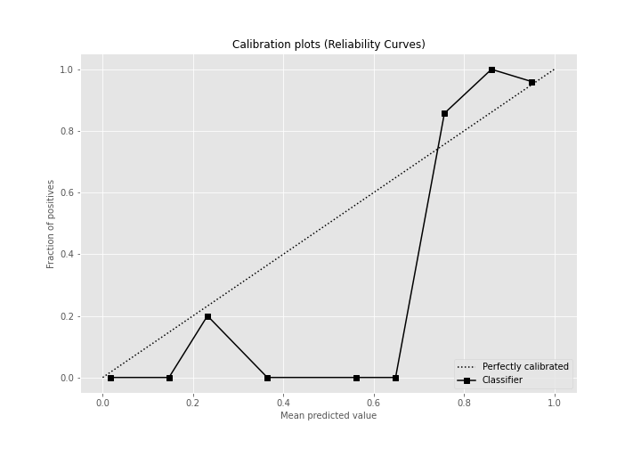

## Cumulative Gains Curve

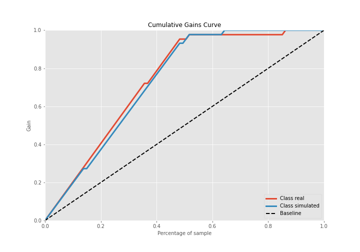

## Lift Curve

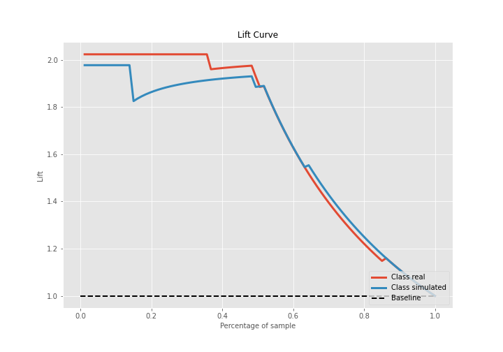

## SHAP Importance
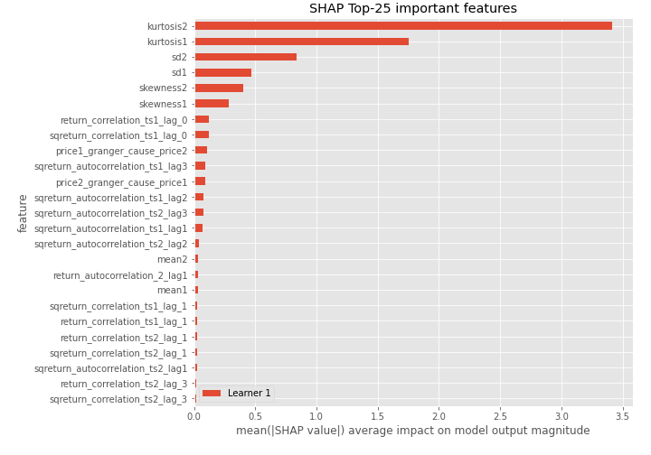

## SHAP Dependence plots

### Dependence (Fold 1)
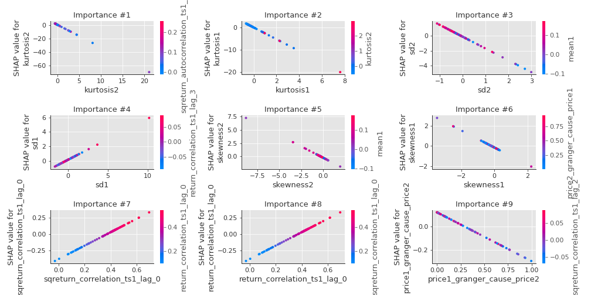

## SHAP Decision plots

### Top-10 Worst decisions for class 0 (Fold 1)
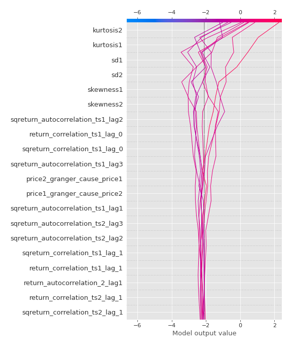
### Top-10 Best decisions for class 0 (Fold 1)
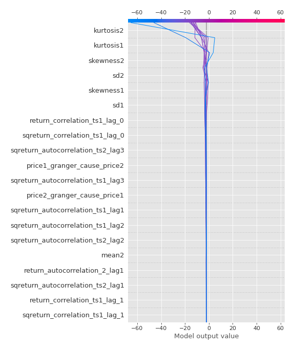
### Top-10 Worst decisions for class 1 (Fold 1)
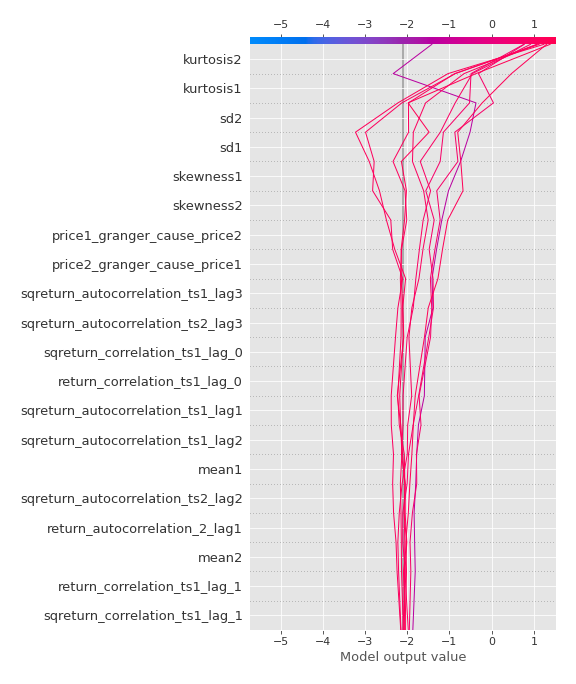
### Top-10 Best decisions for class 1 (Fold 1)
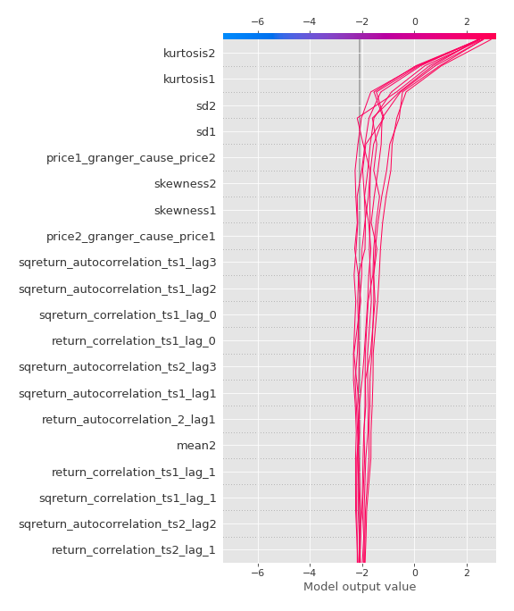

[<< Go back](../README.md)
