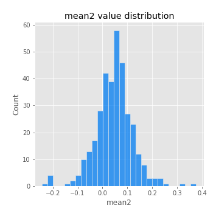
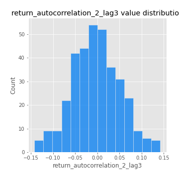

# Exploratory Data Analysis

[<< Go back](../README.md)
## Feature : target
- **Feature type** : categorical
- **Missing** : 0.0%
- **Unique** : 2
- **Count** :347
- **Unique** :2
- **Top** :simulated
- **Freq** :175

## Feature : mean1
- **Feature type** : continous
- **Missing** : 0.0%
- **Unique** : 347
- **Count** :347.0
- **Mean** :0.06069497085192306
- **Std** :0.08927584502349346
- **Min** :-0.2645884176739805
- **25%th Percentile** : 0.009653334646475515
- **50%th Percentile** : 0.0660292233123278
- **75%th Percentile** : 0.11297749606646038
- **Max** :0.37175100008111034

## Feature : mean2
- **Feature type** : continous
- **Missing** : 0.0%
- **Unique** : 347
- **Count** :347.0
- **Mean** :0.04582351379866352
- **Std** :0.0759194614544323
- **Min** :-0.24205418062825398
- **25%th Percentile** : 0.008172462932909266
- **50%th Percentile** : 0.05076959345756524
- **75%th Percentile** : 0.08597940754583192
- **Max** :0.37616608147096464

## Feature : sd1
- **Feature type** : continous
- **Missing** : 0.0%
- **Unique** : 347
- **Count** :347.0
- **Mean** :1.9314119980001558
- **Std** :0.8061658248700851
- **Min** :0.7470080772831957
- **25%th Percentile** : 1.4754308361093489
- **50%th Percentile** : 1.8345964707875422
- **75%th Percentile** : 2.268063718574119
- **Max** :9.236766377527575

## Feature : sd2
- **Feature type** : continous
- **Missing** : 0.0%
- **Unique** : 347
- **Count** :347.0
- **Mean** :1.7014451105693946
- **Std** :0.81406960035984
- **Min** :0.7566193339214375
- **25%th Percentile** : 1.2562660105298682
- **50%th Percentile** : 1.5050067732413956
- **75%th Percentile** : 1.8084839107983175
- **Max** :6.737618636746393

## Feature : skewness1
- **Feature type** : continous
- **Missing** : 0.0%
- **Unique** : 347
- **Count** :347.0
- **Mean** :-0.17752847198177923
- **Std** :0.6239837655709433
- **Min** :-3.530116233761814
- **25%th Percentile** : -0.3337004287170414
- **50%th Percentile** : -0.1568590294239544
- **75%th Percentile** : 0.041279622068958965
- **Max** :2.5845963767725557

## Feature : skewness2
- **Feature type** : continous
- **Missing** : 0.0%
- **Unique** : 347
- **Count** :347.0
- **Mean** :-0.3016774390113833
- **Std** :0.8253015875174885
- **Min** :-8.801502855292393
- **25%th Percentile** : -0.4555910512778509
- **50%th Percentile** : -0.2527179327697841
- **75%th Percentile** : -0.0316232236006305
- **Max** :2.242019525651531

## Feature : kurtosis1
- **Feature type** : continous
- **Missing** : 0.0%
- **Unique** : 347
- **Count** :347.0
- **Mean** :3.9550730013156175
- **Std** :5.794385226418914
- **Min** :-0.01117536059104518
- **25%th Percentile** : 1.1684161208760937
- **50%th Percentile** : 1.909581902969029
- **75%th Percentile** : 3.746268461128576
- **Max** :46.07507808162177

## Feature : kurtosis2
- **Feature type** : continous
- **Missing** : 0.0%
- **Unique** : 347
- **Count** :347.0
- **Mean** :4.778766294164657
- **Std** :10.392719220979375
- **Min** :-0.08068331562367881
- **25%th Percentile** : 1.0951731456361
- **50%th Percentile** : 1.883779137278918
- **75%th Percentile** : 4.335825686593465
- **Max** :143.10871011533666

## Feature : return_autocorrelation_1_lag1
- **Feature type** : continous
- **Missing** : 0.0%
- **Unique** : 347
- **Count** :347.0
- **Mean** :-0.006558615380261731
- **Std** :0.06265354425738548
- **Min** :-0.19339575314049967
- **25%th Percentile** : -0.04641810890902223
- **50%th Percentile** : -0.00033874009328135733
- **75%th Percentile** : 0.03572397362795429
- **Max** :0.15241794119910573

## Feature : return_autocorrelation_1_lag2
- **Feature type** : continous
- **Missing** : 0.0%
- **Unique** : 347
- **Count** :347.0
- **Mean** :-0.004182420676254826
- **Std** :0.0551148846159975
- **Min** :-0.14778545476159105
- **25%th Percentile** : -0.03758480969436911
- **50%th Percentile** : -0.0048280567484427364
- **75%th Percentile** : 0.03007717412015782
- **Max** :0.1561488228015672

## Feature : return_autocorrelation_1_lag3
- **Feature type** : continous
- **Missing** : 0.0%
- **Unique** : 347
- **Count** :347.0
- **Mean** :-0.0031320074116916023
- **Std** :0.053416056913175546
- **Min** :-0.1940836867390813
- **25%th Percentile** : -0.03607685108826012
- **50%th Percentile** : -0.0031604177575367213
- **75%th Percentile** : 0.033710039312547055
- **Max** :0.17805869530681923

## Feature : return_autocorrelation_2_lag1
- **Feature type** : continous
- **Missing** : 0.0%
- **Unique** : 347
- **Count** :347.0
- **Mean** :-0.008575329692797685
- **Std** :0.06319045748473448
- **Min** :-0.25075531010123286
- **25%th Percentile** : -0.04730578231920386
- **50%th Percentile** : -0.010289097845712893
- **75%th Percentile** : 0.029871328886968654
- **Max** :0.31863413537898483

## Feature : return_autocorrelation_2_lag2
- **Feature type** : continous
- **Missing** : 0.0%
- **Unique** : 347
- **Count** :347.0
- **Mean** :-0.0038156535937342202
- **Std** :0.05700058578737893
- **Min** :-0.15323211089747296
- **25%th Percentile** : -0.042611342293421804
- **50%th Percentile** : -0.005863232171352378
- **75%th Percentile** : 0.031862304229912305
- **Max** :0.20974504043791217

## Feature : return_autocorrelation_2_lag3
- **Feature type** : continous
- **Missing** : 0.0%
- **Unique** : 347
- **Count** :347.0
- **Mean** :-0.0033783439828142924
- **Std** :0.05363983629636091
- **Min** :-0.14200107169559698
- **25%th Percentile** : -0.040591801650958645
- **50%th Percentile** : -0.007666012835402461
- **75%th Percentile** : 0.035260960242545686
- **Max** :0.1419999376914021

## Feature : return_correlation_ts1_lag_0
- **Feature type** : continous
- **Missing** : 0.0%
- **Unique** : 347
- **Count** :347.0
- **Mean** :0.3740740757928036
- **Std** :0.12502144920658045
- **Min** :-0.027089510445801036
- **25%th Percentile** : 0.3061327584824916
- **50%th Percentile** : 0.40858878779717767
- **75%th Percentile** : 0.45020041008462097
- **Max** :0.7041861626832071

## Feature : return_correlation_ts1_lag_1
- **Feature type** : continous
- **Missing** : 0.0%
- **Unique** : 347
- **Count** :347.0
- **Mean** :-0.002324438518797013
- **Std** :0.05583676178133029
- **Min** :-0.15776193292681923
- **25%th Percentile** : -0.03884371450054926
- **50%th Percentile** : -0.0008887302648487002
- **75%th Percentile** : 0.0336566947517211
- **Max** :0.18363023816718638

## Feature : return_correlation_ts1_lag_2
- **Feature type** : continous
- **Missing** : 0.0%
- **Unique** : 347
- **Count** :347.0
- **Mean** :0.0018782710972994469
- **Std** :0.052104076411342085
- **Min** :-0.1628717166008582
- **25%th Percentile** : -0.03334682955936964
- **50%th Percentile** : 0.002685612002901743
- **75%th Percentile** : 0.0407533596058431
- **Max** :0.13850262991265458

## Feature : return_correlation_ts1_lag_3
- **Feature type** : continous
- **Missing** : 0.0%
- **Unique** : 347
- **Count** :347.0
- **Mean** :0.0001741616583284442
- **Std** :0.053353104137488595
- **Min** :-0.13544908332343852
- **25%th Percentile** : -0.03678014698523084
- **50%th Percentile** : -0.0007045190486255688
- **75%th Percentile** : 0.034814006824201105
- **Max** :0.1636773216468148

## Feature : return_correlation_ts2_lag_1
- **Feature type** : continous
- **Missing** : 0.0%
- **Unique** : 347
- **Count** :347.0
- **Mean** :-0.0028421227660280616
- **Std** :0.0581659383924098
- **Min** :-0.20093919236581337
- **25%th Percentile** : -0.03585596546558539
- **50%th Percentile** : -0.006188664725855553
- **75%th Percentile** : 0.03482408079434664
- **Max** :0.17208763791364762

## Feature : return_correlation_ts2_lag_2
- **Feature type** : continous
- **Missing** : 0.0%
- **Unique** : 347
- **Count** :347.0
- **Mean** :-0.0008375500990150971
- **Std** :0.055363332367391764
- **Min** :-0.23751835475804678
- **25%th Percentile** : -0.04160811874162128
- **50%th Percentile** : -0.003186316216567342
- **75%th Percentile** : 0.03336838418238138
- **Max** :0.20772887392904255

## Feature : return_correlation_ts2_lag_3
- **Feature type** : continous
- **Missing** : 0.0%
- **Unique** : 347
- **Count** :347.0
- **Mean** :-0.003077017113581239
- **Std** :0.05626882364972532
- **Min** :-0.19246333361379422
- **25%th Percentile** : -0.035792959178306494
- **50%th Percentile** : -0.0035843726831726115
- **75%th Percentile** : 0.03773679553421143
- **Max** :0.14418402465874858

## Feature : sqreturn_autocorrelation_ts1_lag1
- **Feature type** : continous
- **Missing** : 0.0%
- **Unique** : 347
- **Count** :347.0
- **Mean** :0.11943255248797188
- **Std** :0.09178081401603247
- **Min** :-0.052978649713557625
- **25%th Percentile** : 0.05353598878445498
- **50%th Percentile** : 0.10469704237335442
- **75%th Percentile** : 0.16588401590765778
- **Max** :0.49414293176447355

## Feature : sqreturn_autocorrelation_ts1_lag2
- **Feature type** : continous
- **Missing** : 0.0%
- **Unique** : 347
- **Count** :347.0
- **Mean** :0.11179704684821506
- **Std** :0.09433734447907766
- **Min** :-0.05419304650062953
- **25%th Percentile** : 0.04285497881088053
- **50%th Percentile** : 0.09869700955016618
- **75%th Percentile** : 0.16122498013963965
- **Max** :0.540735851444759

## Feature : sqreturn_autocorrelation_ts1_lag3
- **Feature type** : continous
- **Missing** : 0.0%
- **Unique** : 347
- **Count** :347.0
- **Mean** :0.10358979336774925
- **Std** :0.0870828721654505
- **Min** :-0.044565249834063285
- **25%th Percentile** : 0.034632839737113695
- **50%th Percentile** : 0.09475950141979897
- **75%th Percentile** : 0.15848818828071892
- **Max** :0.42962478336479026

## Feature : sqreturn_autocorrelation_ts2_lag1
- **Feature type** : continous
- **Missing** : 0.0%
- **Unique** : 347
- **Count** :347.0
- **Mean** :0.11273654955509312
- **Std** :0.08568836426211049
- **Min** :-0.08520586663750691
- **25%th Percentile** : 0.05233011598496683
- **50%th Percentile** : 0.10109909591293822
- **75%th Percentile** : 0.16294083492502529
- **Max** :0.510085647437958

## Feature : sqreturn_autocorrelation_ts2_lag2
- **Feature type** : continous
- **Missing** : 0.0%
- **Unique** : 347
- **Count** :347.0
- **Mean** :0.10396029179633601
- **Std** :0.08823277266330641
- **Min** :-0.051523884196217395
- **25%th Percentile** : 0.03636033608192624
- **50%th Percentile** : 0.09268674841714832
- **75%th Percentile** : 0.1555109153542228
- **Max** :0.45676817892778204

## Feature : sqreturn_autocorrelation_ts2_lag3
- **Feature type** : continous
- **Missing** : 0.0%
- **Unique** : 347
- **Count** :347.0
- **Mean** :0.09339485723626721
- **Std** :0.0816727615406788
- **Min** :-0.06082766359524085
- **25%th Percentile** : 0.026676292780847356
- **50%th Percentile** : 0.08724201048561198
- **75%th Percentile** : 0.14858761118388614
- **Max** :0.3781808589212123

## Feature : sqreturn_correlation_ts1_lag_0
- **Feature type** : continous
- **Missing** : 0.0%
- **Unique** : 347
- **Count** :347.0
- **Mean** :0.3740740757928036
- **Std** :0.12502144920658045
- **Min** :-0.027089510445801036
- **25%th Percentile** : 0.3061327584824916
- **50%th Percentile** : 0.40858878779717767
- **75%th Percentile** : 0.45020041008462097
- **Max** :0.7041861626832071

## Feature : sqreturn_correlation_ts1_lag_1
- **Feature type** : continous
- **Missing** : 0.0%
- **Unique** : 347
- **Count** :347.0
- **Mean** :-0.002324438518797013
- **Std** :0.05583676178133029
- **Min** :-0.15776193292681923
- **25%th Percentile** : -0.03884371450054926
- **50%th Percentile** : -0.0008887302648487002
- **75%th Percentile** : 0.0336566947517211
- **Max** :0.18363023816718638

## Feature : sqreturn_correlation_ts1_lag_2
- **Feature type** : continous
- **Missing** : 0.0%
- **Unique** : 347
- **Count** :347.0
- **Mean** :0.0018782710972994469
- **Std** :0.052104076411342085
- **Min** :-0.1628717166008582
- **25%th Percentile** : -0.03334682955936964
- **50%th Percentile** : 0.002685612002901743
- **75%th Percentile** : 0.0407533596058431
- **Max** :0.13850262991265458

## Feature : sqreturn_correlation_ts1_lag_3
- **Feature type** : continous
- **Missing** : 0.0%
- **Unique** : 347
- **Count** :347.0
- **Mean** :0.0001741616583284442
- **Std** :0.053353104137488595
- **Min** :-0.13544908332343852
- **25%th Percentile** : -0.03678014698523084
- **50%th Percentile** : -0.0007045190486255688
- **75%th Percentile** : 0.034814006824201105
- **Max** :0.1636773216468148

## Feature : sqreturn_correlation_ts2_lag_1
- **Feature type** : continous
- **Missing** : 0.0%
- **Unique** : 347
- **Count** :347.0
- **Mean** :-0.0028421227660280616
- **Std** :0.0581659383924098
- **Min** :-0.20093919236581337
- **25%th Percentile** : -0.03585596546558539
- **50%th Percentile** : -0.006188664725855553
- **75%th Percentile** : 0.03482408079434664
- **Max** :0.17208763791364762

## Feature : sqreturn_correlation_ts2_lag_2
- **Feature type** : continous
- **Missing** : 0.0%
- **Unique** : 347
- **Count** :347.0
- **Mean** :-0.0008375500990150971
- **Std** :0.055363332367391764
- **Min** :-0.23751835475804678
- **25%th Percentile** : -0.04160811874162128
- **50%th Percentile** : -0.003186316216567342
- **75%th Percentile** : 0.03336838418238138
- **Max** :0.20772887392904255

## Feature : sqreturn_correlation_ts2_lag_3
- **Feature type** : continous
- **Missing** : 0.0%
- **Unique** : 347
- **Count** :347.0
- **Mean** :-0.003077017113581239
- **Std** :0.05626882364972532
- **Min** :-0.19246333361379422
- **25%th Percentile** : -0.035792959178306494
- **50%th Percentile** : -0.0035843726831726115
- **75%th Percentile** : 0.03773679553421143
- **Max** :0.14418402465874858

## Feature : price2_granger_cause_price1
- **Feature type** : continous
- **Missing** : 0.0%
- **Unique** : 347
- **Count** :347.0
- **Mean** :0.3194163182838372
- **Std** :0.29907283789217276
- **Min** :9.449630048739812e-09
- **25%th Percentile** : 0.04832132981032118
- **50%th Percentile** : 0.2419661270672936
- **75%th Percentile** : 0.5312928736586813
- **Max** :0.998429277138202

## Feature : price1_granger_cause_price2
- **Feature type** : continous
- **Missing** : 0.0%
- **Unique** : 347
- **Count** :347.0
- **Mean** :0.2626262583380246
- **Std** :0.27938457662014965
- **Min** :6.377892584820281e-09
- **25%th Percentile** : 0.020993489995058585
- **50%th Percentile** : 0.16663105215992569
- **75%th Percentile** : 0.42686224769734965
- **Max** :0.9962785614466931

[<< Go back](../README.md)
