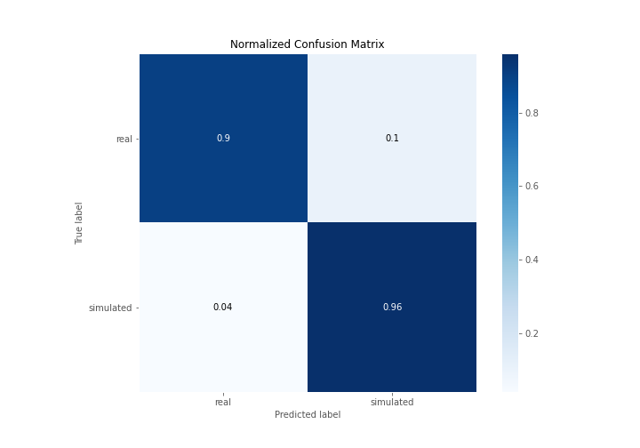
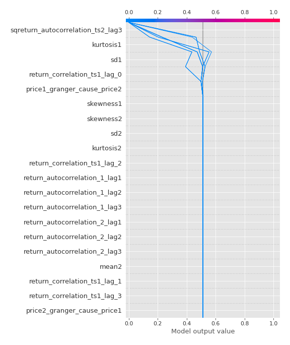

# Summary of 2_DecisionTree

[<< Go back](../README.md)

## Decision Tree
- **n_jobs**: -1
- **criterion**: gini
- **max_depth**: 3
- **explain_level**: 2

## Validation
 - **validation_type**: split
 - **train_ratio**: 0.75
 - **shuffle**: True
 - **stratify**: True

## Optimized metric
accuracy

## Training time

18.4 seconds

## Metric details
|           |    score |   threshold |
|:----------|---------:|------------:|
| logloss   | 0.217473 |  nan        |
| auc       | 0.952646 |  nan        |
| f1        | 0.934783 |    0.455285 |
| accuracy  | 0.931034 |    0.455285 |
| precision | 0.914894 |    0.455285 |
| recall    | 1        |    0        |
| mcc       | 0.862603 |    0.455285 |

## Confusion matrix (at threshold=0.455285)
|                      |   Predicted as real |   Predicted as simulated |
|:---------------------|--------------------:|-------------------------:|
| Labeled as real      |                  38 |                        4 |
| Labeled as simulated |                   2 |                       43 |

## Learning curves

## Decision Tree 

### Tree #1

### Rules

if (sqreturn_autocorrelation_ts2_lag3 > 0.072) and (kurtosis1 <= 3.969) and (return_correlation_ts1_lag_0 <= 0.437) then class: simulated (proba: 91.06%) | based on 123 samples

if (sqreturn_autocorrelation_ts2_lag3 <= 0.072) and (kurtosis1 > 1.885) then class: real (proba: 100.0%) | based on 71 samples

if (sqreturn_autocorrelation_ts2_lag3 <= 0.072) and (kurtosis1 <= 1.885) and (sd1 <= 1.839) then class: real (proba: 94.74%) | based on 19 samples

if (sqreturn_autocorrelation_ts2_lag3 > 0.072) and (kurtosis1 > 3.969) and (price1_granger_cause_price2 > 0.001) then class: real (proba: 93.75%) | based on 16 samples

if (sqreturn_autocorrelation_ts2_lag3 <= 0.072) and (kurtosis1 <= 1.885) and (sd1 > 1.839) then class: simulated (proba: 87.5%) | based on 16 samples

if (sqreturn_autocorrelation_ts2_lag3 > 0.072) and (kurtosis1 <= 3.969) and (return_correlation_ts1_lag_0 > 0.437) then class: real (proba: 76.92%) | based on 13 samples

if (sqreturn_autocorrelation_ts2_lag3 > 0.072) and (kurtosis1 > 3.969) and (price1_granger_cause_price2 <= 0.001) then class: simulated (proba: 100.0%) | based on 2 samples

## Permutation-based Importance

## Confusion Matrix

## Normalized Confusion Matrix

## ROC Curve

## Kolmogorov-Smirnov Statistic

## Precision-Recall Curve

## Calibration Curve

## Cumulative Gains Curve

## Lift Curve

## SHAP Importance

## SHAP Dependence plots

### Dependence (Fold 1)

## SHAP Decision plots

### Top-10 Worst decisions for class 0 (Fold 1)

### Top-10 Best decisions for class 0 (Fold 1)

### Top-10 Worst decisions for class 1 (Fold 1)

### Top-10 Best decisions for class 1 (Fold 1)

[<< Go back](../README.md)
