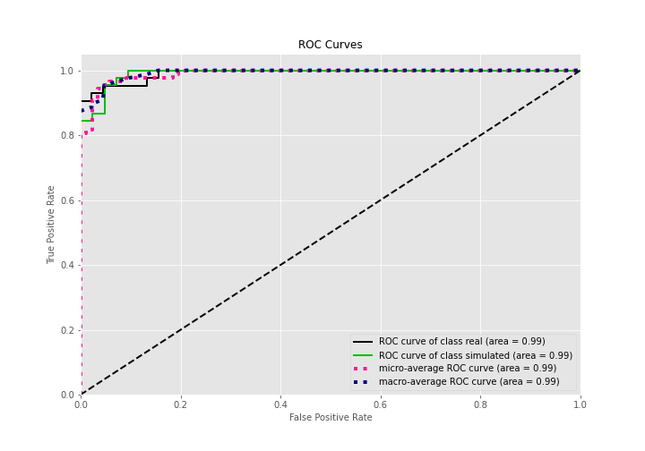
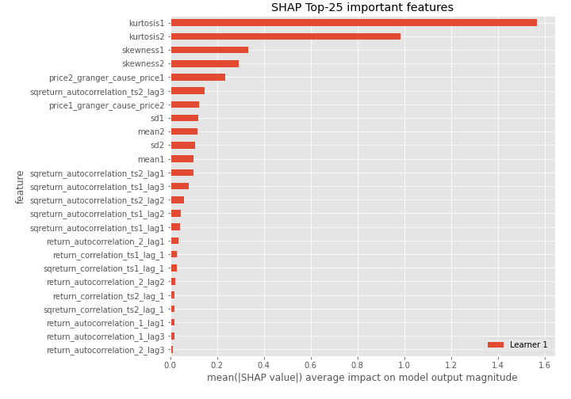
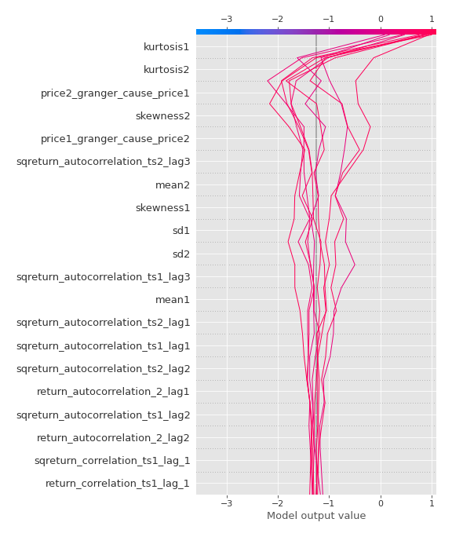

# Summary of 3_Linear

[<< Go back](../README.md)

## Logistic Regression (Linear)
- **n_jobs**: -1
- **explain_level**: 2

## Validation
 - **validation_type**: split
 - **train_ratio**: 0.75
 - **shuffle**: True
 - **stratify**: True

## Optimized metric
accuracy

## Training time

16.6 seconds

## Metric details
|           |    score |   threshold |
|:----------|---------:|------------:|
| logloss   | 0.238475 |  nan        |
| auc       | 0.991534 |  nan        |
| f1        | 0.957447 |    0.515281 |
| accuracy  | 0.954023 |    0.515281 |
| precision | 1        |    0.79624  |
| recall    | 1        |    6.89e-07 |
| mcc       | 0.911539 |    0.515281 |

## Confusion matrix (at threshold=0.515281)
|                      |   Predicted as real |   Predicted as simulated |
|:---------------------|--------------------:|-------------------------:|
| Labeled as real      |                  38 |                        4 |
| Labeled as simulated |                   0 |                       45 |

## Learning curves

## Coefficients
| feature                           |   Learner_1 |
|:----------------------------------|------------:|
| sqreturn_autocorrelation_ts2_lag3 |   1.92864   |
| mean2                             |   1.68919   |
| mean1                             |   1.60417   |
| sqreturn_autocorrelation_ts2_lag1 |   1.38892   |
| sqreturn_autocorrelation_ts1_lag3 |   1.07179   |
| return_autocorrelation_2_lag1     |   0.862784  |
| sqreturn_autocorrelation_ts2_lag2 |   0.814584  |
| sqreturn_autocorrelation_ts1_lag2 |   0.716167  |
| sqreturn_correlation_ts1_lag_1    |   0.678473  |
| return_correlation_ts1_lag_1      |   0.678473  |
| sqreturn_autocorrelation_ts1_lag1 |   0.592507  |
| return_autocorrelation_2_lag2     |   0.522999  |
| sqreturn_correlation_ts2_lag_1    |   0.460096  |
| return_correlation_ts2_lag_1      |   0.460096  |
| return_autocorrelation_1_lag3     |   0.409087  |
| return_autocorrelation_1_lag1     |   0.326286  |
| return_autocorrelation_1_lag2     |   0.315286  |
| return_autocorrelation_2_lag3     |   0.294251  |
| return_correlation_ts2_lag_3      |   0.266872  |
| sqreturn_correlation_ts2_lag_3    |   0.266872  |
| sd1                               |   0.236024  |
| return_correlation_ts1_lag_3      |   0.212756  |
| sqreturn_correlation_ts1_lag_3    |   0.212756  |
| return_correlation_ts2_lag_2      |   0.0821254 |
| sqreturn_correlation_ts2_lag_2    |   0.0821254 |
| return_correlation_ts1_lag_2      |   0.0729249 |
| sqreturn_correlation_ts1_lag_2    |   0.0729249 |
| sqreturn_correlation_ts1_lag_0    |  -0.0377778 |
| return_correlation_ts1_lag_0      |  -0.0377778 |
| sd2                               |  -0.178301  |
| price1_granger_cause_price2       |  -0.502608  |
| skewness2                         |  -0.699466  |
| skewness1                         |  -1.01762   |
| price2_granger_cause_price1       |  -1.04409   |
| intercept                         |  -1.71671   |
| kurtosis2                         |  -2.60832   |
| kurtosis1                         |  -2.71737   |

## Permutation-based Importance

## Confusion Matrix

## Normalized Confusion Matrix

## ROC Curve

## Kolmogorov-Smirnov Statistic

## Precision-Recall Curve

## Calibration Curve

## Cumulative Gains Curve

## Lift Curve

## SHAP Importance

## SHAP Dependence plots

### Dependence (Fold 1)

## SHAP Decision plots

### Top-10 Worst decisions for class 0 (Fold 1)

### Top-10 Best decisions for class 0 (Fold 1)

### Top-10 Worst decisions for class 1 (Fold 1)

### Top-10 Best decisions for class 1 (Fold 1)

[<< Go back](../README.md)
