# Exploratory Data Analysis

[<< Go back](../README.md)
## Feature : target
- **Feature type** : categorical
- **Missing** : 0.0%
- **Unique** : 2
- **Count** :347
- **Unique** :2
- **Top** :simulated
- **Freq** :178

## Feature : mean1
- **Feature type** : continous
- **Missing** : 0.0%
- **Unique** : 347
- **Count** :347.0
- **Mean** :0.07405513432469658
- **Std** :0.08262167492278727
- **Min** :-0.22632637961920957
- **25%th Percentile** : 0.026216846065395503
- **50%th Percentile** : 0.0689712886983387
- **75%th Percentile** : 0.12056462382623254
- **Max** :0.37175100008111034

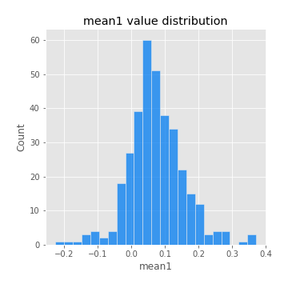
## Feature : mean2
- **Feature type** : continous
- **Missing** : 0.0%
- **Unique** : 347
- **Count** :347.0
- **Mean** :0.0889782130933265
- **Std** :0.08634516104873058
- **Min** :-0.21818165578778434
- **25%th Percentile** : 0.03938186039330817
- **50%th Percentile** : 0.08968720033715662
- **75%th Percentile** : 0.14385420143270644
- **Max** :0.37616608147096464

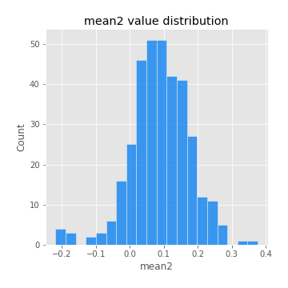
## Feature : sd1
- **Feature type** : continous
- **Missing** : 0.0%
- **Unique** : 347
- **Count** :347.0
- **Mean** :2.053661127010428
- **Std** :0.8466940732230865
- **Min** :0.7470080772831957
- **25%th Percentile** : 1.5429920858238124
- **50%th Percentile** : 1.966617338336333
- **75%th Percentile** : 2.4139555001214634
- **Max** :9.236766377527575

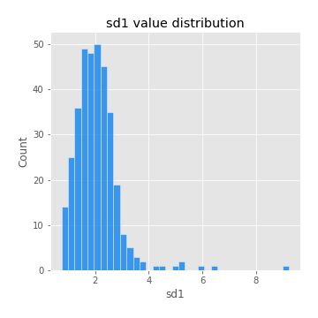
## Feature : sd2
- **Feature type** : continous
- **Missing** : 0.0%
- **Unique** : 347
- **Count** :347.0
- **Mean** :1.9048617193286699
- **Std** :0.6509956159843399
- **Min** :0.8086170063988386
- **25%th Percentile** : 1.4465199620573994
- **50%th Percentile** : 1.8179090932818114
- **75%th Percentile** : 2.1992635907215057
- **Max** :5.042707010333888

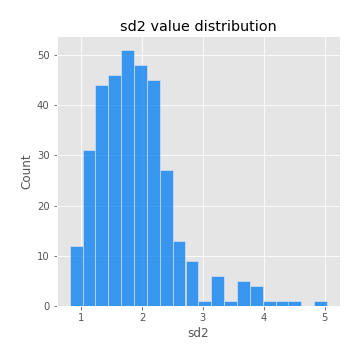
## Feature : skewness1
- **Feature type** : continous
- **Missing** : 0.0%
- **Unique** : 347
- **Count** :347.0
- **Mean** :-0.12764980992741148
- **Std** :0.5724685376309826
- **Min** :-2.817259764925239
- **25%th Percentile** : -0.31571804265842407
- **50%th Percentile** : -0.1266749335676343
- **75%th Percentile** : 0.04877192398232708
- **Max** :2.5845963767725557

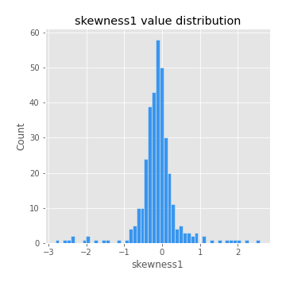
## Feature : skewness2
- **Feature type** : continous
- **Missing** : 0.0%
- **Unique** : 347
- **Count** :347.0
- **Mean** :-0.20585965278131685
- **Std** :0.735130958907579
- **Min** :-8.801502855292393
- **25%th Percentile** : -0.34261458854922555
- **50%th Percentile** : -0.15119171286641628
- **75%th Percentile** : 0.014918911997190846
- **Max** :2.2606839051517187

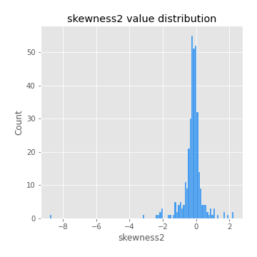
## Feature : kurtosis1
- **Feature type** : continous
- **Missing** : 0.0%
- **Unique** : 347
- **Count** :347.0
- **Mean** :3.870177451861758
- **Std** :5.305425447111004
- **Min** :0.07149361823522637
- **25%th Percentile** : 1.143702385182093
- **50%th Percentile** : 2.028433786881537
- **75%th Percentile** : 3.94510623843101
- **Max** :36.91113889081053

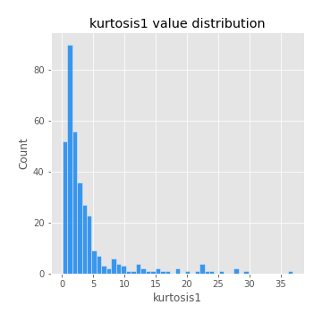
## Feature : kurtosis2
- **Feature type** : continous
- **Missing** : 0.0%
- **Unique** : 347
- **Count** :347.0
- **Mean** :4.444525572535983
- **Std** :9.072403727523362
- **Min** :0.15044486626750198
- **25%th Percentile** : 1.3284508957068737
- **50%th Percentile** : 2.096913496873246
- **75%th Percentile** : 4.3840343020263415
- **Max** :143.10871011533666

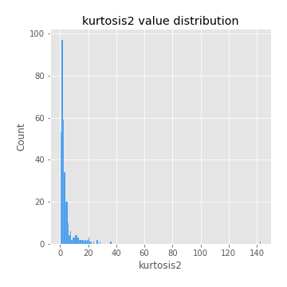
## Feature : return_autocorrelation_1_lag1
- **Feature type** : continous
- **Missing** : 0.0%
- **Unique** : 347
- **Count** :347.0
- **Mean** :-0.012725146738274861
- **Std** :0.06361978160913317
- **Min** :-0.2135576224968752
- **25%th Percentile** : -0.05440793986782945
- **50%th Percentile** : -0.009634447770928348
- **75%th Percentile** : 0.032021990337643545
- **Max** :0.17269129853537432

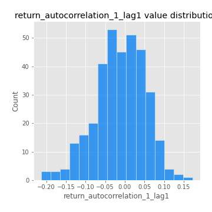
## Feature : return_autocorrelation_1_lag2
- **Feature type** : continous
- **Missing** : 0.0%
- **Unique** : 347
- **Count** :347.0
- **Mean** :-0.008736632631728187
- **Std** :0.05548889064450645
- **Min** :-0.15498829957011556
- **25%th Percentile** : -0.04690940119955089
- **50%th Percentile** : -0.004623435262567136
- **75%th Percentile** : 0.028097748318417486
- **Max** :0.15838856952915298

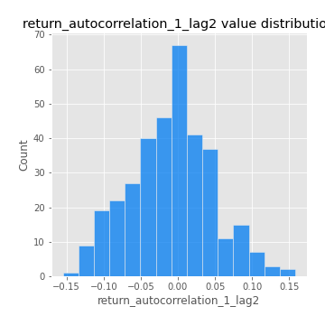
## Feature : return_autocorrelation_1_lag3
- **Feature type** : continous
- **Missing** : 0.0%
- **Unique** : 347
- **Count** :347.0
- **Mean** :-0.004538688872060552
- **Std** :0.05450122566631006
- **Min** :-0.1940836867390813
- **25%th Percentile** : -0.04087254336859095
- **50%th Percentile** : -0.003944386736241346
- **75%th Percentile** : 0.03383575212041928
- **Max** :0.12871071236517712

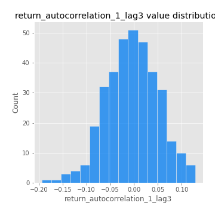
## Feature : return_autocorrelation_2_lag1
- **Feature type** : continous
- **Missing** : 0.0%
- **Unique** : 347
- **Count** :347.0
- **Mean** :-0.011649680261251759
- **Std** :0.0592649841578319
- **Min** :-0.25075531010123286
- **25%th Percentile** : -0.04799442779789416
- **50%th Percentile** : -0.005938424014338073
- **75%th Percentile** : 0.02721614824607003
- **Max** :0.15507433362023185

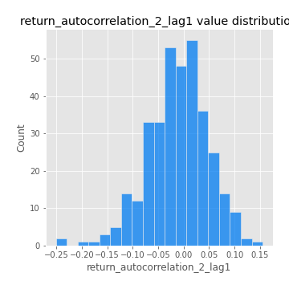
## Feature : return_autocorrelation_2_lag2
- **Feature type** : continous
- **Missing** : 0.0%
- **Unique** : 347
- **Count** :347.0
- **Mean** :-0.002831157384903862
- **Std** :0.05439232294241086
- **Min** :-0.15323211089747296
- **25%th Percentile** : -0.04092895899832402
- **50%th Percentile** : -0.007092497097903174
- **75%th Percentile** : 0.03379684066327783
- **Max** :0.1735398560230086

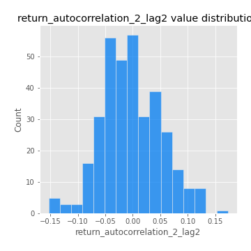
## Feature : return_autocorrelation_2_lag3
- **Feature type** : continous
- **Missing** : 0.0%
- **Unique** : 347
- **Count** :347.0
- **Mean** :-0.004932815638401142
- **Std** :0.0532243432507918
- **Min** :-0.14200107169559698
- **25%th Percentile** : -0.041226251088397295
- **50%th Percentile** : -0.0034712824307259918
- **75%th Percentile** : 0.02717317641916398
- **Max** :0.1419999376914021

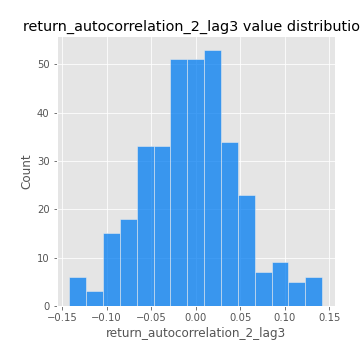
## Feature : return_correlation_ts1_lag_0
- **Feature type** : continous
- **Missing** : 0.0%
- **Unique** : 347
- **Count** :347.0
- **Mean** :0.3316137281627863
- **Std** :0.10770217914898664
- **Min** :-0.027089510445801036
- **25%th Percentile** : 0.2791007675901257
- **50%th Percentile** : 0.340510123884637
- **75%th Percentile** : 0.381967618011326
- **Max** :0.7041861626832071

## Feature : return_correlation_ts1_lag_1
- **Feature type** : continous
- **Missing** : 0.0%
- **Unique** : 347
- **Count** :347.0
- **Mean** :-0.005339160424639657
- **Std** :0.05550111854873918
- **Min** :-0.16985510949917193
- **25%th Percentile** : -0.03803842226944461
- **50%th Percentile** : -0.0030623572402182385
- **75%th Percentile** : 0.033379605880773794
- **Max** :0.15970106437189838

## Feature : return_correlation_ts1_lag_2
- **Feature type** : continous
- **Missing** : 0.0%
- **Unique** : 347
- **Count** :347.0
- **Mean** :-0.0021127485060513777
- **Std** :0.05384395465022825
- **Min** :-0.21653581047581763
- **25%th Percentile** : -0.033688209781193
- **50%th Percentile** : -0.0037917112102554803
- **75%th Percentile** : 0.03775624754614823
- **Max** :0.11240938379175658

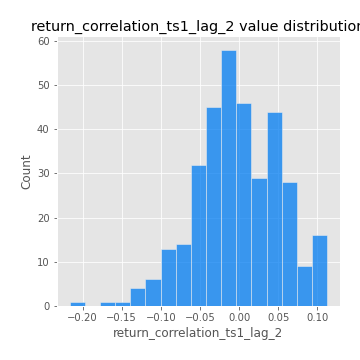
## Feature : return_correlation_ts1_lag_3
- **Feature type** : continous
- **Missing** : 0.0%
- **Unique** : 347
- **Count** :347.0
- **Mean** :-0.0020706907805164297
- **Std** :0.053873164687420684
- **Min** :-0.17540194260766434
- **25%th Percentile** : -0.03535785091063344
- **50%th Percentile** : -0.004614783084151977
- **75%th Percentile** : 0.03285097760751268
- **Max** :0.1636773216468148

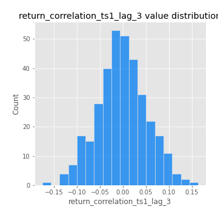
## Feature : return_correlation_ts2_lag_1
- **Feature type** : continous
- **Missing** : 0.0%
- **Unique** : 347
- **Count** :347.0
- **Mean** :-0.005747434207041293
- **Std** :0.0555086812435288
- **Min** :-0.2081139431093261
- **25%th Percentile** : -0.04273489620444549
- **50%th Percentile** : -0.004387972000727864
- **75%th Percentile** : 0.02807380533704988
- **Max** :0.17208763791364762

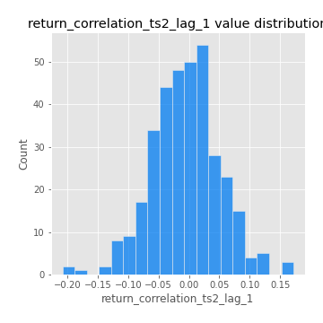
## Feature : return_correlation_ts2_lag_2
- **Feature type** : continous
- **Missing** : 0.0%
- **Unique** : 347
- **Count** :347.0
- **Mean** :-0.0007660040461546844
- **Std** :0.05653422929009813
- **Min** :-0.23751835475804678
- **25%th Percentile** : -0.04305982249865989
- **50%th Percentile** : -0.0010726116929104883
- **75%th Percentile** : 0.03694306352911178
- **Max** :0.20772887392904255

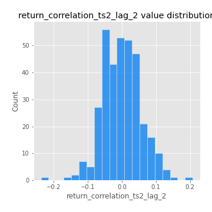
## Feature : return_correlation_ts2_lag_3
- **Feature type** : continous
- **Missing** : 0.0%
- **Unique** : 347
- **Count** :347.0
- **Mean** :-0.0030799565035201527
- **Std** :0.053557854770541785
- **Min** :-0.17564076057312866
- **25%th Percentile** : -0.03231777823180233
- **50%th Percentile** : -0.005416874124346286
- **75%th Percentile** : 0.03547945827945469
- **Max** :0.13128380114518473

## Feature : sqreturn_autocorrelation_ts1_lag1
- **Feature type** : continous
- **Missing** : 0.0%
- **Unique** : 347
- **Count** :347.0
- **Mean** :0.1222767938995433
- **Std** :0.08658449725814829
- **Min** :-0.06532118872798363
- **25%th Percentile** : 0.06254493414387335
- **50%th Percentile** : 0.11298867080838135
- **75%th Percentile** : 0.1642416134104597
- **Max** :0.4439086285737898

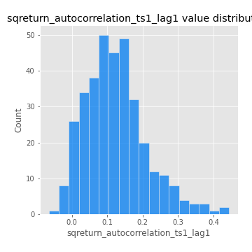
## Feature : sqreturn_autocorrelation_ts1_lag2
- **Feature type** : continous
- **Missing** : 0.0%
- **Unique** : 347
- **Count** :347.0
- **Mean** :0.10423655625918607
- **Std** :0.08603005101952833
- **Min** :-0.05165593255897504
- **25%th Percentile** : 0.037803004532887534
- **50%th Percentile** : 0.09271251450698788
- **75%th Percentile** : 0.15591227278578898
- **Max** :0.42719220751700526

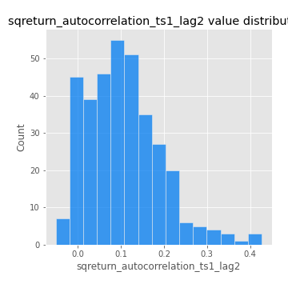
## Feature : sqreturn_autocorrelation_ts1_lag3
- **Feature type** : continous
- **Missing** : 0.0%
- **Unique** : 347
- **Count** :347.0
- **Mean** :0.10304352115894994
- **Std** :0.08925289043397919
- **Min** :-0.044565249834063285
- **25%th Percentile** : 0.03243087994531406
- **50%th Percentile** : 0.09242902677636446
- **75%th Percentile** : 0.15500235371815474
- **Max** :0.37139813170716524

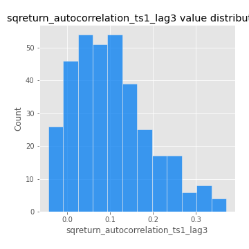
## Feature : sqreturn_autocorrelation_ts2_lag1
- **Feature type** : continous
- **Missing** : 0.0%
- **Unique** : 347
- **Count** :347.0
- **Mean** :0.12574618993643022
- **Std** :0.08702548968761496
- **Min** :-0.08520586663750691
- **25%th Percentile** : 0.05614012736663084
- **50%th Percentile** : 0.12312624338524104
- **75%th Percentile** : 0.17835003250773937
- **Max** :0.5115129763381407

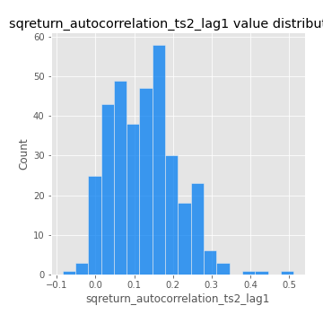
## Feature : sqreturn_autocorrelation_ts2_lag2
- **Feature type** : continous
- **Missing** : 0.0%
- **Unique** : 347
- **Count** :347.0
- **Mean** :0.10803687409803094
- **Std** :0.09193555145876602
- **Min** :-0.051523884196217395
- **25%th Percentile** : 0.03719445972472185
- **50%th Percentile** : 0.09679336230643001
- **75%th Percentile** : 0.1643590722101471
- **Max** :0.5373432415582473

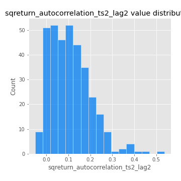
## Feature : sqreturn_autocorrelation_ts2_lag3
- **Feature type** : continous
- **Missing** : 0.0%
- **Unique** : 347
- **Count** :347.0
- **Mean** :0.10334821192967467
- **Std** :0.08909071127221367
- **Min** :-0.06082766359524085
- **25%th Percentile** : 0.03445742908342056
- **50%th Percentile** : 0.0914136433121425
- **75%th Percentile** : 0.16130324429843373
- **Max** :0.3712266819145897

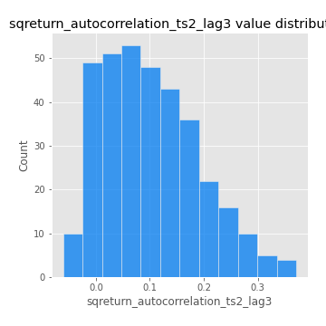
## Feature : sqreturn_correlation_ts1_lag_0
- **Feature type** : continous
- **Missing** : 0.0%
- **Unique** : 347
- **Count** :347.0
- **Mean** :0.3316137281627863
- **Std** :0.10770217914898664
- **Min** :-0.027089510445801036
- **25%th Percentile** : 0.2791007675901257
- **50%th Percentile** : 0.340510123884637
- **75%th Percentile** : 0.381967618011326
- **Max** :0.7041861626832071

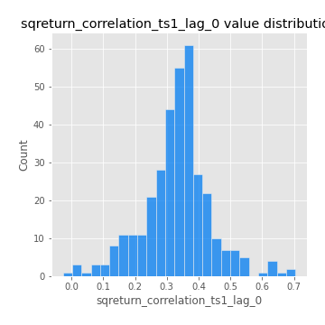
## Feature : sqreturn_correlation_ts1_lag_1
- **Feature type** : continous
- **Missing** : 0.0%
- **Unique** : 347
- **Count** :347.0
- **Mean** :-0.005339160424639657
- **Std** :0.05550111854873918
- **Min** :-0.16985510949917193
- **25%th Percentile** : -0.03803842226944461
- **50%th Percentile** : -0.0030623572402182385
- **75%th Percentile** : 0.033379605880773794
- **Max** :0.15970106437189838

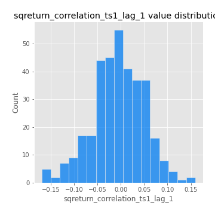
## Feature : sqreturn_correlation_ts1_lag_2
- **Feature type** : continous
- **Missing** : 0.0%
- **Unique** : 347
- **Count** :347.0
- **Mean** :-0.0021127485060513777
- **Std** :0.05384395465022825
- **Min** :-0.21653581047581763
- **25%th Percentile** : -0.033688209781193
- **50%th Percentile** : -0.0037917112102554803
- **75%th Percentile** : 0.03775624754614823
- **Max** :0.11240938379175658

## Feature : sqreturn_correlation_ts1_lag_3
- **Feature type** : continous
- **Missing** : 0.0%
- **Unique** : 347
- **Count** :347.0
- **Mean** :-0.0020706907805164297
- **Std** :0.053873164687420684
- **Min** :-0.17540194260766434
- **25%th Percentile** : -0.03535785091063344
- **50%th Percentile** : -0.004614783084151977
- **75%th Percentile** : 0.03285097760751268
- **Max** :0.1636773216468148

## Feature : sqreturn_correlation_ts2_lag_1
- **Feature type** : continous
- **Missing** : 0.0%
- **Unique** : 347
- **Count** :347.0
- **Mean** :-0.005747434207041293
- **Std** :0.0555086812435288
- **Min** :-0.2081139431093261
- **25%th Percentile** : -0.04273489620444549
- **50%th Percentile** : -0.004387972000727864
- **75%th Percentile** : 0.02807380533704988
- **Max** :0.17208763791364762

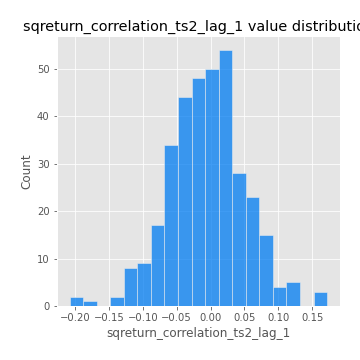
## Feature : sqreturn_correlation_ts2_lag_2
- **Feature type** : continous
- **Missing** : 0.0%
- **Unique** : 347
- **Count** :347.0
- **Mean** :-0.0007660040461546844
- **Std** :0.05653422929009813
- **Min** :-0.23751835475804678
- **25%th Percentile** : -0.04305982249865989
- **50%th Percentile** : -0.0010726116929104883
- **75%th Percentile** : 0.03694306352911178
- **Max** :0.20772887392904255

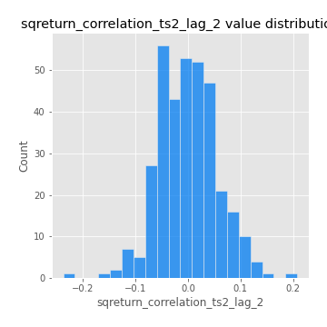
## Feature : sqreturn_correlation_ts2_lag_3
- **Feature type** : continous
- **Missing** : 0.0%
- **Unique** : 347
- **Count** :347.0
- **Mean** :-0.0030799565035201527
- **Std** :0.053557854770541785
- **Min** :-0.17564076057312866
- **25%th Percentile** : -0.03231777823180233
- **50%th Percentile** : -0.005416874124346286
- **75%th Percentile** : 0.03547945827945469
- **Max** :0.13128380114518473

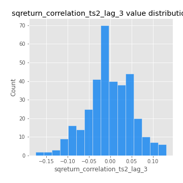
## Feature : price2_granger_cause_price1
- **Feature type** : continous
- **Missing** : 0.0%
- **Unique** : 347
- **Count** :347.0
- **Mean** :0.2693612627884807
- **Std** :0.26997700328380964
- **Min** :1.2398779908072904e-07
- **25%th Percentile** : 0.03256290800659352
- **50%th Percentile** : 0.17256746072654225
- **75%th Percentile** : 0.4786918792714325
- **Max** :0.9853666024514321

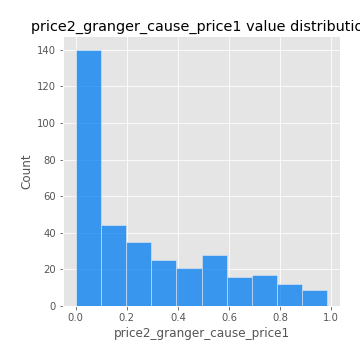
## Feature : price1_granger_cause_price2
- **Feature type** : continous
- **Missing** : 0.0%
- **Unique** : 347
- **Count** :347.0
- **Mean** :0.30416387882605045
- **Std** :0.2887147731334184
- **Min** :2.8799246298044637e-08
- **25%th Percentile** : 0.05092252907360731
- **50%th Percentile** : 0.2176774341783571
- **75%th Percentile** : 0.496322264668029
- **Max** :0.9951398266867577

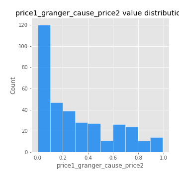

[<< Go back](../README.md)
