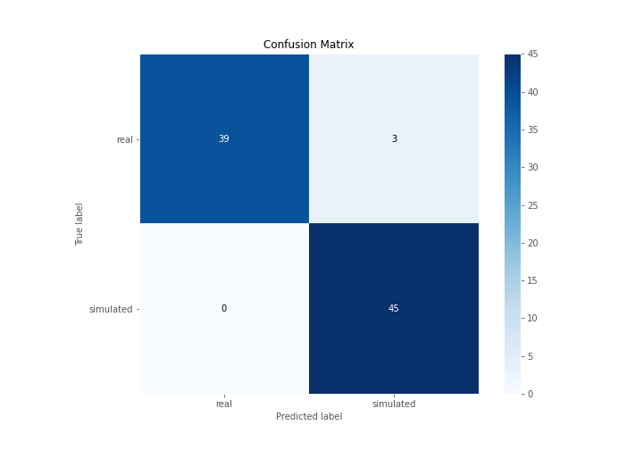
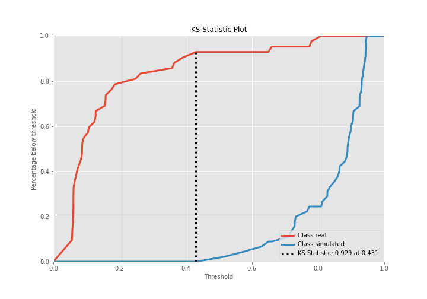
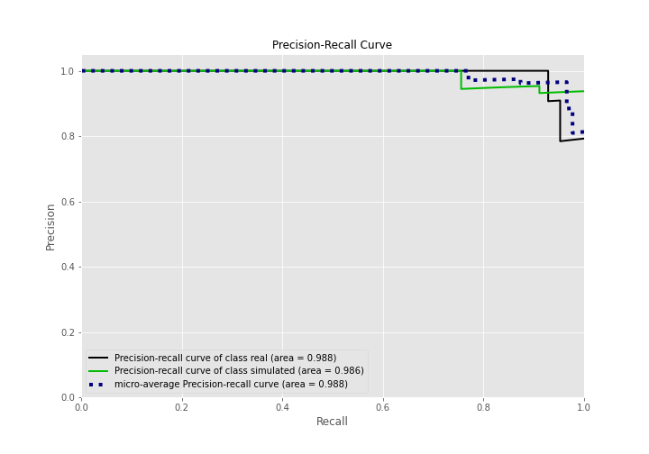
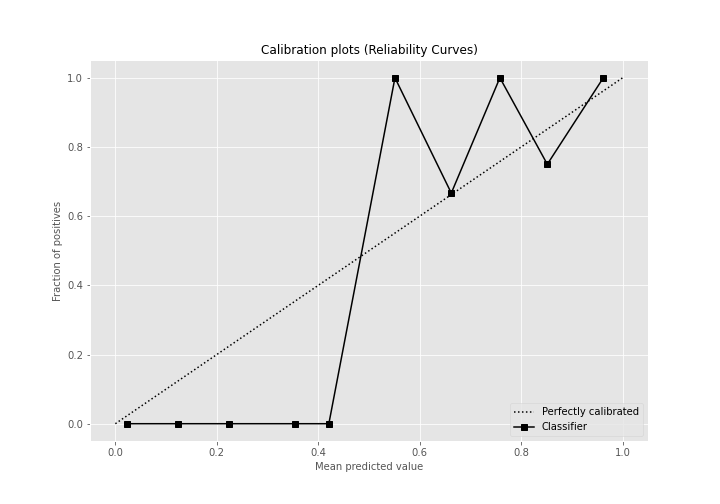
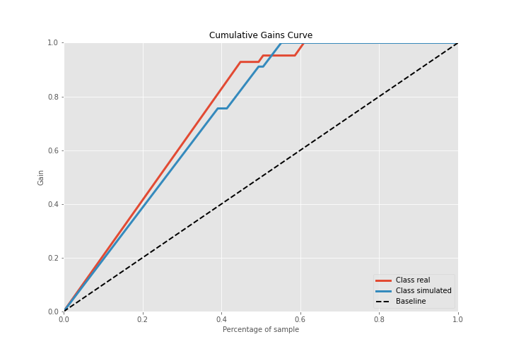
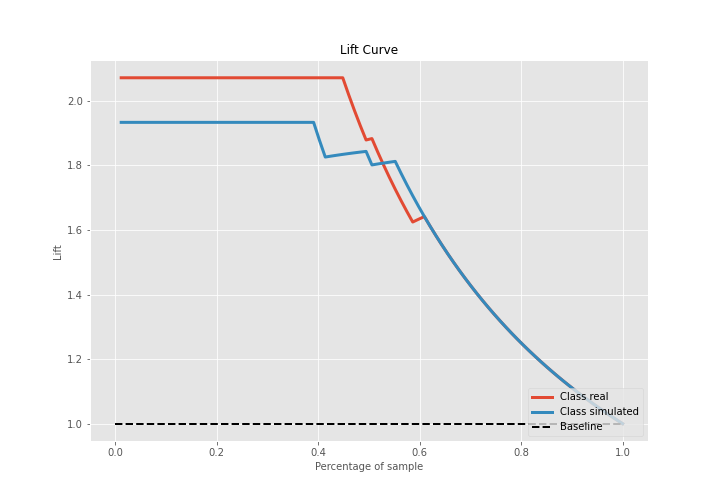

# Summary of Ensemble

[<< Go back](../README.md)

## Ensemble structure
| Model             |   Weight |
|:------------------|---------:|
| 4_Default_Xgboost |        1 |

## Metric details
|           |    score |   threshold |
|:----------|---------:|------------:|
| logloss   | 0.20399  | nan         |
| auc       | 0.986243 | nan         |
| f1        | 0.967742 |   0.463605  |
| accuracy  | 0.965517 |   0.463605  |
| precision | 1        |   0.830676  |
| recall    | 1        |   0.0504029 |
| mcc       | 0.933025 |   0.463605  |

## Confusion matrix (at threshold=0.463605)
|                      |   Predicted as real |   Predicted as simulated |
|:---------------------|--------------------:|-------------------------:|
| Labeled as real      |                  39 |                        3 |
| Labeled as simulated |                   0 |                       45 |

## Learning curves

## Confusion Matrix

## Normalized Confusion Matrix

## ROC Curve

## Kolmogorov-Smirnov Statistic

## Precision-Recall Curve

## Calibration Curve

## Cumulative Gains Curve

## Lift Curve

[<< Go back](../README.md)
