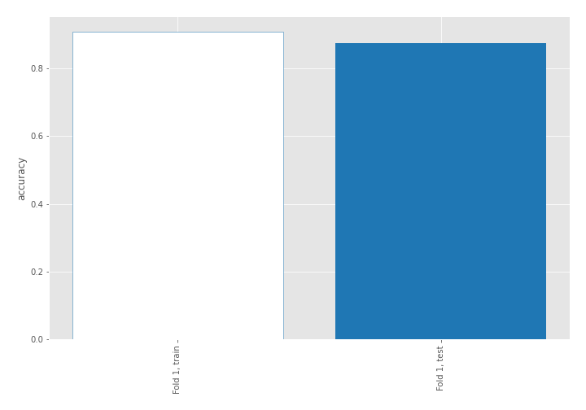

# Summary of 3_Linear

[<< Go back](../README.md)

## Logistic Regression (Linear)
- **n_jobs**: -1
- **explain_level**: 2

## Validation
 - **validation_type**: split
 - **train_ratio**: 0.75
 - **shuffle**: True
 - **stratify**: True

## Optimized metric
accuracy

## Training time

16.9 seconds

## Metric details
|           |    score |    threshold |
|:----------|---------:|-------------:|
| logloss   | 0.319751 | nan          |
| auc       | 0.95228  | nan          |
| f1        | 0.91358  |   0.609732   |
| accuracy  | 0.91954  |   0.609732   |
| precision | 1        |   0.826028   |
| recall    | 1        |   5.8919e-09 |
| mcc       | 0.838557 |   0.609732   |

## Confusion matrix (at threshold=0.609732)
|                      |   Predicted as real |   Predicted as simulated |
|:---------------------|--------------------:|-------------------------:|
| Labeled as real      |                  43 |                        3 |
| Labeled as simulated |                   4 |                       37 |

## Learning curves

## Coefficients
| feature                           |   Learner_1 |
|:----------------------------------|------------:|
| mean2                             |  1.74838    |
| sqreturn_autocorrelation_ts2_lag3 |  1.6479     |
| mean1                             |  1.61968    |
| sqreturn_autocorrelation_ts1_lag3 |  1.60502    |
| sqreturn_autocorrelation_ts2_lag2 |  1.09178    |
| sqreturn_autocorrelation_ts1_lag1 |  0.892309   |
| sqreturn_autocorrelation_ts1_lag2 |  0.755881   |
| sqreturn_autocorrelation_ts2_lag1 |  0.734579   |
| return_autocorrelation_1_lag1     |  0.550218   |
| return_autocorrelation_2_lag1     |  0.490843   |
| return_correlation_ts2_lag_1      |  0.471952   |
| sqreturn_correlation_ts2_lag_1    |  0.471952   |
| sd1                               |  0.431112   |
| sqreturn_correlation_ts1_lag_1    |  0.416298   |
| return_correlation_ts1_lag_1      |  0.416298   |
| sqreturn_correlation_ts2_lag_3    |  0.351784   |
| return_correlation_ts2_lag_3      |  0.351784   |
| sqreturn_correlation_ts1_lag_3    |  0.232545   |
| return_correlation_ts1_lag_3      |  0.232545   |
| price1_granger_cause_price2       |  0.229772   |
| sqreturn_correlation_ts1_lag_2    |  0.192539   |
| return_correlation_ts1_lag_2      |  0.192539   |
| return_autocorrelation_1_lag2     |  0.191101   |
| return_autocorrelation_2_lag3     |  0.130072   |
| return_autocorrelation_2_lag2     |  0.0363093  |
| return_autocorrelation_1_lag3     |  0.0308205  |
| sd2                               |  0.0207565  |
| return_correlation_ts2_lag_2      |  0.00378915 |
| sqreturn_correlation_ts2_lag_2    |  0.00378915 |
| sqreturn_correlation_ts1_lag_0    | -0.363211   |
| return_correlation_ts1_lag_0      | -0.363211   |
| skewness2                         | -0.442828   |
| skewness1                         | -0.572072   |
| price2_granger_cause_price1       | -0.668112   |
| intercept                         | -2.27408    |
| kurtosis2                         | -2.65424    |
| kurtosis1                         | -3.39413    |

## Permutation-based Importance

## Confusion Matrix

## Normalized Confusion Matrix

## ROC Curve

## Kolmogorov-Smirnov Statistic

## Precision-Recall Curve

## Calibration Curve

## Cumulative Gains Curve

## Lift Curve

## SHAP Importance

## SHAP Dependence plots

### Dependence (Fold 1)

## SHAP Decision plots

### Top-10 Worst decisions for class 0 (Fold 1)

### Top-10 Best decisions for class 0 (Fold 1)

### Top-10 Worst decisions for class 1 (Fold 1)

### Top-10 Best decisions for class 1 (Fold 1)

[<< Go back](../README.md)
