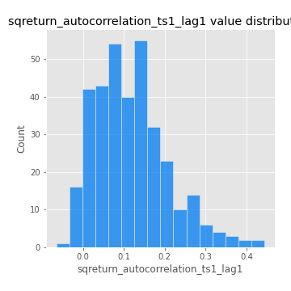

# Exploratory Data Analysis

[<< Go back](../README.md)
## Feature : target
- **Feature type** : categorical
- **Missing** : 0.0%
- **Unique** : 2
- **Count** :347
- **Unique** :2
- **Top** :real
- **Freq** :183

## Feature : mean1
- **Feature type** : continous
- **Missing** : 0.0%
- **Unique** : 347
- **Count** :347.0
- **Mean** :0.07470759046122377
- **Std** :0.07371361644476881
- **Min** :-0.22632637961920957
- **25%th Percentile** : 0.03478403346108177
- **50%th Percentile** : 0.0779216330041561
- **75%th Percentile** : 0.1166692536208695
- **Max** :0.3612366374600757

## Feature : mean2
- **Feature type** : continous
- **Missing** : 0.0%
- **Unique** : 347
- **Count** :347.0
- **Mean** :0.09017631559970601
- **Std** :0.09067853919033875
- **Min** :-0.24205418062825398
- **25%th Percentile** : 0.0437677159325527
- **50%th Percentile** : 0.0913966327691612
- **75%th Percentile** : 0.13937129005794935
- **Max** :0.4417073440900123

## Feature : sd1
- **Feature type** : continous
- **Missing** : 0.0%
- **Unique** : 347
- **Count** :347.0
- **Mean** :2.0370446412091257
- **Std** :0.8038669963932065
- **Min** :0.7470080772831957
- **25%th Percentile** : 1.5269131698157343
- **50%th Percentile** : 1.936998376942811
- **75%th Percentile** : 2.426889116297694
- **Max** :9.236766377527575

## Feature : sd2
- **Feature type** : continous
- **Missing** : 0.0%
- **Unique** : 347
- **Count** :347.0
- **Mean** :1.9246882334606472
- **Std** :0.7265169496619329
- **Min** :0.8592887433004143
- **25%th Percentile** : 1.4234462457929853
- **50%th Percentile** : 1.8248602452877782
- **75%th Percentile** : 2.2245000764210277
- **Max** :5.762808157208253

## Feature : skewness1
- **Feature type** : continous
- **Missing** : 0.0%
- **Unique** : 347
- **Count** :347.0
- **Mean** :-0.1922237746150512
- **Std** :0.6222304524106486
- **Min** :-3.530116233761814
- **25%th Percentile** : -0.3269073467974984
- **50%th Percentile** : -0.141332093138545
- **75%th Percentile** : 0.050927756361545326
- **Max** :2.5845963767725557

## Feature : skewness2
- **Feature type** : continous
- **Missing** : 0.0%
- **Unique** : 347
- **Count** :347.0
- **Mean** :-0.24411529362161774
- **Std** :0.8359967488810116
- **Min** :-8.801502855292393
- **25%th Percentile** : -0.37789929337724304
- **50%th Percentile** : -0.1674899001122927
- **75%th Percentile** : 0.03218697590660121
- **Max** :2.2606839051517187

## Feature : kurtosis1
- **Feature type** : continous
- **Missing** : 0.0%
- **Unique** : 347
- **Count** :347.0
- **Mean** :4.202563782023571
- **Std** :6.069971423792369
- **Min** :0.03477879299249054
- **25%th Percentile** : 1.2311786350406675
- **50%th Percentile** : 2.036431357119017
- **75%th Percentile** : 4.0558655925763585
- **Max** :46.07507808162177

## Feature : kurtosis2
- **Feature type** : continous
- **Missing** : 0.0%
- **Unique** : 347
- **Count** :347.0
- **Mean** :5.058156619873082
- **Std** :10.402501535351844
- **Min** :-0.0016385182802154397
- **25%th Percentile** : 1.291714365527771
- **50%th Percentile** : 2.274867267981603
- **75%th Percentile** : 4.6177777484579545
- **Max** :143.10871011533666

## Feature : return_autocorrelation_1_lag1
- **Feature type** : continous
- **Missing** : 0.0%
- **Unique** : 347
- **Count** :347.0
- **Mean** :-0.015020968324541266
- **Std** :0.0603058207665378
- **Min** :-0.2135576224968752
- **25%th Percentile** : -0.05436027936366339
- **50%th Percentile** : -0.010914393888152778
- **75%th Percentile** : 0.026446019413954046
- **Max** :0.12810656890648087

## Feature : return_autocorrelation_1_lag2
- **Feature type** : continous
- **Missing** : 0.0%
- **Unique** : 347
- **Count** :347.0
- **Mean** :-0.006786926989595534
- **Std** :0.05358714551692273
- **Min** :-0.13641918359183158
- **25%th Percentile** : -0.03617643410814147
- **50%th Percentile** : -0.004318006208422728
- **75%th Percentile** : 0.022722887908027053
- **Max** :0.1561488228015672

## Feature : return_autocorrelation_1_lag3
- **Feature type** : continous
- **Missing** : 0.0%
- **Unique** : 347
- **Count** :347.0
- **Mean** :-0.003662513061840668
- **Std** :0.05458120009336672
- **Min** :-0.1940836867390813
- **25%th Percentile** : -0.03806721128257361
- **50%th Percentile** : -0.004104477608767998
- **75%th Percentile** : 0.03141043094743164
- **Max** :0.17805869530681923

## Feature : return_autocorrelation_2_lag1
- **Feature type** : continous
- **Missing** : 0.0%
- **Unique** : 347
- **Count** :347.0
- **Mean** :-0.013344965274487638
- **Std** :0.06350101339027096
- **Min** :-0.24590087874039124
- **25%th Percentile** : -0.052179228181134345
- **50%th Percentile** : -0.007960497440593815
- **75%th Percentile** : 0.027547365041694877
- **Max** :0.31863413537898483

## Feature : return_autocorrelation_2_lag2
- **Feature type** : continous
- **Missing** : 0.0%
- **Unique** : 347
- **Count** :347.0
- **Mean** :-0.007742737967790822
- **Std** :0.05629557326469519
- **Min** :-0.17870522920613302
- **25%th Percentile** : -0.04569979039334354
- **50%th Percentile** : -0.012295780900347084
- **75%th Percentile** : 0.02882722528692372
- **Max** :0.20974504043791217

## Feature : return_autocorrelation_2_lag3
- **Feature type** : continous
- **Missing** : 0.0%
- **Unique** : 347
- **Count** :347.0
- **Mean** :-0.010126932002216739
- **Std** :0.05408798954132593
- **Min** :-0.20811833755681214
- **25%th Percentile** : -0.046279380740832474
- **50%th Percentile** : -0.009561373779768668
- **75%th Percentile** : 0.022950056968112212
- **Max** :0.1876000786155444

## Feature : return_correlation_ts1_lag_0
- **Feature type** : continous
- **Missing** : 0.0%
- **Unique** : 347
- **Count** :347.0
- **Mean** :0.33263965008182134
- **Std** :0.1155690311232684
- **Min** :-0.027089510445801036
- **25%th Percentile** : 0.2740403639397442
- **50%th Percentile** : 0.34053760455321963
- **75%th Percentile** : 0.3910209942636035
- **Max** :0.7041861626832071

## Feature : return_correlation_ts1_lag_1
- **Feature type** : continous
- **Missing** : 0.0%
- **Unique** : 347
- **Count** :347.0
- **Mean** :-0.011042977794226153
- **Std** :0.057846072546438435
- **Min** :-0.19664360164206132
- **25%th Percentile** : -0.049041207730597426
- **50%th Percentile** : -0.008522969239548574
- **75%th Percentile** : 0.02841341836609171
- **Max** :0.15499424718508623

## Feature : return_correlation_ts1_lag_2
- **Feature type** : continous
- **Missing** : 0.0%
- **Unique** : 347
- **Count** :347.0
- **Mean** :-0.002469925736930432
- **Std** :0.05470504253247236
- **Min** :-0.21653581047581763
- **25%th Percentile** : -0.03830355739263118
- **50%th Percentile** : -0.001280423333016456
- **75%th Percentile** : 0.03453307137063155
- **Max** :0.12943555700949524

## Feature : return_correlation_ts1_lag_3
- **Feature type** : continous
- **Missing** : 0.0%
- **Unique** : 347
- **Count** :347.0
- **Mean** :-0.005878565961550602
- **Std** :0.05674391784791449
- **Min** :-0.1749063152975082
- **25%th Percentile** : -0.04562685524991772
- **50%th Percentile** : -0.006988336667557
- **75%th Percentile** : 0.031936574684001316
- **Max** :0.1636773216468148

## Feature : return_correlation_ts2_lag_1
- **Feature type** : continous
- **Missing** : 0.0%
- **Unique** : 347
- **Count** :347.0
- **Mean** :-0.009735330471998071
- **Std** :0.05409885887916762
- **Min** :-0.20093919236581337
- **25%th Percentile** : -0.04609985719551275
- **50%th Percentile** : -0.008552306461263657
- **75%th Percentile** : 0.026465125220044967
- **Max** :0.11556235671885211

## Feature : return_correlation_ts2_lag_2
- **Feature type** : continous
- **Missing** : 0.0%
- **Unique** : 347
- **Count** :347.0
- **Mean** :-0.0020557715666573596
- **Std** :0.05113915613227217
- **Min** :-0.1829314132519944
- **25%th Percentile** : -0.036832792174121456
- **50%th Percentile** : -0.0017666084871427788
- **75%th Percentile** : 0.02798316917633069
- **Max** :0.20772887392904255

## Feature : return_correlation_ts2_lag_3
- **Feature type** : continous
- **Missing** : 0.0%
- **Unique** : 347
- **Count** :347.0
- **Mean** :-0.0026159151156122207
- **Std** :0.0553210225338872
- **Min** :-0.17564076057312866
- **25%th Percentile** : -0.032037412546571886
- **50%th Percentile** : -0.00482660661728032
- **75%th Percentile** : 0.03393817548390328
- **Max** :0.1646106668413972

## Feature : sqreturn_autocorrelation_ts1_lag1
- **Feature type** : continous
- **Missing** : 0.0%
- **Unique** : 347
- **Count** :347.0
- **Mean** :0.1184926205038492
- **Std** :0.08946566640853759
- **Min** :-0.06532118872798363
- **25%th Percentile** : 0.05116477601539819
- **50%th Percentile** : 0.10645141836349019
- **75%th Percentile** : 0.16736214608096464
- **Max** :0.4439086285737898

## Feature : sqreturn_autocorrelation_ts1_lag2
- **Feature type** : continous
- **Missing** : 0.0%
- **Unique** : 347
- **Count** :347.0
- **Mean** :0.10935189763334068
- **Std** :0.09464840114439513
- **Min** :-0.05419304650062953
- **25%th Percentile** : 0.034119627856539034
- **50%th Percentile** : 0.09773195992853262
- **75%th Percentile** : 0.17189665483499741
- **Max** :0.540735851444759

## Feature : sqreturn_autocorrelation_ts1_lag3
- **Feature type** : continous
- **Missing** : 0.0%
- **Unique** : 347
- **Count** :347.0
- **Mean** :0.09894357321691132
- **Std** :0.08964321104817305
- **Min** :-0.07932884741093428
- **25%th Percentile** : 0.02854069490670872
- **50%th Percentile** : 0.08676781137626986
- **75%th Percentile** : 0.15003649068132024
- **Max** :0.44755937369538146

## Feature : sqreturn_autocorrelation_ts2_lag1
- **Feature type** : continous
- **Missing** : 0.0%
- **Unique** : 347
- **Count** :347.0
- **Mean** :0.11657157355524182
- **Std** :0.08819378251116763
- **Min** :-0.08520586663750691
- **25%th Percentile** : 0.05101125574175471
- **50%th Percentile** : 0.10696663936838736
- **75%th Percentile** : 0.16501070256361283
- **Max** :0.510085647437958

## Feature : sqreturn_autocorrelation_ts2_lag2
- **Feature type** : continous
- **Missing** : 0.0%
- **Unique** : 347
- **Count** :347.0
- **Mean** :0.10896616636450628
- **Std** :0.09415045951032128
- **Min** :-0.051523884196217395
- **25%th Percentile** : 0.03492206419176931
- **50%th Percentile** : 0.09651838809913722
- **75%th Percentile** : 0.16279226188175683
- **Max** :0.5373432415582473

## Feature : sqreturn_autocorrelation_ts2_lag3
- **Feature type** : continous
- **Missing** : 0.0%
- **Unique** : 347
- **Count** :347.0
- **Mean** :0.09444598951021041
- **Std** :0.0824745303674398
- **Min** :-0.06065894750062144
- **25%th Percentile** : 0.027113529689900787
- **50%th Percentile** : 0.08537915245668118
- **75%th Percentile** : 0.1483882696807079
- **Max** :0.3750177445524922

## Feature : sqreturn_correlation_ts1_lag_0
- **Feature type** : continous
- **Missing** : 0.0%
- **Unique** : 347
- **Count** :347.0
- **Mean** :0.33263965008182134
- **Std** :0.1155690311232684
- **Min** :-0.027089510445801036
- **25%th Percentile** : 0.2740403639397442
- **50%th Percentile** : 0.34053760455321963
- **75%th Percentile** : 0.3910209942636035
- **Max** :0.7041861626832071

## Feature : sqreturn_correlation_ts1_lag_1
- **Feature type** : continous
- **Missing** : 0.0%
- **Unique** : 347
- **Count** :347.0
- **Mean** :-0.011042977794226153
- **Std** :0.057846072546438435
- **Min** :-0.19664360164206132
- **25%th Percentile** : -0.049041207730597426
- **50%th Percentile** : -0.008522969239548574
- **75%th Percentile** : 0.02841341836609171
- **Max** :0.15499424718508623

## Feature : sqreturn_correlation_ts1_lag_2
- **Feature type** : continous
- **Missing** : 0.0%
- **Unique** : 347
- **Count** :347.0
- **Mean** :-0.002469925736930432
- **Std** :0.05470504253247236
- **Min** :-0.21653581047581763
- **25%th Percentile** : -0.03830355739263118
- **50%th Percentile** : -0.001280423333016456
- **75%th Percentile** : 0.03453307137063155
- **Max** :0.12943555700949524

## Feature : sqreturn_correlation_ts1_lag_3
- **Feature type** : continous
- **Missing** : 0.0%
- **Unique** : 347
- **Count** :347.0
- **Mean** :-0.005878565961550602
- **Std** :0.05674391784791449
- **Min** :-0.1749063152975082
- **25%th Percentile** : -0.04562685524991772
- **50%th Percentile** : -0.006988336667557
- **75%th Percentile** : 0.031936574684001316
- **Max** :0.1636773216468148

## Feature : sqreturn_correlation_ts2_lag_1
- **Feature type** : continous
- **Missing** : 0.0%
- **Unique** : 347
- **Count** :347.0
- **Mean** :-0.009735330471998071
- **Std** :0.05409885887916762
- **Min** :-0.20093919236581337
- **25%th Percentile** : -0.04609985719551275
- **50%th Percentile** : -0.008552306461263657
- **75%th Percentile** : 0.026465125220044967
- **Max** :0.11556235671885211

## Feature : sqreturn_correlation_ts2_lag_2
- **Feature type** : continous
- **Missing** : 0.0%
- **Unique** : 347
- **Count** :347.0
- **Mean** :-0.0020557715666573596
- **Std** :0.05113915613227217
- **Min** :-0.1829314132519944
- **25%th Percentile** : -0.036832792174121456
- **50%th Percentile** : -0.0017666084871427788
- **75%th Percentile** : 0.02798316917633069
- **Max** :0.20772887392904255

## Feature : sqreturn_correlation_ts2_lag_3
- **Feature type** : continous
- **Missing** : 0.0%
- **Unique** : 347
- **Count** :347.0
- **Mean** :-0.0026159151156122207
- **Std** :0.0553210225338872
- **Min** :-0.17564076057312866
- **25%th Percentile** : -0.032037412546571886
- **50%th Percentile** : -0.00482660661728032
- **75%th Percentile** : 0.03393817548390328
- **Max** :0.1646106668413972

## Feature : price2_granger_cause_price1
- **Feature type** : continous
- **Missing** : 0.0%
- **Unique** : 347
- **Count** :347.0
- **Mean** :0.28876979311166473
- **Std** :0.28955273043574736
- **Min** :1.7945700647366793e-17
- **25%th Percentile** : 0.0254553349404561
- **50%th Percentile** : 0.1821519336495923
- **75%th Percentile** : 0.48809558966018957
- **Max** :0.9885712803689185

## Feature : price1_granger_cause_price2
- **Feature type** : continous
- **Missing** : 0.0%
- **Unique** : 347
- **Count** :347.0
- **Mean** :0.33696708375563916
- **Std** :0.3012527465224821
- **Min** :1.5106561127078797e-15
- **25%th Percentile** : 0.05675386371441466
- **50%th Percentile** : 0.2622330749754867
- **75%th Percentile** : 0.5882977219151022
- **Max** :0.9951398266867577

[<< Go back](../README.md)
