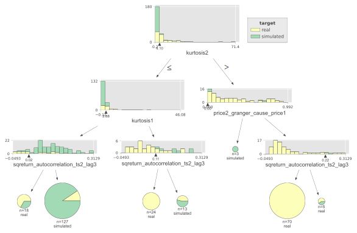
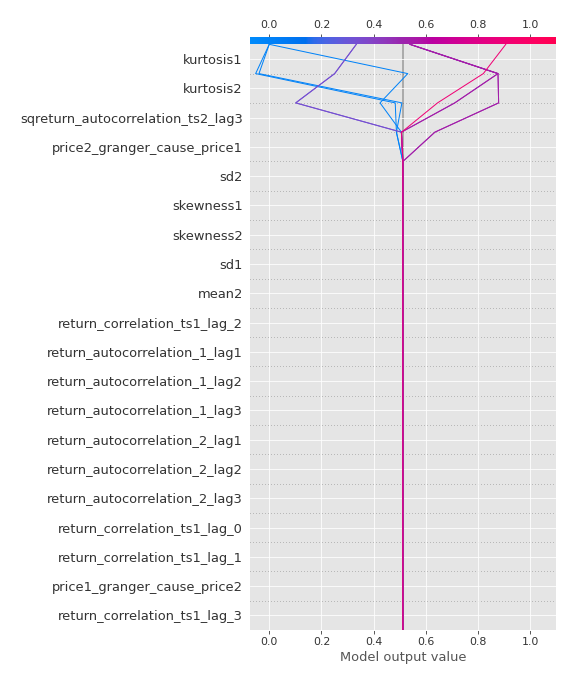

# Summary of 2_DecisionTree

[<< Go back](../README.md)

## Decision Tree
- **n_jobs**: -1
- **criterion**: gini
- **max_depth**: 3
- **explain_level**: 2

## Validation
 - **validation_type**: split
 - **train_ratio**: 0.75
 - **shuffle**: True
 - **stratify**: True

## Optimized metric
accuracy

## Training time

21.6 seconds

## Metric details
|           |    score |   threshold |
|:----------|---------:|------------:|
| logloss   | 0.969209 |  nan        |
| auc       | 0.839059 |  nan        |
| f1        | 0.83871  |    0.452756 |
| accuracy  | 0.827586 |    0.452756 |
| precision | 0.813953 |    0.721987 |
| recall    | 0.931818 |    0        |
| mcc       | 0.659051 |    0.452756 |

## Confusion matrix (at threshold=0.452756)
|                      |   Predicted as real |   Predicted as simulated |
|:---------------------|--------------------:|-------------------------:|
| Labeled as real      |                  33 |                       10 |
| Labeled as simulated |                   5 |                       39 |

## Learning curves

## Decision Tree 

### Tree #1

### Rules

if (kurtosis2 <= 4.098) and (kurtosis1 <= 2.884) and (sqreturn_autocorrelation_ts2_lag3 > 0.023) then class: simulated (proba: 90.55%) | based on 127 samples

if (kurtosis2 > 4.098) and (price2_granger_cause_price1 > 0.001) and (sqreturn_autocorrelation_ts2_lag3 <= 0.223) then class: real (proba: 100.0%) | based on 70 samples

if (kurtosis2 <= 4.098) and (kurtosis1 > 2.884) and (sqreturn_autocorrelation_ts2_lag3 <= 0.107) then class: real (proba: 100.0%) | based on 24 samples

if (kurtosis2 <= 4.098) and (kurtosis1 <= 2.884) and (sqreturn_autocorrelation_ts2_lag3 <= 0.023) then class: real (proba: 66.67%) | based on 18 samples

if (kurtosis2 <= 4.098) and (kurtosis1 > 2.884) and (sqreturn_autocorrelation_ts2_lag3 > 0.107) then class: simulated (proba: 53.85%) | based on 13 samples

if (kurtosis2 > 4.098) and (price2_granger_cause_price1 > 0.001) and (sqreturn_autocorrelation_ts2_lag3 > 0.223) then class: real (proba: 60.0%) | based on 5 samples

if (kurtosis2 > 4.098) and (price2_granger_cause_price1 <= 0.001) then class: simulated (proba: 100.0%) | based on 3 samples

## Permutation-based Importance

## Confusion Matrix

## Normalized Confusion Matrix

## ROC Curve

## Kolmogorov-Smirnov Statistic

## Precision-Recall Curve

## Calibration Curve

## Cumulative Gains Curve

## Lift Curve

## SHAP Importance

## SHAP Dependence plots

### Dependence (Fold 1)

## SHAP Decision plots

### Top-10 Worst decisions for class 0 (Fold 1)

### Top-10 Best decisions for class 0 (Fold 1)

### Top-10 Worst decisions for class 1 (Fold 1)

### Top-10 Best decisions for class 1 (Fold 1)

[<< Go back](../README.md)
