# Summary of 3_Linear

[<< Go back](../README.md)

## Logistic Regression (Linear)
- **n_jobs**: -1
- **explain_level**: 2

## Validation
 - **validation_type**: split
 - **train_ratio**: 0.75
 - **shuffle**: True
 - **stratify**: True

## Optimized metric
accuracy

## Training time

22.6 seconds

## Metric details
|           |    score |     threshold |
|:----------|---------:|--------------:|
| logloss   | 0.325138 | nan           |
| auc       | 0.951903 | nan           |
| f1        | 0.886598 |   0.464714    |
| accuracy  | 0.873563 |   0.580429    |
| precision | 1        |   0.81874     |
| recall    | 1        |   8.71908e-10 |
| mcc       | 0.764152 |   0.728023    |

## Confusion matrix (at threshold=0.580429)
|                      |   Predicted as real |   Predicted as simulated |
|:---------------------|--------------------:|-------------------------:|
| Labeled as real      |                  36 |                        7 |
| Labeled as simulated |                   4 |                       40 |

## Learning curves
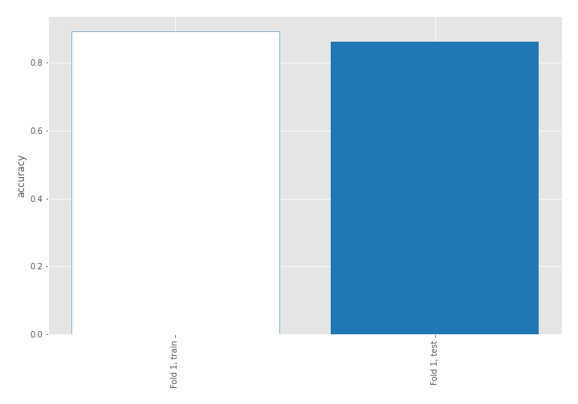

## Coefficients
| feature                           |   Learner_1 |
|:----------------------------------|------------:|
| sqreturn_autocorrelation_ts2_lag3 |   1.96756   |
| mean2                             |   1.91367   |
| mean1                             |   1.34007   |
| sqreturn_autocorrelation_ts1_lag3 |   1.12688   |
| sqreturn_autocorrelation_ts1_lag1 |   1.0067    |
| sqreturn_autocorrelation_ts2_lag1 |   0.907216  |
| return_autocorrelation_2_lag1     |   0.893029  |
| sqreturn_autocorrelation_ts2_lag2 |   0.7936    |
| sqreturn_autocorrelation_ts1_lag2 |   0.726523  |
| return_autocorrelation_1_lag1     |   0.490352  |
| return_correlation_ts2_lag_1      |   0.485556  |
| sqreturn_correlation_ts2_lag_1    |   0.485556  |
| return_correlation_ts1_lag_1      |   0.462683  |
| sqreturn_correlation_ts1_lag_1    |   0.462683  |
| return_autocorrelation_1_lag3     |   0.421604  |
| sqreturn_correlation_ts2_lag_3    |   0.403494  |
| return_correlation_ts2_lag_3      |   0.403494  |
| sqreturn_correlation_ts1_lag_2    |   0.374405  |
| return_correlation_ts1_lag_2      |   0.374405  |
| return_autocorrelation_1_lag2     |   0.332194  |
| sd1                               |   0.288051  |
| price1_granger_cause_price2       |   0.280348  |
| return_autocorrelation_2_lag2     |   0.235662  |
| return_autocorrelation_2_lag3     |   0.218336  |
| sqreturn_correlation_ts1_lag_3    |  -0.0227099 |
| return_correlation_ts1_lag_3      |  -0.0227099 |
| return_correlation_ts2_lag_2      |  -0.108425  |
| sqreturn_correlation_ts2_lag_2    |  -0.108425  |
| return_correlation_ts1_lag_0      |  -0.207518  |
| sqreturn_correlation_ts1_lag_0    |  -0.207518  |
| skewness2                         |  -0.240956  |
| sd2                               |  -0.245953  |
| price2_granger_cause_price1       |  -0.476048  |
| skewness1                         |  -0.631187  |
| intercept                         |  -1.96089   |
| kurtosis2                         |  -2.40197   |
| kurtosis1                         |  -2.94046   |

## Permutation-based Importance
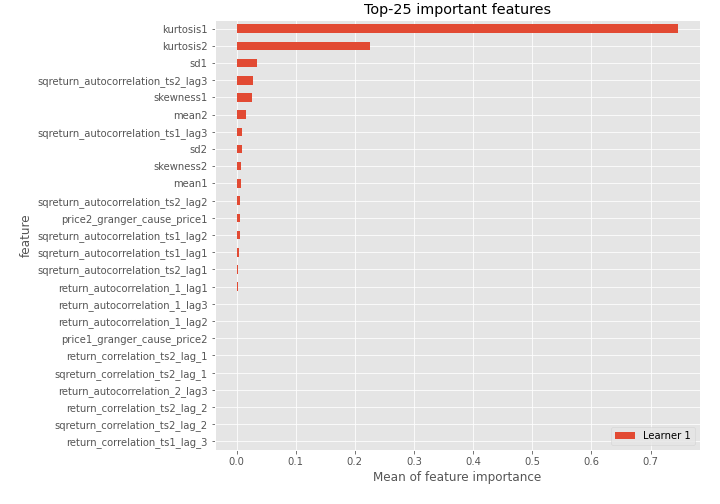
## Confusion Matrix

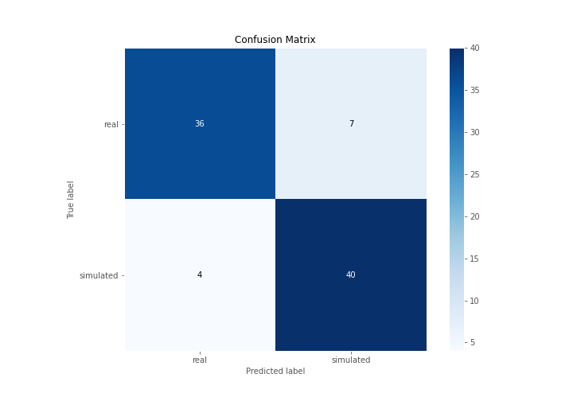

## Normalized Confusion Matrix

## ROC Curve

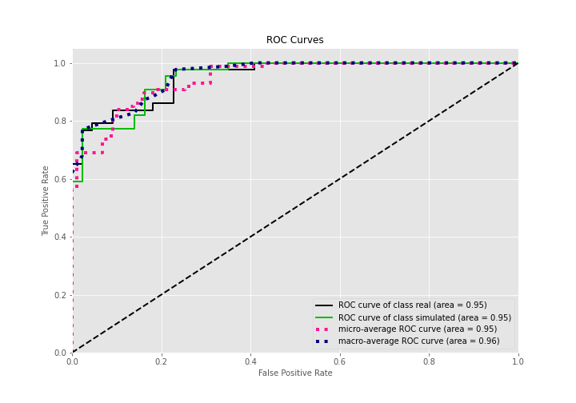

## Kolmogorov-Smirnov Statistic

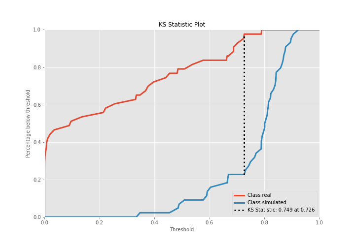

## Precision-Recall Curve

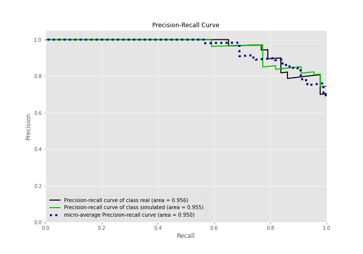

## Calibration Curve

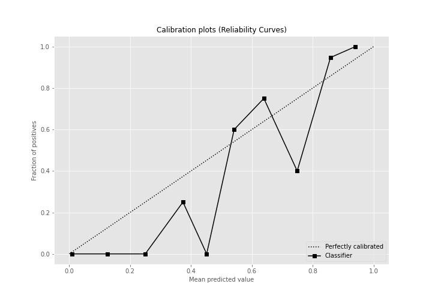

## Cumulative Gains Curve

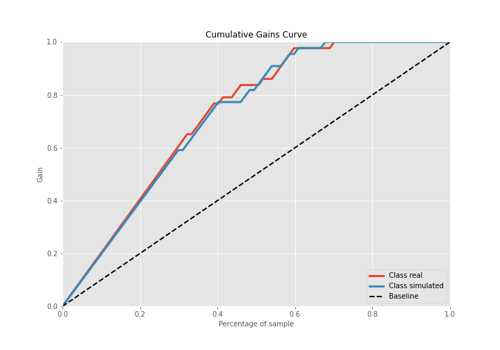

## Lift Curve

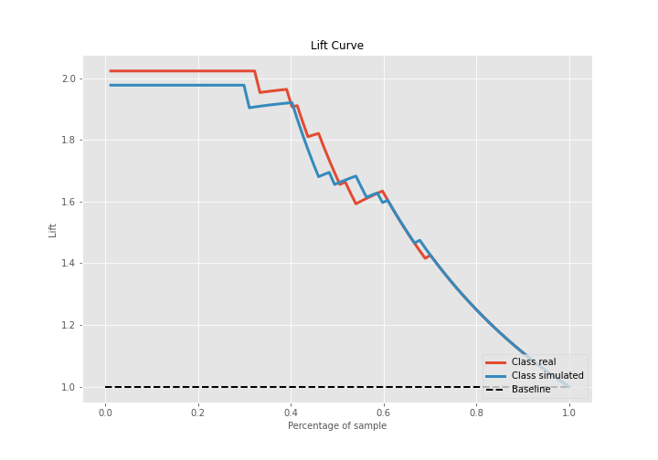

## SHAP Importance
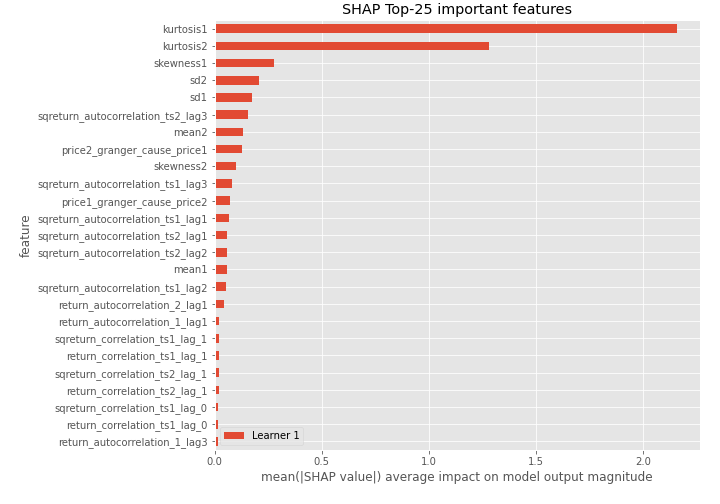

## SHAP Dependence plots

### Dependence (Fold 1)
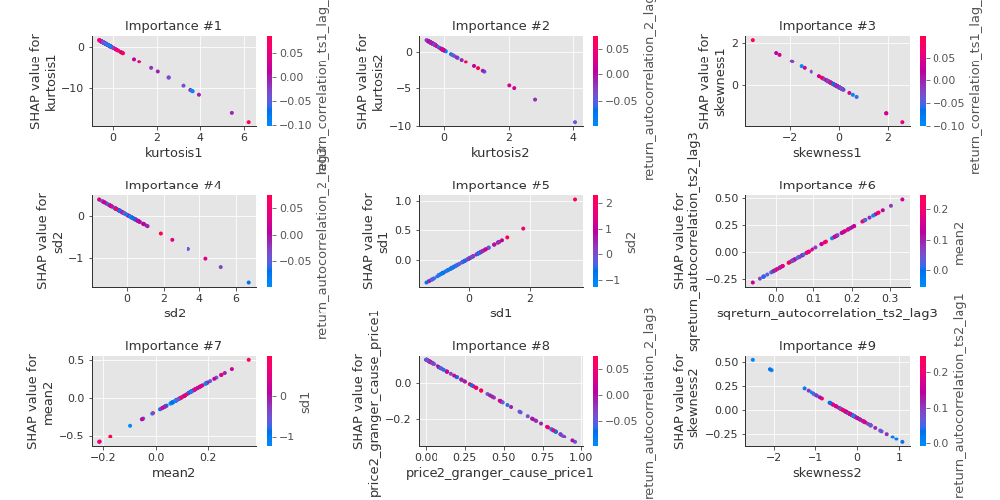

## SHAP Decision plots

### Top-10 Worst decisions for class 0 (Fold 1)
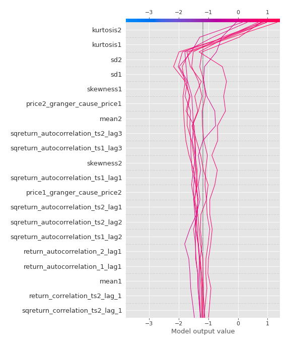
### Top-10 Best decisions for class 0 (Fold 1)
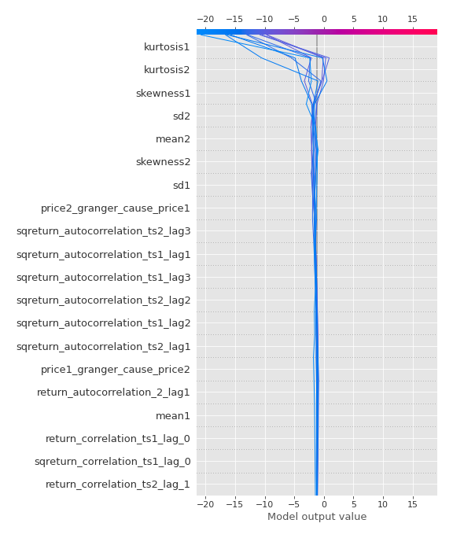
### Top-10 Worst decisions for class 1 (Fold 1)
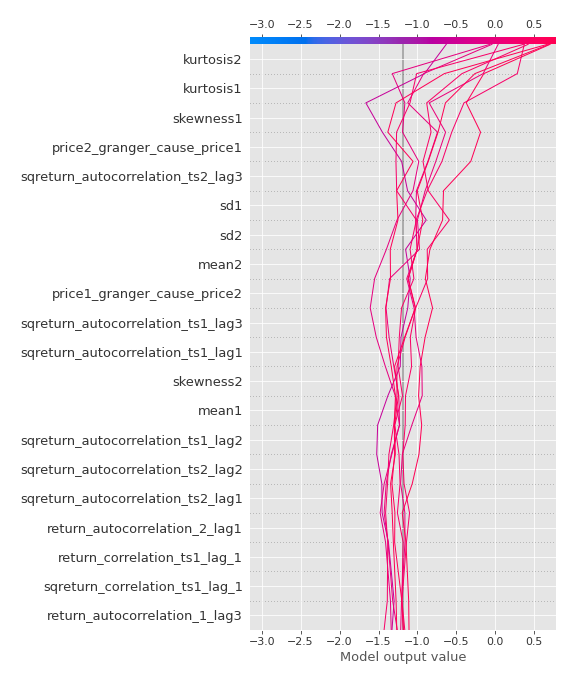
### Top-10 Best decisions for class 1 (Fold 1)
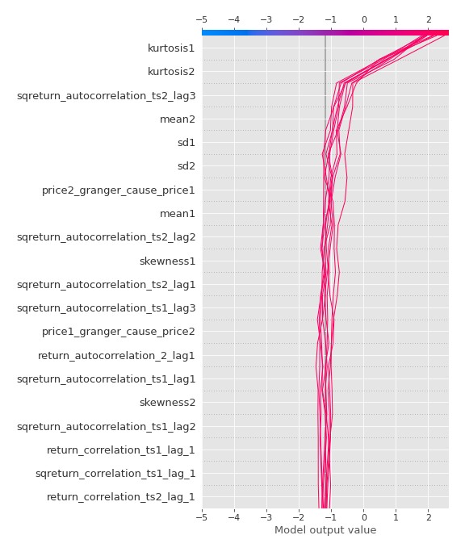

[<< Go back](../README.md)
