# Exploratory Data Analysis

[<< Go back](../README.md)
## Feature : target
- **Feature type** : categorical
- **Missing** : 0.0%
- **Unique** : 2
- **Count** :347
- **Unique** :2
- **Top** :simulated
- **Freq** :177

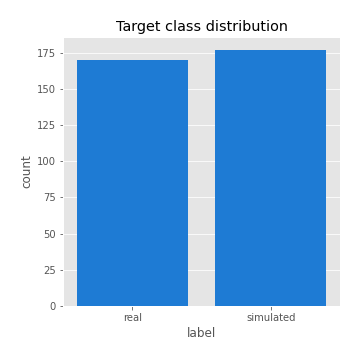
## Feature : mean1
- **Feature type** : continous
- **Missing** : 0.0%
- **Unique** : 347
- **Count** :347.0
- **Mean** :0.07203878471745001
- **Std** :0.07672200957796703
- **Min** :-0.22632637961920957
- **25%th Percentile** : 0.031149220727950892
- **50%th Percentile** : 0.06887252092173905
- **75%th Percentile** : 0.11023004836495756
- **Max** :0.37175100008111034

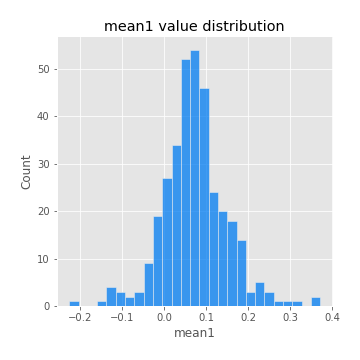
## Feature : mean2
- **Feature type** : continous
- **Missing** : 0.0%
- **Unique** : 347
- **Count** :347.0
- **Mean** :0.09323284384645489
- **Std** :0.08801426069488441
- **Min** :-0.2144814672643959
- **25%th Percentile** : 0.041535083016219054
- **50%th Percentile** : 0.09389727418418632
- **75%th Percentile** : 0.14721129297589863
- **Max** :0.37616608147096464

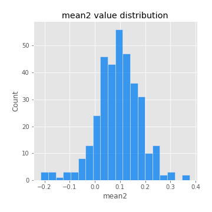
## Feature : sd1
- **Feature type** : continous
- **Missing** : 0.0%
- **Unique** : 347
- **Count** :347.0
- **Mean** :2.0353607843936015
- **Std** :0.8206202557259195
- **Min** :0.8382061051466024
- **25%th Percentile** : 1.50780582430602
- **50%th Percentile** : 1.9404979876575827
- **75%th Percentile** : 2.3914370850269693
- **Max** :9.236766377527575

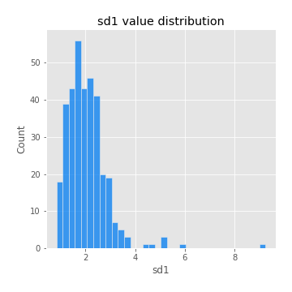
## Feature : sd2
- **Feature type** : continous
- **Missing** : 0.0%
- **Unique** : 347
- **Count** :347.0
- **Mean** :1.9466600201628736
- **Std** :0.7828652868869072
- **Min** :0.8455946193085045
- **25%th Percentile** : 1.4202889025434402
- **50%th Percentile** : 1.8026248546025714
- **75%th Percentile** : 2.2579357013198615
- **Max** :6.737618636746393

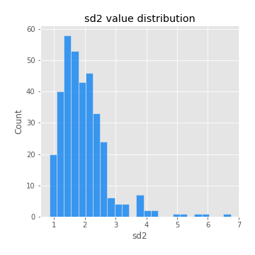
## Feature : skewness1
- **Feature type** : continous
- **Missing** : 0.0%
- **Unique** : 347
- **Count** :347.0
- **Mean** :-0.18843408086176938
- **Std** :0.5821112672430236
- **Min** :-3.530116233761814
- **25%th Percentile** : -0.32199389652399524
- **50%th Percentile** : -0.1266336613058994
- **75%th Percentile** : 0.025972322145456847
- **Max** :2.5845963767725557

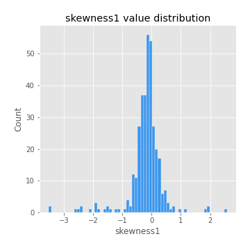
## Feature : skewness2
- **Feature type** : continous
- **Missing** : 0.0%
- **Unique** : 347
- **Count** :347.0
- **Mean** :-0.23220460430542222
- **Std** :0.7132249180466598
- **Min** :-5.778144124281153
- **25%th Percentile** : -0.39285851380686115
- **50%th Percentile** : -0.16542677648693432
- **75%th Percentile** : 0.02792811798981902
- **Max** :2.2606839051517187

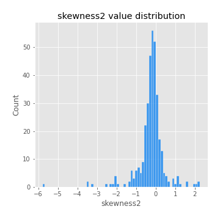
## Feature : kurtosis1
- **Feature type** : continous
- **Missing** : 0.0%
- **Unique** : 347
- **Count** :347.0
- **Mean** :3.8429119389744635
- **Std** :5.716351682061719
- **Min** :-0.10532584319360305
- **25%th Percentile** : 1.1260299667240874
- **50%th Percentile** : 1.909581902969029
- **75%th Percentile** : 3.7148174119178448
- **Max** :46.07507808162177

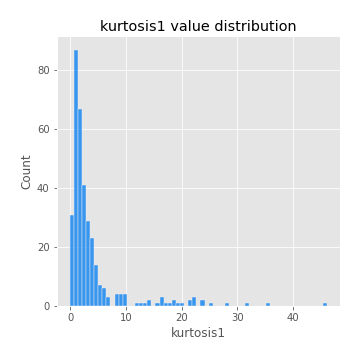
## Feature : kurtosis2
- **Feature type** : continous
- **Missing** : 0.0%
- **Unique** : 347
- **Count** :347.0
- **Mean** :4.725827364322681
- **Std** :7.2502866340554775
- **Min** :0.2065159666277676
- **25%th Percentile** : 1.340821574581311
- **50%th Percentile** : 2.2688911159987764
- **75%th Percentile** : 4.7121612051708395
- **Max** :71.39844769176813

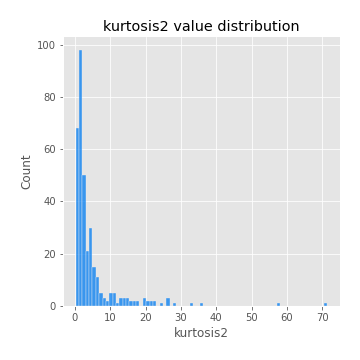
## Feature : return_autocorrelation_1_lag1
- **Feature type** : continous
- **Missing** : 0.0%
- **Unique** : 347
- **Count** :347.0
- **Mean** :-0.013123472480961422
- **Std** :0.06205419728006596
- **Min** :-0.2135576224968752
- **25%th Percentile** : -0.04823958768838995
- **50%th Percentile** : -0.009846743089683679
- **75%th Percentile** : 0.02883640078227138
- **Max** :0.15509607117598168

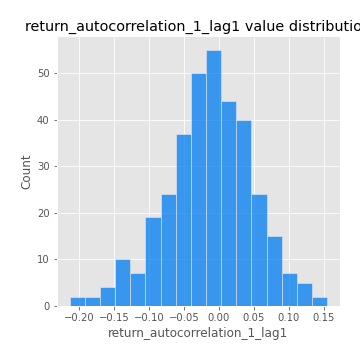
## Feature : return_autocorrelation_1_lag2
- **Feature type** : continous
- **Missing** : 0.0%
- **Unique** : 347
- **Count** :347.0
- **Mean** :-0.0067388661755028376
- **Std** :0.04743986202520911
- **Min** :-0.14034859780431896
- **25%th Percentile** : -0.03974174092538353
- **50%th Percentile** : -0.008961332541155045
- **75%th Percentile** : 0.024646616831927017
- **Max** :0.13553587149024285

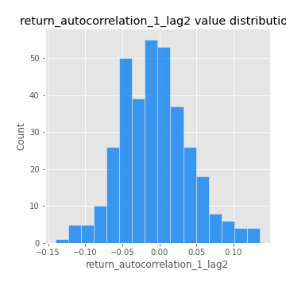
## Feature : return_autocorrelation_1_lag3
- **Feature type** : continous
- **Missing** : 0.0%
- **Unique** : 347
- **Count** :347.0
- **Mean** :0.000650594867561708
- **Std** :0.054915820298575994
- **Min** :-0.1940836867390813
- **25%th Percentile** : -0.03599112891389786
- **50%th Percentile** : 0.0002777521396447955
- **75%th Percentile** : 0.03666418776915668
- **Max** :0.17805869530681923

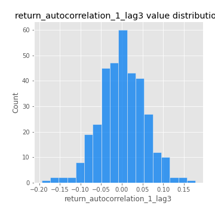
## Feature : return_autocorrelation_2_lag1
- **Feature type** : continous
- **Missing** : 0.0%
- **Unique** : 347
- **Count** :347.0
- **Mean** :-0.012077291070382745
- **Std** :0.06986398696774547
- **Min** :-0.24590087874039124
- **25%th Percentile** : -0.05359367271894076
- **50%th Percentile** : -0.01110607129012973
- **75%th Percentile** : 0.027671797288673
- **Max** :0.31863413537898483

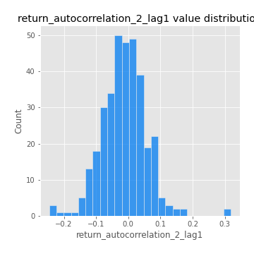
## Feature : return_autocorrelation_2_lag2
- **Feature type** : continous
- **Missing** : 0.0%
- **Unique** : 347
- **Count** :347.0
- **Mean** :-0.008253759924975169
- **Std** :0.055460278004605776
- **Min** :-0.1573042027186005
- **25%th Percentile** : -0.043116862919251556
- **50%th Percentile** : -0.012150176066534044
- **75%th Percentile** : 0.023533851302423844
- **Max** :0.20974504043791217

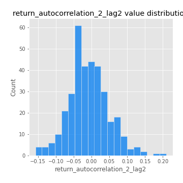
## Feature : return_autocorrelation_2_lag3
- **Feature type** : continous
- **Missing** : 0.0%
- **Unique** : 347
- **Count** :347.0
- **Mean** :-0.00791694388654689
- **Std** :0.055765635444461156
- **Min** :-0.18247716652573553
- **25%th Percentile** : -0.0466042759259855
- **50%th Percentile** : -0.006897499064027957
- **75%th Percentile** : 0.02724372892394067
- **Max** :0.25938814813829103

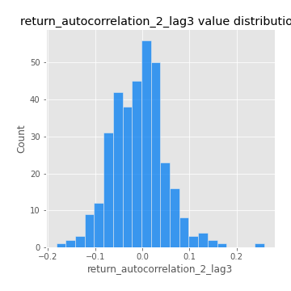
## Feature : return_correlation_ts1_lag_0
- **Feature type** : continous
- **Missing** : 0.0%
- **Unique** : 347
- **Count** :347.0
- **Mean** :0.32672097218135693
- **Std** :0.1087586584242273
- **Min** :-0.027089510445801036
- **25%th Percentile** : 0.2729996455706043
- **50%th Percentile** : 0.3352687234614468
- **75%th Percentile** : 0.38330617161159963
- **Max** :0.7041861626832071

## Feature : return_correlation_ts1_lag_1
- **Feature type** : continous
- **Missing** : 0.0%
- **Unique** : 347
- **Count** :347.0
- **Mean** :-0.008272273649399283
- **Std** :0.054543496474379755
- **Min** :-0.17175420097128355
- **25%th Percentile** : -0.04274121398083972
- **50%th Percentile** : -0.007197675865019511
- **75%th Percentile** : 0.026107093068460464
- **Max** :0.15499424718508623

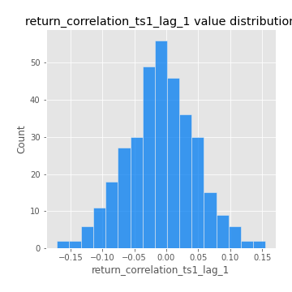
## Feature : return_correlation_ts1_lag_2
- **Feature type** : continous
- **Missing** : 0.0%
- **Unique** : 347
- **Count** :347.0
- **Mean** :-0.0029965578455413235
- **Std** :0.05271842837843281
- **Min** :-0.21653581047581763
- **25%th Percentile** : -0.040058135433588604
- **50%th Percentile** : -0.003158964337708972
- **75%th Percentile** : 0.031142564349941296
- **Max** :0.14017342420959597

## Feature : return_correlation_ts1_lag_3
- **Feature type** : continous
- **Missing** : 0.0%
- **Unique** : 347
- **Count** :347.0
- **Mean** :-0.001233506111133836
- **Std** :0.056029434519596834
- **Min** :-0.1924301202830267
- **25%th Percentile** : -0.03460715179547895
- **50%th Percentile** : -0.00481766022213819
- **75%th Percentile** : 0.03581893086468367
- **Max** :0.19836419347211287

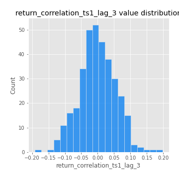
## Feature : return_correlation_ts2_lag_1
- **Feature type** : continous
- **Missing** : 0.0%
- **Unique** : 347
- **Count** :347.0
- **Mean** :-0.007321748820111182
- **Std** :0.056809511468673544
- **Min** :-0.2081139431093261
- **25%th Percentile** : -0.04011871035885145
- **50%th Percentile** : -0.006842248660024381
- **75%th Percentile** : 0.030945158605691844
- **Max** :0.1512351217854039

## Feature : return_correlation_ts2_lag_2
- **Feature type** : continous
- **Missing** : 0.0%
- **Unique** : 347
- **Count** :347.0
- **Mean** :-0.007742551876106981
- **Std** :0.05416530492290551
- **Min** :-0.23751835475804678
- **25%th Percentile** : -0.04493151391242284
- **50%th Percentile** : -0.006807870727517523
- **75%th Percentile** : 0.023234503770656063
- **Max** :0.16305123316871079

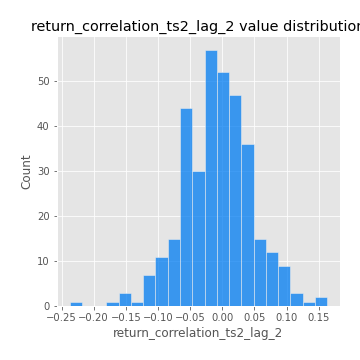
## Feature : return_correlation_ts2_lag_3
- **Feature type** : continous
- **Missing** : 0.0%
- **Unique** : 347
- **Count** :347.0
- **Mean** :-0.00019003008280567507
- **Std** :0.05119390352281436
- **Min** :-0.15490495486968472
- **25%th Percentile** : -0.029642236677216882
- **50%th Percentile** : -0.0032282345594001572
- **75%th Percentile** : 0.03393817548390328
- **Max** :0.15094837770637637

## Feature : sqreturn_autocorrelation_ts1_lag1
- **Feature type** : continous
- **Missing** : 0.0%
- **Unique** : 347
- **Count** :347.0
- **Mean** :0.12241029033396489
- **Std** :0.09090648562929816
- **Min** :-0.06532118872798363
- **25%th Percentile** : 0.06029603545728582
- **50%th Percentile** : 0.11107528392729979
- **75%th Percentile** : 0.1732624455442378
- **Max** :0.49414293176447355

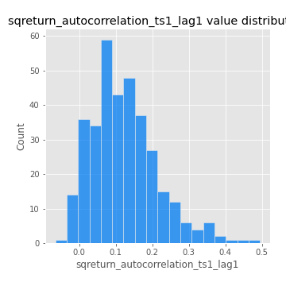
## Feature : sqreturn_autocorrelation_ts1_lag2
- **Feature type** : continous
- **Missing** : 0.0%
- **Unique** : 347
- **Count** :347.0
- **Mean** :0.11446466628559039
- **Std** :0.09382216871933051
- **Min** :-0.05419304650062953
- **25%th Percentile** : 0.046983471361771514
- **50%th Percentile** : 0.10349581211166771
- **75%th Percentile** : 0.17208768894214194
- **Max** :0.540735851444759

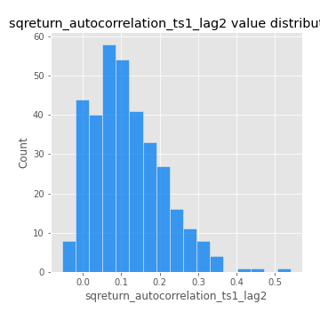
## Feature : sqreturn_autocorrelation_ts1_lag3
- **Feature type** : continous
- **Missing** : 0.0%
- **Unique** : 347
- **Count** :347.0
- **Mean** :0.10223333410913582
- **Std** :0.08934386581986473
- **Min** :-0.05313973583773816
- **25%th Percentile** : 0.033256352431890374
- **50%th Percentile** : 0.08852368549586581
- **75%th Percentile** : 0.1615427123263246
- **Max** :0.44755937369538146

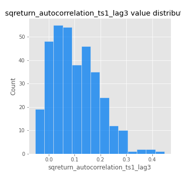
## Feature : sqreturn_autocorrelation_ts2_lag1
- **Feature type** : continous
- **Missing** : 0.0%
- **Unique** : 347
- **Count** :347.0
- **Mean** :0.11953833320080112
- **Std** :0.09201331340115176
- **Min** :-0.08520586663750691
- **25%th Percentile** : 0.053200330908238745
- **50%th Percentile** : 0.10591788898768234
- **75%th Percentile** : 0.17200116182740918
- **Max** :0.510085647437958

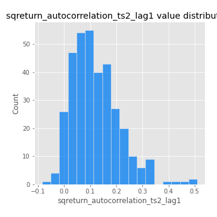
## Feature : sqreturn_autocorrelation_ts2_lag2
- **Feature type** : continous
- **Missing** : 0.0%
- **Unique** : 347
- **Count** :347.0
- **Mean** :0.10604736608599005
- **Std** :0.09397112167130155
- **Min** :-0.04424883229120365
- **25%th Percentile** : 0.03127297919524761
- **50%th Percentile** : 0.09920221099908309
- **75%th Percentile** : 0.15966828786769066
- **Max** :0.5373432415582473

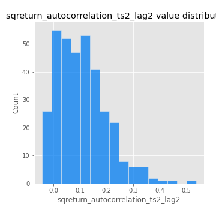
## Feature : sqreturn_autocorrelation_ts2_lag3
- **Feature type** : continous
- **Missing** : 0.0%
- **Unique** : 347
- **Count** :347.0
- **Mean** :0.09764457530065906
- **Std** :0.08716956918671967
- **Min** :-0.06082766359524085
- **25%th Percentile** : 0.02437921557154711
- **50%th Percentile** : 0.08256813603654592
- **75%th Percentile** : 0.16108250341143873
- **Max** :0.33236896550410666

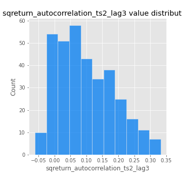
## Feature : sqreturn_correlation_ts1_lag_0
- **Feature type** : continous
- **Missing** : 0.0%
- **Unique** : 347
- **Count** :347.0
- **Mean** :0.32672097218135693
- **Std** :0.1087586584242273
- **Min** :-0.027089510445801036
- **25%th Percentile** : 0.2729996455706043
- **50%th Percentile** : 0.3352687234614468
- **75%th Percentile** : 0.38330617161159963
- **Max** :0.7041861626832071

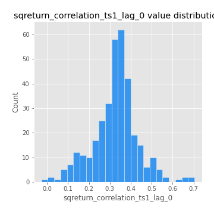
## Feature : sqreturn_correlation_ts1_lag_1
- **Feature type** : continous
- **Missing** : 0.0%
- **Unique** : 347
- **Count** :347.0
- **Mean** :-0.008272273649399283
- **Std** :0.054543496474379755
- **Min** :-0.17175420097128355
- **25%th Percentile** : -0.04274121398083972
- **50%th Percentile** : -0.007197675865019511
- **75%th Percentile** : 0.026107093068460464
- **Max** :0.15499424718508623

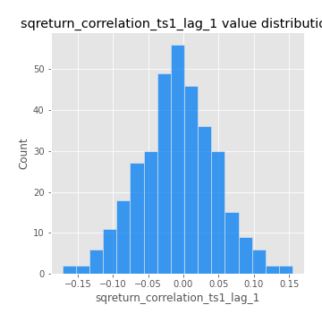
## Feature : sqreturn_correlation_ts1_lag_2
- **Feature type** : continous
- **Missing** : 0.0%
- **Unique** : 347
- **Count** :347.0
- **Mean** :-0.0029965578455413235
- **Std** :0.05271842837843281
- **Min** :-0.21653581047581763
- **25%th Percentile** : -0.040058135433588604
- **50%th Percentile** : -0.003158964337708972
- **75%th Percentile** : 0.031142564349941296
- **Max** :0.14017342420959597

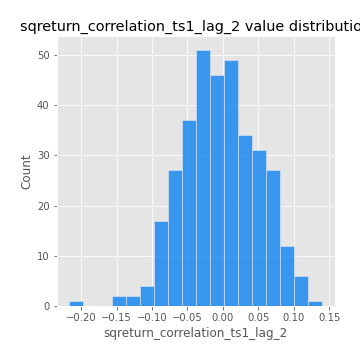
## Feature : sqreturn_correlation_ts1_lag_3
- **Feature type** : continous
- **Missing** : 0.0%
- **Unique** : 347
- **Count** :347.0
- **Mean** :-0.001233506111133836
- **Std** :0.056029434519596834
- **Min** :-0.1924301202830267
- **25%th Percentile** : -0.03460715179547895
- **50%th Percentile** : -0.00481766022213819
- **75%th Percentile** : 0.03581893086468367
- **Max** :0.19836419347211287

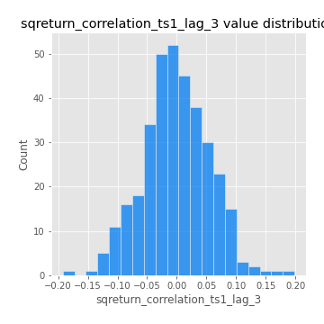
## Feature : sqreturn_correlation_ts2_lag_1
- **Feature type** : continous
- **Missing** : 0.0%
- **Unique** : 347
- **Count** :347.0
- **Mean** :-0.007321748820111182
- **Std** :0.056809511468673544
- **Min** :-0.2081139431093261
- **25%th Percentile** : -0.04011871035885145
- **50%th Percentile** : -0.006842248660024381
- **75%th Percentile** : 0.030945158605691844
- **Max** :0.1512351217854039

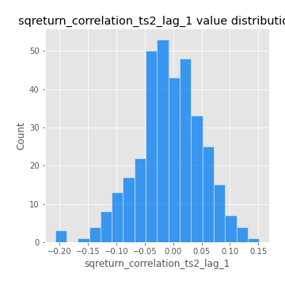
## Feature : sqreturn_correlation_ts2_lag_2
- **Feature type** : continous
- **Missing** : 0.0%
- **Unique** : 347
- **Count** :347.0
- **Mean** :-0.007742551876106981
- **Std** :0.05416530492290551
- **Min** :-0.23751835475804678
- **25%th Percentile** : -0.04493151391242284
- **50%th Percentile** : -0.006807870727517523
- **75%th Percentile** : 0.023234503770656063
- **Max** :0.16305123316871079

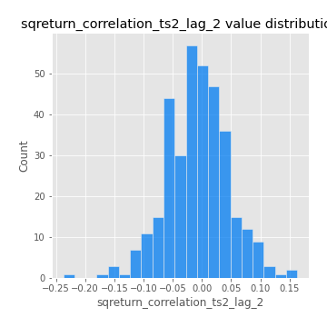
## Feature : sqreturn_correlation_ts2_lag_3
- **Feature type** : continous
- **Missing** : 0.0%
- **Unique** : 347
- **Count** :347.0
- **Mean** :-0.00019003008280567507
- **Std** :0.05119390352281436
- **Min** :-0.15490495486968472
- **25%th Percentile** : -0.029642236677216882
- **50%th Percentile** : -0.0032282345594001572
- **75%th Percentile** : 0.03393817548390328
- **Max** :0.15094837770637637

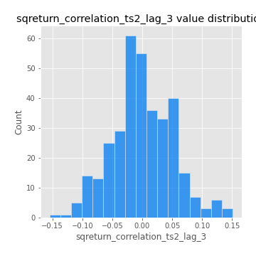
## Feature : price2_granger_cause_price1
- **Feature type** : continous
- **Missing** : 0.0%
- **Unique** : 347
- **Count** :347.0
- **Mean** :0.3209783949674754
- **Std** :0.3099823145221444
- **Min** :6.706827848891273e-12
- **25%th Percentile** : 0.036857597695812636
- **50%th Percentile** : 0.2284290991659397
- **75%th Percentile** : 0.5823414427402454
- **Max** :0.992071219293557

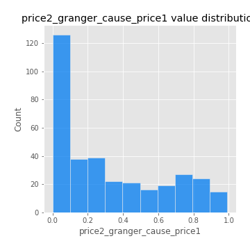
## Feature : price1_granger_cause_price2
- **Feature type** : continous
- **Missing** : 0.0%
- **Unique** : 347
- **Count** :347.0
- **Mean** :0.3263418750548711
- **Std** :0.2928975897141294
- **Min** :1.1190836214386748e-10
- **25%th Percentile** : 0.0492226764554481
- **50%th Percentile** : 0.2622330749754867
- **75%th Percentile** : 0.5697262932816303
- **Max** :0.9887598013673117

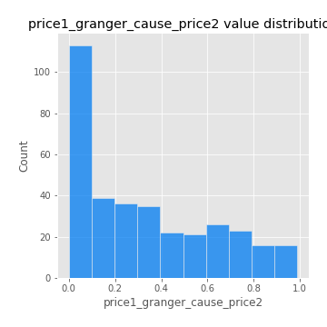

[<< Go back](../README.md)
