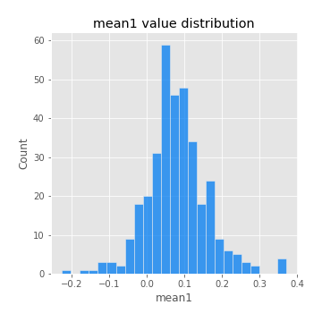
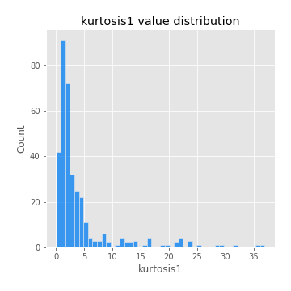
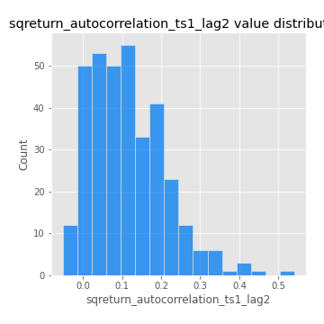

# Exploratory Data Analysis

[<< Go back](../README.md)
## Feature : target
- **Feature type** : categorical
- **Missing** : 0.0%
- **Unique** : 2
- **Count** :347
- **Unique** :2
- **Top** :simulated
- **Freq** :174

## Feature : mean1
- **Feature type** : continous
- **Missing** : 0.0%
- **Unique** : 347
- **Count** :347.0
- **Mean** :0.07928119373867466
- **Std** :0.080439015915922
- **Min** :-0.22632637961920957
- **25%th Percentile** : 0.03499441684766769
- **50%th Percentile** : 0.0777365266701866
- **75%th Percentile** : 0.12119339153223
- **Max** :0.37175100008111034

## Feature : mean2
- **Feature type** : continous
- **Missing** : 0.0%
- **Unique** : 347
- **Count** :347.0
- **Mean** :0.09016329905795983
- **Std** :0.0886185092552014
- **Min** :-0.21818165578778434
- **25%th Percentile** : 0.04152924593782177
- **50%th Percentile** : 0.08697697559977646
- **75%th Percentile** : 0.1454607675456832
- **Max** :0.42612049165695887

## Feature : sd1
- **Feature type** : continous
- **Missing** : 0.0%
- **Unique** : 347
- **Count** :347.0
- **Mean** :2.0525703709168823
- **Std** :0.8190389683500036
- **Min** :0.7620831696941981
- **25%th Percentile** : 1.534477305141047
- **50%th Percentile** : 1.9600056922276983
- **75%th Percentile** : 2.4266407522817044
- **Max** :9.236766377527575

## Feature : sd2
- **Feature type** : continous
- **Missing** : 0.0%
- **Unique** : 347
- **Count** :347.0
- **Mean** :1.944515375969669
- **Std** :0.731324288674063
- **Min** :0.7872711318257454
- **25%th Percentile** : 1.4506759701825316
- **50%th Percentile** : 1.8114310782757608
- **75%th Percentile** : 2.2528560892511007
- **Max** :6.737618636746393

## Feature : skewness1
- **Feature type** : continous
- **Missing** : 0.0%
- **Unique** : 347
- **Count** :347.0
- **Mean** :-0.15250508785661165
- **Std** :0.6217335540734449
- **Min** :-3.530116233761814
- **25%th Percentile** : -0.3130395912545013
- **50%th Percentile** : -0.12951596072577773
- **75%th Percentile** : 0.07269195976357024
- **Max** :2.5845963767725557

## Feature : skewness2
- **Feature type** : continous
- **Missing** : 0.0%
- **Unique** : 347
- **Count** :347.0
- **Mean** :-0.20209812322832243
- **Std** :0.591939029588024
- **Min** :-3.436088288137694
- **25%th Percentile** : -0.3837975443395166
- **50%th Percentile** : -0.19521033126387316
- **75%th Percentile** : 0.022026584720792504
- **Max** :2.2606839051517187

## Feature : kurtosis1
- **Feature type** : continous
- **Missing** : 0.0%
- **Unique** : 347
- **Count** :347.0
- **Mean** :4.071722398069593
- **Std** :5.777624380003341
- **Min** :0.03477879299249054
- **25%th Percentile** : 1.1982099693906445
- **50%th Percentile** : 2.057823736032699
- **75%th Percentile** : 4.028030879417009
- **Max** :36.91113889081053

## Feature : kurtosis2
- **Feature type** : continous
- **Missing** : 0.0%
- **Unique** : 347
- **Count** :347.0
- **Mean** :4.188933252635321
- **Std** :5.542050130694124
- **Min** :0.15044486626750198
- **25%th Percentile** : 1.3104257970673427
- **50%th Percentile** : 2.274867267981603
- **75%th Percentile** : 4.375421570582565
- **Max** :36.023880269969645

## Feature : return_autocorrelation_1_lag1
- **Feature type** : continous
- **Missing** : 0.0%
- **Unique** : 347
- **Count** :347.0
- **Mean** :-0.011216487352467426
- **Std** :0.06146361880705811
- **Min** :-0.2135576224968752
- **25%th Percentile** : -0.04634465885958439
- **50%th Percentile** : -0.009159894704668319
- **75%th Percentile** : 0.028348048887338502
- **Max** :0.1347308672212927

## Feature : return_autocorrelation_1_lag2
- **Feature type** : continous
- **Missing** : 0.0%
- **Unique** : 347
- **Count** :347.0
- **Mean** :-0.01214834024703416
- **Std** :0.05277851433186372
- **Min** :-0.1727990799896914
- **25%th Percentile** : -0.04609430624053149
- **50%th Percentile** : -0.010199536612058536
- **75%th Percentile** : 0.019699943413332366
- **Max** :0.17359886259184087

## Feature : return_autocorrelation_1_lag3
- **Feature type** : continous
- **Missing** : 0.0%
- **Unique** : 347
- **Count** :347.0
- **Mean** :-0.0037935415819454503
- **Std** :0.05718785863308001
- **Min** :-0.1940836867390813
- **25%th Percentile** : -0.0374988344633592
- **50%th Percentile** : -0.000841456369762179
- **75%th Percentile** : 0.030327592471071446
- **Max** :0.19836944539148793

## Feature : return_autocorrelation_2_lag1
- **Feature type** : continous
- **Missing** : 0.0%
- **Unique** : 347
- **Count** :347.0
- **Mean** :-0.013547829320511554
- **Std** :0.061881825052193154
- **Min** :-0.25075531010123286
- **25%th Percentile** : -0.04545978263871221
- **50%th Percentile** : -0.010289097845712893
- **75%th Percentile** : 0.022462345720052013
- **Max** :0.16349871797309318

## Feature : return_autocorrelation_2_lag2
- **Feature type** : continous
- **Missing** : 0.0%
- **Unique** : 347
- **Count** :347.0
- **Mean** :-0.009185207302881129
- **Std** :0.054370746113670175
- **Min** :-0.1630625477372004
- **25%th Percentile** : -0.04272012426371539
- **50%th Percentile** : -0.009300666512847243
- **75%th Percentile** : 0.0260042858479657
- **Max** :0.1735398560230086

## Feature : return_autocorrelation_2_lag3
- **Feature type** : continous
- **Missing** : 0.0%
- **Unique** : 347
- **Count** :347.0
- **Mean** :-0.009414599952873073
- **Std** :0.05569413124934173
- **Min** :-0.2089125763060944
- **25%th Percentile** : -0.0460376249638778
- **50%th Percentile** : -0.0053313135532921255
- **75%th Percentile** : 0.025417892249553785
- **Max** :0.16859074462662507

## Feature : return_correlation_ts1_lag_0
- **Feature type** : continous
- **Missing** : 0.0%
- **Unique** : 347
- **Count** :347.0
- **Mean** :0.3332314333828983
- **Std** :0.11575599470530112
- **Min** :-0.027089510445801036
- **25%th Percentile** : 0.27585541197219476
- **50%th Percentile** : 0.33855442199646424
- **75%th Percentile** : 0.39111433296011844
- **Max** :0.7041861626832071

## Feature : return_correlation_ts1_lag_1
- **Feature type** : continous
- **Missing** : 0.0%
- **Unique** : 347
- **Count** :347.0
- **Mean** :-0.011680979949513412
- **Std** :0.05443170909695498
- **Min** :-0.16985510949917193
- **25%th Percentile** : -0.045763252511493435
- **50%th Percentile** : -0.010963933168068141
- **75%th Percentile** : 0.025718962749105966
- **Max** :0.15499424718508623

## Feature : return_correlation_ts1_lag_2
- **Feature type** : continous
- **Missing** : 0.0%
- **Unique** : 347
- **Count** :347.0
- **Mean** :-0.006225073730512747
- **Std** :0.052182748133418624
- **Min** :-0.21653581047581763
- **25%th Percentile** : -0.04139520019248461
- **50%th Percentile** : -0.00790984021372761
- **75%th Percentile** : 0.027319390781181778
- **Max** :0.14766286411735216

## Feature : return_correlation_ts1_lag_3
- **Feature type** : continous
- **Missing** : 0.0%
- **Unique** : 347
- **Count** :347.0
- **Mean** :-0.0019261377960084947
- **Std** :0.05557967705028545
- **Min** :-0.1270218498974763
- **25%th Percentile** : -0.037628507010893195
- **50%th Percentile** : -0.005294200719616712
- **75%th Percentile** : 0.03552815904457386
- **Max** :0.18377779838346103

## Feature : return_correlation_ts2_lag_1
- **Feature type** : continous
- **Missing** : 0.0%
- **Unique** : 347
- **Count** :347.0
- **Mean** :-0.007892079158618276
- **Std** :0.055955556195873606
- **Min** :-0.19671969155495325
- **25%th Percentile** : -0.04460558928895001
- **50%th Percentile** : -0.011514961633060058
- **75%th Percentile** : 0.027214025447302035
- **Max** :0.16950064000083823

## Feature : return_correlation_ts2_lag_2
- **Feature type** : continous
- **Missing** : 0.0%
- **Unique** : 347
- **Count** :347.0
- **Mean** :-0.00847150674015652
- **Std** :0.05460164126652209
- **Min** :-0.23751835475804678
- **25%th Percentile** : -0.041094330075791684
- **50%th Percentile** : -0.009040615453340436
- **75%th Percentile** : 0.023590549139650252
- **Max** :0.20772887392904255

## Feature : return_correlation_ts2_lag_3
- **Feature type** : continous
- **Missing** : 0.0%
- **Unique** : 347
- **Count** :347.0
- **Mean** :-0.003973243637784767
- **Std** :0.05609957242258335
- **Min** :-0.17564076057312866
- **25%th Percentile** : -0.038043795555895626
- **50%th Percentile** : -0.005549569530732531
- **75%th Percentile** : 0.03644787577443426
- **Max** :0.17237107352285527

## Feature : sqreturn_autocorrelation_ts1_lag1
- **Feature type** : continous
- **Missing** : 0.0%
- **Unique** : 347
- **Count** :347.0
- **Mean** :0.12153664460297318
- **Std** :0.08816060693094505
- **Min** :-0.06532118872798363
- **25%th Percentile** : 0.05740759278258635
- **50%th Percentile** : 0.10386235527377823
- **75%th Percentile** : 0.17738446539799818
- **Max** :0.4439086285737898

## Feature : sqreturn_autocorrelation_ts1_lag2
- **Feature type** : continous
- **Missing** : 0.0%
- **Unique** : 347
- **Count** :347.0
- **Mean** :0.11416519960651063
- **Std** :0.09536296556866176
- **Min** :-0.05165593255897504
- **25%th Percentile** : 0.042243508066917276
- **50%th Percentile** : 0.10285664870337984
- **75%th Percentile** : 0.17549875504691748
- **Max** :0.540735851444759

## Feature : sqreturn_autocorrelation_ts1_lag3
- **Feature type** : continous
- **Missing** : 0.0%
- **Unique** : 347
- **Count** :347.0
- **Mean** :0.1051468881358483
- **Std** :0.09017677524443467
- **Min** :-0.05313973583773816
- **25%th Percentile** : 0.032280205354200744
- **50%th Percentile** : 0.0955771560242182
- **75%th Percentile** : 0.16145940656111313
- **Max** :0.44755937369538146

## Feature : sqreturn_autocorrelation_ts2_lag1
- **Feature type** : continous
- **Missing** : 0.0%
- **Unique** : 347
- **Count** :347.0
- **Mean** :0.11830277163476324
- **Std** :0.08546736752053269
- **Min** :-0.08520586663750691
- **25%th Percentile** : 0.05297714154901895
- **50%th Percentile** : 0.11060124244356503
- **75%th Percentile** : 0.17105637885937547
- **Max** :0.510085647437958

## Feature : sqreturn_autocorrelation_ts2_lag2
- **Feature type** : continous
- **Missing** : 0.0%
- **Unique** : 347
- **Count** :347.0
- **Mean** :0.11339299966180273
- **Std** :0.09431387415503781
- **Min** :-0.051523884196217395
- **25%th Percentile** : 0.04037690474484396
- **50%th Percentile** : 0.09923511997472957
- **75%th Percentile** : 0.16648039656029948
- **Max** :0.5373432415582473

## Feature : sqreturn_autocorrelation_ts2_lag3
- **Feature type** : continous
- **Missing** : 0.0%
- **Unique** : 347
- **Count** :347.0
- **Mean** :0.10091777168144402
- **Std** :0.0867645843139331
- **Min** :-0.049271901244418284
- **25%th Percentile** : 0.0313955278225359
- **50%th Percentile** : 0.09631120525118206
- **75%th Percentile** : 0.15953142679550322
- **Max** :0.37659676809746145

## Feature : sqreturn_correlation_ts1_lag_0
- **Feature type** : continous
- **Missing** : 0.0%
- **Unique** : 347
- **Count** :347.0
- **Mean** :0.3332314333828983
- **Std** :0.11575599470530112
- **Min** :-0.027089510445801036
- **25%th Percentile** : 0.27585541197219476
- **50%th Percentile** : 0.33855442199646424
- **75%th Percentile** : 0.39111433296011844
- **Max** :0.7041861626832071

## Feature : sqreturn_correlation_ts1_lag_1
- **Feature type** : continous
- **Missing** : 0.0%
- **Unique** : 347
- **Count** :347.0
- **Mean** :-0.011680979949513412
- **Std** :0.05443170909695498
- **Min** :-0.16985510949917193
- **25%th Percentile** : -0.045763252511493435
- **50%th Percentile** : -0.010963933168068141
- **75%th Percentile** : 0.025718962749105966
- **Max** :0.15499424718508623

## Feature : sqreturn_correlation_ts1_lag_2
- **Feature type** : continous
- **Missing** : 0.0%
- **Unique** : 347
- **Count** :347.0
- **Mean** :-0.006225073730512747
- **Std** :0.052182748133418624
- **Min** :-0.21653581047581763
- **25%th Percentile** : -0.04139520019248461
- **50%th Percentile** : -0.00790984021372761
- **75%th Percentile** : 0.027319390781181778
- **Max** :0.14766286411735216

## Feature : sqreturn_correlation_ts1_lag_3
- **Feature type** : continous
- **Missing** : 0.0%
- **Unique** : 347
- **Count** :347.0
- **Mean** :-0.0019261377960084947
- **Std** :0.05557967705028545
- **Min** :-0.1270218498974763
- **25%th Percentile** : -0.037628507010893195
- **50%th Percentile** : -0.005294200719616712
- **75%th Percentile** : 0.03552815904457386
- **Max** :0.18377779838346103

## Feature : sqreturn_correlation_ts2_lag_1
- **Feature type** : continous
- **Missing** : 0.0%
- **Unique** : 347
- **Count** :347.0
- **Mean** :-0.007892079158618276
- **Std** :0.055955556195873606
- **Min** :-0.19671969155495325
- **25%th Percentile** : -0.04460558928895001
- **50%th Percentile** : -0.011514961633060058
- **75%th Percentile** : 0.027214025447302035
- **Max** :0.16950064000083823

## Feature : sqreturn_correlation_ts2_lag_2
- **Feature type** : continous
- **Missing** : 0.0%
- **Unique** : 347
- **Count** :347.0
- **Mean** :-0.00847150674015652
- **Std** :0.05460164126652209
- **Min** :-0.23751835475804678
- **25%th Percentile** : -0.041094330075791684
- **50%th Percentile** : -0.009040615453340436
- **75%th Percentile** : 0.023590549139650252
- **Max** :0.20772887392904255

## Feature : sqreturn_correlation_ts2_lag_3
- **Feature type** : continous
- **Missing** : 0.0%
- **Unique** : 347
- **Count** :347.0
- **Mean** :-0.003973243637784767
- **Std** :0.05609957242258335
- **Min** :-0.17564076057312866
- **25%th Percentile** : -0.038043795555895626
- **50%th Percentile** : -0.005549569530732531
- **75%th Percentile** : 0.03644787577443426
- **Max** :0.17237107352285527

## Feature : price2_granger_cause_price1
- **Feature type** : continous
- **Missing** : 0.0%
- **Unique** : 347
- **Count** :347.0
- **Mean** :0.3028016268595691
- **Std** :0.3011000730011205
- **Min** :1.1033532283760818e-08
- **25%th Percentile** : 0.035775619312992044
- **50%th Percentile** : 0.18845811474378177
- **75%th Percentile** : 0.5310529745828658
- **Max** :0.9958235775023839

## Feature : price1_granger_cause_price2
- **Feature type** : continous
- **Missing** : 0.0%
- **Unique** : 347
- **Count** :347.0
- **Mean** :0.2853107370067791
- **Std** :0.2845673314721489
- **Min** :4.424287198591251e-10
- **25%th Percentile** : 0.03326154839665764
- **50%th Percentile** : 0.19607845904533072
- **75%th Percentile** : 0.4875430925978621
- **Max** :0.9974622088480068

[<< Go back](../README.md)
