# Summary of 3_Linear

[<< Go back](../README.md)

## Logistic Regression (Linear)
- **n_jobs**: -1
- **explain_level**: 2

## Validation
 - **validation_type**: split
 - **train_ratio**: 0.75
 - **shuffle**: True
 - **stratify**: True

## Optimized metric
accuracy

## Training time

2.9 seconds

## Metric details
|           |    score |     threshold |
|:----------|---------:|--------------:|
| logloss   | 0.349643 | nan           |
| auc       | 0.92759  | nan           |
| f1        | 0.87234  |   0.46274     |
| accuracy  | 0.862069 |   0.46274     |
| precision | 1        |   0.907258    |
| recall    | 1        |   1.10419e-06 |
| mcc       | 0.730671 |   0.46274     |

## Confusion matrix (at threshold=0.46274)
|                      |   Predicted as real |   Predicted as simulated |
|:---------------------|--------------------:|-------------------------:|
| Labeled as real      |                  34 |                        9 |
| Labeled as simulated |                   3 |                       41 |

## Learning curves
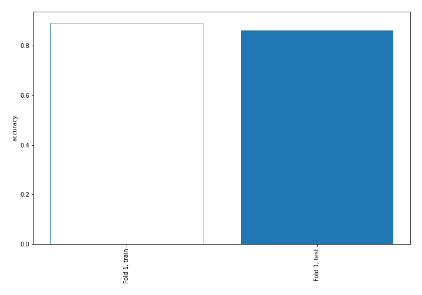

## Coefficients
| feature                           |   Learner_1 |
|:----------------------------------|------------:|
| sqreturn_autocorrelation_ts2_lag3 |   1.75912   |
| mean2                             |   1.62188   |
| sqreturn_autocorrelation_ts1_lag3 |   1.4459    |
| mean1                             |   1.37908   |
| sqreturn_autocorrelation_ts1_lag2 |   0.910706  |
| sqreturn_autocorrelation_ts2_lag1 |   0.729053  |
| return_autocorrelation_1_lag1     |   0.703051  |
| return_autocorrelation_2_lag1     |   0.698933  |
| return_correlation_ts1_lag_1      |   0.652108  |
| sqreturn_correlation_ts1_lag_1    |   0.652108  |
| sqreturn_autocorrelation_ts2_lag2 |   0.617761  |
| sqreturn_autocorrelation_ts1_lag1 |   0.485746  |
| sqreturn_correlation_ts2_lag_1    |   0.451053  |
| return_correlation_ts2_lag_1      |   0.451053  |
| sd1                               |   0.414149  |
| return_autocorrelation_2_lag2     |   0.278262  |
| return_correlation_ts1_lag_3      |   0.214963  |
| sqreturn_correlation_ts1_lag_3    |   0.214963  |
| return_autocorrelation_2_lag3     |   0.191926  |
| return_autocorrelation_1_lag3     |   0.183793  |
| return_autocorrelation_1_lag2     |   0.157443  |
| price1_granger_cause_price2       |   0.147655  |
| return_correlation_ts1_lag_2      |   0.0812034 |
| sqreturn_correlation_ts1_lag_2    |   0.0812034 |
| return_correlation_ts2_lag_3      |   0.0580624 |
| sqreturn_correlation_ts2_lag_3    |   0.0580624 |
| sd2                               |  -0.128386  |
| return_correlation_ts2_lag_2      |  -0.153505  |
| sqreturn_correlation_ts2_lag_2    |  -0.153505  |
| return_correlation_ts1_lag_0      |  -0.221758  |
| sqreturn_correlation_ts1_lag_0    |  -0.221758  |
| price2_granger_cause_price1       |  -0.325401  |
| skewness2                         |  -0.482155  |
| skewness1                         |  -1.29309   |
| intercept                         |  -1.94513   |
| kurtosis1                         |  -2.7072    |
| kurtosis2                         |  -3.15225   |

## Permutation-based Importance
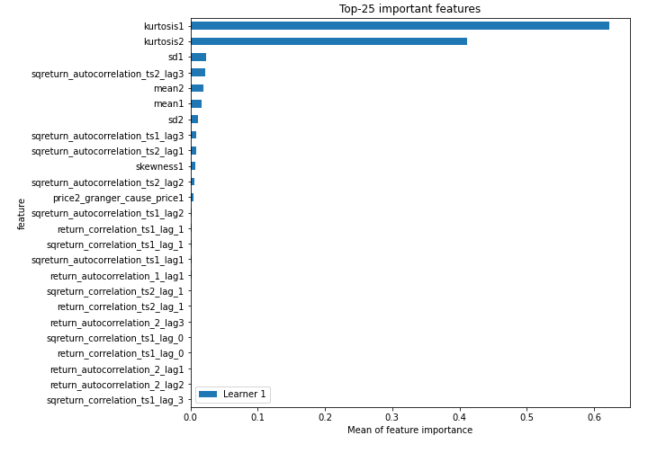
## Confusion Matrix

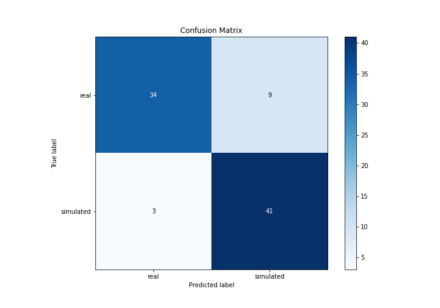

## Normalized Confusion Matrix

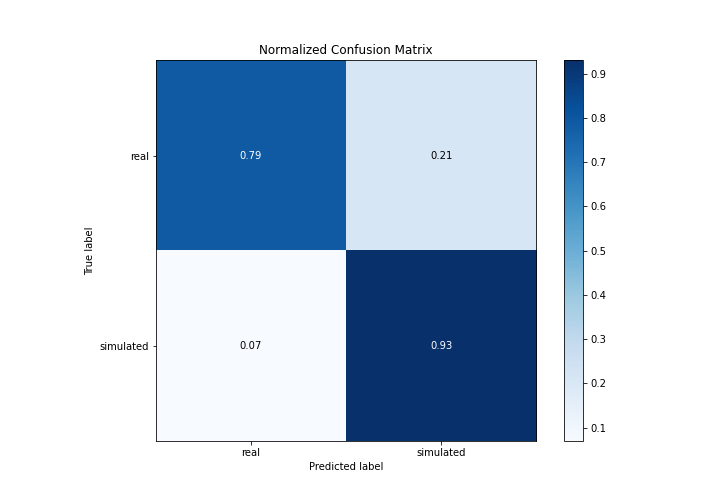

## ROC Curve

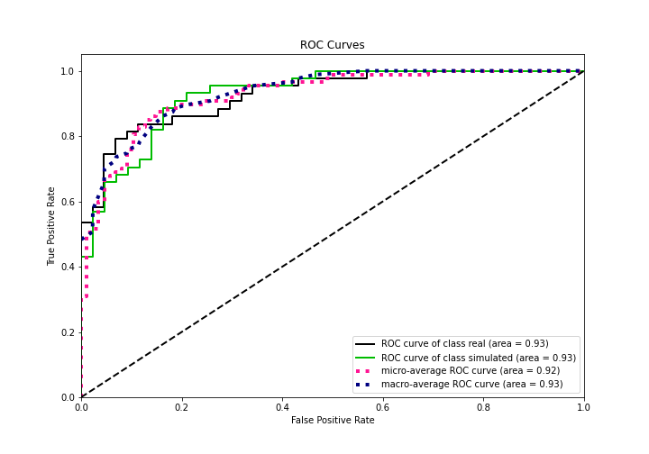

## Kolmogorov-Smirnov Statistic

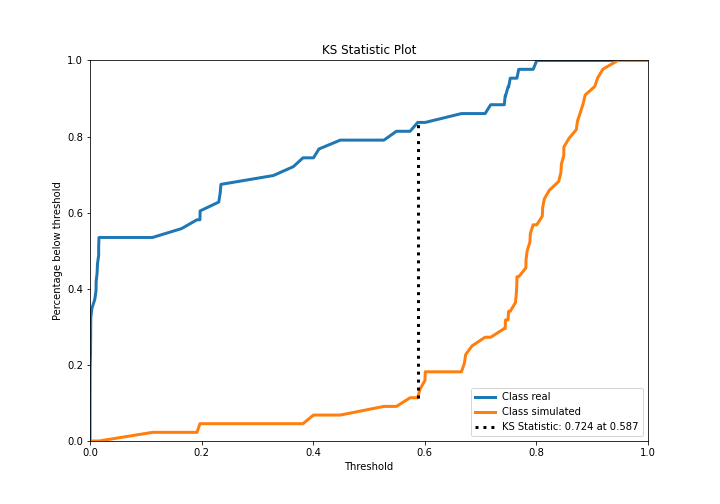

## Precision-Recall Curve

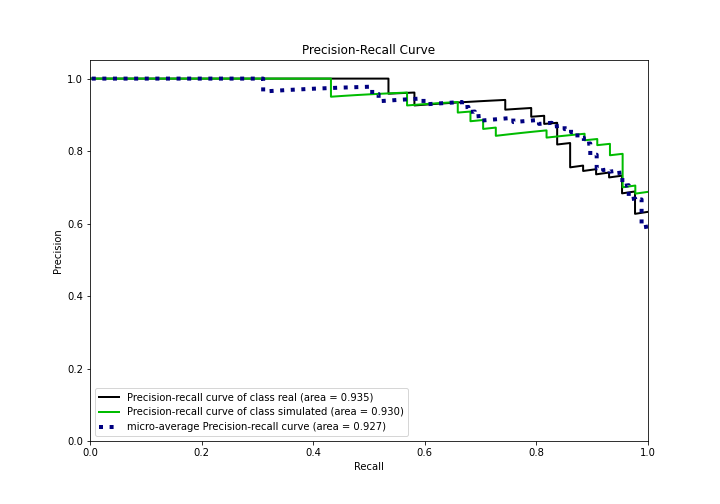

## Calibration Curve

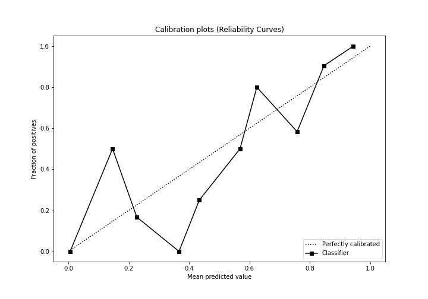

## Cumulative Gains Curve

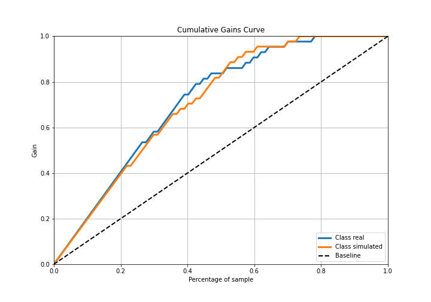

## Lift Curve

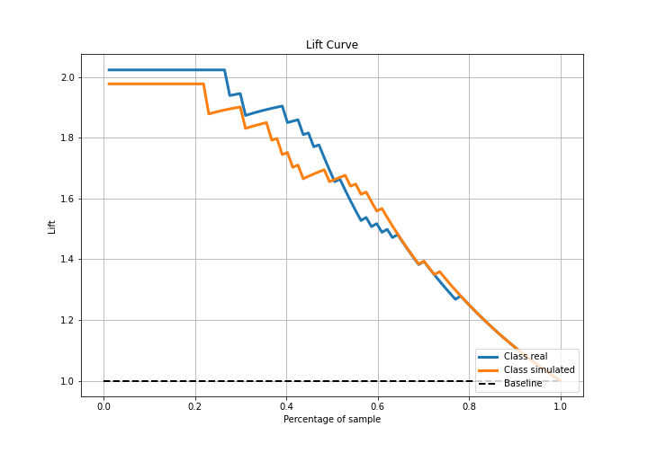

## SHAP Importance
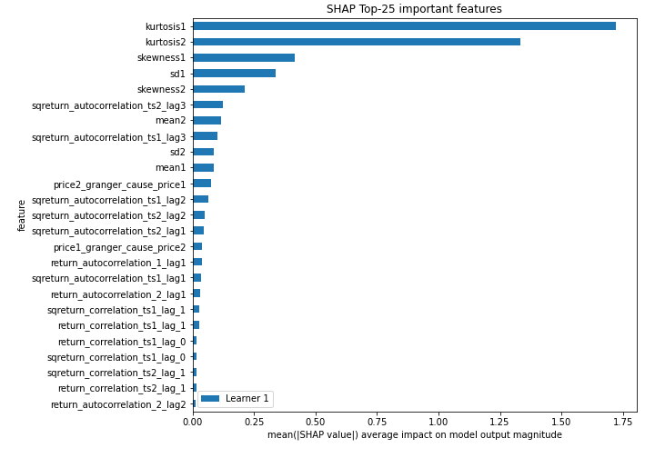

## SHAP Dependence plots

### Dependence (Fold 1)
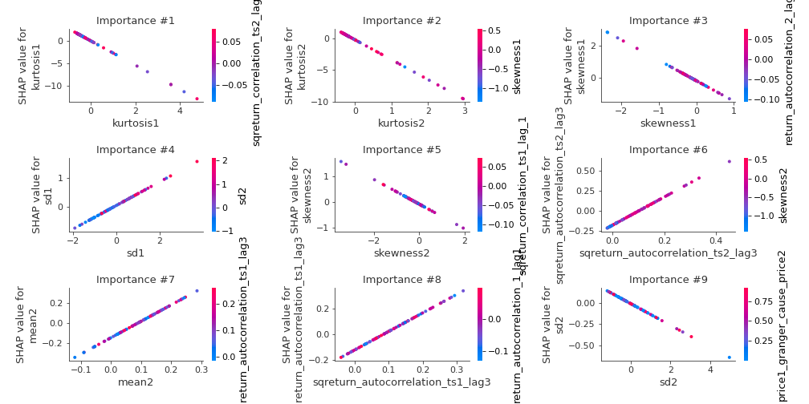

## SHAP Decision plots

### Top-10 Worst decisions for class 0 (Fold 1)
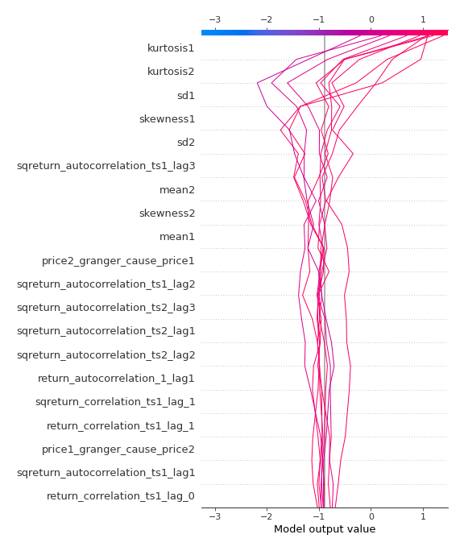
### Top-10 Best decisions for class 0 (Fold 1)
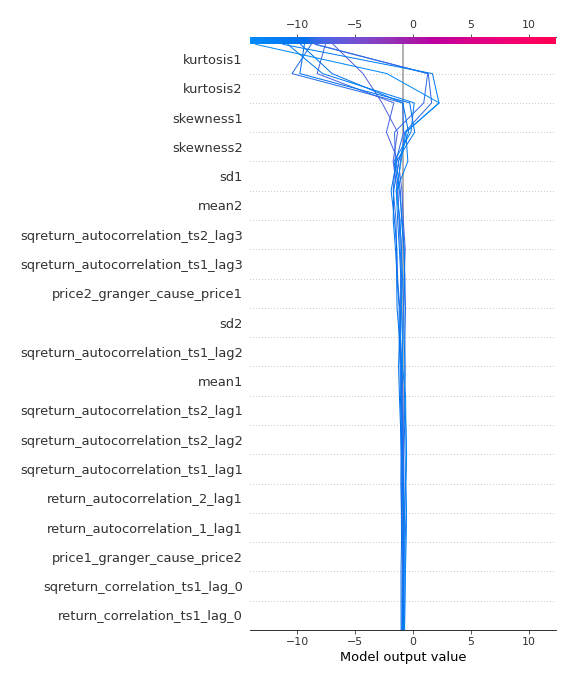
### Top-10 Worst decisions for class 1 (Fold 1)
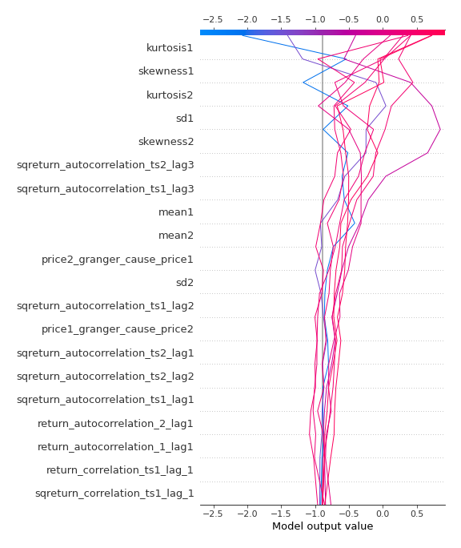
### Top-10 Best decisions for class 1 (Fold 1)
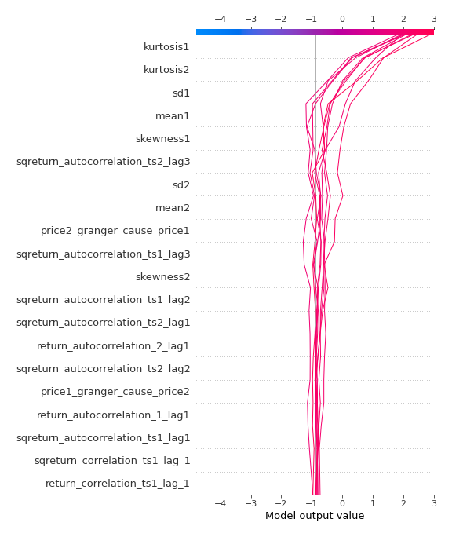

[<< Go back](../README.md)
