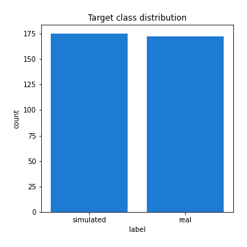

# Exploratory Data Analysis

[<< Go back](../README.md)
## Feature : target
- **Feature type** : categorical
- **Missing** : 0.0%
- **Unique** : 2
- **Count** :347
- **Unique** :2
- **Top** :simulated
- **Freq** :175

## Feature : mean1
- **Feature type** : continous
- **Missing** : 0.0%
- **Unique** : 347
- **Count** :347.0
- **Mean** :0.07721457518517318
- **Std** :0.07553292144256661
- **Min** :-0.17686457077756634
- **25%th Percentile** : 0.035738779576000745
- **50%th Percentile** : 0.07785379721447913
- **75%th Percentile** : 0.11624542245813346
- **Max** :0.35951212719134734

## Feature : mean2
- **Feature type** : continous
- **Missing** : 0.0%
- **Unique** : 347
- **Count** :347.0
- **Mean** :0.09456557419071131
- **Std** :0.09014243200427312
- **Min** :-0.24205418062825398
- **25%th Percentile** : 0.049134682071987956
- **50%th Percentile** : 0.09822058238526712
- **75%th Percentile** : 0.14800109783191776
- **Max** :0.37616608147096464

## Feature : sd1
- **Feature type** : continous
- **Missing** : 0.0%
- **Unique** : 347
- **Count** :347.0
- **Mean** :2.0502170065666485
- **Std** :0.6832317518828828
- **Min** :0.7470080772831957
- **25%th Percentile** : 1.5894778518068833
- **50%th Percentile** : 2.0082620007086347
- **75%th Percentile** : 2.4455896186012054
- **Max** :5.996244884956102

## Feature : sd2
- **Feature type** : continous
- **Missing** : 0.0%
- **Unique** : 347
- **Count** :347.0
- **Mean** :1.9699562341834844
- **Std** :0.7918020825332158
- **Min** :0.7552256884477146
- **25%th Percentile** : 1.4549246410391463
- **50%th Percentile** : 1.8472921556639235
- **75%th Percentile** : 2.269746869065922
- **Max** :6.737618636746393

## Feature : skewness1
- **Feature type** : continous
- **Missing** : 0.0%
- **Unique** : 347
- **Count** :347.0
- **Mean** :-0.14003480734167434
- **Std** :0.5587206806159506
- **Min** :-2.4443473868357586
- **25%th Percentile** : -0.30038995278030206
- **50%th Percentile** : -0.13489972887184867
- **75%th Percentile** : 0.03056277620457075
- **Max** :2.5845963767725557

## Feature : skewness2
- **Feature type** : continous
- **Missing** : 0.0%
- **Unique** : 347
- **Count** :347.0
- **Mean** :-0.23418546683568164
- **Std** :0.7503749091447204
- **Min** :-8.801502855292393
- **25%th Percentile** : -0.38454873128642847
- **50%th Percentile** : -0.16257487562777095
- **75%th Percentile** : 0.014621705916978282
- **Max** :2.2606839051517187

## Feature : kurtosis1
- **Feature type** : continous
- **Missing** : 0.0%
- **Unique** : 347
- **Count** :347.0
- **Mean** :3.823666118179984
- **Std** :5.185300987451396
- **Min** :0.03477879299249054
- **25%th Percentile** : 1.210707487221764
- **50%th Percentile** : 1.979987797950638
- **75%th Percentile** : 3.9945238268597105
- **Max** :35.56636016047202

## Feature : kurtosis2
- **Feature type** : continous
- **Missing** : 0.0%
- **Unique** : 347
- **Count** :347.0
- **Mean** :4.492451653384461
- **Std** :9.286035543841132
- **Min** :0.11360459889828833
- **25%th Percentile** : 1.3663998994707152
- **50%th Percentile** : 2.0899899124185066
- **75%th Percentile** : 4.320535562516911
- **Max** :143.10871011533666

## Feature : return_autocorrelation_1_lag1
- **Feature type** : continous
- **Missing** : 0.0%
- **Unique** : 347
- **Count** :347.0
- **Mean** :-0.013851589817088087
- **Std** :0.058335563007373484
- **Min** :-0.20673896439036124
- **25%th Percentile** : -0.05233092674235635
- **50%th Percentile** : -0.00932881941308751
- **75%th Percentile** : 0.024653335710090322
- **Max** :0.1253959753011446

## Feature : return_autocorrelation_1_lag2
- **Feature type** : continous
- **Missing** : 0.0%
- **Unique** : 347
- **Count** :347.0
- **Mean** :-0.007620924211946454
- **Std** :0.052128962244712196
- **Min** :-0.15939193757237788
- **25%th Percentile** : -0.04025507988385968
- **50%th Percentile** : -0.010855702324202361
- **75%th Percentile** : 0.02160435158239809
- **Max** :0.13559009000619343

## Feature : return_autocorrelation_1_lag3
- **Feature type** : continous
- **Missing** : 0.0%
- **Unique** : 347
- **Count** :347.0
- **Mean** :-0.0032699386734719366
- **Std** :0.05168884362367558
- **Min** :-0.17984096785863446
- **25%th Percentile** : -0.03515790283771798
- **50%th Percentile** : -0.002166715952400992
- **75%th Percentile** : 0.03280359004634367
- **Max** :0.17805869530681923

## Feature : return_autocorrelation_2_lag1
- **Feature type** : continous
- **Missing** : 0.0%
- **Unique** : 347
- **Count** :347.0
- **Mean** :-0.015163978255713102
- **Std** :0.05996567279487265
- **Min** :-0.24590087874039124
- **25%th Percentile** : -0.04897895824835804
- **50%th Percentile** : -0.012218173480824558
- **75%th Percentile** : 0.02464600374491712
- **Max** :0.16349871797309318

## Feature : return_autocorrelation_2_lag2
- **Feature type** : continous
- **Missing** : 0.0%
- **Unique** : 347
- **Count** :347.0
- **Mean** :-0.006244167866897253
- **Std** :0.05222449108203183
- **Min** :-0.15323211089747296
- **25%th Percentile** : -0.04227069862163235
- **50%th Percentile** : -0.006303184136612406
- **75%th Percentile** : 0.032013650362114746
- **Max** :0.14734721826682337

## Feature : return_autocorrelation_2_lag3
- **Feature type** : continous
- **Missing** : 0.0%
- **Unique** : 347
- **Count** :347.0
- **Mean** :-0.008339309860066289
- **Std** :0.05209729466071446
- **Min** :-0.1315535528857823
- **25%th Percentile** : -0.04491800910768176
- **50%th Percentile** : -0.008725325646635881
- **75%th Percentile** : 0.02724372892394067
- **Max** :0.1419999376914021

## Feature : return_correlation_ts1_lag_0
- **Feature type** : continous
- **Missing** : 0.0%
- **Unique** : 347
- **Count** :347.0
- **Mean** :0.3329712352392392
- **Std** :0.10560410071058776
- **Min** :-0.027089510445801036
- **25%th Percentile** : 0.2818722415431123
- **50%th Percentile** : 0.34215294198363877
- **75%th Percentile** : 0.3860244147353339
- **Max** :0.7041861626832071

## Feature : return_correlation_ts1_lag_1
- **Feature type** : continous
- **Missing** : 0.0%
- **Unique** : 347
- **Count** :347.0
- **Mean** :-0.011023630184807108
- **Std** :0.05525415644779299
- **Min** :-0.21609021788293686
- **25%th Percentile** : -0.046061858329275264
- **50%th Percentile** : -0.006706166125540545
- **75%th Percentile** : 0.021695618806963628
- **Max** :0.15451940164582634

## Feature : return_correlation_ts1_lag_2
- **Feature type** : continous
- **Missing** : 0.0%
- **Unique** : 347
- **Count** :347.0
- **Mean** :-0.002695139901657816
- **Std** :0.050773266969608384
- **Min** :-0.1246451147068724
- **25%th Percentile** : -0.03809635001533668
- **50%th Percentile** : -0.0014534736287393124
- **75%th Percentile** : 0.027694131146378205
- **Max** :0.15743848443918065

## Feature : return_correlation_ts1_lag_3
- **Feature type** : continous
- **Missing** : 0.0%
- **Unique** : 347
- **Count** :347.0
- **Mean** :-0.0038278646501811254
- **Std** :0.05501943455874208
- **Min** :-0.15774810772085687
- **25%th Percentile** : -0.03983470319893964
- **50%th Percentile** : -0.005623623140617771
- **75%th Percentile** : 0.03169514146402433
- **Max** :0.1636773216468148

## Feature : return_correlation_ts2_lag_1
- **Feature type** : continous
- **Missing** : 0.0%
- **Unique** : 347
- **Count** :347.0
- **Mean** :-0.00640973167836715
- **Std** :0.055114139546068606
- **Min** :-0.2081139431093261
- **25%th Percentile** : -0.04262276677535279
- **50%th Percentile** : -0.008980302342999544
- **75%th Percentile** : 0.029676388885083525
- **Max** :0.17208763791364762

## Feature : return_correlation_ts2_lag_2
- **Feature type** : continous
- **Missing** : 0.0%
- **Unique** : 347
- **Count** :347.0
- **Mean** :-0.006221034363874332
- **Std** :0.05308198738244032
- **Min** :-0.23751835475804678
- **25%th Percentile** : -0.042426412921733256
- **50%th Percentile** : -0.008068972567911175
- **75%th Percentile** : 0.02745843064980132
- **Max** :0.15388933426238696

## Feature : return_correlation_ts2_lag_3
- **Feature type** : continous
- **Missing** : 0.0%
- **Unique** : 347
- **Count** :347.0
- **Mean** :-0.0063710447436608735
- **Std** :0.05285228763560152
- **Min** :-0.16212823605110202
- **25%th Percentile** : -0.0400525013022489
- **50%th Percentile** : -0.003993925988076543
- **75%th Percentile** : 0.028652944958802242
- **Max** :0.13128380114518473

## Feature : sqreturn_autocorrelation_ts1_lag1
- **Feature type** : continous
- **Missing** : 0.0%
- **Unique** : 347
- **Count** :347.0
- **Mean** :0.11207407960706715
- **Std** :0.08663914044578218
- **Min** :-0.06532118872798363
- **25%th Percentile** : 0.04916263864092264
- **50%th Percentile** : 0.10003674162732526
- **75%th Percentile** : 0.15907977221834063
- **Max** :0.49414293176447355

## Feature : sqreturn_autocorrelation_ts1_lag2
- **Feature type** : continous
- **Missing** : 0.0%
- **Unique** : 347
- **Count** :347.0
- **Mean** :0.10661563099806366
- **Std** :0.08391601917632656
- **Min** :-0.05165593255897504
- **25%th Percentile** : 0.04242438410055341
- **50%th Percentile** : 0.09955677992021988
- **75%th Percentile** : 0.15700229859463094
- **Max** :0.4522162366773919

## Feature : sqreturn_autocorrelation_ts1_lag3
- **Feature type** : continous
- **Missing** : 0.0%
- **Unique** : 347
- **Count** :347.0
- **Mean** :0.09923836624155524
- **Std** :0.08479299272269528
- **Min** :-0.06486026764840777
- **25%th Percentile** : 0.03351516853956158
- **50%th Percentile** : 0.08769755662093784
- **75%th Percentile** : 0.15229594908395613
- **Max** :0.44755937369538146

## Feature : sqreturn_autocorrelation_ts2_lag1
- **Feature type** : continous
- **Missing** : 0.0%
- **Unique** : 347
- **Count** :347.0
- **Mean** :0.12162312829505353
- **Std** :0.08576678782881658
- **Min** :-0.04997282481431907
- **25%th Percentile** : 0.05560963495511574
- **50%th Percentile** : 0.11610446306246314
- **75%th Percentile** : 0.17474199745372054
- **Max** :0.510085647437958

## Feature : sqreturn_autocorrelation_ts2_lag2
- **Feature type** : continous
- **Missing** : 0.0%
- **Unique** : 347
- **Count** :347.0
- **Mean** :0.10907728228529584
- **Std** :0.08935725048573517
- **Min** :-0.04424883229120365
- **25%th Percentile** : 0.0355229114015586
- **50%th Percentile** : 0.1026641751789738
- **75%th Percentile** : 0.165872513065428
- **Max** :0.4161185589245815

## Feature : sqreturn_autocorrelation_ts2_lag3
- **Feature type** : continous
- **Missing** : 0.0%
- **Unique** : 347
- **Count** :347.0
- **Mean** :0.09905683590189175
- **Std** :0.08420875158669336
- **Min** :-0.06082766359524085
- **25%th Percentile** : 0.02849374751737202
- **50%th Percentile** : 0.0931078839489695
- **75%th Percentile** : 0.15773706239277133
- **Max** :0.4519305707660606

## Feature : sqreturn_correlation_ts1_lag_0
- **Feature type** : continous
- **Missing** : 0.0%
- **Unique** : 347
- **Count** :347.0
- **Mean** :0.3329712352392392
- **Std** :0.10560410071058776
- **Min** :-0.027089510445801036
- **25%th Percentile** : 0.2818722415431123
- **50%th Percentile** : 0.34215294198363877
- **75%th Percentile** : 0.3860244147353339
- **Max** :0.7041861626832071

## Feature : sqreturn_correlation_ts1_lag_1
- **Feature type** : continous
- **Missing** : 0.0%
- **Unique** : 347
- **Count** :347.0
- **Mean** :-0.011023630184807108
- **Std** :0.05525415644779299
- **Min** :-0.21609021788293686
- **25%th Percentile** : -0.046061858329275264
- **50%th Percentile** : -0.006706166125540545
- **75%th Percentile** : 0.021695618806963628
- **Max** :0.15451940164582634

## Feature : sqreturn_correlation_ts1_lag_2
- **Feature type** : continous
- **Missing** : 0.0%
- **Unique** : 347
- **Count** :347.0
- **Mean** :-0.002695139901657816
- **Std** :0.050773266969608384
- **Min** :-0.1246451147068724
- **25%th Percentile** : -0.03809635001533668
- **50%th Percentile** : -0.0014534736287393124
- **75%th Percentile** : 0.027694131146378205
- **Max** :0.15743848443918065

## Feature : sqreturn_correlation_ts1_lag_3
- **Feature type** : continous
- **Missing** : 0.0%
- **Unique** : 347
- **Count** :347.0
- **Mean** :-0.0038278646501811254
- **Std** :0.05501943455874208
- **Min** :-0.15774810772085687
- **25%th Percentile** : -0.03983470319893964
- **50%th Percentile** : -0.005623623140617771
- **75%th Percentile** : 0.03169514146402433
- **Max** :0.1636773216468148

## Feature : sqreturn_correlation_ts2_lag_1
- **Feature type** : continous
- **Missing** : 0.0%
- **Unique** : 347
- **Count** :347.0
- **Mean** :-0.00640973167836715
- **Std** :0.055114139546068606
- **Min** :-0.2081139431093261
- **25%th Percentile** : -0.04262276677535279
- **50%th Percentile** : -0.008980302342999544
- **75%th Percentile** : 0.029676388885083525
- **Max** :0.17208763791364762

## Feature : sqreturn_correlation_ts2_lag_2
- **Feature type** : continous
- **Missing** : 0.0%
- **Unique** : 347
- **Count** :347.0
- **Mean** :-0.006221034363874332
- **Std** :0.05308198738244032
- **Min** :-0.23751835475804678
- **25%th Percentile** : -0.042426412921733256
- **50%th Percentile** : -0.008068972567911175
- **75%th Percentile** : 0.02745843064980132
- **Max** :0.15388933426238696

## Feature : sqreturn_correlation_ts2_lag_3
- **Feature type** : continous
- **Missing** : 0.0%
- **Unique** : 347
- **Count** :347.0
- **Mean** :-0.0063710447436608735
- **Std** :0.05285228763560152
- **Min** :-0.16212823605110202
- **25%th Percentile** : -0.0400525013022489
- **50%th Percentile** : -0.003993925988076543
- **75%th Percentile** : 0.028652944958802242
- **Max** :0.13128380114518473

## Feature : price2_granger_cause_price1
- **Feature type** : continous
- **Missing** : 0.0%
- **Unique** : 347
- **Count** :347.0
- **Mean** :0.3017018986672935
- **Std** :0.28580147637714814
- **Min** :1.8609237864830008e-07
- **25%th Percentile** : 0.04250598994238959
- **50%th Percentile** : 0.22927600170723084
- **75%th Percentile** : 0.4975004798026968
- **Max** :0.9885712803689185

## Feature : price1_granger_cause_price2
- **Feature type** : continous
- **Missing** : 0.0%
- **Unique** : 347
- **Count** :347.0
- **Mean** :0.3243445047952409
- **Std** :0.3007379310565751
- **Min** :8.269113237228595e-06
- **25%th Percentile** : 0.0503720603223895
- **50%th Percentile** : 0.24827258158661256
- **75%th Percentile** : 0.5720236165975399
- **Max** :0.9933581703677227

[<< Go back](../README.md)
