# Exploratory Data Analysis

[<< Go back](../README.md)
## Feature : target
- **Feature type** : categorical
- **Missing** : 0.0%
- **Unique** : 2
- **Count** :347
- **Unique** :2
- **Top** :simulated
- **Freq** :179

## Feature : mean1
- **Feature type** : continous
- **Missing** : 0.0%
- **Unique** : 347
- **Count** :347.0
- **Mean** :0.08263144178408242
- **Std** :0.08254348911966938
- **Min** :-0.22632637961920957
- **25%th Percentile** : 0.032738595468379345
- **50%th Percentile** : 0.07904469386179161
- **75%th Percentile** : 0.12069049053538175
- **Max** :0.3612366374600757

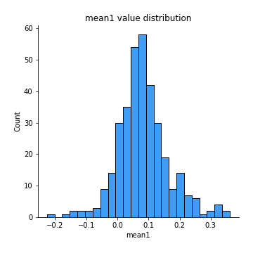
## Feature : mean2
- **Feature type** : continous
- **Missing** : 0.0%
- **Unique** : 347
- **Count** :347.0
- **Mean** :0.08724024333007978
- **Std** :0.08809279461442328
- **Min** :-0.24205418062825398
- **25%th Percentile** : 0.04646911227563084
- **50%th Percentile** : 0.08885048087299631
- **75%th Percentile** : 0.14212853975504355
- **Max** :0.2865592267325418

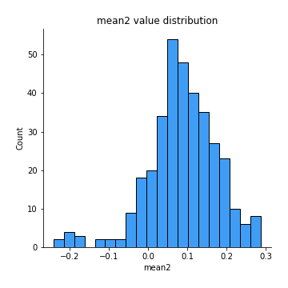
## Feature : sd1
- **Feature type** : continous
- **Missing** : 0.0%
- **Unique** : 347
- **Count** :347.0
- **Mean** :2.050349473788737
- **Std** :0.7885338151752409
- **Min** :0.7470080772831957
- **25%th Percentile** : 1.580409353601877
- **50%th Percentile** : 1.9642148151354486
- **75%th Percentile** : 2.3982978891318654
- **Max** :9.236766377527575

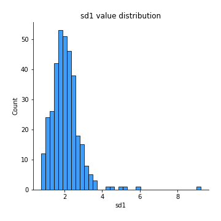
## Feature : sd2
- **Feature type** : continous
- **Missing** : 0.0%
- **Unique** : 347
- **Count** :347.0
- **Mean** :1.965391182305573
- **Std** :0.7235905950905777
- **Min** :0.7319322896632917
- **25%th Percentile** : 1.4782712960644577
- **50%th Percentile** : 1.8622702085701153
- **75%th Percentile** : 2.2675166389433157
- **Max** :6.737618636746393

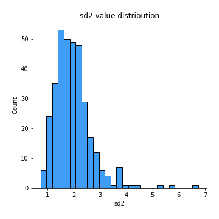
## Feature : skewness1
- **Feature type** : continous
- **Missing** : 0.0%
- **Unique** : 347
- **Count** :347.0
- **Mean** :-0.16651926588566965
- **Std** :0.590205356785405
- **Min** :-3.530116233761814
- **25%th Percentile** : -0.2978274188143025
- **50%th Percentile** : -0.12753460584477386
- **75%th Percentile** : 0.035865978301550736
- **Max** :2.5845963767725557

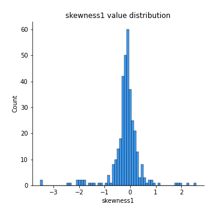
## Feature : skewness2
- **Feature type** : continous
- **Missing** : 0.0%
- **Unique** : 347
- **Count** :347.0
- **Mean** :-0.26449647374026325
- **Std** :0.7700648238481036
- **Min** :-8.801502855292393
- **25%th Percentile** : -0.3886430864924936
- **50%th Percentile** : -0.19036870139215922
- **75%th Percentile** : -0.029551117197019444
- **Max** :2.2606839051517187

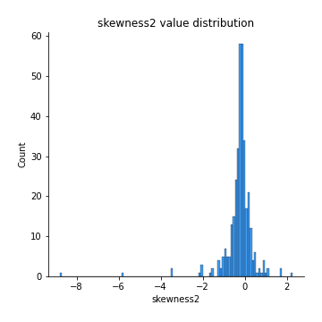
## Feature : kurtosis1
- **Feature type** : continous
- **Missing** : 0.0%
- **Unique** : 347
- **Count** :347.0
- **Mean** :3.910871445205025
- **Std** :5.805371603828034
- **Min** :0.07149361823522637
- **25%th Percentile** : 1.1350334166212344
- **50%th Percentile** : 1.8443690184129875
- **75%th Percentile** : 3.8405863563633806
- **Max** :46.07507808162177

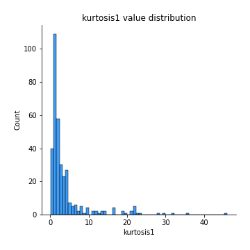
## Feature : kurtosis2
- **Feature type** : continous
- **Missing** : 0.0%
- **Unique** : 347
- **Count** :347.0
- **Mean** :4.5080938188289545
- **Std** :10.063014896636638
- **Min** :0.1351448070009158
- **25%th Percentile** : 1.2157297847989441
- **50%th Percentile** : 2.0023518405844567
- **75%th Percentile** : 4.203257588500451
- **Max** :143.10871011533666

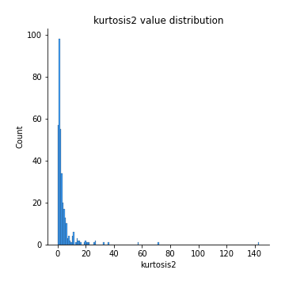
## Feature : return_autocorrelation_1_lag1
- **Feature type** : continous
- **Missing** : 0.0%
- **Unique** : 347
- **Count** :347.0
- **Mean** :-0.014238560281176952
- **Std** :0.057789561812887115
- **Min** :-0.2135576224968752
- **25%th Percentile** : -0.046465530274590994
- **50%th Percentile** : -0.011652124522722464
- **75%th Percentile** : 0.022542396685244437
- **Max** :0.12810656890648087

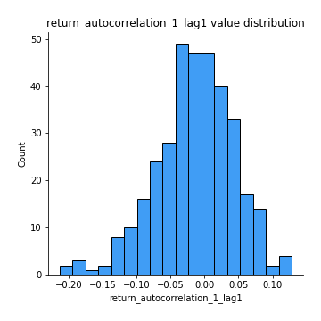
## Feature : return_autocorrelation_1_lag2
- **Feature type** : continous
- **Missing** : 0.0%
- **Unique** : 347
- **Count** :347.0
- **Mean** :-0.005568037248117832
- **Std** :0.05677437651782145
- **Min** :-0.18486883173331514
- **25%th Percentile** : -0.042063712877434
- **50%th Percentile** : -0.00797538814089631
- **75%th Percentile** : 0.03243848274022838
- **Max** :0.1561488228015672

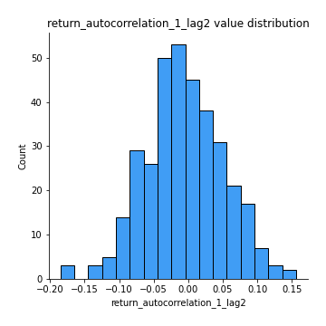
## Feature : return_autocorrelation_1_lag3
- **Feature type** : continous
- **Missing** : 0.0%
- **Unique** : 347
- **Count** :347.0
- **Mean** :-0.0044423638200770735
- **Std** :0.05805613768323096
- **Min** :-0.1940836867390813
- **25%th Percentile** : -0.04307401268501332
- **50%th Percentile** : -0.001593208013365921
- **75%th Percentile** : 0.03248322743178883
- **Max** :0.17805869530681923

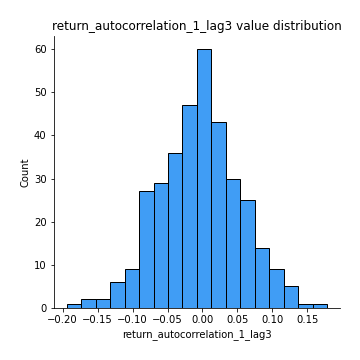
## Feature : return_autocorrelation_2_lag1
- **Feature type** : continous
- **Missing** : 0.0%
- **Unique** : 347
- **Count** :347.0
- **Mean** :-0.011751924208052858
- **Std** :0.06584488833573113
- **Min** :-0.25075531010123286
- **25%th Percentile** : -0.04610388203702853
- **50%th Percentile** : -0.010289097845712893
- **75%th Percentile** : 0.028192596991144805
- **Max** :0.31863413537898483

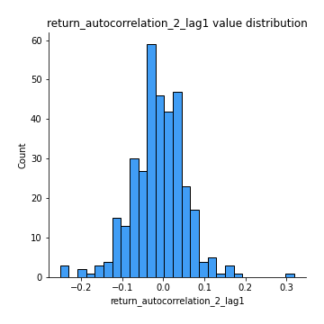
## Feature : return_autocorrelation_2_lag2
- **Feature type** : continous
- **Missing** : 0.0%
- **Unique** : 347
- **Count** :347.0
- **Mean** :-0.00906705402948606
- **Std** :0.05625977645886067
- **Min** :-0.16914799315768872
- **25%th Percentile** : -0.04748961192770451
- **50%th Percentile** : -0.011267130347342677
- **75%th Percentile** : 0.02693902034625561
- **Max** :0.20974504043791217

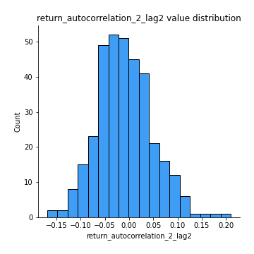
## Feature : return_autocorrelation_2_lag3
- **Feature type** : continous
- **Missing** : 0.0%
- **Unique** : 347
- **Count** :347.0
- **Mean** :-0.006130543762467586
- **Std** :0.053104506513332296
- **Min** :-0.19113955104408462
- **25%th Percentile** : -0.04267038011090901
- **50%th Percentile** : -0.007843092436941953
- **75%th Percentile** : 0.025940607330432845
- **Max** :0.1341825769928139

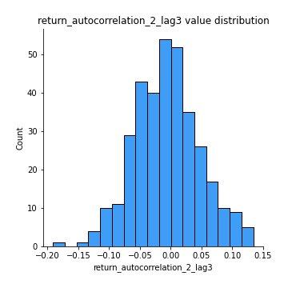
## Feature : return_correlation_ts1_lag_0
- **Feature type** : continous
- **Missing** : 0.0%
- **Unique** : 347
- **Count** :347.0
- **Mean** :0.3289401333730142
- **Std** :0.10421771780619311
- **Min** :0.005136598099876001
- **25%th Percentile** : 0.27859774054528774
- **50%th Percentile** : 0.33632173560026696
- **75%th Percentile** : 0.38037322090406456
- **Max** :0.6812020480945222

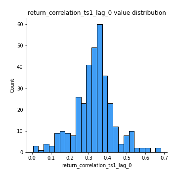
## Feature : return_correlation_ts1_lag_1
- **Feature type** : continous
- **Missing** : 0.0%
- **Unique** : 347
- **Count** :347.0
- **Mean** :-0.0077896017091466955
- **Std** :0.05557829171030141
- **Min** :-0.16985510949917193
- **25%th Percentile** : -0.04429180844218658
- **50%th Percentile** : -0.0069253238230752604
- **75%th Percentile** : 0.0279338674769197
- **Max** :0.17928733008378564

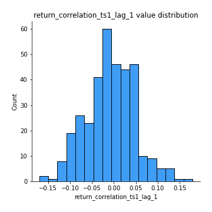
## Feature : return_correlation_ts1_lag_2
- **Feature type** : continous
- **Missing** : 0.0%
- **Unique** : 347
- **Count** :347.0
- **Mean** :-0.002370202995392621
- **Std** :0.05632385076294068
- **Min** :-0.21653581047581763
- **25%th Percentile** : -0.0409134868391428
- **50%th Percentile** : -0.00218597116671537
- **75%th Percentile** : 0.03992344153655106
- **Max** :0.15693741084693572

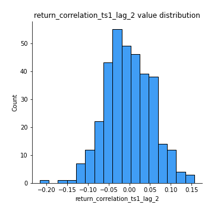
## Feature : return_correlation_ts1_lag_3
- **Feature type** : continous
- **Missing** : 0.0%
- **Unique** : 347
- **Count** :347.0
- **Mean** :0.0009057160871014544
- **Std** :0.05805542672696525
- **Min** :-0.1270218498974763
- **25%th Percentile** : -0.03943996639404451
- **50%th Percentile** : 0.0017488934461860055
- **75%th Percentile** : 0.0418924288591615
- **Max** :0.1636773216468148

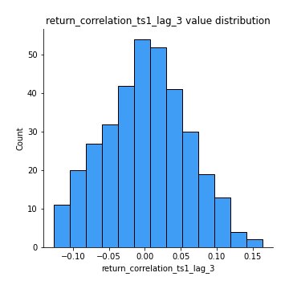
## Feature : return_correlation_ts2_lag_1
- **Feature type** : continous
- **Missing** : 0.0%
- **Unique** : 347
- **Count** :347.0
- **Mean** :-0.009917106314675411
- **Std** :0.05417766115091096
- **Min** :-0.2081139431093261
- **25%th Percentile** : -0.04385293956106716
- **50%th Percentile** : -0.010502912867097602
- **75%th Percentile** : 0.026185088551976182
- **Max** :0.13533528515617996

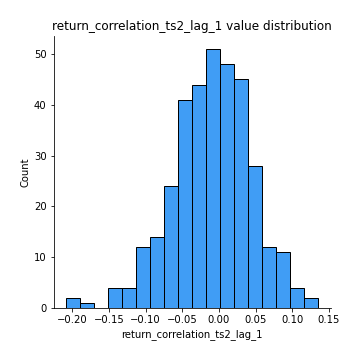
## Feature : return_correlation_ts2_lag_2
- **Feature type** : continous
- **Missing** : 0.0%
- **Unique** : 347
- **Count** :347.0
- **Mean** :-0.001617641307031572
- **Std** :0.055650399412901744
- **Min** :-0.15762002273574965
- **25%th Percentile** : -0.0409742718473934
- **50%th Percentile** : 0.0007876363585141012
- **75%th Percentile** : 0.03703223181980689
- **Max** :0.20772887392904255

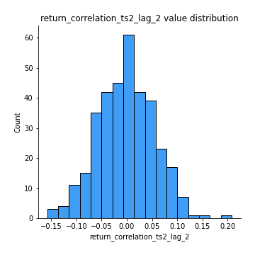
## Feature : return_correlation_ts2_lag_3
- **Feature type** : continous
- **Missing** : 0.0%
- **Unique** : 347
- **Count** :347.0
- **Mean** :-0.004800337821000458
- **Std** :0.05425143844446648
- **Min** :-0.17564076057312866
- **25%th Percentile** : -0.03738126027369351
- **50%th Percentile** : -0.004373852284171392
- **75%th Percentile** : 0.029313157909586104
- **Max** :0.17745113863166995

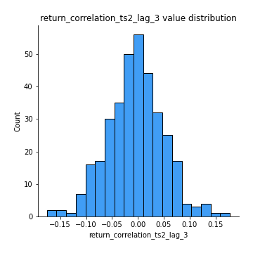
## Feature : sqreturn_autocorrelation_ts1_lag1
- **Feature type** : continous
- **Missing** : 0.0%
- **Unique** : 347
- **Count** :347.0
- **Mean** :0.11088548690124253
- **Std** :0.08556551845421585
- **Min** :-0.06532118872798363
- **25%th Percentile** : 0.04694887120498403
- **50%th Percentile** : 0.09674987482032439
- **75%th Percentile** : 0.16226818198269477
- **Max** :0.4439086285737898

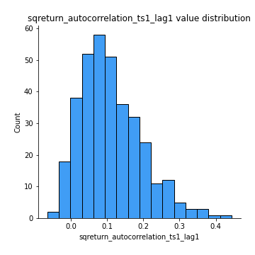
## Feature : sqreturn_autocorrelation_ts1_lag2
- **Feature type** : continous
- **Missing** : 0.0%
- **Unique** : 347
- **Count** :347.0
- **Mean** :0.1069931501360127
- **Std** :0.09353819428929616
- **Min** :-0.05419304650062953
- **25%th Percentile** : 0.03314083037756201
- **50%th Percentile** : 0.09062670440662428
- **75%th Percentile** : 0.16252679114965124
- **Max** :0.4522162366773919

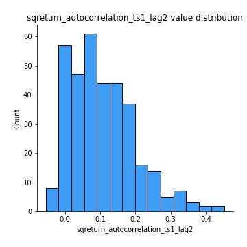
## Feature : sqreturn_autocorrelation_ts1_lag3
- **Feature type** : continous
- **Missing** : 0.0%
- **Unique** : 347
- **Count** :347.0
- **Mean** :0.10432264613218678
- **Std** :0.08604131757667087
- **Min** :-0.06486026764840777
- **25%th Percentile** : 0.03991677228472704
- **50%th Percentile** : 0.0948627082357208
- **75%th Percentile** : 0.1558380848973367
- **Max** :0.41030914918857014

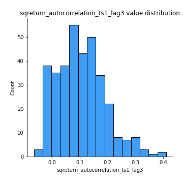
## Feature : sqreturn_autocorrelation_ts2_lag1
- **Feature type** : continous
- **Missing** : 0.0%
- **Unique** : 347
- **Count** :347.0
- **Mean** :0.12201250162145744
- **Std** :0.09159450924015203
- **Min** :-0.08520586663750691
- **25%th Percentile** : 0.05257428649933921
- **50%th Percentile** : 0.10937156167910128
- **75%th Percentile** : 0.17758496251047357
- **Max** :0.510085647437958

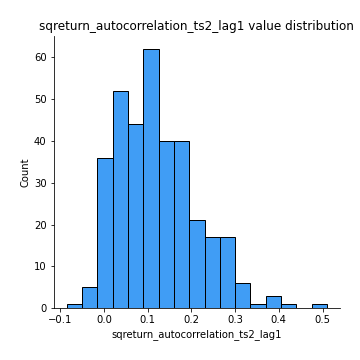
## Feature : sqreturn_autocorrelation_ts2_lag2
- **Feature type** : continous
- **Missing** : 0.0%
- **Unique** : 347
- **Count** :347.0
- **Mean** :0.11174333468204106
- **Std** :0.09349728515776755
- **Min** :-0.051523884196217395
- **25%th Percentile** : 0.038352607546885534
- **50%th Percentile** : 0.10147494754968665
- **75%th Percentile** : 0.17016436343380703
- **Max** :0.5373432415582473

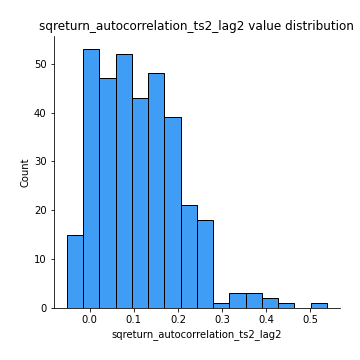
## Feature : sqreturn_autocorrelation_ts2_lag3
- **Feature type** : continous
- **Missing** : 0.0%
- **Unique** : 347
- **Count** :347.0
- **Mean** :0.10385580577611288
- **Std** :0.08976606833414871
- **Min** :-0.06082766359524085
- **25%th Percentile** : 0.03155221118510096
- **50%th Percentile** : 0.0975010745548366
- **75%th Percentile** : 0.15693754451489628
- **Max** :0.4726660472258331

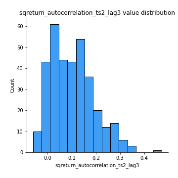
## Feature : sqreturn_correlation_ts1_lag_0
- **Feature type** : continous
- **Missing** : 0.0%
- **Unique** : 347
- **Count** :347.0
- **Mean** :0.3289401333730142
- **Std** :0.10421771780619311
- **Min** :0.005136598099876001
- **25%th Percentile** : 0.27859774054528774
- **50%th Percentile** : 0.33632173560026696
- **75%th Percentile** : 0.38037322090406456
- **Max** :0.6812020480945222

## Feature : sqreturn_correlation_ts1_lag_1
- **Feature type** : continous
- **Missing** : 0.0%
- **Unique** : 347
- **Count** :347.0
- **Mean** :-0.0077896017091466955
- **Std** :0.05557829171030141
- **Min** :-0.16985510949917193
- **25%th Percentile** : -0.04429180844218658
- **50%th Percentile** : -0.0069253238230752604
- **75%th Percentile** : 0.0279338674769197
- **Max** :0.17928733008378564

## Feature : sqreturn_correlation_ts1_lag_2
- **Feature type** : continous
- **Missing** : 0.0%
- **Unique** : 347
- **Count** :347.0
- **Mean** :-0.002370202995392621
- **Std** :0.05632385076294068
- **Min** :-0.21653581047581763
- **25%th Percentile** : -0.0409134868391428
- **50%th Percentile** : -0.00218597116671537
- **75%th Percentile** : 0.03992344153655106
- **Max** :0.15693741084693572

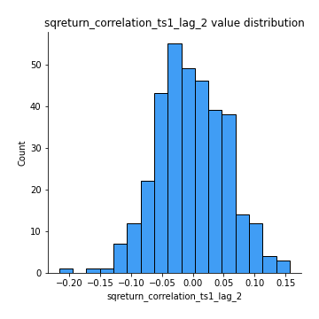
## Feature : sqreturn_correlation_ts1_lag_3
- **Feature type** : continous
- **Missing** : 0.0%
- **Unique** : 347
- **Count** :347.0
- **Mean** :0.0009057160871014544
- **Std** :0.05805542672696525
- **Min** :-0.1270218498974763
- **25%th Percentile** : -0.03943996639404451
- **50%th Percentile** : 0.0017488934461860055
- **75%th Percentile** : 0.0418924288591615
- **Max** :0.1636773216468148

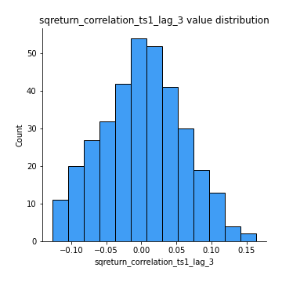
## Feature : sqreturn_correlation_ts2_lag_1
- **Feature type** : continous
- **Missing** : 0.0%
- **Unique** : 347
- **Count** :347.0
- **Mean** :-0.009917106314675411
- **Std** :0.05417766115091096
- **Min** :-0.2081139431093261
- **25%th Percentile** : -0.04385293956106716
- **50%th Percentile** : -0.010502912867097602
- **75%th Percentile** : 0.026185088551976182
- **Max** :0.13533528515617996

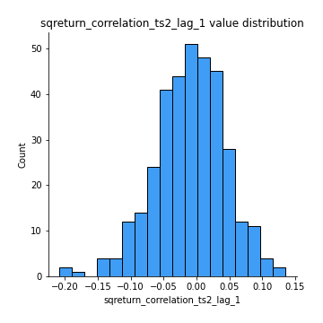
## Feature : sqreturn_correlation_ts2_lag_2
- **Feature type** : continous
- **Missing** : 0.0%
- **Unique** : 347
- **Count** :347.0
- **Mean** :-0.001617641307031572
- **Std** :0.055650399412901744
- **Min** :-0.15762002273574965
- **25%th Percentile** : -0.0409742718473934
- **50%th Percentile** : 0.0007876363585141012
- **75%th Percentile** : 0.03703223181980689
- **Max** :0.20772887392904255

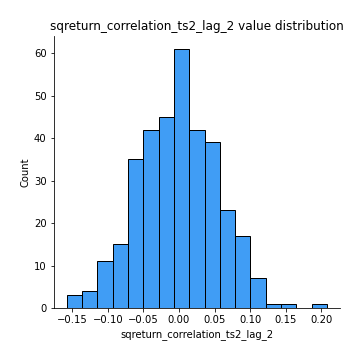
## Feature : sqreturn_correlation_ts2_lag_3
- **Feature type** : continous
- **Missing** : 0.0%
- **Unique** : 347
- **Count** :347.0
- **Mean** :-0.004800337821000458
- **Std** :0.05425143844446648
- **Min** :-0.17564076057312866
- **25%th Percentile** : -0.03738126027369351
- **50%th Percentile** : -0.004373852284171392
- **75%th Percentile** : 0.029313157909586104
- **Max** :0.17745113863166995

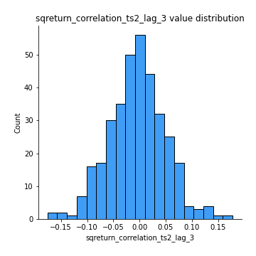
## Feature : price2_granger_cause_price1
- **Feature type** : continous
- **Missing** : 0.0%
- **Unique** : 347
- **Count** :347.0
- **Mean** :0.3257902740400881
- **Std** :0.3050928317477079
- **Min** :6.8403175486821225e-09
- **25%th Percentile** : 0.04467064245455458
- **50%th Percentile** : 0.2369928032318464
- **75%th Percentile** : 0.5776575051391222
- **Max** :0.9885712803689185

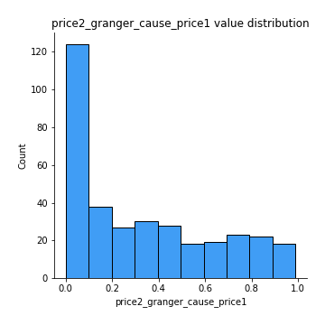
## Feature : price1_granger_cause_price2
- **Feature type** : continous
- **Missing** : 0.0%
- **Unique** : 347
- **Count** :347.0
- **Mean** :0.3146997359528
- **Std** :0.30326138711943124
- **Min** :2.2059558833237886e-08
- **25%th Percentile** : 0.036438886383383495
- **50%th Percentile** : 0.21544702794312137
- **75%th Percentile** : 0.555847812053551
- **Max** :0.9972531135239756

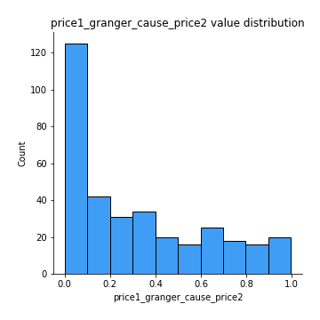

[<< Go back](../README.md)
