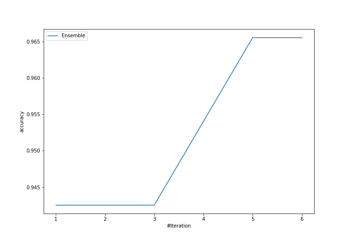
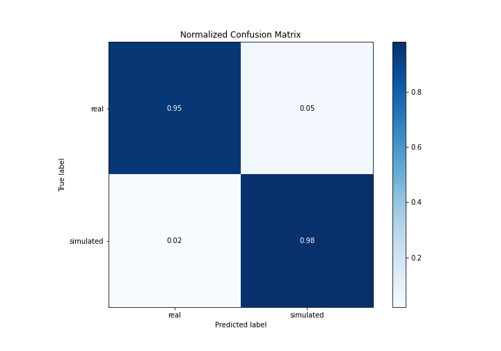
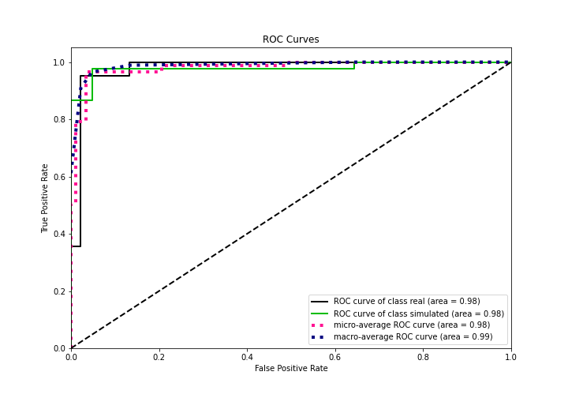
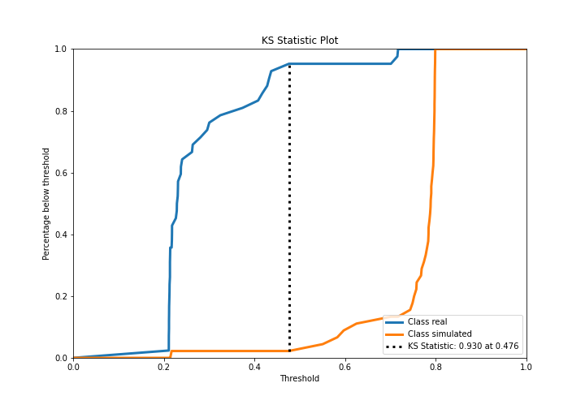
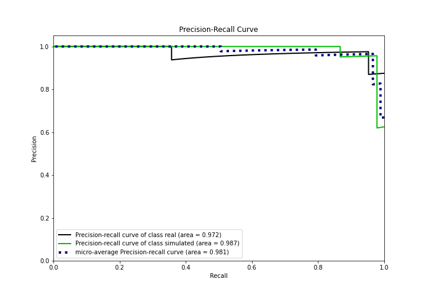
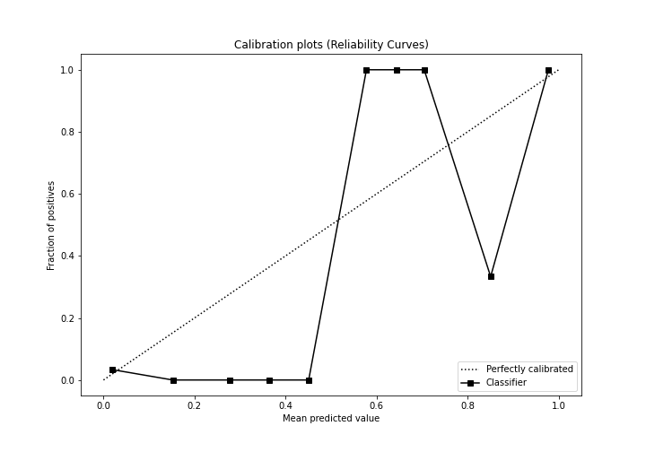
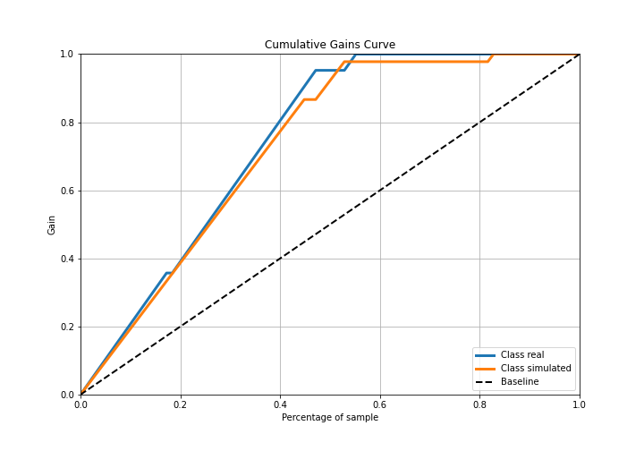
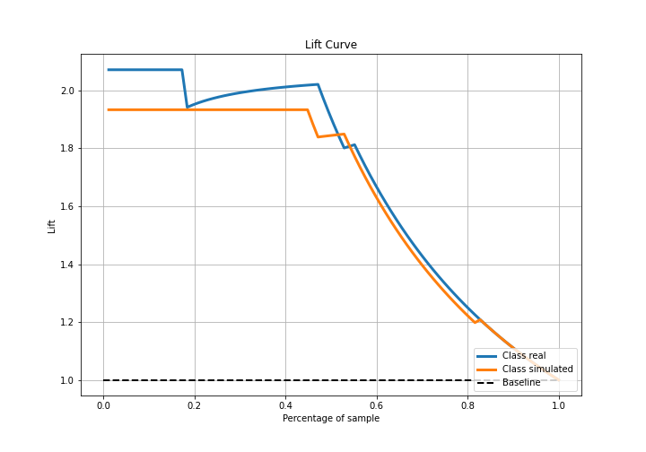

# Summary of Ensemble

[<< Go back](../README.md)

## Ensemble structure
| Model                   |   Weight |
|:------------------------|---------:|
| 1_Baseline              |        2 |
| 2_DecisionTree          |        1 |
| 4_Default_Xgboost       |        1 |
| 5_Default_NeuralNetwork |        1 |

## Metric details
|           |    score |   threshold |
|:----------|---------:|------------:|
| logloss   | 0.328327 |  nan        |
| auc       | 0.980423 |  nan        |
| f1        | 0.967033 |    0.485441 |
| accuracy  | 0.965517 |    0.485441 |
| precision | 1        |    0.793591 |
| recall    | 1        |    0.189938 |
| mcc       | 0.931145 |    0.485441 |

## Confusion matrix (at threshold=0.485441)
|                      |   Predicted as real |   Predicted as simulated |
|:---------------------|--------------------:|-------------------------:|
| Labeled as real      |                  40 |                        2 |
| Labeled as simulated |                   1 |                       44 |

## Learning curves

## Confusion Matrix

## Normalized Confusion Matrix

## ROC Curve

## Kolmogorov-Smirnov Statistic

## Precision-Recall Curve

## Calibration Curve

## Cumulative Gains Curve

## Lift Curve

[<< Go back](../README.md)
