# Exploratory Data Analysis

[<< Go back](../README.md)
## Feature : target
- **Feature type** : categorical
- **Missing** : 0.0%
- **Unique** : 2
- **Count** :347
- **Unique** :2
- **Top** :simulated
- **Freq** :181

## Feature : mean1
- **Feature type** : continous
- **Missing** : 0.0%
- **Unique** : 347
- **Count** :347.0
- **Mean** :0.08265633571998021
- **Std** :0.08381479054845434
- **Min** :-0.15256913196305744
- **25%th Percentile** : 0.02890495653990749
- **50%th Percentile** : 0.0777365266701866
- **75%th Percentile** : 0.12451658076160657
- **Max** :0.40294665176982414

## Feature : mean2
- **Feature type** : continous
- **Missing** : 0.0%
- **Unique** : 347
- **Count** :347.0
- **Mean** :0.0850441617668972
- **Std** :0.08939181633487064
- **Min** :-0.24205418062825398
- **25%th Percentile** : 0.039436050329072624
- **50%th Percentile** : 0.09063986816601285
- **75%th Percentile** : 0.14269141130550905
- **Max** :0.3446354232527783

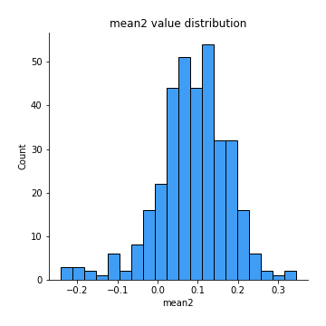
## Feature : sd1
- **Feature type** : continous
- **Missing** : 0.0%
- **Unique** : 347
- **Count** :347.0
- **Mean** :2.0593126722955164
- **Std** :0.7065345849951361
- **Min** :0.7620831696941981
- **25%th Percentile** : 1.5619804692444332
- **50%th Percentile** : 2.039604953622261
- **75%th Percentile** : 2.422259177964594
- **Max** :5.996244884956102

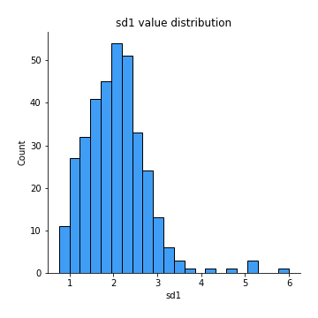
## Feature : sd2
- **Feature type** : continous
- **Missing** : 0.0%
- **Unique** : 347
- **Count** :347.0
- **Mean** :1.960644970897929
- **Std** :0.7681763248660742
- **Min** :0.6602722516356448
- **25%th Percentile** : 1.445521766046909
- **50%th Percentile** : 1.8199620375933643
- **75%th Percentile** : 2.231603855988664
- **Max** :6.737618636746393

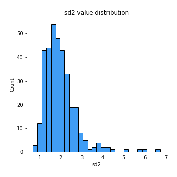
## Feature : skewness1
- **Feature type** : continous
- **Missing** : 0.0%
- **Unique** : 347
- **Count** :347.0
- **Mean** :-0.1671484585001601
- **Std** :0.5929956724623138
- **Min** :-3.530116233761814
- **25%th Percentile** : -0.3154418528101691
- **50%th Percentile** : -0.13639706278335695
- **75%th Percentile** : 0.045879251870370605
- **Max** :2.5845963767725557

## Feature : skewness2
- **Feature type** : continous
- **Missing** : 0.0%
- **Unique** : 347
- **Count** :347.0
- **Mean** :-0.26317791542073654
- **Std** :0.7947687396845705
- **Min** :-8.801502855292393
- **25%th Percentile** : -0.373009468868359
- **50%th Percentile** : -0.1917354150264728
- **75%th Percentile** : -0.005063716540071216
- **Max** :2.2606839051517187

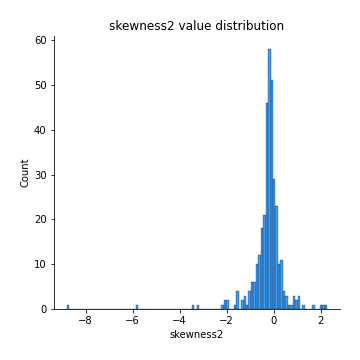
## Feature : kurtosis1
- **Feature type** : continous
- **Missing** : 0.0%
- **Unique** : 347
- **Count** :347.0
- **Mean** :3.6796793591186514
- **Std** :5.6363318225596934
- **Min** :0.03477879299249054
- **25%th Percentile** : 1.0822587710528513
- **50%th Percentile** : 1.777064752098219
- **75%th Percentile** : 3.5429832879128296
- **Max** :36.91113889081053

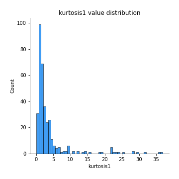
## Feature : kurtosis2
- **Feature type** : continous
- **Missing** : 0.0%
- **Unique** : 347
- **Count** :347.0
- **Mean** :4.751723874027991
- **Std** :9.934762278238422
- **Min** :-0.028821761062803652
- **25%th Percentile** : 1.2846309359496129
- **50%th Percentile** : 2.1844420734445547
- **75%th Percentile** : 4.528736557657497
- **Max** :143.10871011533666

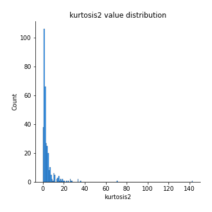
## Feature : return_autocorrelation_1_lag1
- **Feature type** : continous
- **Missing** : 0.0%
- **Unique** : 347
- **Count** :347.0
- **Mean** :-0.012973557361922792
- **Std** :0.058974156538727195
- **Min** :-0.2135576224968752
- **25%th Percentile** : -0.04799837137000463
- **50%th Percentile** : -0.0073825539194493014
- **75%th Percentile** : 0.026429809960195345
- **Max** :0.14042570750072425

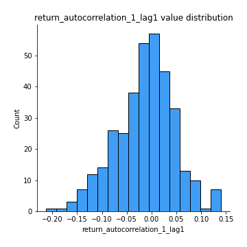
## Feature : return_autocorrelation_1_lag2
- **Feature type** : continous
- **Missing** : 0.0%
- **Unique** : 347
- **Count** :347.0
- **Mean** :-0.009544044653319676
- **Std** :0.05528075709866439
- **Min** :-0.1365159308016689
- **25%th Percentile** : -0.046668985800960475
- **50%th Percentile** : -0.008904684973079516
- **75%th Percentile** : 0.026962105055260505
- **Max** :0.16321527324439386

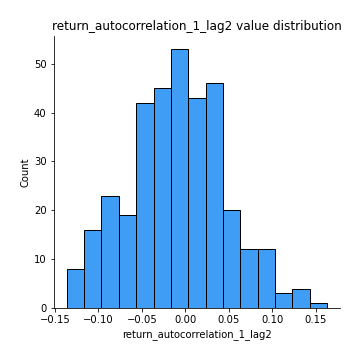
## Feature : return_autocorrelation_1_lag3
- **Feature type** : continous
- **Missing** : 0.0%
- **Unique** : 347
- **Count** :347.0
- **Mean** :-0.0018015257990082476
- **Std** :0.05178080568031283
- **Min** :-0.15656160114984594
- **25%th Percentile** : -0.037013214088317634
- **50%th Percentile** : -0.002563240726466464
- **75%th Percentile** : 0.034960536744319065
- **Max** :0.12731811633576073

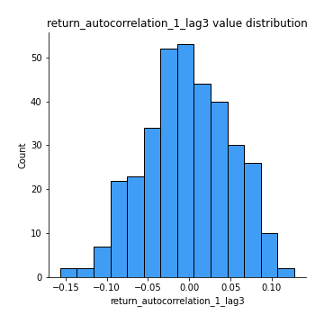
## Feature : return_autocorrelation_2_lag1
- **Feature type** : continous
- **Missing** : 0.0%
- **Unique** : 347
- **Count** :347.0
- **Mean** :-0.007197465923275276
- **Std** :0.0674749216482993
- **Min** :-0.25075531010123286
- **25%th Percentile** : -0.04693945250617618
- **50%th Percentile** : -0.0053051223931493054
- **75%th Percentile** : 0.032441102250954174
- **Max** :0.31863413537898483

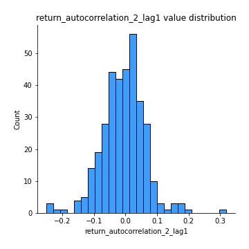
## Feature : return_autocorrelation_2_lag2
- **Feature type** : continous
- **Missing** : 0.0%
- **Unique** : 347
- **Count** :347.0
- **Mean** :-0.005362899343695051
- **Std** :0.05624491756155995
- **Min** :-0.15323211089747296
- **25%th Percentile** : -0.04084562488625357
- **50%th Percentile** : -0.006588528796977387
- **75%th Percentile** : 0.03191836100533612
- **Max** :0.20974504043791217

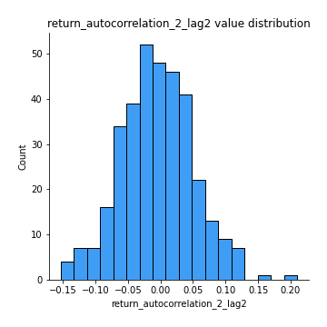
## Feature : return_autocorrelation_2_lag3
- **Feature type** : continous
- **Missing** : 0.0%
- **Unique** : 347
- **Count** :347.0
- **Mean** :-0.006439458930630302
- **Std** :0.05382725620761149
- **Min** :-0.14200107169559698
- **25%th Percentile** : -0.04644825396090267
- **50%th Percentile** : -0.006661082556650845
- **75%th Percentile** : 0.03005414690228171
- **Max** :0.1419999376914021

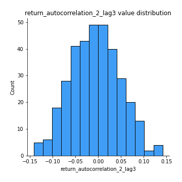
## Feature : return_correlation_ts1_lag_0
- **Feature type** : continous
- **Missing** : 0.0%
- **Unique** : 347
- **Count** :347.0
- **Mean** :0.3365818877372515
- **Std** :0.10502377232474484
- **Min** :0.005136598099876001
- **25%th Percentile** : 0.29396636435863993
- **50%th Percentile** : 0.3463022360570341
- **75%th Percentile** : 0.39664194602563124
- **Max** :0.7028422087350163

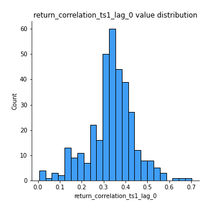
## Feature : return_correlation_ts1_lag_1
- **Feature type** : continous
- **Missing** : 0.0%
- **Unique** : 347
- **Count** :347.0
- **Mean** :-0.011035776596810074
- **Std** :0.05621623304923316
- **Min** :-0.16985510949917193
- **25%th Percentile** : -0.0488725304550275
- **50%th Percentile** : -0.009086570618374404
- **75%th Percentile** : 0.028006513746053112
- **Max** :0.1868646771574293

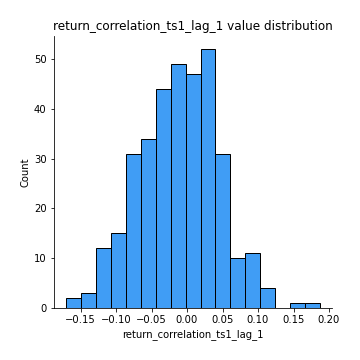
## Feature : return_correlation_ts1_lag_2
- **Feature type** : continous
- **Missing** : 0.0%
- **Unique** : 347
- **Count** :347.0
- **Mean** :-0.0013008377199693693
- **Std** :0.055271568790234676
- **Min** :-0.21653581047581763
- **25%th Percentile** : -0.03822761941262744
- **50%th Percentile** : -0.0038537794177983488
- **75%th Percentile** : 0.039964913493970106
- **Max** :0.1383722553520675

## Feature : return_correlation_ts1_lag_3
- **Feature type** : continous
- **Missing** : 0.0%
- **Unique** : 347
- **Count** :347.0
- **Mean** :0.00039862681338071924
- **Std** :0.0559190887104403
- **Min** :-0.1556985706696077
- **25%th Percentile** : -0.036797894159024735
- **50%th Percentile** : -0.0031753162242923565
- **75%th Percentile** : 0.039435559567620355
- **Max** :0.1636773216468148

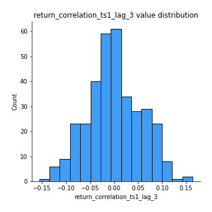
## Feature : return_correlation_ts2_lag_1
- **Feature type** : continous
- **Missing** : 0.0%
- **Unique** : 347
- **Count** :347.0
- **Mean** :-0.00658580590914515
- **Std** :0.06214326950683639
- **Min** :-0.2081139431093261
- **25%th Percentile** : -0.0452988099751751
- **50%th Percentile** : -0.010502912867097602
- **75%th Percentile** : 0.0302270864522457
- **Max** :0.20814946803944118

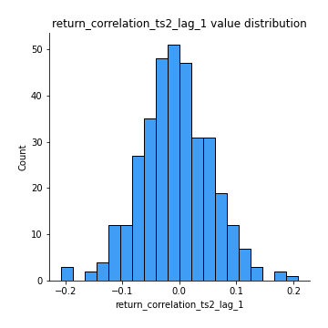
## Feature : return_correlation_ts2_lag_2
- **Feature type** : continous
- **Missing** : 0.0%
- **Unique** : 347
- **Count** :347.0
- **Mean** :-0.001195708681447253
- **Std** :0.05048599509871829
- **Min** :-0.15299951737180204
- **25%th Percentile** : -0.033024235895439444
- **50%th Percentile** : -0.0003449019640725187
- **75%th Percentile** : 0.03143592395703993
- **Max** :0.15388933426238696

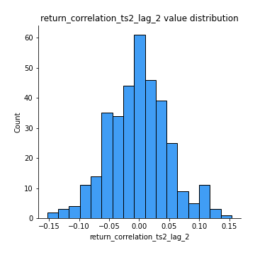
## Feature : return_correlation_ts2_lag_3
- **Feature type** : continous
- **Missing** : 0.0%
- **Unique** : 347
- **Count** :347.0
- **Mean** :-0.002271637564320882
- **Std** :0.051856725956913145
- **Min** :-0.1603001201932561
- **25%th Percentile** : -0.030947185428365193
- **50%th Percentile** : -0.001744564302787636
- **75%th Percentile** : 0.029112876628700827
- **Max** :0.14764617567120178

## Feature : sqreturn_autocorrelation_ts1_lag1
- **Feature type** : continous
- **Missing** : 0.0%
- **Unique** : 347
- **Count** :347.0
- **Mean** :0.11501718490930209
- **Std** :0.08078728569264874
- **Min** :-0.06532118872798363
- **25%th Percentile** : 0.05411369319635366
- **50%th Percentile** : 0.10697101941286527
- **75%th Percentile** : 0.1641891240972578
- **Max** :0.3607533260327883

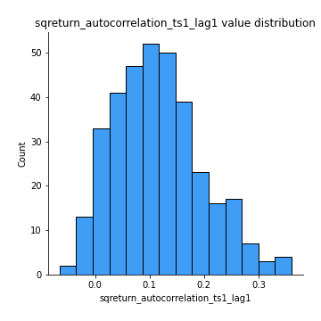
## Feature : sqreturn_autocorrelation_ts1_lag2
- **Feature type** : continous
- **Missing** : 0.0%
- **Unique** : 347
- **Count** :347.0
- **Mean** :0.10780241725592823
- **Std** :0.08534204853252422
- **Min** :-0.05419304650062953
- **25%th Percentile** : 0.043426435462999756
- **50%th Percentile** : 0.09636916537008755
- **75%th Percentile** : 0.16400450638188654
- **Max** :0.39723504055743203

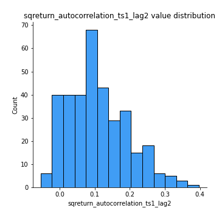
## Feature : sqreturn_autocorrelation_ts1_lag3
- **Feature type** : continous
- **Missing** : 0.0%
- **Unique** : 347
- **Count** :347.0
- **Mean** :0.0957826604524734
- **Std** :0.08175710926311403
- **Min** :-0.06486026764840777
- **25%th Percentile** : 0.03181256166141913
- **50%th Percentile** : 0.08839345867700539
- **75%th Percentile** : 0.15705168416661208
- **Max** :0.38247947855806275

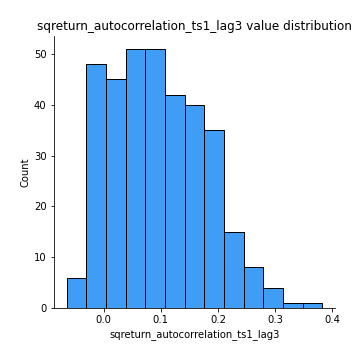
## Feature : sqreturn_autocorrelation_ts2_lag1
- **Feature type** : continous
- **Missing** : 0.0%
- **Unique** : 347
- **Count** :347.0
- **Mean** :0.12271388416805655
- **Std** :0.08606837334296204
- **Min** :-0.026796415279758023
- **25%th Percentile** : 0.05699697646243414
- **50%th Percentile** : 0.1164905416506481
- **75%th Percentile** : 0.17216463329790277
- **Max** :0.510085647437958

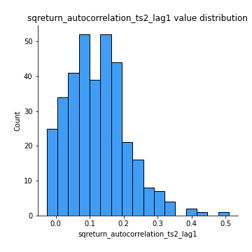
## Feature : sqreturn_autocorrelation_ts2_lag2
- **Feature type** : continous
- **Missing** : 0.0%
- **Unique** : 347
- **Count** :347.0
- **Mean** :0.10634939185785643
- **Std** :0.08976646807194573
- **Min** :-0.05546807804785111
- **25%th Percentile** : 0.03892909957796753
- **50%th Percentile** : 0.09469255290441443
- **75%th Percentile** : 0.15868534159160214
- **Max** :0.5373432415582473

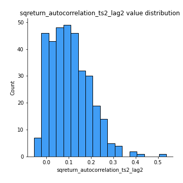
## Feature : sqreturn_autocorrelation_ts2_lag3
- **Feature type** : continous
- **Missing** : 0.0%
- **Unique** : 347
- **Count** :347.0
- **Mean** :0.10415927713215586
- **Std** :0.08623592425578808
- **Min** :-0.06082766359524085
- **25%th Percentile** : 0.03313354511444918
- **50%th Percentile** : 0.10135811137436455
- **75%th Percentile** : 0.15652156342623585
- **Max** :0.38764329892217975

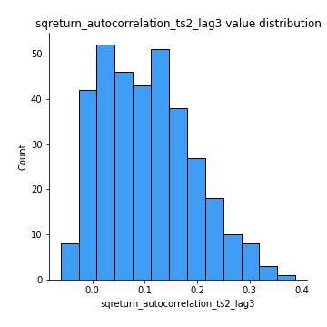
## Feature : sqreturn_correlation_ts1_lag_0
- **Feature type** : continous
- **Missing** : 0.0%
- **Unique** : 347
- **Count** :347.0
- **Mean** :0.3365818877372515
- **Std** :0.10502377232474484
- **Min** :0.005136598099876001
- **25%th Percentile** : 0.29396636435863993
- **50%th Percentile** : 0.3463022360570341
- **75%th Percentile** : 0.39664194602563124
- **Max** :0.7028422087350163

## Feature : sqreturn_correlation_ts1_lag_1
- **Feature type** : continous
- **Missing** : 0.0%
- **Unique** : 347
- **Count** :347.0
- **Mean** :-0.011035776596810074
- **Std** :0.05621623304923316
- **Min** :-0.16985510949917193
- **25%th Percentile** : -0.0488725304550275
- **50%th Percentile** : -0.009086570618374404
- **75%th Percentile** : 0.028006513746053112
- **Max** :0.1868646771574293

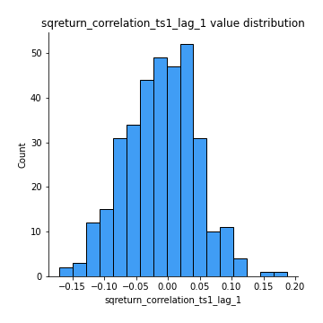
## Feature : sqreturn_correlation_ts1_lag_2
- **Feature type** : continous
- **Missing** : 0.0%
- **Unique** : 347
- **Count** :347.0
- **Mean** :-0.0013008377199693693
- **Std** :0.055271568790234676
- **Min** :-0.21653581047581763
- **25%th Percentile** : -0.03822761941262744
- **50%th Percentile** : -0.0038537794177983488
- **75%th Percentile** : 0.039964913493970106
- **Max** :0.1383722553520675

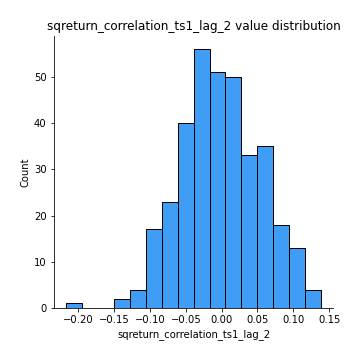
## Feature : sqreturn_correlation_ts1_lag_3
- **Feature type** : continous
- **Missing** : 0.0%
- **Unique** : 347
- **Count** :347.0
- **Mean** :0.00039862681338071924
- **Std** :0.0559190887104403
- **Min** :-0.1556985706696077
- **25%th Percentile** : -0.036797894159024735
- **50%th Percentile** : -0.0031753162242923565
- **75%th Percentile** : 0.039435559567620355
- **Max** :0.1636773216468148

## Feature : sqreturn_correlation_ts2_lag_1
- **Feature type** : continous
- **Missing** : 0.0%
- **Unique** : 347
- **Count** :347.0
- **Mean** :-0.00658580590914515
- **Std** :0.06214326950683639
- **Min** :-0.2081139431093261
- **25%th Percentile** : -0.0452988099751751
- **50%th Percentile** : -0.010502912867097602
- **75%th Percentile** : 0.0302270864522457
- **Max** :0.20814946803944118

## Feature : sqreturn_correlation_ts2_lag_2
- **Feature type** : continous
- **Missing** : 0.0%
- **Unique** : 347
- **Count** :347.0
- **Mean** :-0.001195708681447253
- **Std** :0.05048599509871829
- **Min** :-0.15299951737180204
- **25%th Percentile** : -0.033024235895439444
- **50%th Percentile** : -0.0003449019640725187
- **75%th Percentile** : 0.03143592395703993
- **Max** :0.15388933426238696

## Feature : sqreturn_correlation_ts2_lag_3
- **Feature type** : continous
- **Missing** : 0.0%
- **Unique** : 347
- **Count** :347.0
- **Mean** :-0.002271637564320882
- **Std** :0.051856725956913145
- **Min** :-0.1603001201932561
- **25%th Percentile** : -0.030947185428365193
- **50%th Percentile** : -0.001744564302787636
- **75%th Percentile** : 0.029112876628700827
- **Max** :0.14764617567120178

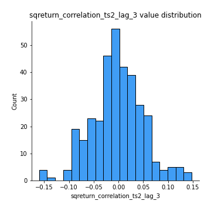
## Feature : price2_granger_cause_price1
- **Feature type** : continous
- **Missing** : 0.0%
- **Unique** : 347
- **Count** :347.0
- **Mean** :0.2928814942148031
- **Std** :0.29464684238792266
- **Min** :6.08807873490217e-08
- **25%th Percentile** : 0.024647589131632452
- **50%th Percentile** : 0.2048974341741947
- **75%th Percentile** : 0.506517567235079
- **Max** :0.9885712803689185

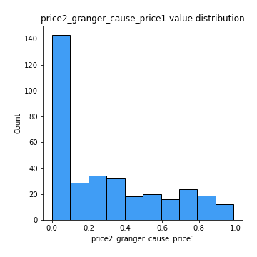
## Feature : price1_granger_cause_price2
- **Feature type** : continous
- **Missing** : 0.0%
- **Unique** : 347
- **Count** :347.0
- **Mean** :0.2937820256158796
- **Std** :0.2898132635925606
- **Min** :4.5491887350909195e-08
- **25%th Percentile** : 0.03676497320490131
- **50%th Percentile** : 0.20508134504225928
- **75%th Percentile** : 0.5037305970523518
- **Max** :0.9951398266867577

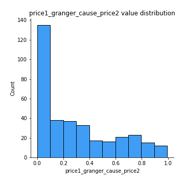

[<< Go back](../README.md)
