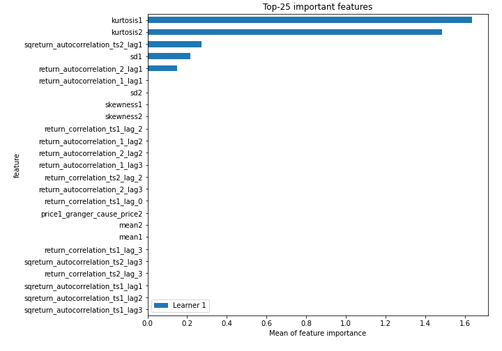

# Summary of 2_DecisionTree

[<< Go back](../README.md)

## Decision Tree
- **n_jobs**: -1
- **criterion**: gini
- **max_depth**: 3
- **explain_level**: 2

## Validation
 - **validation_type**: split
 - **train_ratio**: 0.75
 - **shuffle**: True
 - **stratify**: True

## Optimized metric
accuracy

## Training time

6.8 seconds

## Metric details
|           |    score |   threshold |
|:----------|---------:|------------:|
| logloss   | 0.547397 |  nan        |
| auc       | 0.857937 |  nan        |
| f1        | 0.835165 |    0.626407 |
| accuracy  | 0.827586 |    0.626407 |
| precision | 0.826087 |    0.626407 |
| recall    | 1        |    0        |
| mcc       | 0.654661 |    0.626407 |

## Confusion matrix (at threshold=0.626407)
|                      |   Predicted as real |   Predicted as simulated |
|:---------------------|--------------------:|-------------------------:|
| Labeled as real      |                  34 |                        8 |
| Labeled as simulated |                   7 |                       38 |

## Learning curves

## Decision Tree 

### Tree #1

### Rules

if (kurtosis2 <= 3.873) and (kurtosis1 <= 3.74) and (sd1 > 1.726) then class: simulated (proba: 93.02%) | based on 129 samples

if (kurtosis2 > 3.873) and (price1_granger_cause_price2 > 0.0) and (sqreturn_autocorrelation_ts2_lag1 <= 0.219) then class: real (proba: 100.0%) | based on 67 samples

if (kurtosis2 <= 3.873) and (kurtosis1 <= 3.74) and (sd1 <= 1.726) then class: real (proba: 67.74%) | based on 31 samples

if (kurtosis2 <= 3.873) and (kurtosis1 > 3.74) and (return_autocorrelation_2_lag1 <= 0.061) then class: real (proba: 100.0%) | based on 21 samples

if (kurtosis2 > 3.873) and (price1_granger_cause_price2 > 0.0) and (sqreturn_autocorrelation_ts2_lag1 > 0.219) then class: real (proba: 77.78%) | based on 9 samples

if (kurtosis2 > 3.873) and (price1_granger_cause_price2 <= 0.0) then class: simulated (proba: 100.0%) | based on 2 samples

if (kurtosis2 <= 3.873) and (kurtosis1 > 3.74) and (return_autocorrelation_2_lag1 > 0.061) then class: simulated (proba: 100.0%) | based on 1 samples

## Permutation-based Importance

## Confusion Matrix

## Normalized Confusion Matrix

## ROC Curve

## Kolmogorov-Smirnov Statistic

## Precision-Recall Curve

## Calibration Curve

## Cumulative Gains Curve

## Lift Curve

## SHAP Importance

## SHAP Dependence plots

### Dependence (Fold 1)

## SHAP Decision plots

### Top-10 Worst decisions for class 0 (Fold 1)

### Top-10 Best decisions for class 0 (Fold 1)

### Top-10 Worst decisions for class 1 (Fold 1)

### Top-10 Best decisions for class 1 (Fold 1)

[<< Go back](../README.md)
