# Summary of 3_Linear

[<< Go back](../README.md)

## Logistic Regression (Linear)
- **n_jobs**: -1
- **explain_level**: 2

## Validation
 - **validation_type**: split
 - **train_ratio**: 0.75
 - **shuffle**: True
 - **stratify**: True

## Optimized metric
accuracy

## Training time

5.5 seconds

## Metric details
|           |    score |     threshold |
|:----------|---------:|--------------:|
| logloss   | 0.362591 | nan           |
| auc       | 0.937037 | nan           |
| f1        | 0.903226 |   0.631742    |
| accuracy  | 0.896552 |   0.677122    |
| precision | 0.965517 |   0.773098    |
| recall    | 1        |   2.06595e-05 |
| mcc       | 0.794267 |   0.631742    |

## Confusion matrix (at threshold=0.677122)
|                      |   Predicted as real |   Predicted as simulated |
|:---------------------|--------------------:|-------------------------:|
| Labeled as real      |                  38 |                        4 |
| Labeled as simulated |                   5 |                       40 |

## Learning curves
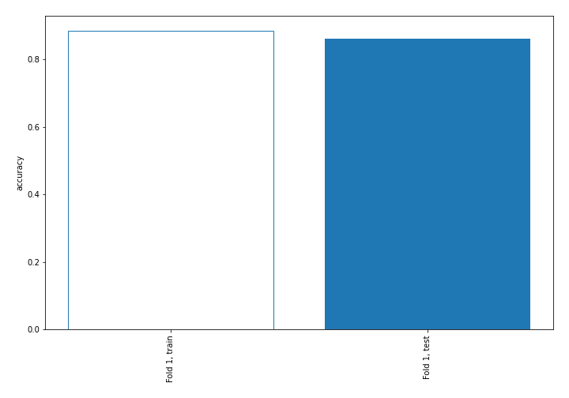

## Coefficients
| feature                           |   Learner_1 |
|:----------------------------------|------------:|
| mean2                             |  1.6886     |
| sqreturn_autocorrelation_ts2_lag3 |  1.54492    |
| mean1                             |  1.51899    |
| sqreturn_autocorrelation_ts1_lag3 |  1.20991    |
| sqreturn_autocorrelation_ts2_lag2 |  0.979519   |
| return_autocorrelation_2_lag1     |  0.881255   |
| sqreturn_autocorrelation_ts1_lag1 |  0.600982   |
| sqreturn_correlation_ts1_lag_1    |  0.534652   |
| return_correlation_ts1_lag_1      |  0.534652   |
| sqreturn_autocorrelation_ts1_lag2 |  0.525598   |
| sqreturn_correlation_ts2_lag_1    |  0.503424   |
| return_correlation_ts2_lag_1      |  0.503424   |
| return_autocorrelation_1_lag3     |  0.480227   |
| sd1                               |  0.467506   |
| sqreturn_autocorrelation_ts2_lag1 |  0.466236   |
| return_autocorrelation_1_lag2     |  0.316029   |
| return_autocorrelation_1_lag1     |  0.213817   |
| sqreturn_correlation_ts2_lag_3    |  0.185059   |
| return_correlation_ts2_lag_3      |  0.185059   |
| return_correlation_ts1_lag_3      |  0.132434   |
| sqreturn_correlation_ts1_lag_3    |  0.132434   |
| return_correlation_ts2_lag_2      |  0.118711   |
| sqreturn_correlation_ts2_lag_2    |  0.118711   |
| return_autocorrelation_2_lag3     |  0.0102173  |
| return_autocorrelation_2_lag2     |  0.00584013 |
| return_correlation_ts1_lag_2      | -0.156648   |
| sqreturn_correlation_ts1_lag_2    | -0.156648   |
| price1_granger_cause_price2       | -0.188897   |
| sd2                               | -0.190224   |
| price2_granger_cause_price1       | -0.331041   |
| skewness2                         | -0.342247   |
| sqreturn_correlation_ts1_lag_0    | -0.379243   |
| return_correlation_ts1_lag_0      | -0.379243   |
| skewness1                         | -1.34446    |
| intercept                         | -1.54817    |
| kurtosis1                         | -2.64341    |
| kurtosis2                         | -2.79398    |

## Permutation-based Importance
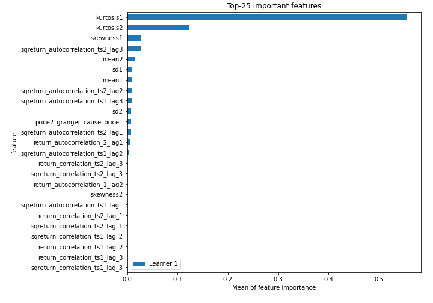
## Confusion Matrix

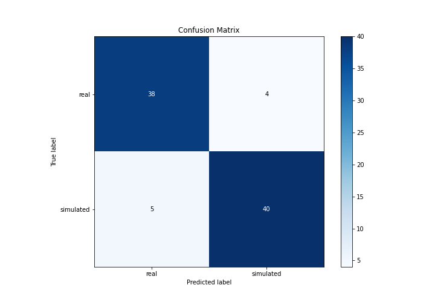

## Normalized Confusion Matrix

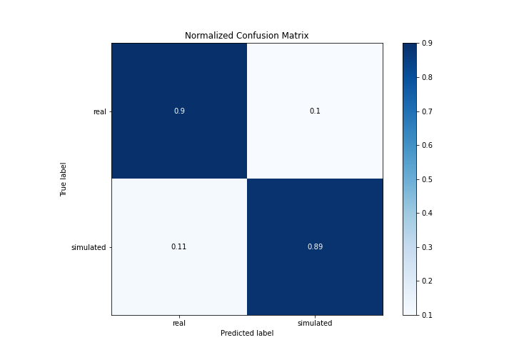

## ROC Curve

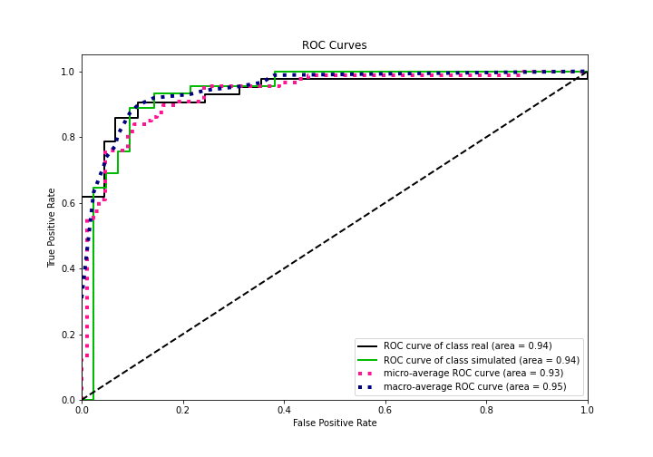

## Kolmogorov-Smirnov Statistic

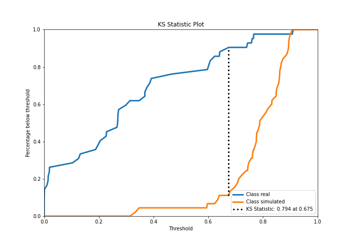

## Precision-Recall Curve

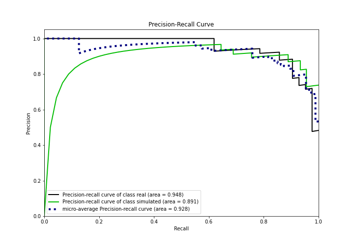

## Calibration Curve

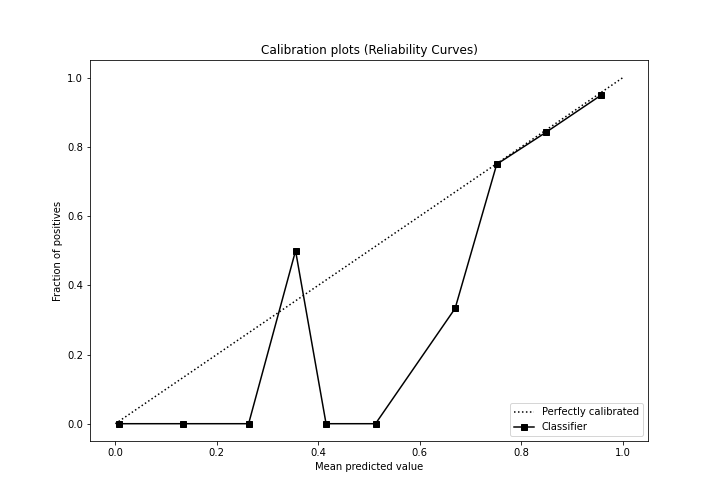

## Cumulative Gains Curve

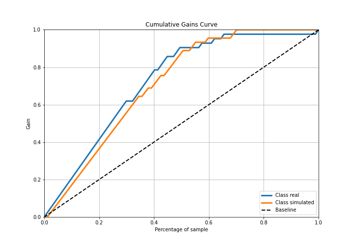

## Lift Curve

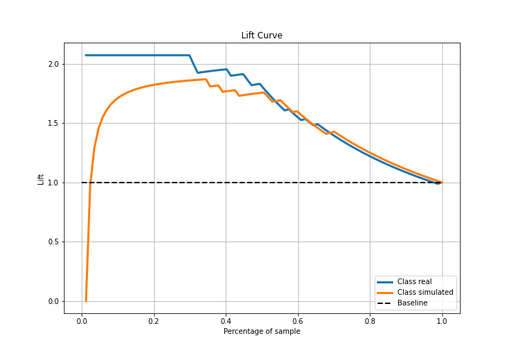

## SHAP Importance
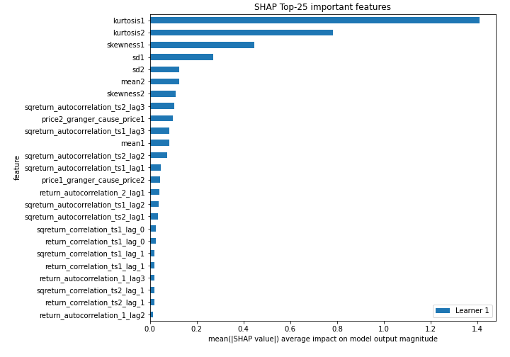

## SHAP Dependence plots

### Dependence (Fold 1)
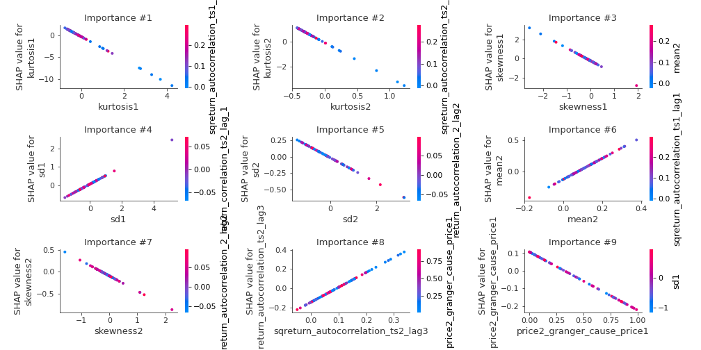

## SHAP Decision plots

### Top-10 Worst decisions for class 0 (Fold 1)
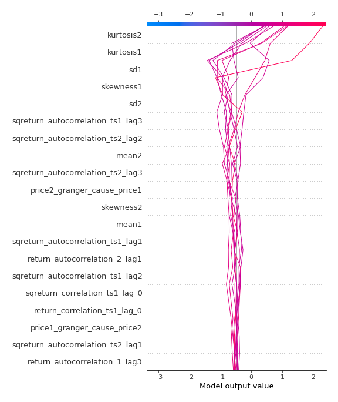
### Top-10 Best decisions for class 0 (Fold 1)
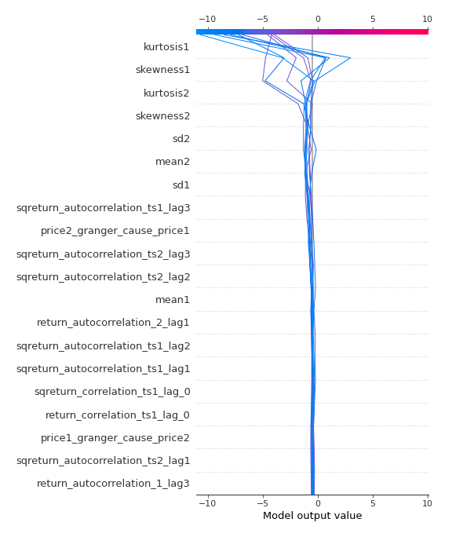
### Top-10 Worst decisions for class 1 (Fold 1)
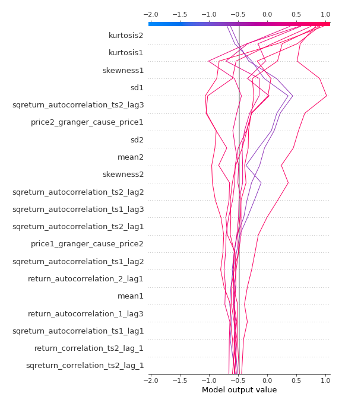
### Top-10 Best decisions for class 1 (Fold 1)
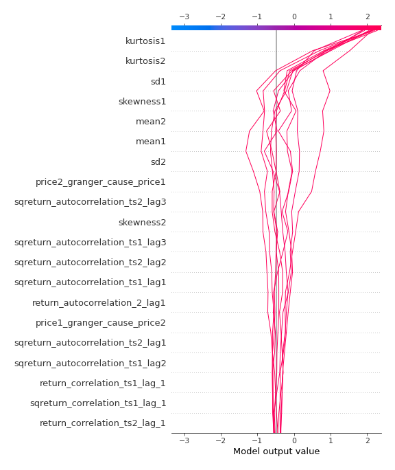

[<< Go back](../README.md)
