# Exploratory Data Analysis

[<< Go back](../README.md)
## Feature : target
- **Feature type** : categorical
- **Missing** : 0.0%
- **Unique** : 2
- **Count** :347
- **Unique** :2
- **Top** :simulated
- **Freq** :180

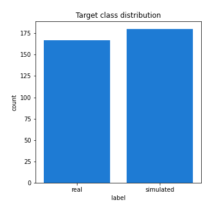
## Feature : mean1
- **Feature type** : continous
- **Missing** : 0.0%
- **Unique** : 347
- **Count** :347.0
- **Mean** :0.08025855666547593
- **Std** :0.08012014558668727
- **Min** :-0.22632637961920957
- **25%th Percentile** : 0.034719541379980165
- **50%th Percentile** : 0.08039277828131189
- **75%th Percentile** : 0.1206876812901545
- **Max** :0.37175100008111034

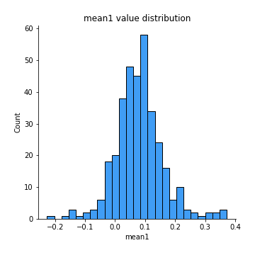
## Feature : mean2
- **Feature type** : continous
- **Missing** : 0.0%
- **Unique** : 347
- **Count** :347.0
- **Mean** :0.0895236039317203
- **Std** :0.08850242619896288
- **Min** :-0.24205418062825398
- **25%th Percentile** : 0.041792437832435025
- **50%th Percentile** : 0.08874396824357875
- **75%th Percentile** : 0.14502679611450273
- **Max** :0.37616608147096464

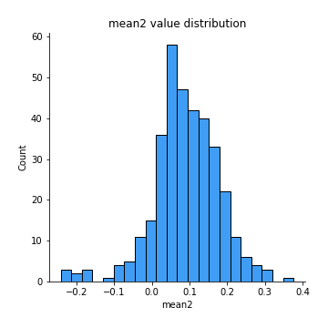
## Feature : sd1
- **Feature type** : continous
- **Missing** : 0.0%
- **Unique** : 347
- **Count** :347.0
- **Mean** :2.0773090980374462
- **Std** :0.8239353628713374
- **Min** :0.7470080772831957
- **25%th Percentile** : 1.5644731498661604
- **50%th Percentile** : 1.995444938278213
- **75%th Percentile** : 2.3851728936710463
- **Max** :9.236766377527575

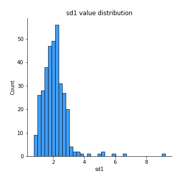
## Feature : sd2
- **Feature type** : continous
- **Missing** : 0.0%
- **Unique** : 347
- **Count** :347.0
- **Mean** :1.9715958279276504
- **Std** :0.7500578427855656
- **Min** :0.8455946193085045
- **25%th Percentile** : 1.4926009281132255
- **50%th Percentile** : 1.8475462462530414
- **75%th Percentile** : 2.2522523319588594
- **Max** :6.737618636746393

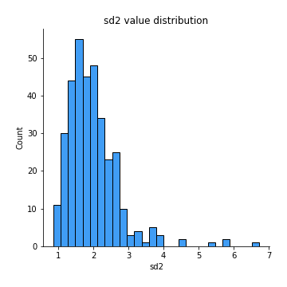
## Feature : skewness1
- **Feature type** : continous
- **Missing** : 0.0%
- **Unique** : 347
- **Count** :347.0
- **Mean** :-0.13914725413532544
- **Std** :0.5297881616287441
- **Min** :-2.5812453059760836
- **25%th Percentile** : -0.321129808828721
- **50%th Percentile** : -0.1199332908890008
- **75%th Percentile** : 0.06076539745928648
- **Max** :2.5845963767725557

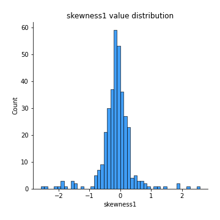
## Feature : skewness2
- **Feature type** : continous
- **Missing** : 0.0%
- **Unique** : 347
- **Count** :347.0
- **Mean** :-0.2322078230007884
- **Std** :0.7947074475703063
- **Min** :-8.801502855292393
- **25%th Percentile** : -0.36892765752787593
- **50%th Percentile** : -0.15881510469213858
- **75%th Percentile** : 0.011475943468270557
- **Max** :2.2606839051517187

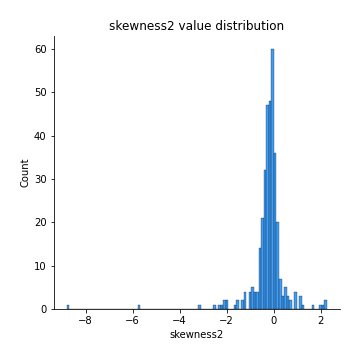
## Feature : kurtosis1
- **Feature type** : continous
- **Missing** : 0.0%
- **Unique** : 347
- **Count** :347.0
- **Mean** :3.480672026964936
- **Std** :4.7654163974085915
- **Min** :-0.13203065635402655
- **25%th Percentile** : 1.106200822042879
- **50%th Percentile** : 1.893406113826145
- **75%th Percentile** : 3.624223199327542
- **Max** :35.56636016047202

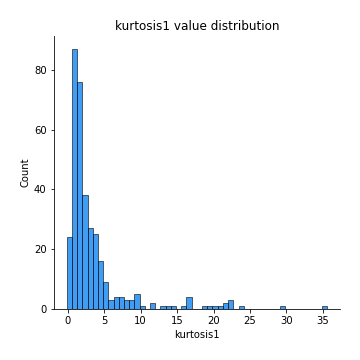
## Feature : kurtosis2
- **Feature type** : continous
- **Missing** : 0.0%
- **Unique** : 347
- **Count** :347.0
- **Mean** :4.62866316986129
- **Std** :9.881795516794448
- **Min** :0.15044486626750198
- **25%th Percentile** : 1.261875732800974
- **50%th Percentile** : 2.1844420734445547
- **75%th Percentile** : 4.109234780795159
- **Max** :143.10871011533666

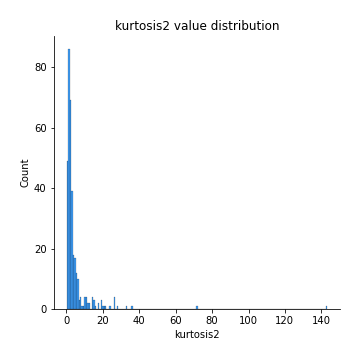
## Feature : return_autocorrelation_1_lag1
- **Feature type** : continous
- **Missing** : 0.0%
- **Unique** : 347
- **Count** :347.0
- **Mean** :-0.012821924761550377
- **Std** :0.05812940127359514
- **Min** :-0.2135576224968752
- **25%th Percentile** : -0.05020156357348379
- **50%th Percentile** : -0.012958181168433036
- **75%th Percentile** : 0.025504338410423627
- **Max** :0.17582622417445837

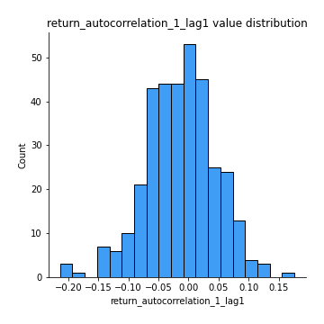
## Feature : return_autocorrelation_1_lag2
- **Feature type** : continous
- **Missing** : 0.0%
- **Unique** : 347
- **Count** :347.0
- **Mean** :-0.0058092923687219095
- **Std** :0.05551391282804293
- **Min** :-0.1560981579078069
- **25%th Percentile** : -0.042066025875638964
- **50%th Percentile** : -0.0047928992330598065
- **75%th Percentile** : 0.02939894740882268
- **Max** :0.1561488228015672

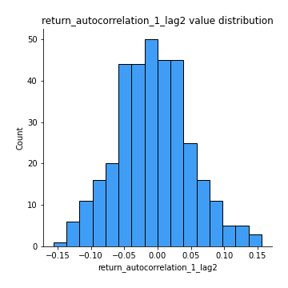
## Feature : return_autocorrelation_1_lag3
- **Feature type** : continous
- **Missing** : 0.0%
- **Unique** : 347
- **Count** :347.0
- **Mean** :-0.007792981847502516
- **Std** :0.05665080673388372
- **Min** :-0.1940836867390813
- **25%th Percentile** : -0.04469838279676546
- **50%th Percentile** : -0.0037399346828342773
- **75%th Percentile** : 0.029572727990451093
- **Max** :0.17805869530681923

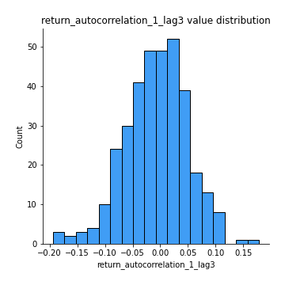
## Feature : return_autocorrelation_2_lag1
- **Feature type** : continous
- **Missing** : 0.0%
- **Unique** : 347
- **Count** :347.0
- **Mean** :-0.00914834446623136
- **Std** :0.06437639245052038
- **Min** :-0.25075531010123286
- **25%th Percentile** : -0.04412084187687889
- **50%th Percentile** : -0.005528990699066865
- **75%th Percentile** : 0.027550646760226873
- **Max** :0.31863413537898483

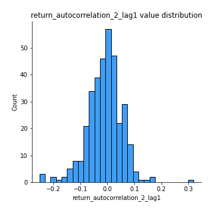
## Feature : return_autocorrelation_2_lag2
- **Feature type** : continous
- **Missing** : 0.0%
- **Unique** : 347
- **Count** :347.0
- **Mean** :-0.006663198464478464
- **Std** :0.06273817313842171
- **Min** :-0.22623830039880768
- **25%th Percentile** : -0.045791334140677736
- **50%th Percentile** : -0.009555497467738329
- **75%th Percentile** : 0.033107417598368494
- **Max** :0.20974504043791217

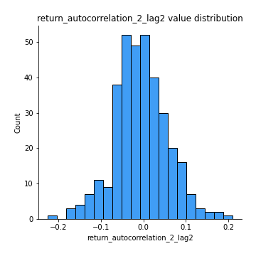
## Feature : return_autocorrelation_2_lag3
- **Feature type** : continous
- **Missing** : 0.0%
- **Unique** : 347
- **Count** :347.0
- **Mean** :-0.00978792911129771
- **Std** :0.05284799917732313
- **Min** :-0.15296577917760576
- **25%th Percentile** : -0.047370698673504644
- **50%th Percentile** : -0.01087933045003371
- **75%th Percentile** : 0.026523786535272875
- **Max** :0.1419999376914021

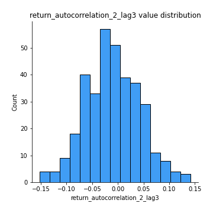
## Feature : return_correlation_ts1_lag_0
- **Feature type** : continous
- **Missing** : 0.0%
- **Unique** : 347
- **Count** :347.0
- **Mean** :0.3366897861078257
- **Std** :0.1085238692823338
- **Min** :0.005136598099876001
- **25%th Percentile** : 0.285141214531363
- **50%th Percentile** : 0.34153289588315416
- **75%th Percentile** : 0.39192625174480983
- **Max** :0.7041861626832071

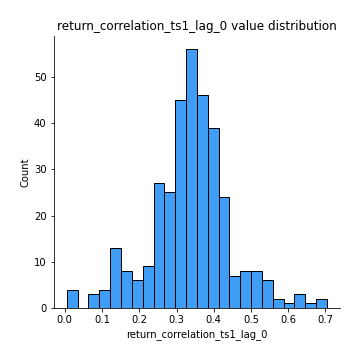
## Feature : return_correlation_ts1_lag_1
- **Feature type** : continous
- **Missing** : 0.0%
- **Unique** : 347
- **Count** :347.0
- **Mean** :-0.01044836900514704
- **Std** :0.05619785193239907
- **Min** :-0.16985510949917193
- **25%th Percentile** : -0.04643635427092734
- **50%th Percentile** : -0.008267165389834285
- **75%th Percentile** : 0.027333760110732363
- **Max** :0.17286826225608923

## Feature : return_correlation_ts1_lag_2
- **Feature type** : continous
- **Missing** : 0.0%
- **Unique** : 347
- **Count** :347.0
- **Mean** :-0.008537828819774792
- **Std** :0.05458449581822529
- **Min** :-0.21653581047581763
- **25%th Percentile** : -0.04139520019248461
- **50%th Percentile** : -0.009910497637742958
- **75%th Percentile** : 0.025505058646483808
- **Max** :0.20438975546472038

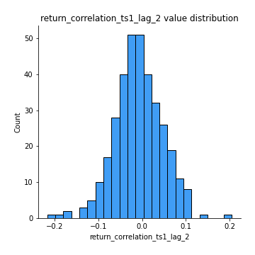
## Feature : return_correlation_ts1_lag_3
- **Feature type** : continous
- **Missing** : 0.0%
- **Unique** : 347
- **Count** :347.0
- **Mean** :-0.007774455129938972
- **Std** :0.05618131139877747
- **Min** :-0.129191765198499
- **25%th Percentile** : -0.048213591264059136
- **50%th Percentile** : -0.011607725632210589
- **75%th Percentile** : 0.029369001612393135
- **Max** :0.1477941905193232

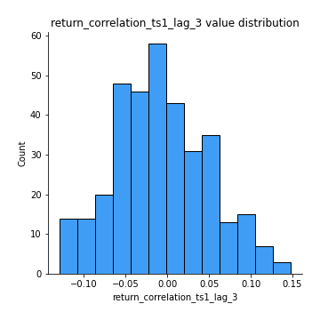
## Feature : return_correlation_ts2_lag_1
- **Feature type** : continous
- **Missing** : 0.0%
- **Unique** : 347
- **Count** :347.0
- **Mean** :-0.004823316838689449
- **Std** :0.05420095571129252
- **Min** :-0.2081139431093261
- **25%th Percentile** : -0.0394823871115958
- **50%th Percentile** : -0.008864432991539762
- **75%th Percentile** : 0.03040135384461909
- **Max** :0.17208763791364762

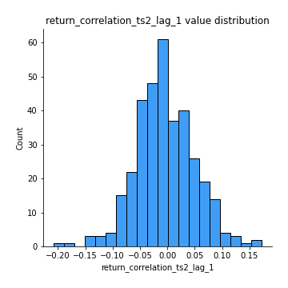
## Feature : return_correlation_ts2_lag_2
- **Feature type** : continous
- **Missing** : 0.0%
- **Unique** : 347
- **Count** :347.0
- **Mean** :0.0016330370849380992
- **Std** :0.054926091412702986
- **Min** :-0.23751835475804678
- **25%th Percentile** : -0.03419100193616144
- **50%th Percentile** : 0.0018815406597969967
- **75%th Percentile** : 0.034610912225981505
- **Max** :0.20772887392904255

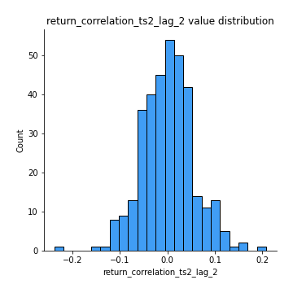
## Feature : return_correlation_ts2_lag_3
- **Feature type** : continous
- **Missing** : 0.0%
- **Unique** : 347
- **Count** :347.0
- **Mean** :-0.006111713566457804
- **Std** :0.05588273914204938
- **Min** :-0.17564076057312866
- **25%th Percentile** : -0.038235397326071965
- **50%th Percentile** : -0.006062347554331474
- **75%th Percentile** : 0.03279893230493368
- **Max** :0.13128380114518473

## Feature : sqreturn_autocorrelation_ts1_lag1
- **Feature type** : continous
- **Missing** : 0.0%
- **Unique** : 347
- **Count** :347.0
- **Mean** :0.11905567330930274
- **Std** :0.08972377564220184
- **Min** :-0.06532118872798363
- **25%th Percentile** : 0.05957447692729324
- **50%th Percentile** : 0.10638739093736967
- **75%th Percentile** : 0.16950023044314422
- **Max** :0.49414293176447355

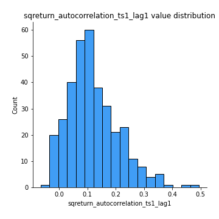
## Feature : sqreturn_autocorrelation_ts1_lag2
- **Feature type** : continous
- **Missing** : 0.0%
- **Unique** : 347
- **Count** :347.0
- **Mean** :0.11396193141550451
- **Std** :0.08921495637955316
- **Min** :-0.05419304650062953
- **25%th Percentile** : 0.04882577467616921
- **50%th Percentile** : 0.1059510996031153
- **75%th Percentile** : 0.1657458184745887
- **Max** :0.4522162366773919

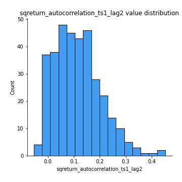
## Feature : sqreturn_autocorrelation_ts1_lag3
- **Feature type** : continous
- **Missing** : 0.0%
- **Unique** : 347
- **Count** :347.0
- **Mean** :0.10398102184074115
- **Std** :0.08539006464179141
- **Min** :-0.06486026764840777
- **25%th Percentile** : 0.03834203308984094
- **50%th Percentile** : 0.0967965864553469
- **75%th Percentile** : 0.15877279194098476
- **Max** :0.41030914918857014

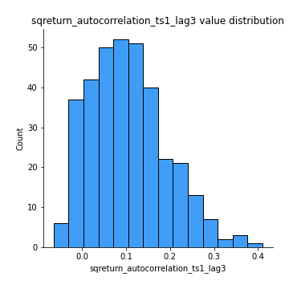
## Feature : sqreturn_autocorrelation_ts2_lag1
- **Feature type** : continous
- **Missing** : 0.0%
- **Unique** : 347
- **Count** :347.0
- **Mean** :0.12246888956689254
- **Std** :0.0917098781007588
- **Min** :-0.08520586663750691
- **25%th Percentile** : 0.0510552596685038
- **50%th Percentile** : 0.11139120122248747
- **75%th Percentile** : 0.17938724128785835
- **Max** :0.510085647437958

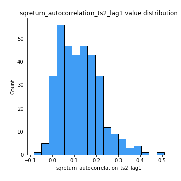
## Feature : sqreturn_autocorrelation_ts2_lag2
- **Feature type** : continous
- **Missing** : 0.0%
- **Unique** : 347
- **Count** :347.0
- **Mean** :0.11544545016759714
- **Std** :0.09654546906047191
- **Min** :-0.051523884196217395
- **25%th Percentile** : 0.039483770721967126
- **50%th Percentile** : 0.10654679281660694
- **75%th Percentile** : 0.17319134833362654
- **Max** :0.5373432415582473

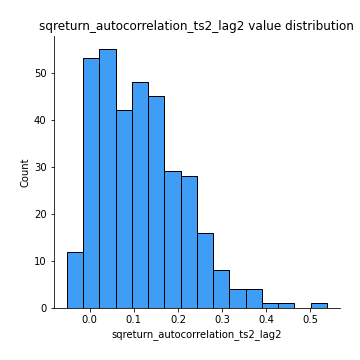
## Feature : sqreturn_autocorrelation_ts2_lag3
- **Feature type** : continous
- **Missing** : 0.0%
- **Unique** : 347
- **Count** :347.0
- **Mean** :0.1024150002750184
- **Std** :0.09090467081873259
- **Min** :-0.06065894750062144
- **25%th Percentile** : 0.02582692786991788
- **50%th Percentile** : 0.08920998342527857
- **75%th Percentile** : 0.15473085026314787
- **Max** :0.38438197094309773

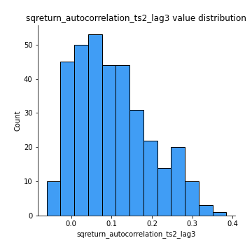
## Feature : sqreturn_correlation_ts1_lag_0
- **Feature type** : continous
- **Missing** : 0.0%
- **Unique** : 347
- **Count** :347.0
- **Mean** :0.3366897861078257
- **Std** :0.1085238692823338
- **Min** :0.005136598099876001
- **25%th Percentile** : 0.285141214531363
- **50%th Percentile** : 0.34153289588315416
- **75%th Percentile** : 0.39192625174480983
- **Max** :0.7041861626832071

## Feature : sqreturn_correlation_ts1_lag_1
- **Feature type** : continous
- **Missing** : 0.0%
- **Unique** : 347
- **Count** :347.0
- **Mean** :-0.01044836900514704
- **Std** :0.05619785193239907
- **Min** :-0.16985510949917193
- **25%th Percentile** : -0.04643635427092734
- **50%th Percentile** : -0.008267165389834285
- **75%th Percentile** : 0.027333760110732363
- **Max** :0.17286826225608923

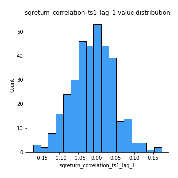
## Feature : sqreturn_correlation_ts1_lag_2
- **Feature type** : continous
- **Missing** : 0.0%
- **Unique** : 347
- **Count** :347.0
- **Mean** :-0.008537828819774792
- **Std** :0.05458449581822529
- **Min** :-0.21653581047581763
- **25%th Percentile** : -0.04139520019248461
- **50%th Percentile** : -0.009910497637742958
- **75%th Percentile** : 0.025505058646483808
- **Max** :0.20438975546472038

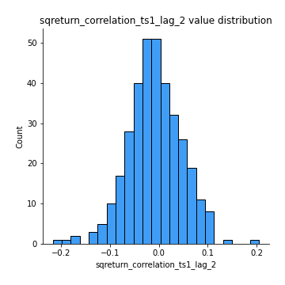
## Feature : sqreturn_correlation_ts1_lag_3
- **Feature type** : continous
- **Missing** : 0.0%
- **Unique** : 347
- **Count** :347.0
- **Mean** :-0.007774455129938972
- **Std** :0.05618131139877747
- **Min** :-0.129191765198499
- **25%th Percentile** : -0.048213591264059136
- **50%th Percentile** : -0.011607725632210589
- **75%th Percentile** : 0.029369001612393135
- **Max** :0.1477941905193232

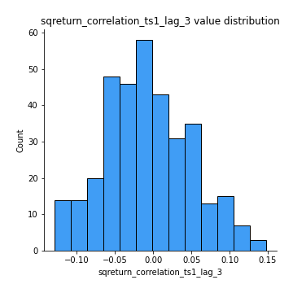
## Feature : sqreturn_correlation_ts2_lag_1
- **Feature type** : continous
- **Missing** : 0.0%
- **Unique** : 347
- **Count** :347.0
- **Mean** :-0.004823316838689449
- **Std** :0.05420095571129252
- **Min** :-0.2081139431093261
- **25%th Percentile** : -0.0394823871115958
- **50%th Percentile** : -0.008864432991539762
- **75%th Percentile** : 0.03040135384461909
- **Max** :0.17208763791364762

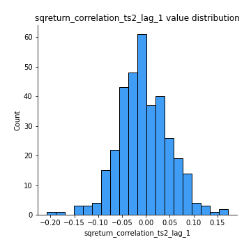
## Feature : sqreturn_correlation_ts2_lag_2
- **Feature type** : continous
- **Missing** : 0.0%
- **Unique** : 347
- **Count** :347.0
- **Mean** :0.0016330370849380992
- **Std** :0.054926091412702986
- **Min** :-0.23751835475804678
- **25%th Percentile** : -0.03419100193616144
- **50%th Percentile** : 0.0018815406597969967
- **75%th Percentile** : 0.034610912225981505
- **Max** :0.20772887392904255

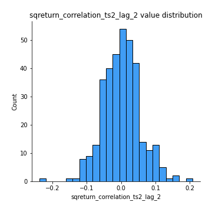
## Feature : sqreturn_correlation_ts2_lag_3
- **Feature type** : continous
- **Missing** : 0.0%
- **Unique** : 347
- **Count** :347.0
- **Mean** :-0.006111713566457804
- **Std** :0.05588273914204938
- **Min** :-0.17564076057312866
- **25%th Percentile** : -0.038235397326071965
- **50%th Percentile** : -0.006062347554331474
- **75%th Percentile** : 0.03279893230493368
- **Max** :0.13128380114518473

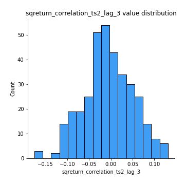
## Feature : price2_granger_cause_price1
- **Feature type** : continous
- **Missing** : 0.0%
- **Unique** : 347
- **Count** :347.0
- **Mean** :0.3175341674955749
- **Std** :0.30458379667895963
- **Min** :9.924437348242019e-07
- **25%th Percentile** : 0.04688041496586315
- **50%th Percentile** : 0.20534117253465375
- **75%th Percentile** : 0.550263593470958
- **Max** :0.9941824052093047

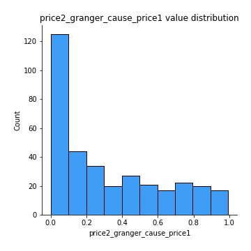
## Feature : price1_granger_cause_price2
- **Feature type** : continous
- **Missing** : 0.0%
- **Unique** : 347
- **Count** :347.0
- **Mean** :0.3041205337138652
- **Std** :0.2869897321748018
- **Min** :3.1739544208257145e-10
- **25%th Percentile** : 0.04396828418310028
- **50%th Percentile** : 0.22159327549817773
- **75%th Percentile** : 0.5163913703084775
- **Max** :0.9986344814689947

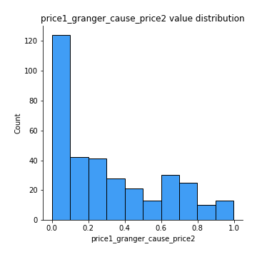

[<< Go back](../README.md)
