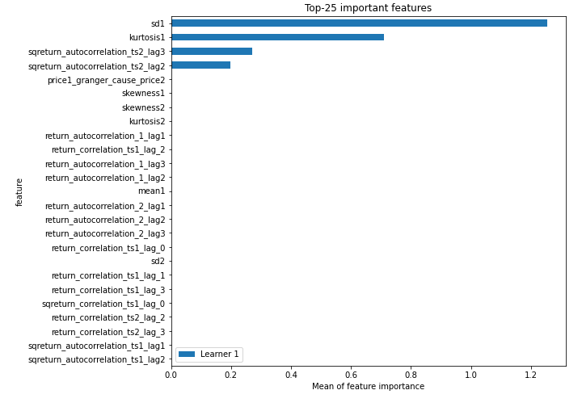
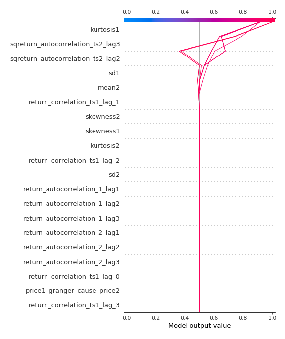

# Summary of 2_DecisionTree

[<< Go back](../README.md)

## Decision Tree
- **n_jobs**: -1
- **criterion**: gini
- **max_depth**: 3
- **explain_level**: 2

## Validation
 - **validation_type**: split
 - **train_ratio**: 0.75
 - **shuffle**: True
 - **stratify**: True

## Optimized metric
accuracy

## Training time

7.6 seconds

## Metric details
|           |    score |   threshold |
|:----------|---------:|------------:|
| logloss   | 0.701244 |  nan        |
| auc       | 0.861786 |  nan        |
| f1        | 0.853933 |    0.464233 |
| accuracy  | 0.850575 |    0.464233 |
| precision | 0.844444 |    0.464233 |
| recall    | 1        |    0        |
| mcc       | 0.701216 |    0.464233 |

## Confusion matrix (at threshold=0.464233)
|                      |   Predicted as real |   Predicted as simulated |
|:---------------------|--------------------:|-------------------------:|
| Labeled as real      |                  36 |                        7 |
| Labeled as simulated |                   6 |                       38 |

## Learning curves

## Decision Tree 

### Tree #1

### Rules

if (kurtosis1 <= 2.935) and (sqreturn_autocorrelation_ts2_lag2 > 0.06) and (sd1 > 1.205) then class: simulated (proba: 91.6%) | based on 119 samples

if (kurtosis1 > 2.935) and (sqreturn_autocorrelation_ts2_lag3 <= 0.221) and (return_correlation_ts1_lag_1 <= 0.134) then class: real (proba: 98.75%) | based on 80 samples

if (kurtosis1 <= 2.935) and (sqreturn_autocorrelation_ts2_lag2 <= 0.06) and (sqreturn_autocorrelation_ts2_lag3 <= 0.131) then class: real (proba: 83.78%) | based on 37 samples

if (kurtosis1 > 2.935) and (sqreturn_autocorrelation_ts2_lag3 > 0.221) and (mean2 > 0.074) then class: simulated (proba: 100.0%) | based on 7 samples

if (kurtosis1 <= 2.935) and (sqreturn_autocorrelation_ts2_lag2 > 0.06) and (sd1 <= 1.205) then class: real (proba: 100.0%) | based on 6 samples

if (kurtosis1 <= 2.935) and (sqreturn_autocorrelation_ts2_lag2 <= 0.06) and (sqreturn_autocorrelation_ts2_lag3 > 0.131) then class: simulated (proba: 100.0%) | based on 6 samples

if (kurtosis1 > 2.935) and (sqreturn_autocorrelation_ts2_lag3 > 0.221) and (mean2 <= 0.074) then class: real (proba: 100.0%) | based on 4 samples

if (kurtosis1 > 2.935) and (sqreturn_autocorrelation_ts2_lag3 <= 0.221) and (return_correlation_ts1_lag_1 > 0.134) then class: simulated (proba: 100.0%) | based on 1 samples

## Permutation-based Importance

## Confusion Matrix

## Normalized Confusion Matrix

## ROC Curve

## Kolmogorov-Smirnov Statistic

## Precision-Recall Curve

## Calibration Curve

## Cumulative Gains Curve

## Lift Curve

## SHAP Importance

## SHAP Dependence plots

### Dependence (Fold 1)

## SHAP Decision plots

### Top-10 Worst decisions for class 0 (Fold 1)

### Top-10 Best decisions for class 0 (Fold 1)

### Top-10 Worst decisions for class 1 (Fold 1)

### Top-10 Best decisions for class 1 (Fold 1)

[<< Go back](../README.md)
