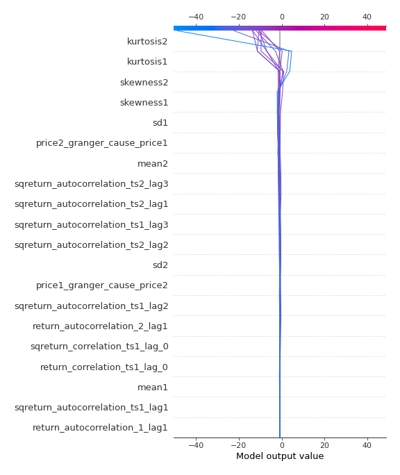

# Summary of 3_Linear

[<< Go back](../README.md)

## Logistic Regression (Linear)
- **n_jobs**: -1
- **explain_level**: 2

## Validation
 - **validation_type**: split
 - **train_ratio**: 0.75
 - **shuffle**: True
 - **stratify**: True

## Optimized metric
accuracy

## Training time

4.3 seconds

## Metric details
|           |    score |     threshold |
|:----------|---------:|--------------:|
| logloss   | 0.323937 | nan           |
| auc       | 0.940803 | nan           |
| f1        | 0.895833 |   0.512144    |
| accuracy  | 0.885057 |   0.512144    |
| precision | 1        |   0.870326    |
| recall    | 1        |   6.53233e-22 |
| mcc       | 0.783014 |   0.512144    |

## Confusion matrix (at threshold=0.512144)
|                      |   Predicted as real |   Predicted as simulated |
|:---------------------|--------------------:|-------------------------:|
| Labeled as real      |                  34 |                        9 |
| Labeled as simulated |                   1 |                       43 |

## Learning curves

## Coefficients
| feature                           |   Learner_1 |
|:----------------------------------|------------:|
| sqreturn_autocorrelation_ts2_lag3 |   1.73639   |
| mean2                             |   1.67131   |
| mean1                             |   1.44731   |
| sqreturn_autocorrelation_ts1_lag3 |   1.3356    |
| sqreturn_autocorrelation_ts2_lag1 |   1.16682   |
| sqreturn_autocorrelation_ts2_lag2 |   1.08637   |
| return_autocorrelation_2_lag1     |   0.776479  |
| sqreturn_autocorrelation_ts1_lag2 |   0.648685  |
| return_correlation_ts2_lag_3      |   0.479319  |
| sqreturn_correlation_ts2_lag_3    |   0.479319  |
| return_autocorrelation_1_lag1     |   0.41558   |
| sqreturn_correlation_ts2_lag_1    |   0.410736  |
| return_correlation_ts2_lag_1      |   0.410736  |
| sd1                               |   0.392449  |
| sqreturn_correlation_ts1_lag_1    |   0.391255  |
| return_correlation_ts1_lag_1      |   0.391255  |
| sqreturn_autocorrelation_ts1_lag1 |   0.285178  |
| return_correlation_ts1_lag_3      |   0.218388  |
| sqreturn_correlation_ts1_lag_3    |   0.218388  |
| return_autocorrelation_1_lag3     |   0.215791  |
| return_autocorrelation_2_lag3     |   0.167831  |
| return_autocorrelation_2_lag2     |   0.0689518 |
| return_correlation_ts2_lag_2      |   0.0213289 |
| sqreturn_correlation_ts2_lag_2    |   0.0213289 |
| return_autocorrelation_1_lag2     |  -0.09036   |
| sd2                               |  -0.199983  |
| sqreturn_correlation_ts1_lag_0    |  -0.384199  |
| return_correlation_ts1_lag_0      |  -0.384199  |
| return_correlation_ts1_lag_2      |  -0.394188  |
| sqreturn_correlation_ts1_lag_2    |  -0.394188  |
| price1_granger_cause_price2       |  -0.508464  |
| skewness1                         |  -0.546918  |
| skewness2                         |  -0.682826  |
| price2_granger_cause_price1       |  -1.16224   |
| intercept                         |  -1.66166   |
| kurtosis2                         |  -2.38535   |
| kurtosis1                         |  -3.22564   |

## Permutation-based Importance

## Confusion Matrix

## Normalized Confusion Matrix

## ROC Curve

## Kolmogorov-Smirnov Statistic

## Precision-Recall Curve

## Calibration Curve

## Cumulative Gains Curve

## Lift Curve

## SHAP Importance

## SHAP Dependence plots

### Dependence (Fold 1)

## SHAP Decision plots

### Top-10 Worst decisions for class 0 (Fold 1)

### Top-10 Best decisions for class 0 (Fold 1)

### Top-10 Worst decisions for class 1 (Fold 1)

### Top-10 Best decisions for class 1 (Fold 1)

[<< Go back](../README.md)
