# Exploratory Data Analysis

[<< Go back](../README.md)
## Feature : target
- **Feature type** : categorical
- **Missing** : 0.0%
- **Unique** : 2
- **Count** :347
- **Unique** :2
- **Top** :simulated
- **Freq** :174

## Feature : mean1
- **Feature type** : continous
- **Missing** : 0.0%
- **Unique** : 347
- **Count** :347.0
- **Mean** :0.07651200545609295
- **Std** :0.07922858418963588
- **Min** :-0.17686457077756634
- **25%th Percentile** : 0.026040854466025262
- **50%th Percentile** : 0.0777365266701866
- **75%th Percentile** : 0.12111922945205318
- **Max** :0.3612366374600757

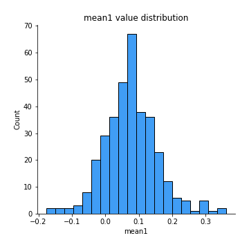
## Feature : mean2
- **Feature type** : continous
- **Missing** : 0.0%
- **Unique** : 347
- **Count** :347.0
- **Mean** :0.09668477182595513
- **Std** :0.09568280882156771
- **Min** :-0.24205418062825398
- **25%th Percentile** : 0.045752209662838494
- **50%th Percentile** : 0.09169762649790254
- **75%th Percentile** : 0.14799023159877361
- **Max** :0.4754779562799241

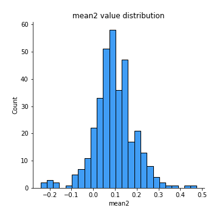
## Feature : sd1
- **Feature type** : continous
- **Missing** : 0.0%
- **Unique** : 347
- **Count** :347.0
- **Mean** :2.065422126691528
- **Std** :0.7268567143573412
- **Min** :0.7470080772831957
- **25%th Percentile** : 1.574852762638296
- **50%th Percentile** : 1.9887151217594652
- **75%th Percentile** : 2.509198217919536
- **Max** :6.495661311240861

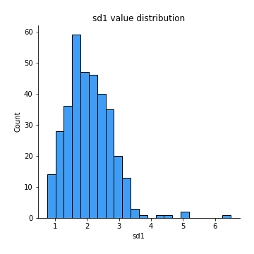
## Feature : sd2
- **Feature type** : continous
- **Missing** : 0.0%
- **Unique** : 347
- **Count** :347.0
- **Mean** :1.9805509131553858
- **Std** :0.7660583256451601
- **Min** :0.8455946193085045
- **25%th Percentile** : 1.436919370550334
- **50%th Percentile** : 1.8342183135803274
- **75%th Percentile** : 2.336137562277423
- **Max** :5.762808157208253

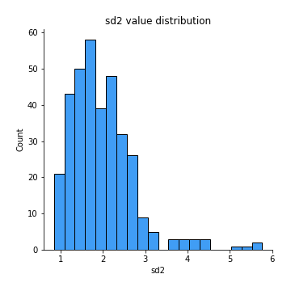
## Feature : skewness1
- **Feature type** : continous
- **Missing** : 0.0%
- **Unique** : 347
- **Count** :347.0
- **Mean** :-0.17877593437039796
- **Std** :0.597792503866274
- **Min** :-3.453087436558107
- **25%th Percentile** : -0.31421422585577735
- **50%th Percentile** : -0.14261543011626351
- **75%th Percentile** : 0.03494027082312241
- **Max** :2.5845963767725557

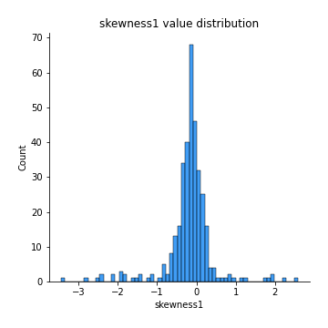
## Feature : skewness2
- **Feature type** : continous
- **Missing** : 0.0%
- **Unique** : 347
- **Count** :347.0
- **Mean** :-0.2624565777993591
- **Std** :0.830962232639086
- **Min** :-8.801502855292393
- **25%th Percentile** : -0.3964817226785291
- **50%th Percentile** : -0.17906366780419908
- **75%th Percentile** : 0.0008834771224761964
- **Max** :2.2606839051517187

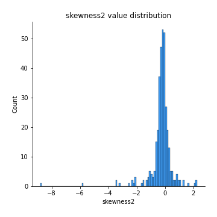
## Feature : kurtosis1
- **Feature type** : continous
- **Missing** : 0.0%
- **Unique** : 347
- **Count** :347.0
- **Mean** :3.865055644035159
- **Std** :5.613321513185078
- **Min** :-0.021730077292434036
- **25%th Percentile** : 1.0626900571943527
- **50%th Percentile** : 1.9062221626957396
- **75%th Percentile** : 4.003958991518974
- **Max** :46.07507808162177

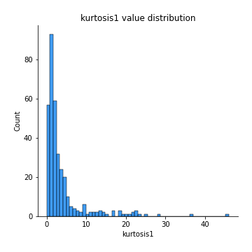
## Feature : kurtosis2
- **Feature type** : continous
- **Missing** : 0.0%
- **Unique** : 347
- **Count** :347.0
- **Mean** :4.811197345721611
- **Std** :10.334547200397383
- **Min** :0.09363612778630337
- **25%th Percentile** : 1.2923984461032179
- **50%th Percentile** : 2.2021247822422274
- **75%th Percentile** : 4.393039424201936
- **Max** :143.10871011533666

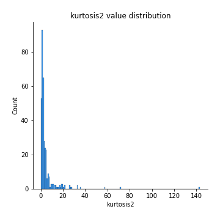
## Feature : return_autocorrelation_1_lag1
- **Feature type** : continous
- **Missing** : 0.0%
- **Unique** : 347
- **Count** :347.0
- **Mean** :-0.007867377939867172
- **Std** :0.06142524275050485
- **Min** :-0.20673896439036124
- **25%th Percentile** : -0.04088044207532762
- **50%th Percentile** : -0.0025700027948254035
- **75%th Percentile** : 0.029480337735019034
- **Max** :0.14291057685850764

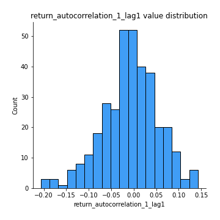
## Feature : return_autocorrelation_1_lag2
- **Feature type** : continous
- **Missing** : 0.0%
- **Unique** : 347
- **Count** :347.0
- **Mean** :-0.009998577876803543
- **Std** :0.05370489930647985
- **Min** :-0.16606791859398398
- **25%th Percentile** : -0.04673288334071872
- **50%th Percentile** : -0.012053956613798326
- **75%th Percentile** : 0.021295931157991176
- **Max** :0.20817439013039335

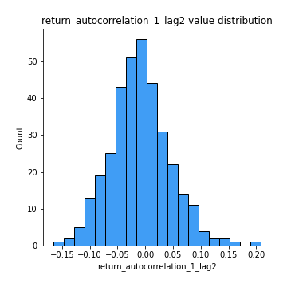
## Feature : return_autocorrelation_1_lag3
- **Feature type** : continous
- **Missing** : 0.0%
- **Unique** : 347
- **Count** :347.0
- **Mean** :-0.008432729251326378
- **Std** :0.053936150596756424
- **Min** :-0.15806635192103805
- **25%th Percentile** : -0.04326028775819998
- **50%th Percentile** : -0.010090069335138268
- **75%th Percentile** : 0.02681313751405606
- **Max** :0.17805869530681923

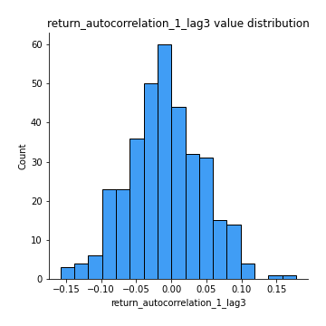
## Feature : return_autocorrelation_2_lag1
- **Feature type** : continous
- **Missing** : 0.0%
- **Unique** : 347
- **Count** :347.0
- **Mean** :-0.012935196833531106
- **Std** :0.06587678494124705
- **Min** :-0.25075531010123286
- **25%th Percentile** : -0.04935489904800543
- **50%th Percentile** : -0.01110607129012973
- **75%th Percentile** : 0.028347146138598282
- **Max** :0.31863413537898483

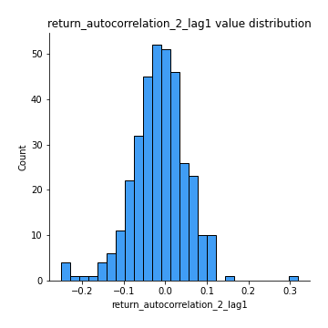
## Feature : return_autocorrelation_2_lag2
- **Feature type** : continous
- **Missing** : 0.0%
- **Unique** : 347
- **Count** :347.0
- **Mean** :-0.0058904606196421615
- **Std** :0.05562716955557587
- **Min** :-0.16792569305543492
- **25%th Percentile** : -0.04142676149465491
- **50%th Percentile** : -0.00946541661341321
- **75%th Percentile** : 0.028051729257455332
- **Max** :0.20974504043791217

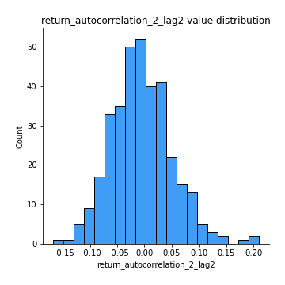
## Feature : return_autocorrelation_2_lag3
- **Feature type** : continous
- **Missing** : 0.0%
- **Unique** : 347
- **Count** :347.0
- **Mean** :-0.00818170712856919
- **Std** :0.056982687229201766
- **Min** :-0.21193701686104915
- **25%th Percentile** : -0.04732746450314252
- **50%th Percentile** : -0.006661082556650845
- **75%th Percentile** : 0.02978001039557016
- **Max** :0.15509861294174013

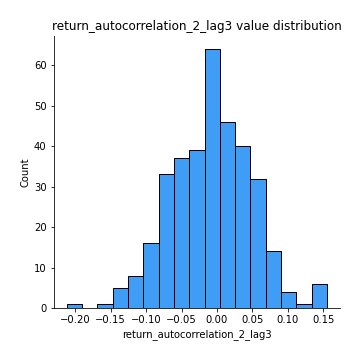
## Feature : return_correlation_ts1_lag_0
- **Feature type** : continous
- **Missing** : 0.0%
- **Unique** : 347
- **Count** :347.0
- **Mean** :0.3301814691838667
- **Std** :0.10714354820225357
- **Min** :-0.027089510445801036
- **25%th Percentile** : 0.2757550489012832
- **50%th Percentile** : 0.3365070750254664
- **75%th Percentile** : 0.38309782447255425
- **Max** :0.6812020480945222

## Feature : return_correlation_ts1_lag_1
- **Feature type** : continous
- **Missing** : 0.0%
- **Unique** : 347
- **Count** :347.0
- **Mean** :-0.006869163813491944
- **Std** :0.05683788923132778
- **Min** :-0.15776193292681923
- **25%th Percentile** : -0.04849910121089246
- **50%th Percentile** : -0.003239296097075467
- **75%th Percentile** : 0.03463744107742885
- **Max** :0.19315114277462667

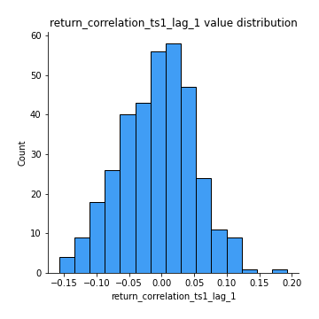
## Feature : return_correlation_ts1_lag_2
- **Feature type** : continous
- **Missing** : 0.0%
- **Unique** : 347
- **Count** :347.0
- **Mean** :-0.0014515750686458486
- **Std** :0.051629323206184505
- **Min** :-0.15139131319654112
- **25%th Percentile** : -0.03375358810868734
- **50%th Percentile** : -0.005314647900952841
- **75%th Percentile** : 0.0351704467703573
- **Max** :0.149315571259654

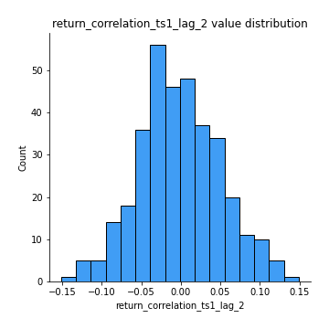
## Feature : return_correlation_ts1_lag_3
- **Feature type** : continous
- **Missing** : 0.0%
- **Unique** : 347
- **Count** :347.0
- **Mean** :-0.004244272385858551
- **Std** :0.05553944550217397
- **Min** :-0.1357021249408934
- **25%th Percentile** : -0.04076305950541652
- **50%th Percentile** : -0.0061346886228702295
- **75%th Percentile** : 0.030409474311713605
- **Max** :0.1636773216468148

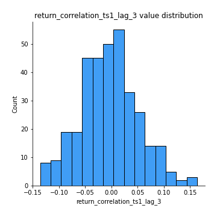
## Feature : return_correlation_ts2_lag_1
- **Feature type** : continous
- **Missing** : 0.0%
- **Unique** : 347
- **Count** :347.0
- **Mean** :-0.00518508409562022
- **Std** :0.05812155729187374
- **Min** :-0.2081139431093261
- **25%th Percentile** : -0.0396360543930816
- **50%th Percentile** : -0.008469813697103017
- **75%th Percentile** : 0.03520685118363287
- **Max** :0.15649977372588117

## Feature : return_correlation_ts2_lag_2
- **Feature type** : continous
- **Missing** : 0.0%
- **Unique** : 347
- **Count** :347.0
- **Mean** :-0.005428759162654276
- **Std** :0.05405318560599455
- **Min** :-0.17683292666294811
- **25%th Percentile** : -0.04336467276768932
- **50%th Percentile** : -0.004981959270171729
- **75%th Percentile** : 0.027154947259988113
- **Max** :0.20772887392904255

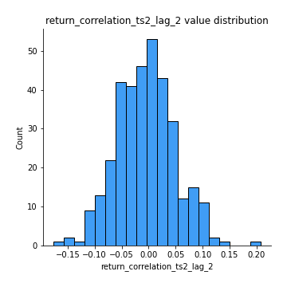
## Feature : return_correlation_ts2_lag_3
- **Feature type** : continous
- **Missing** : 0.0%
- **Unique** : 347
- **Count** :347.0
- **Mean** :-0.0033632660496953496
- **Std** :0.05352192607152982
- **Min** :-0.17564076057312866
- **25%th Percentile** : -0.034228024251920966
- **50%th Percentile** : -0.005549569530732531
- **75%th Percentile** : 0.03571232274081065
- **Max** :0.15174775359844558

## Feature : sqreturn_autocorrelation_ts1_lag1
- **Feature type** : continous
- **Missing** : 0.0%
- **Unique** : 347
- **Count** :347.0
- **Mean** :0.1175416623272845
- **Std** :0.08853127796969615
- **Min** :-0.052978649713557625
- **25%th Percentile** : 0.04915499669151987
- **50%th Percentile** : 0.10559671313439974
- **75%th Percentile** : 0.16169820705206667
- **Max** :0.49414293176447355

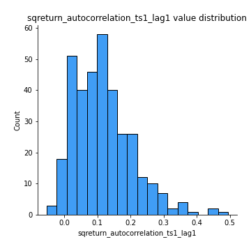
## Feature : sqreturn_autocorrelation_ts1_lag2
- **Feature type** : continous
- **Missing** : 0.0%
- **Unique** : 347
- **Count** :347.0
- **Mean** :0.1072586148717447
- **Std** :0.09172413646506988
- **Min** :-0.055215670801522655
- **25%th Percentile** : 0.03721709104751733
- **50%th Percentile** : 0.08829694236854801
- **75%th Percentile** : 0.15700229859463094
- **Max** :0.4522162366773919

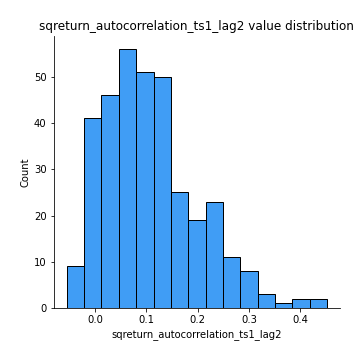
## Feature : sqreturn_autocorrelation_ts1_lag3
- **Feature type** : continous
- **Missing** : 0.0%
- **Unique** : 347
- **Count** :347.0
- **Mean** :0.10126749332942589
- **Std** :0.0876826236602905
- **Min** :-0.05313973583773816
- **25%th Percentile** : 0.03490357756206064
- **50%th Percentile** : 0.09270117278088838
- **75%th Percentile** : 0.1532170339270913
- **Max** :0.44755937369538146

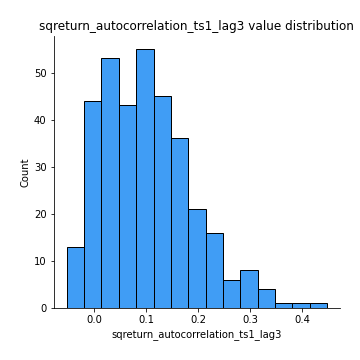
## Feature : sqreturn_autocorrelation_ts2_lag1
- **Feature type** : continous
- **Missing** : 0.0%
- **Unique** : 347
- **Count** :347.0
- **Mean** :0.11625975731143214
- **Std** :0.08731373445932733
- **Min** :-0.04997282481431907
- **25%th Percentile** : 0.047598089141142455
- **50%th Percentile** : 0.10763160297001295
- **75%th Percentile** : 0.16589014737052946
- **Max** :0.510085647437958

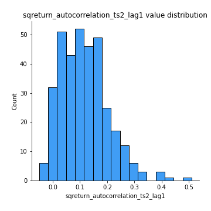
## Feature : sqreturn_autocorrelation_ts2_lag2
- **Feature type** : continous
- **Missing** : 0.0%
- **Unique** : 347
- **Count** :347.0
- **Mean** :0.10987549448865853
- **Std** :0.09340314086744413
- **Min** :-0.051523884196217395
- **25%th Percentile** : 0.03492206419176931
- **50%th Percentile** : 0.09874901186786796
- **75%th Percentile** : 0.170638830863143
- **Max** :0.45676817892778204

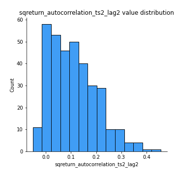
## Feature : sqreturn_autocorrelation_ts2_lag3
- **Feature type** : continous
- **Missing** : 0.0%
- **Unique** : 347
- **Count** :347.0
- **Mean** :0.0976004885817527
- **Std** :0.0867988271274005
- **Min** :-0.06082766359524085
- **25%th Percentile** : 0.02540516688011514
- **50%th Percentile** : 0.08704444595899903
- **75%th Percentile** : 0.15828817992676236
- **Max** :0.4637565953832106

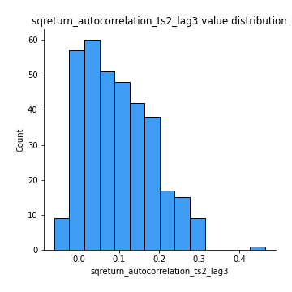
## Feature : sqreturn_correlation_ts1_lag_0
- **Feature type** : continous
- **Missing** : 0.0%
- **Unique** : 347
- **Count** :347.0
- **Mean** :0.3301814691838667
- **Std** :0.10714354820225357
- **Min** :-0.027089510445801036
- **25%th Percentile** : 0.2757550489012832
- **50%th Percentile** : 0.3365070750254664
- **75%th Percentile** : 0.38309782447255425
- **Max** :0.6812020480945222

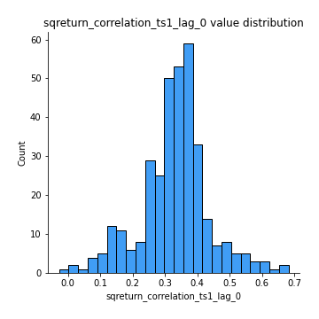
## Feature : sqreturn_correlation_ts1_lag_1
- **Feature type** : continous
- **Missing** : 0.0%
- **Unique** : 347
- **Count** :347.0
- **Mean** :-0.006869163813491944
- **Std** :0.05683788923132778
- **Min** :-0.15776193292681923
- **25%th Percentile** : -0.04849910121089246
- **50%th Percentile** : -0.003239296097075467
- **75%th Percentile** : 0.03463744107742885
- **Max** :0.19315114277462667

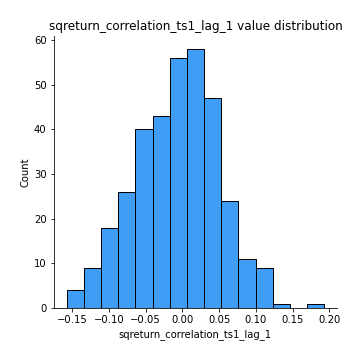
## Feature : sqreturn_correlation_ts1_lag_2
- **Feature type** : continous
- **Missing** : 0.0%
- **Unique** : 347
- **Count** :347.0
- **Mean** :-0.0014515750686458486
- **Std** :0.051629323206184505
- **Min** :-0.15139131319654112
- **25%th Percentile** : -0.03375358810868734
- **50%th Percentile** : -0.005314647900952841
- **75%th Percentile** : 0.0351704467703573
- **Max** :0.149315571259654

## Feature : sqreturn_correlation_ts1_lag_3
- **Feature type** : continous
- **Missing** : 0.0%
- **Unique** : 347
- **Count** :347.0
- **Mean** :-0.004244272385858551
- **Std** :0.05553944550217397
- **Min** :-0.1357021249408934
- **25%th Percentile** : -0.04076305950541652
- **50%th Percentile** : -0.0061346886228702295
- **75%th Percentile** : 0.030409474311713605
- **Max** :0.1636773216468148

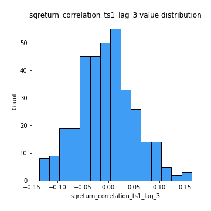
## Feature : sqreturn_correlation_ts2_lag_1
- **Feature type** : continous
- **Missing** : 0.0%
- **Unique** : 347
- **Count** :347.0
- **Mean** :-0.00518508409562022
- **Std** :0.05812155729187374
- **Min** :-0.2081139431093261
- **25%th Percentile** : -0.0396360543930816
- **50%th Percentile** : -0.008469813697103017
- **75%th Percentile** : 0.03520685118363287
- **Max** :0.15649977372588117

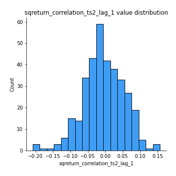
## Feature : sqreturn_correlation_ts2_lag_2
- **Feature type** : continous
- **Missing** : 0.0%
- **Unique** : 347
- **Count** :347.0
- **Mean** :-0.005428759162654276
- **Std** :0.05405318560599455
- **Min** :-0.17683292666294811
- **25%th Percentile** : -0.04336467276768932
- **50%th Percentile** : -0.004981959270171729
- **75%th Percentile** : 0.027154947259988113
- **Max** :0.20772887392904255

## Feature : sqreturn_correlation_ts2_lag_3
- **Feature type** : continous
- **Missing** : 0.0%
- **Unique** : 347
- **Count** :347.0
- **Mean** :-0.0033632660496953496
- **Std** :0.05352192607152982
- **Min** :-0.17564076057312866
- **25%th Percentile** : -0.034228024251920966
- **50%th Percentile** : -0.005549569530732531
- **75%th Percentile** : 0.03571232274081065
- **Max** :0.15174775359844558

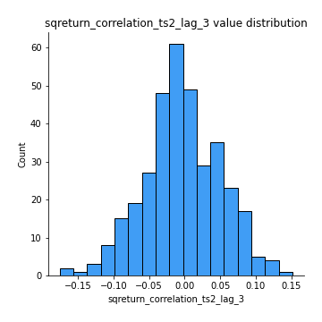
## Feature : price2_granger_cause_price1
- **Feature type** : continous
- **Missing** : 0.0%
- **Unique** : 347
- **Count** :347.0
- **Mean** :0.3007067716643147
- **Std** :0.2957720594878552
- **Min** :7.097507661316369e-12
- **25%th Percentile** : 0.027084778862766473
- **50%th Percentile** : 0.19553307867608352
- **75%th Percentile** : 0.5336710780793278
- **Max** :0.9963610991989615

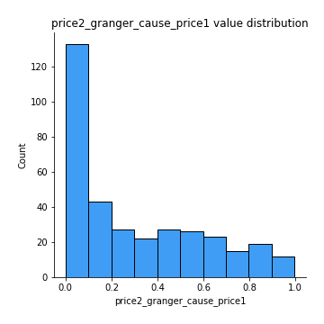
## Feature : price1_granger_cause_price2
- **Feature type** : continous
- **Missing** : 0.0%
- **Unique** : 347
- **Count** :347.0
- **Mean** :0.3061707980787643
- **Std** :0.2825083592372557
- **Min** :5.85968396450943e-07
- **25%th Percentile** : 0.041646976946130856
- **50%th Percentile** : 0.22433366089041326
- **75%th Percentile** : 0.5033991090387833
- **Max** :0.9803813305990684

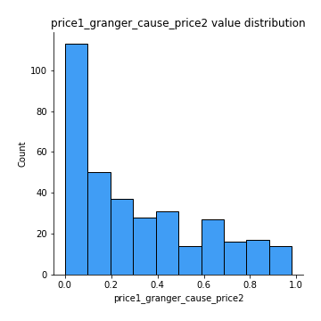

[<< Go back](../README.md)
