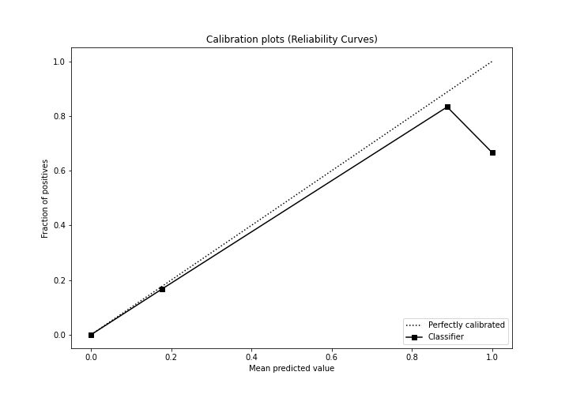
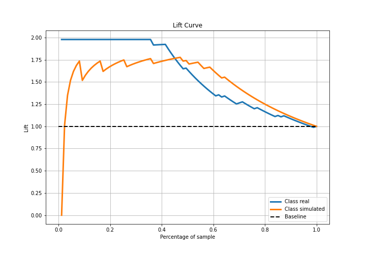

# Summary of 2_DecisionTree

[<< Go back](../README.md)

## Decision Tree
- **n_jobs**: -1
- **criterion**: gini
- **max_depth**: 3
- **explain_level**: 2

## Validation
 - **validation_type**: split
 - **train_ratio**: 0.75
 - **shuffle**: True
 - **stratify**: True

## Optimized metric
accuracy

## Training time

7.8 seconds

## Metric details
|           |    score |   threshold |
|:----------|---------:|------------:|
| logloss   | 0.445838 |   nan       |
| auc       | 0.887685 |   nan       |
| f1        | 0.893617 |     0.44403 |
| accuracy  | 0.885057 |     0.44403 |
| precision | 0.823529 |     0.44403 |
| recall    | 1        |     0       |
| mcc       | 0.783887 |     0.44403 |

## Confusion matrix (at threshold=0.44403)
|                      |   Predicted as real |   Predicted as simulated |
|:---------------------|--------------------:|-------------------------:|
| Labeled as real      |                  35 |                        9 |
| Labeled as simulated |                   1 |                       42 |

## Learning curves

## Decision Tree 

### Tree #1

### Rules

if (kurtosis1 <= 3.002) and (kurtosis2 <= 4.309) and (sd1 > 1.196) then class: simulated (proba: 88.81%) | based on 134 samples

if (kurtosis1 > 3.002) and (price2_granger_cause_price1 > 0.001) and (sqreturn_autocorrelation_ts2_lag2 <= 0.149) then class: real (proba: 100.0%) | based on 69 samples

if (kurtosis1 <= 3.002) and (kurtosis2 > 4.309) and (sqreturn_correlation_ts2_lag_3 > -0.09) then class: real (proba: 100.0%) | based on 20 samples

if (kurtosis1 > 3.002) and (price2_granger_cause_price1 > 0.001) and (sqreturn_autocorrelation_ts2_lag2 > 0.149) then class: real (proba: 82.35%) | based on 17 samples

if (kurtosis1 <= 3.002) and (kurtosis2 <= 4.309) and (sd1 <= 1.196) then class: real (proba: 100.0%) | based on 12 samples

if (kurtosis1 > 3.002) and (price2_granger_cause_price1 <= 0.001) and (price1_granger_cause_price2 <= 0.238) then class: simulated (proba: 100.0%) | based on 6 samples

if (kurtosis1 > 3.002) and (price2_granger_cause_price1 <= 0.001) and (price1_granger_cause_price2 > 0.238) then class: real (proba: 100.0%) | based on 1 samples

if (kurtosis1 <= 3.002) and (kurtosis2 > 4.309) and (sqreturn_correlation_ts2_lag_3 <= -0.09) then class: simulated (proba: 100.0%) | based on 1 samples

## Permutation-based Importance

## Confusion Matrix

## Normalized Confusion Matrix

## ROC Curve

## Kolmogorov-Smirnov Statistic

## Precision-Recall Curve

## Calibration Curve

## Cumulative Gains Curve

## Lift Curve

## SHAP Importance

## SHAP Dependence plots

### Dependence (Fold 1)

## SHAP Decision plots

### Top-10 Worst decisions for class 0 (Fold 1)

### Top-10 Best decisions for class 0 (Fold 1)

### Top-10 Worst decisions for class 1 (Fold 1)

### Top-10 Best decisions for class 1 (Fold 1)

[<< Go back](../README.md)
