# Summary of 3_Linear

[<< Go back](../README.md)

## Logistic Regression (Linear)
- **n_jobs**: -1
- **explain_level**: 2

## Validation
 - **validation_type**: split
 - **train_ratio**: 0.75
 - **shuffle**: True
 - **stratify**: True

## Optimized metric
accuracy

## Training time

6.1 seconds

## Metric details
|           |    score |    threshold |
|:----------|---------:|-------------:|
| logloss   | 0.351996 | nan          |
| auc       | 0.930233 | nan          |
| f1        | 0.893617 |   0.590395   |
| accuracy  | 0.885057 |   0.590395   |
| precision | 1        |   0.940632   |
| recall    | 1        |   1.0895e-22 |
| mcc       | 0.783887 |   0.590395   |

## Confusion matrix (at threshold=0.590395)
|                      |   Predicted as real |   Predicted as simulated |
|:---------------------|--------------------:|-------------------------:|
| Labeled as real      |                  35 |                        9 |
| Labeled as simulated |                   1 |                       42 |

## Learning curves
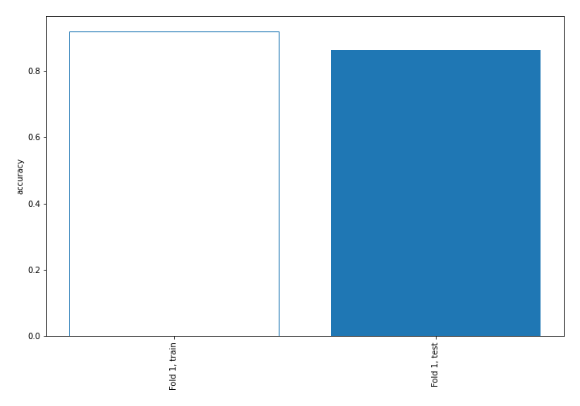

## Coefficients
| feature                           |   Learner_1 |
|:----------------------------------|------------:|
| sqreturn_autocorrelation_ts2_lag3 |   1.66932   |
| mean2                             |   1.53915   |
| mean1                             |   1.44807   |
| sqreturn_autocorrelation_ts1_lag3 |   1.17495   |
| sqreturn_autocorrelation_ts1_lag1 |   1.13751   |
| return_autocorrelation_2_lag1     |   0.890198  |
| sqreturn_autocorrelation_ts2_lag2 |   0.876463  |
| sqreturn_autocorrelation_ts2_lag1 |   0.875805  |
| sqreturn_autocorrelation_ts1_lag2 |   0.824458  |
| sd1                               |   0.659395  |
| return_correlation_ts1_lag_1      |   0.430319  |
| sqreturn_correlation_ts1_lag_1    |   0.430319  |
| sqreturn_correlation_ts2_lag_1    |   0.354801  |
| return_correlation_ts2_lag_1      |   0.354801  |
| price1_granger_cause_price2       |   0.269065  |
| return_autocorrelation_2_lag2     |   0.214974  |
| return_autocorrelation_1_lag3     |   0.203203  |
| return_autocorrelation_1_lag1     |   0.19671   |
| return_autocorrelation_2_lag3     |   0.155748  |
| sqreturn_correlation_ts2_lag_3    |   0.135078  |
| return_correlation_ts2_lag_3      |   0.135078  |
| sqreturn_correlation_ts1_lag_2    |   0.0118788 |
| return_correlation_ts1_lag_2      |   0.0118788 |
| return_autocorrelation_1_lag2     |  -0.0524777 |
| sqreturn_correlation_ts1_lag_3    |  -0.105342  |
| return_correlation_ts1_lag_3      |  -0.105342  |
| return_correlation_ts1_lag_0      |  -0.143092  |
| sqreturn_correlation_ts1_lag_0    |  -0.143092  |
| sd2                               |  -0.173376  |
| return_correlation_ts2_lag_2      |  -0.308127  |
| sqreturn_correlation_ts2_lag_2    |  -0.308127  |
| skewness1                         |  -0.375892  |
| skewness2                         |  -0.595787  |
| intercept                         |  -1.70783   |
| price2_granger_cause_price1       |  -1.71703   |
| kurtosis2                         |  -2.24003   |
| kurtosis1                         |  -2.66598   |

## Permutation-based Importance
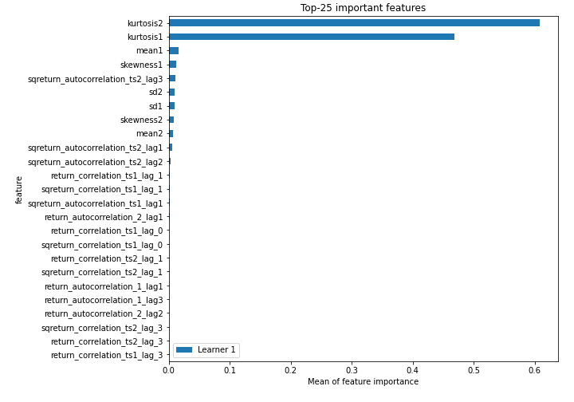
## Confusion Matrix

## Normalized Confusion Matrix

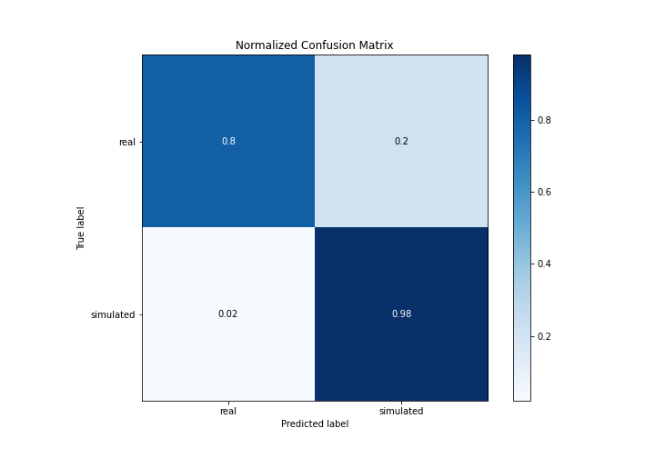

## ROC Curve

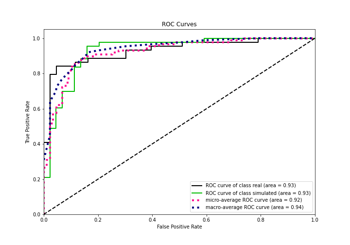

## Kolmogorov-Smirnov Statistic

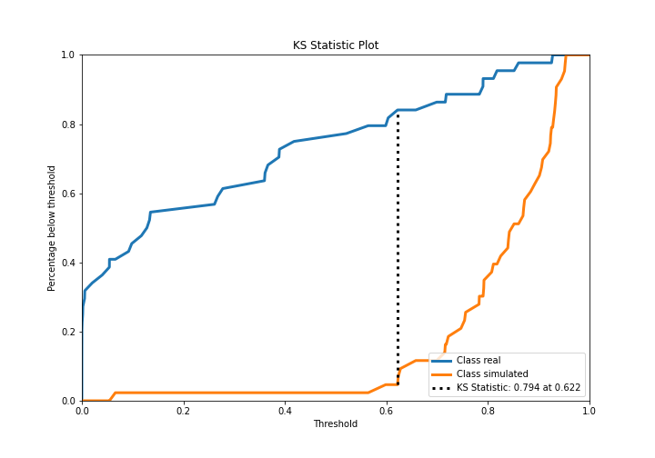

## Precision-Recall Curve

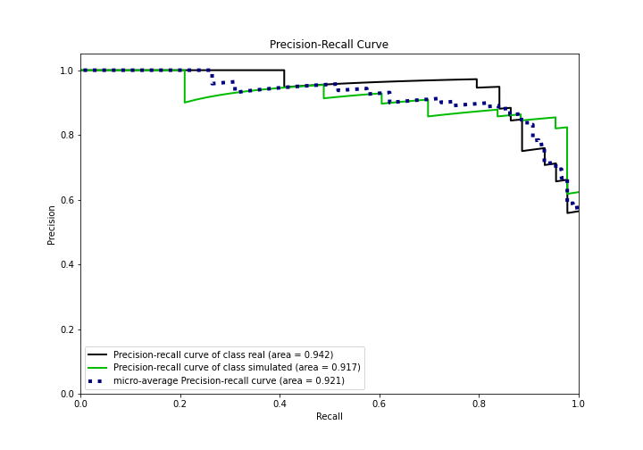

## Calibration Curve

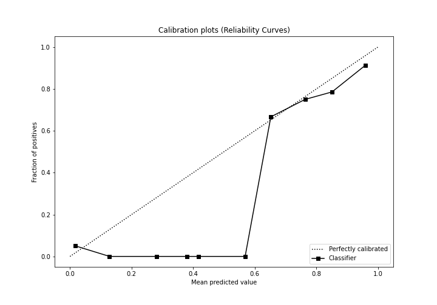

## Cumulative Gains Curve

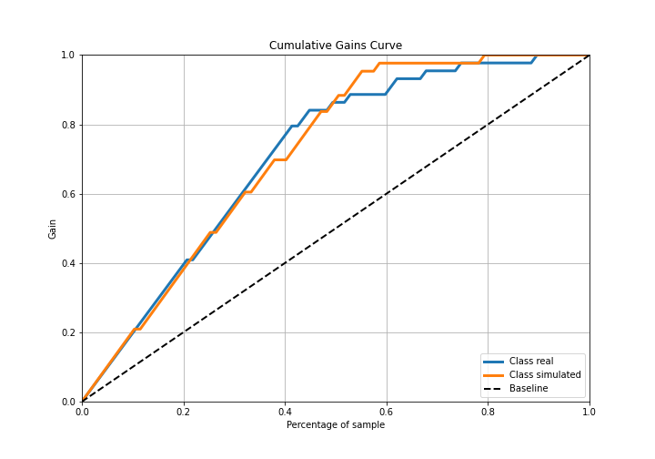

## Lift Curve

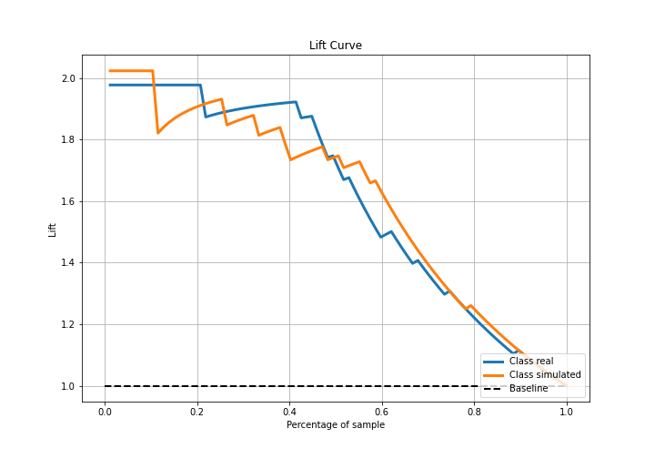

## SHAP Importance
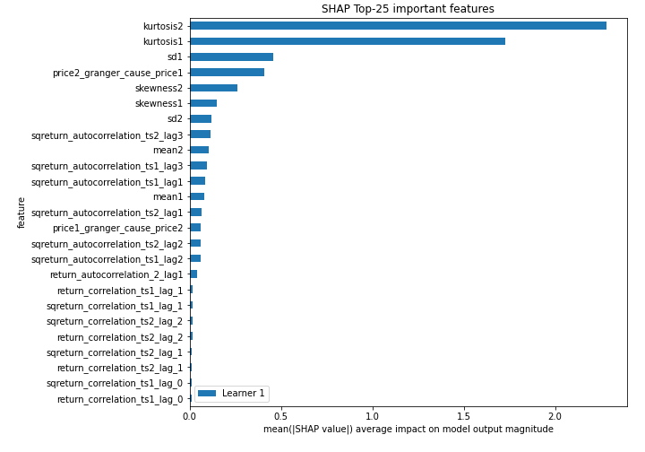

## SHAP Dependence plots

### Dependence (Fold 1)
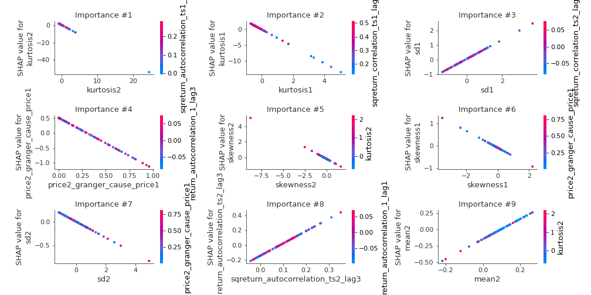

## SHAP Decision plots

### Top-10 Worst decisions for class 0 (Fold 1)
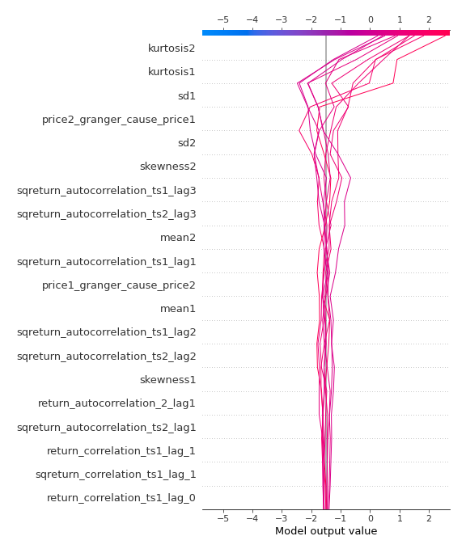
### Top-10 Best decisions for class 0 (Fold 1)
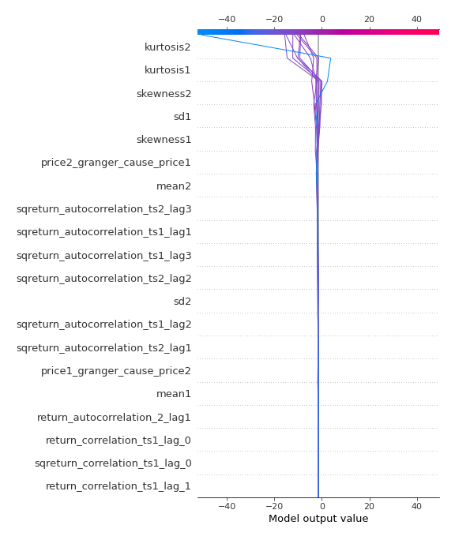
### Top-10 Worst decisions for class 1 (Fold 1)
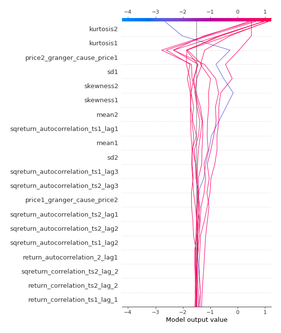
### Top-10 Best decisions for class 1 (Fold 1)
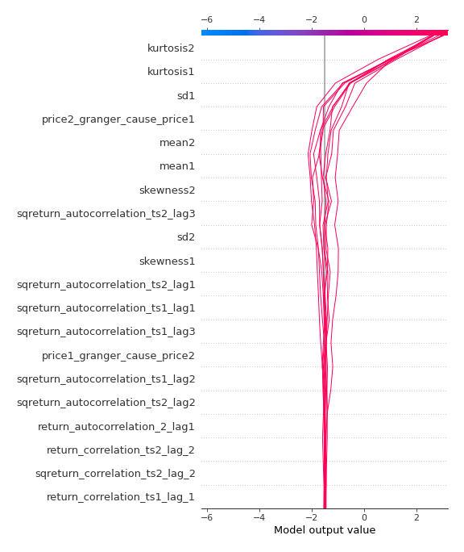

[<< Go back](../README.md)
