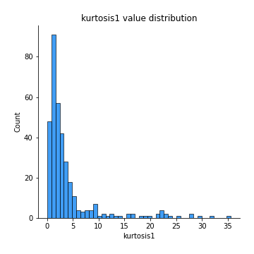

# Exploratory Data Analysis

[<< Go back](../README.md)
## Feature : target
- **Feature type** : categorical
- **Missing** : 0.0%
- **Unique** : 2
- **Count** :347
- **Unique** :2
- **Top** :real
- **Freq** :175

## Feature : mean1
- **Feature type** : continous
- **Missing** : 0.0%
- **Unique** : 347
- **Count** :347.0
- **Mean** :0.078564146915896
- **Std** :0.07871198933682075
- **Min** :-0.22632637961920957
- **25%th Percentile** : 0.03499441684766769
- **50%th Percentile** : 0.07774167956193015
- **75%th Percentile** : 0.12078912354270446
- **Max** :0.3612366374600757

## Feature : mean2
- **Feature type** : continous
- **Missing** : 0.0%
- **Unique** : 347
- **Count** :347.0
- **Mean** :0.09136689577381894
- **Std** :0.09021840835058408
- **Min** :-0.21818165578778434
- **25%th Percentile** : 0.04542397687752678
- **50%th Percentile** : 0.08621113735322024
- **75%th Percentile** : 0.14624970263845896
- **Max** :0.37616608147096464

## Feature : sd1
- **Feature type** : continous
- **Missing** : 0.0%
- **Unique** : 347
- **Count** :347.0
- **Mean** :2.0855240798216617
- **Std** :0.8144141576627151
- **Min** :0.8382061051466024
- **25%th Percentile** : 1.5552686338195594
- **50%th Percentile** : 1.9999174867960723
- **75%th Percentile** : 2.4618385850625577
- **Max** :9.236766377527575

## Feature : sd2
- **Feature type** : continous
- **Missing** : 0.0%
- **Unique** : 347
- **Count** :347.0
- **Mean** :1.991081852502198
- **Std** :0.7907889519360279
- **Min** :0.8455946193085045
- **25%th Percentile** : 1.4459824369178738
- **50%th Percentile** : 1.8768224428132902
- **75%th Percentile** : 2.264125790991301
- **Max** :6.737618636746393

## Feature : skewness1
- **Feature type** : continous
- **Missing** : 0.0%
- **Unique** : 347
- **Count** :347.0
- **Mean** :-0.13678548061930634
- **Std** :0.598575577780143
- **Min** :-3.530116233761814
- **25%th Percentile** : -0.3052881247380501
- **50%th Percentile** : -0.12246960672728274
- **75%th Percentile** : 0.08361602769295146
- **Max** :2.5845963767725557

## Feature : skewness2
- **Feature type** : continous
- **Missing** : 0.0%
- **Unique** : 347
- **Count** :347.0
- **Mean** :-0.21168321346089253
- **Std** :0.7695062655452418
- **Min** :-8.801502855292393
- **25%th Percentile** : -0.3748447378094081
- **50%th Percentile** : -0.16322292485279583
- **75%th Percentile** : 0.030927658533993985
- **Max** :2.2606839051517187

## Feature : kurtosis1
- **Feature type** : continous
- **Missing** : 0.0%
- **Unique** : 347
- **Count** :347.0
- **Mean** :4.014887249817416
- **Std** :5.602374015270306
- **Min** :0.03477879299249054
- **25%th Percentile** : 1.153868167429827
- **50%th Percentile** : 2.0837639712907836
- **75%th Percentile** : 3.991611060155577
- **Max** :35.56636016047202

## Feature : kurtosis2
- **Feature type** : continous
- **Missing** : 0.0%
- **Unique** : 347
- **Count** :347.0
- **Mean** :4.637294209559439
- **Std** :9.338433880821144
- **Min** :0.10052188588139765
- **25%th Percentile** : 1.2618642670359508
- **50%th Percentile** : 2.137609931340194
- **75%th Percentile** : 4.614999516444347
- **Max** :143.10871011533666

## Feature : return_autocorrelation_1_lag1
- **Feature type** : continous
- **Missing** : 0.0%
- **Unique** : 347
- **Count** :347.0
- **Mean** :-0.01785817986869101
- **Std** :0.060924652066090774
- **Min** :-0.2135576224968752
- **25%th Percentile** : -0.05988767158151918
- **50%th Percentile** : -0.010914393888152778
- **75%th Percentile** : 0.02168729376026287
- **Max** :0.13882717701811664

## Feature : return_autocorrelation_1_lag2
- **Feature type** : continous
- **Missing** : 0.0%
- **Unique** : 347
- **Count** :347.0
- **Mean** :-0.010242008769169881
- **Std** :0.05696950634274295
- **Min** :-0.19679025299021177
- **25%th Percentile** : -0.04790172727722384
- **50%th Percentile** : -0.010199536612058536
- **75%th Percentile** : 0.025592425591234334
- **Max** :0.1561488228015672

## Feature : return_autocorrelation_1_lag3
- **Feature type** : continous
- **Missing** : 0.0%
- **Unique** : 347
- **Count** :347.0
- **Mean** :-0.007680337776400528
- **Std** :0.05261202616763165
- **Min** :-0.16072019641445887
- **25%th Percentile** : -0.040976836957622706
- **50%th Percentile** : -0.005602291875092177
- **75%th Percentile** : 0.03204092133039933
- **Max** :0.11028973727744579

## Feature : return_autocorrelation_2_lag1
- **Feature type** : continous
- **Missing** : 0.0%
- **Unique** : 347
- **Count** :347.0
- **Mean** :-0.013273595414186256
- **Std** :0.06168995564362212
- **Min** :-0.25075531010123286
- **25%th Percentile** : -0.04652074225633522
- **50%th Percentile** : -0.011303559347658051
- **75%th Percentile** : 0.023913231626299342
- **Max** :0.16349871797309318

## Feature : return_autocorrelation_2_lag2
- **Feature type** : continous
- **Missing** : 0.0%
- **Unique** : 347
- **Count** :347.0
- **Mean** :-0.0051743713094170845
- **Std** :0.05906951732309308
- **Min** :-0.15323211089747296
- **25%th Percentile** : -0.04369917884268401
- **50%th Percentile** : -0.009555497467738329
- **75%th Percentile** : 0.03185732744681979
- **Max** :0.180699595071666

## Feature : return_autocorrelation_2_lag3
- **Feature type** : continous
- **Missing** : 0.0%
- **Unique** : 347
- **Count** :347.0
- **Mean** :-0.009331654442718156
- **Std** :0.05273866897724067
- **Min** :-0.1654758791651854
- **25%th Percentile** : -0.04685351652770702
- **50%th Percentile** : -0.01101988074859781
- **75%th Percentile** : 0.025212794069429195
- **Max** :0.12244506014589265

## Feature : return_correlation_ts1_lag_0
- **Feature type** : continous
- **Missing** : 0.0%
- **Unique** : 347
- **Count** :347.0
- **Mean** :0.33486364715164424
- **Std** :0.1109274507485572
- **Min** :-0.027089510445801036
- **25%th Percentile** : 0.27916481326140963
- **50%th Percentile** : 0.3448393349280878
- **75%th Percentile** : 0.3942668867404861
- **Max** :0.6949986865664105

## Feature : return_correlation_ts1_lag_1
- **Feature type** : continous
- **Missing** : 0.0%
- **Unique** : 347
- **Count** :347.0
- **Mean** :-0.005568706419759327
- **Std** :0.0567016853480078
- **Min** :-0.16985510949917193
- **25%th Percentile** : -0.04529899111186632
- **50%th Percentile** : -0.0031114594253763422
- **75%th Percentile** : 0.03463744107742885
- **Max** :0.15499424718508623

## Feature : return_correlation_ts1_lag_2
- **Feature type** : continous
- **Missing** : 0.0%
- **Unique** : 347
- **Count** :347.0
- **Mean** :-0.00035788049654892474
- **Std** :0.05744986906765235
- **Min** :-0.21653581047581763
- **25%th Percentile** : -0.036727558022195524
- **50%th Percentile** : -0.0038537794177983488
- **75%th Percentile** : 0.03940118705276176
- **Max** :0.1870683566147312

## Feature : return_correlation_ts1_lag_3
- **Feature type** : continous
- **Missing** : 0.0%
- **Unique** : 347
- **Count** :347.0
- **Mean** :-0.008525050144770901
- **Std** :0.05967029661495955
- **Min** :-0.20688367104423974
- **25%th Percentile** : -0.050111174010200946
- **50%th Percentile** : -0.010598778070996328
- **75%th Percentile** : 0.03450664505736821
- **Max** :0.1636773216468148

## Feature : return_correlation_ts2_lag_1
- **Feature type** : continous
- **Missing** : 0.0%
- **Unique** : 347
- **Count** :347.0
- **Mean** :-0.009740641598774313
- **Std** :0.05489708830153418
- **Min** :-0.2081139431093261
- **25%th Percentile** : -0.041658426255299766
- **50%th Percentile** : -0.008563581774338
- **75%th Percentile** : 0.02381350036932369
- **Max** :0.17208763791364762

## Feature : return_correlation_ts2_lag_2
- **Feature type** : continous
- **Missing** : 0.0%
- **Unique** : 347
- **Count** :347.0
- **Mean** :-0.0021858741385229596
- **Std** :0.05622571510450076
- **Min** :-0.23751835475804678
- **25%th Percentile** : -0.040155942667383496
- **50%th Percentile** : -0.0027358749519114604
- **75%th Percentile** : 0.03067844458359327
- **Max** :0.20772887392904255

## Feature : return_correlation_ts2_lag_3
- **Feature type** : continous
- **Missing** : 0.0%
- **Unique** : 347
- **Count** :347.0
- **Mean** :-0.00871019536456681
- **Std** :0.05282254124319657
- **Min** :-0.17564076057312866
- **25%th Percentile** : -0.0439510735614987
- **50%th Percentile** : -0.007943060341285047
- **75%th Percentile** : 0.02219563994926664
- **Max** :0.1294689919977519

## Feature : sqreturn_autocorrelation_ts1_lag1
- **Feature type** : continous
- **Missing** : 0.0%
- **Unique** : 347
- **Count** :347.0
- **Mean** :0.12396568890423927
- **Std** :0.09032566372363433
- **Min** :-0.02886671348349621
- **25%th Percentile** : 0.061673479737677686
- **50%th Percentile** : 0.10535606063098572
- **75%th Percentile** : 0.17207323007800168
- **Max** :0.4439086285737898

## Feature : sqreturn_autocorrelation_ts1_lag2
- **Feature type** : continous
- **Missing** : 0.0%
- **Unique** : 347
- **Count** :347.0
- **Mean** :0.110154712950414
- **Std** :0.09409829721108237
- **Min** :-0.05165593255897504
- **25%th Percentile** : 0.03685753926800793
- **50%th Percentile** : 0.09994000832978436
- **75%th Percentile** : 0.1639732711144542
- **Max** :0.540735851444759

## Feature : sqreturn_autocorrelation_ts1_lag3
- **Feature type** : continous
- **Missing** : 0.0%
- **Unique** : 347
- **Count** :347.0
- **Mean** :0.09886968678201011
- **Std** :0.08855559639258596
- **Min** :-0.044565249834063285
- **25%th Percentile** : 0.02854069490670872
- **50%th Percentile** : 0.091282682984777
- **75%th Percentile** : 0.14617698014731106
- **Max** :0.44755937369538146

## Feature : sqreturn_autocorrelation_ts2_lag1
- **Feature type** : continous
- **Missing** : 0.0%
- **Unique** : 347
- **Count** :347.0
- **Mean** :0.12363401055634081
- **Std** :0.09085092565369213
- **Min** :-0.04997282481431907
- **25%th Percentile** : 0.053453086468587076
- **50%th Percentile** : 0.1148761002442443
- **75%th Percentile** : 0.17617073361508784
- **Max** :0.510085647437958

## Feature : sqreturn_autocorrelation_ts2_lag2
- **Feature type** : continous
- **Missing** : 0.0%
- **Unique** : 347
- **Count** :347.0
- **Mean** :0.10678635328558994
- **Std** :0.0941484355516427
- **Min** :-0.051523884196217395
- **25%th Percentile** : 0.032410418790168025
- **50%th Percentile** : 0.09940330184314967
- **75%th Percentile** : 0.16051453017094308
- **Max** :0.5373432415582473

## Feature : sqreturn_autocorrelation_ts2_lag3
- **Feature type** : continous
- **Missing** : 0.0%
- **Unique** : 347
- **Count** :347.0
- **Mean** :0.09511809188908536
- **Std** :0.08664528037856842
- **Min** :-0.06082766359524085
- **25%th Percentile** : 0.02329843140465753
- **50%th Percentile** : 0.08086677132962858
- **75%th Percentile** : 0.14991933497104937
- **Max** :0.39181204176149387

## Feature : sqreturn_correlation_ts1_lag_0
- **Feature type** : continous
- **Missing** : 0.0%
- **Unique** : 347
- **Count** :347.0
- **Mean** :0.33486364715164424
- **Std** :0.1109274507485572
- **Min** :-0.027089510445801036
- **25%th Percentile** : 0.27916481326140963
- **50%th Percentile** : 0.3448393349280878
- **75%th Percentile** : 0.3942668867404861
- **Max** :0.6949986865664105

## Feature : sqreturn_correlation_ts1_lag_1
- **Feature type** : continous
- **Missing** : 0.0%
- **Unique** : 347
- **Count** :347.0
- **Mean** :-0.005568706419759327
- **Std** :0.0567016853480078
- **Min** :-0.16985510949917193
- **25%th Percentile** : -0.04529899111186632
- **50%th Percentile** : -0.0031114594253763422
- **75%th Percentile** : 0.03463744107742885
- **Max** :0.15499424718508623

## Feature : sqreturn_correlation_ts1_lag_2
- **Feature type** : continous
- **Missing** : 0.0%
- **Unique** : 347
- **Count** :347.0
- **Mean** :-0.00035788049654892474
- **Std** :0.05744986906765235
- **Min** :-0.21653581047581763
- **25%th Percentile** : -0.036727558022195524
- **50%th Percentile** : -0.0038537794177983488
- **75%th Percentile** : 0.03940118705276176
- **Max** :0.1870683566147312

## Feature : sqreturn_correlation_ts1_lag_3
- **Feature type** : continous
- **Missing** : 0.0%
- **Unique** : 347
- **Count** :347.0
- **Mean** :-0.008525050144770901
- **Std** :0.05967029661495955
- **Min** :-0.20688367104423974
- **25%th Percentile** : -0.050111174010200946
- **50%th Percentile** : -0.010598778070996328
- **75%th Percentile** : 0.03450664505736821
- **Max** :0.1636773216468148

## Feature : sqreturn_correlation_ts2_lag_1
- **Feature type** : continous
- **Missing** : 0.0%
- **Unique** : 347
- **Count** :347.0
- **Mean** :-0.009740641598774313
- **Std** :0.05489708830153418
- **Min** :-0.2081139431093261
- **25%th Percentile** : -0.041658426255299766
- **50%th Percentile** : -0.008563581774338
- **75%th Percentile** : 0.02381350036932369
- **Max** :0.17208763791364762

## Feature : sqreturn_correlation_ts2_lag_2
- **Feature type** : continous
- **Missing** : 0.0%
- **Unique** : 347
- **Count** :347.0
- **Mean** :-0.0021858741385229596
- **Std** :0.05622571510450076
- **Min** :-0.23751835475804678
- **25%th Percentile** : -0.040155942667383496
- **50%th Percentile** : -0.0027358749519114604
- **75%th Percentile** : 0.03067844458359327
- **Max** :0.20772887392904255

## Feature : sqreturn_correlation_ts2_lag_3
- **Feature type** : continous
- **Missing** : 0.0%
- **Unique** : 347
- **Count** :347.0
- **Mean** :-0.00871019536456681
- **Std** :0.05282254124319657
- **Min** :-0.17564076057312866
- **25%th Percentile** : -0.0439510735614987
- **50%th Percentile** : -0.007943060341285047
- **75%th Percentile** : 0.02219563994926664
- **Max** :0.1294689919977519

## Feature : price2_granger_cause_price1
- **Feature type** : continous
- **Missing** : 0.0%
- **Unique** : 347
- **Count** :347.0
- **Mean** :0.2830956849505268
- **Std** :0.2926529109424034
- **Min** :2.5694476084764288e-15
- **25%th Percentile** : 0.0234683217064571
- **50%th Percentile** : 0.17136728097463974
- **75%th Percentile** : 0.49288916197351035
- **Max** :0.9885712803689185

## Feature : price1_granger_cause_price2
- **Feature type** : continous
- **Missing** : 0.0%
- **Unique** : 347
- **Count** :347.0
- **Mean** :0.2909573530819846
- **Std** :0.27336021963195384
- **Min** :7.602707318394735e-12
- **25%th Percentile** : 0.04574239464808354
- **50%th Percentile** : 0.22433366089041326
- **75%th Percentile** : 0.4741339167419333
- **Max** :0.9951398266867577

[<< Go back](../README.md)
