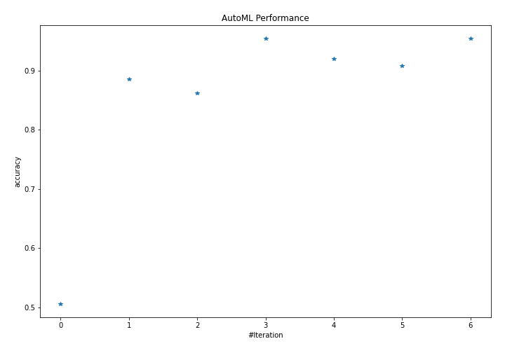
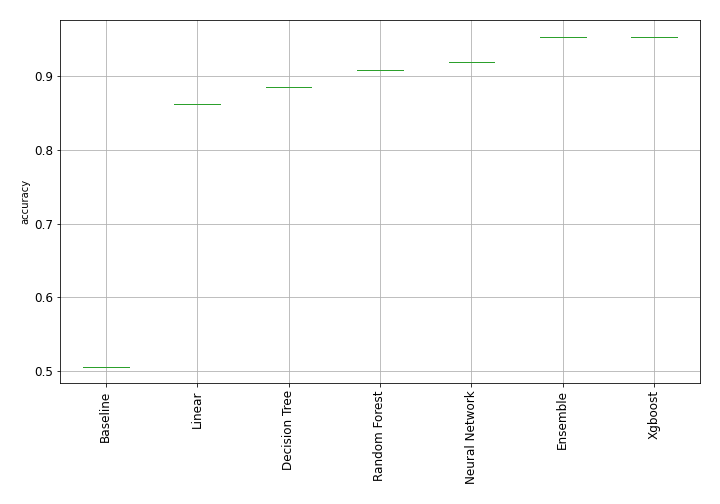
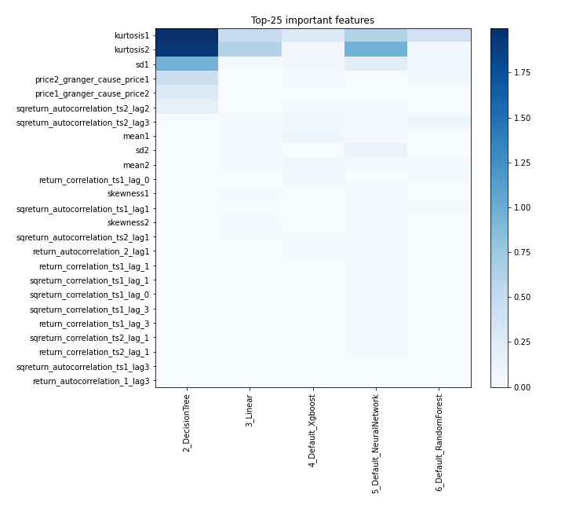
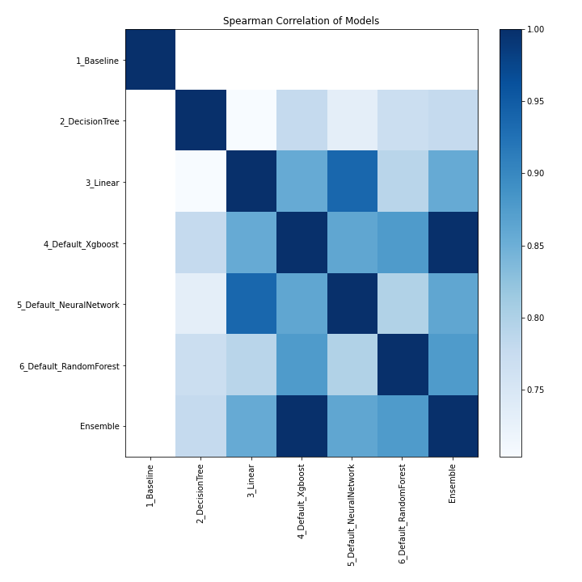

# AutoML Leaderboard

| Best model   | name                                                         | model_type     | metric_type   |   metric_value |   train_time |
|:-------------|:-------------------------------------------------------------|:---------------|:--------------|---------------:|-------------:|
|              | [1_Baseline](1_Baseline/README.md)                           | Baseline       | accuracy      |       0.505747 |         3.68 |
|              | [2_DecisionTree](2_DecisionTree/README.md)                   | Decision Tree  | accuracy      |       0.885057 |         8.57 |
|              | [3_Linear](3_Linear/README.md)                               | Linear         | accuracy      |       0.862069 |         6.72 |
| **the best** | [4_Default_Xgboost](4_Default_Xgboost/README.md)             | Xgboost        | accuracy      |       0.954023 |         7.64 |
|              | [5_Default_NeuralNetwork](5_Default_NeuralNetwork/README.md) | Neural Network | accuracy      |       0.91954  |         5.27 |
|              | [6_Default_RandomForest](6_Default_RandomForest/README.md)   | Random Forest  | accuracy      |       0.908046 |        10.79 |
|              | [Ensemble](Ensemble/README.md)                               | Ensemble       | accuracy      |       0.954023 |         0.33 |

### AutoML Performance

### AutoML Performance Boxplot

### Features Importance

### Spearman Correlation of Models

