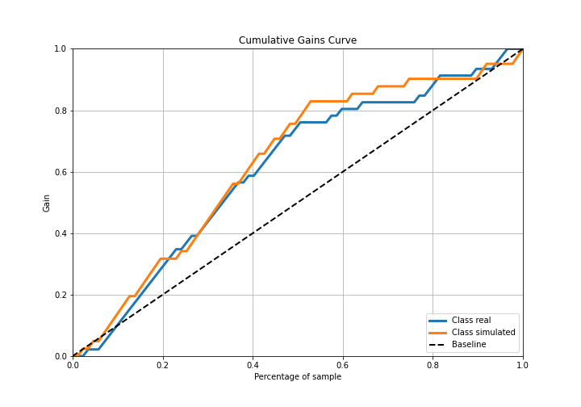

# Summary of 2_DecisionTree

[<< Go back](../README.md)

## Decision Tree
- **n_jobs**: -1
- **criterion**: gini
- **max_depth**: 3
- **explain_level**: 2

## Validation
 - **validation_type**: split
 - **train_ratio**: 0.75
 - **shuffle**: True
 - **stratify**: True

## Optimized metric
accuracy

## Training time

17.5 seconds

## Metric details
|           |    score |   threshold |
|:----------|---------:|------------:|
| logloss   | 1.31197  |  nan        |
| auc       | 0.741516 |  nan        |
| f1        | 0.752941 |    0.457274 |
| accuracy  | 0.758621 |    0.457274 |
| precision | 0.738095 |    0.722155 |
| recall    | 0.95122  |    0        |
| mcc       | 0.518794 |    0.457274 |

## Confusion matrix (at threshold=0.457274)
|                      |   Predicted as real |   Predicted as simulated |
|:---------------------|--------------------:|-------------------------:|
| Labeled as real      |                  34 |                       12 |
| Labeled as simulated |                   9 |                       32 |

## Learning curves

## Decision Tree 

### Tree #1

### Rules

if (kurtosis1 <= 2.496) and (sqreturn_autocorrelation_ts2_lag3 > 0.029) and (sqreturn_autocorrelation_ts1_lag3 > 0.001) then class: simulated (proba: 87.29%) | based on 118 samples

if (kurtosis1 > 2.496) and (price2_granger_cause_price1 > 0.001) and (return_autocorrelation_1_lag3 <= 0.087) then class: real (proba: 95.83%) | based on 96 samples

if (kurtosis1 <= 2.496) and (sqreturn_autocorrelation_ts2_lag3 <= 0.029) and (kurtosis1 > 0.633) then class: real (proba: 95.24%) | based on 21 samples

if (kurtosis1 > 2.496) and (price2_granger_cause_price1 <= 0.001) then class: simulated (proba: 100.0%) | based on 9 samples

if (kurtosis1 > 2.496) and (price2_granger_cause_price1 > 0.001) and (return_autocorrelation_1_lag3 > 0.087) then class: simulated (proba: 57.14%) | based on 7 samples

if (kurtosis1 <= 2.496) and (sqreturn_autocorrelation_ts2_lag3 > 0.029) and (sqreturn_autocorrelation_ts1_lag3 <= 0.001) then class: real (proba: 100.0%) | based on 7 samples

if (kurtosis1 <= 2.496) and (sqreturn_autocorrelation_ts2_lag3 <= 0.029) and (kurtosis1 <= 0.633) then class: simulated (proba: 100.0%) | based on 2 samples

## Permutation-based Importance

## Confusion Matrix

## Normalized Confusion Matrix

## ROC Curve

## Kolmogorov-Smirnov Statistic

## Precision-Recall Curve

## Calibration Curve

## Cumulative Gains Curve

## Lift Curve

## SHAP Importance

## SHAP Dependence plots

### Dependence (Fold 1)

## SHAP Decision plots

### Top-10 Worst decisions for class 0 (Fold 1)

### Top-10 Best decisions for class 0 (Fold 1)

### Top-10 Worst decisions for class 1 (Fold 1)

### Top-10 Best decisions for class 1 (Fold 1)

[<< Go back](../README.md)
