# Summary of 3_Linear

[<< Go back](../README.md)

## Logistic Regression (Linear)
- **n_jobs**: -1
- **explain_level**: 2

## Validation
 - **validation_type**: split
 - **train_ratio**: 0.75
 - **shuffle**: True
 - **stratify**: True

## Optimized metric
accuracy

## Training time

9.4 seconds

## Metric details
|           |    score |     threshold |
|:----------|---------:|--------------:|
| logloss   | 0.3979   | nan           |
| auc       | 0.902969 | nan           |
| f1        | 0.869565 |   0.377106    |
| accuracy  | 0.862069 |   0.473359    |
| precision | 0.892857 |   0.760753    |
| recall    | 1        |   1.60813e-06 |
| mcc       | 0.74644  |   0.377106    |

## Confusion matrix (at threshold=0.473359)
|                      |   Predicted as real |   Predicted as simulated |
|:---------------------|--------------------:|-------------------------:|
| Labeled as real      |                  36 |                       10 |
| Labeled as simulated |                   2 |                       39 |

## Learning curves
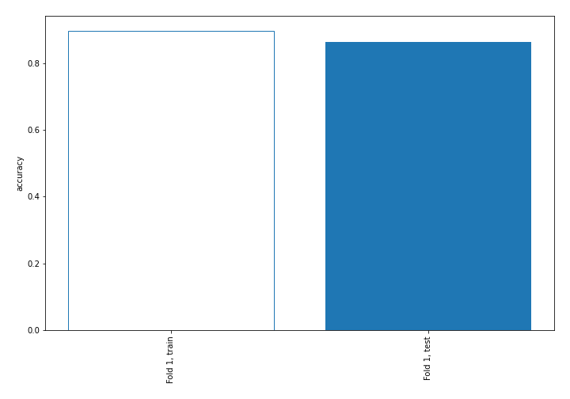

## Coefficients
| feature                           |   Learner_1 |
|:----------------------------------|------------:|
| sqreturn_autocorrelation_ts2_lag3 |    1.74997  |
| mean2                             |    1.681    |
| mean1                             |    1.53468  |
| sqreturn_autocorrelation_ts1_lag3 |    1.34106  |
| sqreturn_autocorrelation_ts1_lag2 |    1.23962  |
| sqreturn_autocorrelation_ts1_lag1 |    1.13133  |
| sqreturn_autocorrelation_ts2_lag2 |    0.86098  |
| sqreturn_autocorrelation_ts2_lag1 |    0.856125 |
| return_autocorrelation_2_lag1     |    0.659018 |
| sd1                               |    0.658698 |
| sqreturn_correlation_ts2_lag_3    |    0.606282 |
| return_correlation_ts2_lag_3      |    0.606282 |
| return_autocorrelation_2_lag2     |    0.525761 |
| return_correlation_ts1_lag_1      |    0.501318 |
| sqreturn_correlation_ts1_lag_1    |    0.501318 |
| return_autocorrelation_1_lag1     |    0.48915  |
| sqreturn_correlation_ts2_lag_1    |    0.485715 |
| return_correlation_ts2_lag_1      |    0.485715 |
| return_autocorrelation_2_lag3     |    0.396268 |
| return_autocorrelation_1_lag3     |    0.324388 |
| return_correlation_ts1_lag_3      |    0.247108 |
| sqreturn_correlation_ts1_lag_3    |    0.247108 |
| return_correlation_ts2_lag_2      |    0.187074 |
| sqreturn_correlation_ts2_lag_2    |    0.187074 |
| return_autocorrelation_1_lag2     |    0.15736  |
| return_correlation_ts1_lag_2      |    0.105909 |
| sqreturn_correlation_ts1_lag_2    |    0.105909 |
| return_correlation_ts1_lag_0      |   -0.131812 |
| sqreturn_correlation_ts1_lag_0    |   -0.131812 |
| skewness2                         |   -0.222021 |
| sd2                               |   -0.312677 |
| skewness1                         |   -0.451579 |
| price1_granger_cause_price2       |   -0.567544 |
| price2_granger_cause_price1       |   -0.571266 |
| intercept                         |   -1.76212  |
| kurtosis2                         |   -1.76762  |
| kurtosis1                         |   -2.57625  |

## Permutation-based Importance
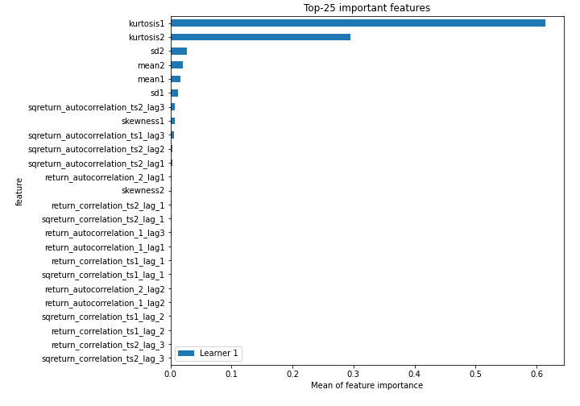
## Confusion Matrix

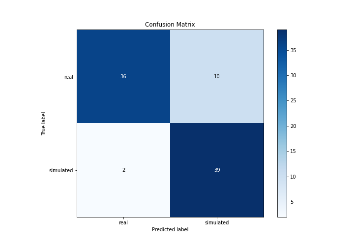

## Normalized Confusion Matrix

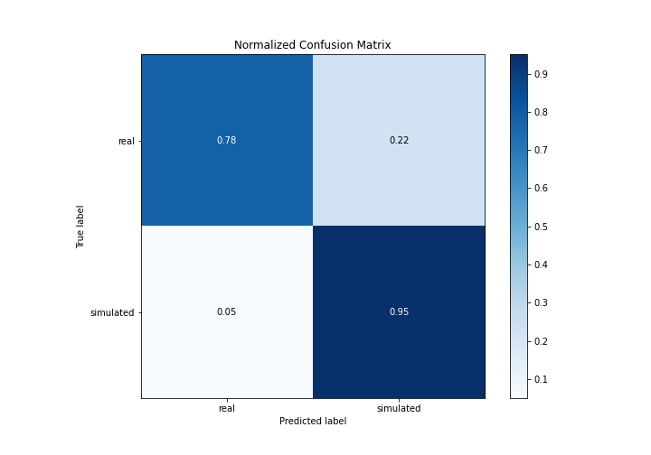

## ROC Curve

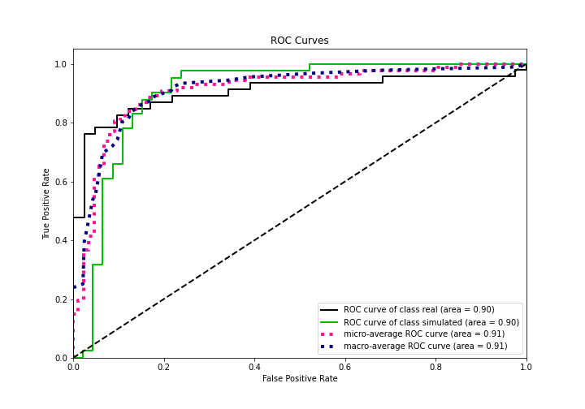

## Kolmogorov-Smirnov Statistic

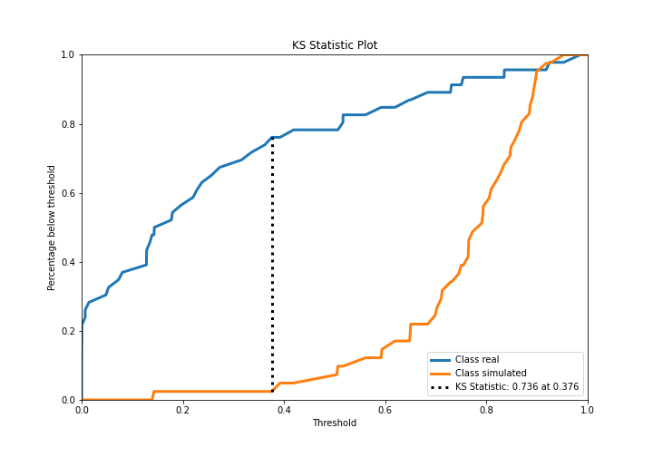

## Precision-Recall Curve

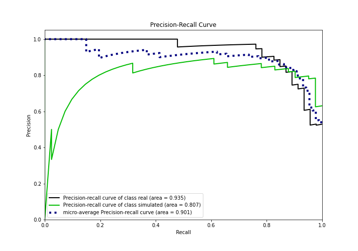

## Calibration Curve

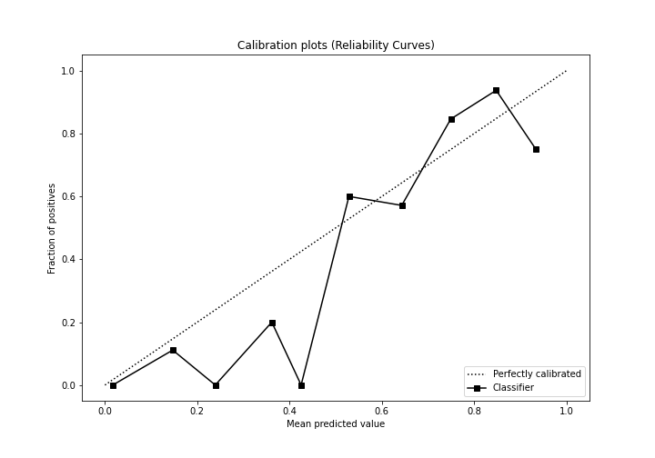

## Cumulative Gains Curve

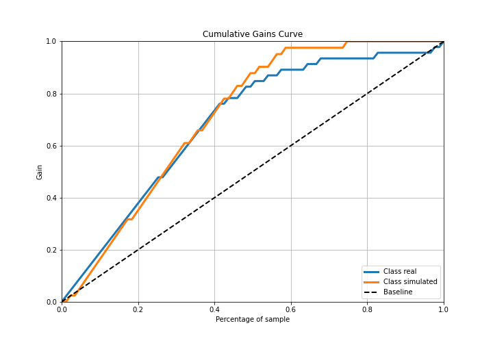

## Lift Curve

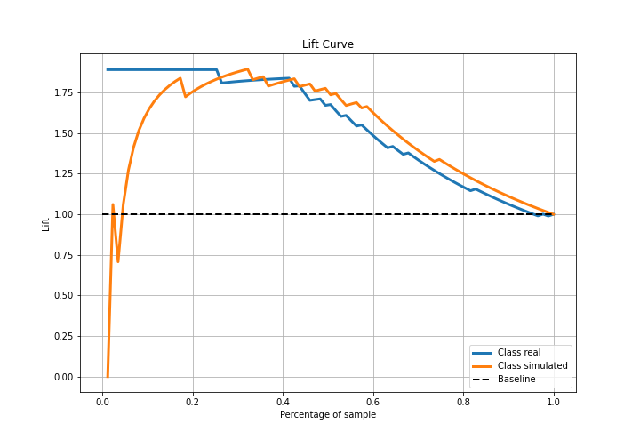

## SHAP Importance
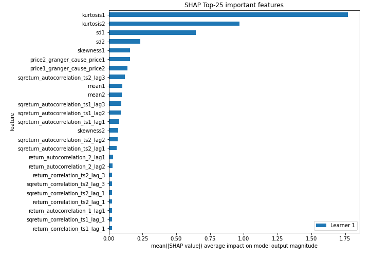

## SHAP Dependence plots

### Dependence (Fold 1)
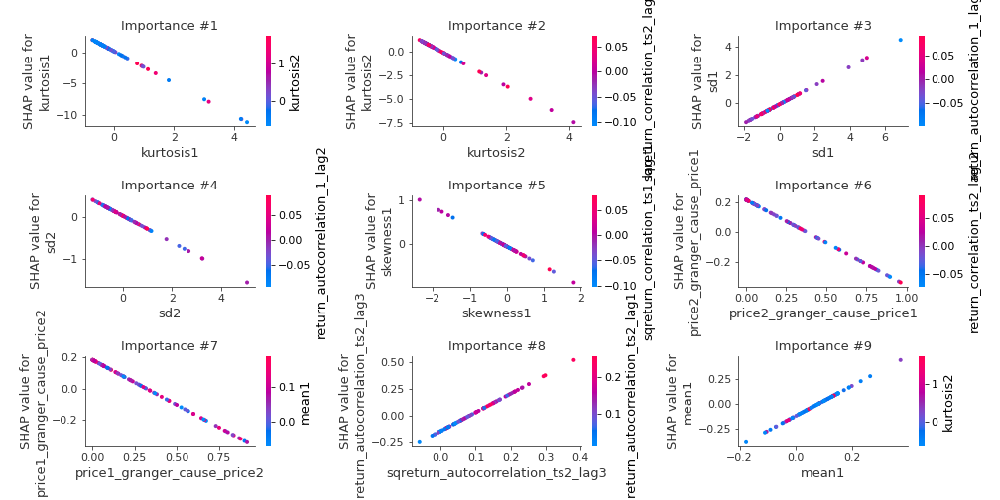

## SHAP Decision plots

### Top-10 Worst decisions for class 0 (Fold 1)
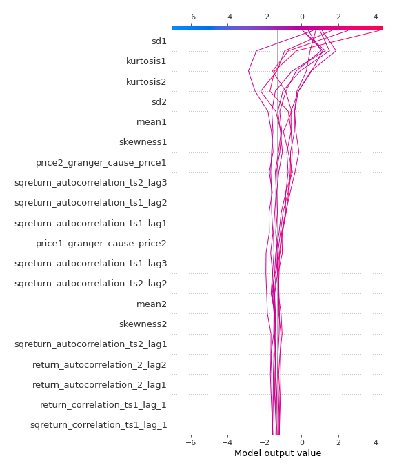
### Top-10 Best decisions for class 0 (Fold 1)
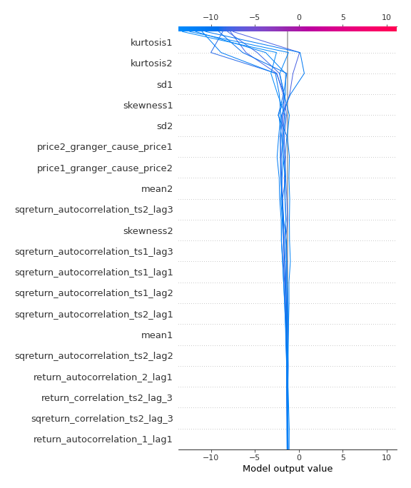
### Top-10 Worst decisions for class 1 (Fold 1)
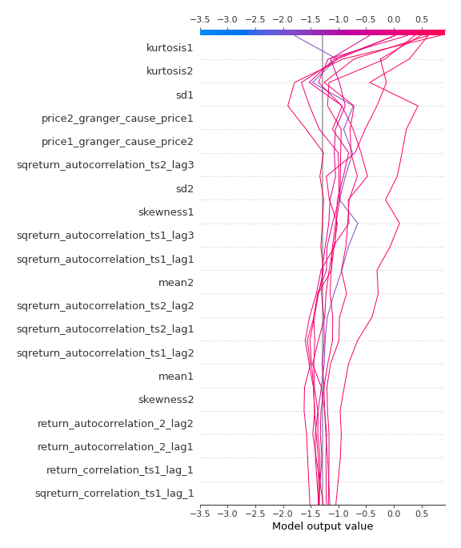
### Top-10 Best decisions for class 1 (Fold 1)
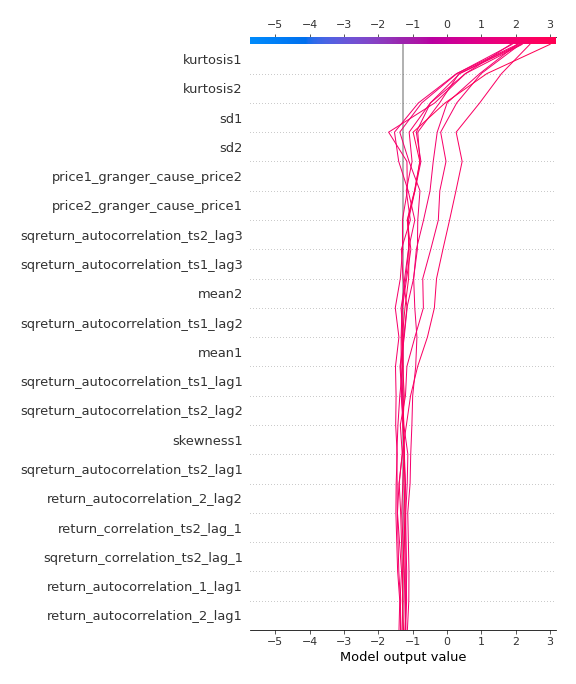

[<< Go back](../README.md)
