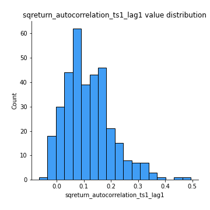
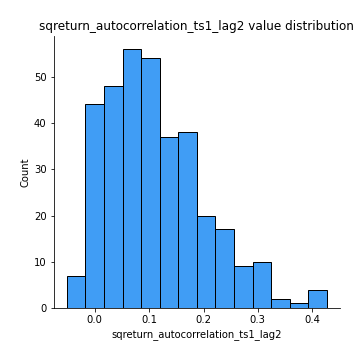
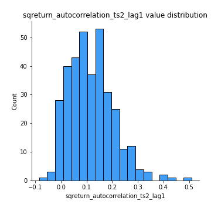

# Exploratory Data Analysis

[<< Go back](../README.md)
## Feature : target
- **Feature type** : categorical
- **Missing** : 0.0%
- **Unique** : 2
- **Count** :347
- **Unique** :2
- **Top** :real
- **Freq** :183

## Feature : mean1
- **Feature type** : continous
- **Missing** : 0.0%
- **Unique** : 347
- **Count** :347.0
- **Mean** :0.07679765589397623
- **Std** :0.07440500563118034
- **Min** :-0.17686457077756634
- **25%th Percentile** : 0.03346182445133823
- **50%th Percentile** : 0.07599321278730281
- **75%th Percentile** : 0.12147872437498455
- **Max** :0.37175100008111034

## Feature : mean2
- **Feature type** : continous
- **Missing** : 0.0%
- **Unique** : 347
- **Count** :347.0
- **Mean** :0.09049074829185148
- **Std** :0.0847486208722037
- **Min** :-0.24205418062825398
- **25%th Percentile** : 0.04376655121306791
- **50%th Percentile** : 0.09075887451841905
- **75%th Percentile** : 0.14197146010315015
- **Max** :0.37616608147096464

## Feature : sd1
- **Feature type** : continous
- **Missing** : 0.0%
- **Unique** : 347
- **Count** :347.0
- **Mean** :2.0083261194866027
- **Std** :0.7399645261305134
- **Min** :0.7470080772831957
- **25%th Percentile** : 1.4849655298818634
- **50%th Percentile** : 1.9123116647914988
- **75%th Percentile** : 2.392985895276971
- **Max** :6.495661311240861

## Feature : sd2
- **Feature type** : continous
- **Missing** : 0.0%
- **Unique** : 347
- **Count** :347.0
- **Mean** :1.9444597784273316
- **Std** :0.7940176470145879
- **Min** :0.8455946193085045
- **25%th Percentile** : 1.416510390532657
- **50%th Percentile** : 1.8132319821594836
- **75%th Percentile** : 2.2839780036201507
- **Max** :6.737618636746393

## Feature : skewness1
- **Feature type** : continous
- **Missing** : 0.0%
- **Unique** : 347
- **Count** :347.0
- **Mean** :-0.16581433522554576
- **Std** :0.6104829273181239
- **Min** :-3.530116233761814
- **25%th Percentile** : -0.3170953849478596
- **50%th Percentile** : -0.1266336613058994
- **75%th Percentile** : 0.0732996666582574
- **Max** :2.224942816365292

## Feature : skewness2
- **Feature type** : continous
- **Missing** : 0.0%
- **Unique** : 347
- **Count** :347.0
- **Mean** :-0.15187820199547825
- **Std** :0.5860754275871102
- **Min** :-3.436088288137694
- **25%th Percentile** : -0.3767268340383251
- **50%th Percentile** : -0.15687303302762082
- **75%th Percentile** : 0.06632653603899154
- **Max** :2.2606839051517187

## Feature : kurtosis1
- **Feature type** : continous
- **Missing** : 0.0%
- **Unique** : 347
- **Count** :347.0
- **Mean** :4.073632883194625
- **Std** :5.787773935587664
- **Min** :0.02099673041307737
- **25%th Percentile** : 1.1282696494894466
- **50%th Percentile** : 2.0619545867796636
- **75%th Percentile** : 4.020109176018237
- **Max** :36.91113889081053

## Feature : kurtosis2
- **Feature type** : continous
- **Missing** : 0.0%
- **Unique** : 347
- **Count** :347.0
- **Mean** :4.096491713499687
- **Std** :5.144773265598048
- **Min** :0.11397212668095502
- **25%th Percentile** : 1.3330871459650258
- **50%th Percentile** : 2.222369505614411
- **75%th Percentile** : 4.443645217136195
- **Max** :33.2074998145622

## Feature : return_autocorrelation_1_lag1
- **Feature type** : continous
- **Missing** : 0.0%
- **Unique** : 347
- **Count** :347.0
- **Mean** :-0.012255026711029822
- **Std** :0.0608006025102257
- **Min** :-0.20673896439036124
- **25%th Percentile** : -0.04866529362938049
- **50%th Percentile** : -0.0073825539194493014
- **75%th Percentile** : 0.028377110972989835
- **Max** :0.19894095784289417

## Feature : return_autocorrelation_1_lag2
- **Feature type** : continous
- **Missing** : 0.0%
- **Unique** : 347
- **Count** :347.0
- **Mean** :-0.006382130572113559
- **Std** :0.052903026804551875
- **Min** :-0.13309283796645122
- **25%th Percentile** : -0.04326321277181454
- **50%th Percentile** : -0.005583441304546397
- **75%th Percentile** : 0.026678954573679158
- **Max** :0.1561488228015672

## Feature : return_autocorrelation_1_lag3
- **Feature type** : continous
- **Missing** : 0.0%
- **Unique** : 347
- **Count** :347.0
- **Mean** :-0.005815276129163044
- **Std** :0.057101413150374446
- **Min** :-0.1940836867390813
- **25%th Percentile** : -0.04527145053947215
- **50%th Percentile** : -0.004531706217933944
- **75%th Percentile** : 0.032882636020726136
- **Max** :0.13878880394263232

## Feature : return_autocorrelation_2_lag1
- **Feature type** : continous
- **Missing** : 0.0%
- **Unique** : 347
- **Count** :347.0
- **Mean** :-0.014587488438006922
- **Std** :0.061750730425541404
- **Min** :-0.24265814531706406
- **25%th Percentile** : -0.05082775062546184
- **50%th Percentile** : -0.014541444469896164
- **75%th Percentile** : 0.027953577713643474
- **Max** :0.16349871797309318

## Feature : return_autocorrelation_2_lag2
- **Feature type** : continous
- **Missing** : 0.0%
- **Unique** : 347
- **Count** :347.0
- **Mean** :-0.000592360968776363
- **Std** :0.05680721726610524
- **Min** :-0.15323211089747296
- **25%th Percentile** : -0.040525526037058564
- **50%th Percentile** : -0.0034670824892446316
- **75%th Percentile** : 0.03951862149164396
- **Max** :0.1735398560230086

## Feature : return_autocorrelation_2_lag3
- **Feature type** : continous
- **Missing** : 0.0%
- **Unique** : 347
- **Count** :347.0
- **Mean** :-0.006174611718842059
- **Std** :0.052862574758303894
- **Min** :-0.14200107169559698
- **25%th Percentile** : -0.042349841153705575
- **50%th Percentile** : -0.004785330675609946
- **75%th Percentile** : 0.027805215770114647
- **Max** :0.1419999376914021

## Feature : return_correlation_ts1_lag_0
- **Feature type** : continous
- **Missing** : 0.0%
- **Unique** : 347
- **Count** :347.0
- **Mean** :0.3337430042233082
- **Std** :0.11001870415156213
- **Min** :-0.027089510445801036
- **25%th Percentile** : 0.27521836976700365
- **50%th Percentile** : 0.3438947143821985
- **75%th Percentile** : 0.38760802738014744
- **Max** :0.7028422087350163

## Feature : return_correlation_ts1_lag_1
- **Feature type** : continous
- **Missing** : 0.0%
- **Unique** : 347
- **Count** :347.0
- **Mean** :-0.005804524407433669
- **Std** :0.055452739853222334
- **Min** :-0.1705603205854142
- **25%th Percentile** : -0.04149686538608233
- **50%th Percentile** : -0.004490374380456575
- **75%th Percentile** : 0.03336108026955483
- **Max** :0.12808691577953232

## Feature : return_correlation_ts1_lag_2
- **Feature type** : continous
- **Missing** : 0.0%
- **Unique** : 347
- **Count** :347.0
- **Mean** :0.0027097733368555642
- **Std** :0.05515949002048716
- **Min** :-0.17870642640133683
- **25%th Percentile** : -0.033852763251315365
- **50%th Percentile** : 0.001146803135765006
- **75%th Percentile** : 0.041940142125376945
- **Max** :0.17263381943891573

## Feature : return_correlation_ts1_lag_3
- **Feature type** : continous
- **Missing** : 0.0%
- **Unique** : 347
- **Count** :347.0
- **Mean** :-0.008558927541393566
- **Std** :0.05988698899768722
- **Min** :-0.2206592186205659
- **25%th Percentile** : -0.048600343285502154
- **50%th Percentile** : -0.0098511469436087
- **75%th Percentile** : 0.035123036028728655
- **Max** :0.1636773216468148

## Feature : return_correlation_ts2_lag_1
- **Feature type** : continous
- **Missing** : 0.0%
- **Unique** : 347
- **Count** :347.0
- **Mean** :-0.008827239608607877
- **Std** :0.05871243302004137
- **Min** :-0.2081139431093261
- **25%th Percentile** : -0.04681563753500499
- **50%th Percentile** : -0.009866335752524082
- **75%th Percentile** : 0.029570033601678914
- **Max** :0.17208763791364762

## Feature : return_correlation_ts2_lag_2
- **Feature type** : continous
- **Missing** : 0.0%
- **Unique** : 347
- **Count** :347.0
- **Mean** :-0.0014183698637009667
- **Std** :0.055845608817365645
- **Min** :-0.23751835475804678
- **25%th Percentile** : -0.03680566599895389
- **50%th Percentile** : -0.0036452516636156043
- **75%th Percentile** : 0.03058201224554132
- **Max** :0.20772887392904255

## Feature : return_correlation_ts2_lag_3
- **Feature type** : continous
- **Missing** : 0.0%
- **Unique** : 347
- **Count** :347.0
- **Mean** :-0.0021441207626913318
- **Std** :0.05556409257642347
- **Min** :-0.17564076057312866
- **25%th Percentile** : -0.029811518064975798
- **50%th Percentile** : -0.0031808542098304003
- **75%th Percentile** : 0.032015869210055656
- **Max** :0.1693303439535366

## Feature : sqreturn_autocorrelation_ts1_lag1
- **Feature type** : continous
- **Missing** : 0.0%
- **Unique** : 347
- **Count** :347.0
- **Mean** :0.117114246381887
- **Std** :0.08782350605975484
- **Min** :-0.06532118872798363
- **25%th Percentile** : 0.05414778076774386
- **50%th Percentile** : 0.10196346884026602
- **75%th Percentile** : 0.16773198042693732
- **Max** :0.49414293176447355

## Feature : sqreturn_autocorrelation_ts1_lag2
- **Feature type** : continous
- **Missing** : 0.0%
- **Unique** : 347
- **Count** :347.0
- **Mean** :0.11162665863343735
- **Std** :0.09110819679081976
- **Min** :-0.05165593255897504
- **25%th Percentile** : 0.04292352165536588
- **50%th Percentile** : 0.09788968368702664
- **75%th Percentile** : 0.1637587006320449
- **Max** :0.42719220751700526

## Feature : sqreturn_autocorrelation_ts1_lag3
- **Feature type** : continous
- **Missing** : 0.0%
- **Unique** : 347
- **Count** :347.0
- **Mean** :0.09529883755641567
- **Std** :0.0846767487887741
- **Min** :-0.06486026764840777
- **25%th Percentile** : 0.032280205354200744
- **50%th Percentile** : 0.08852368549586581
- **75%th Percentile** : 0.1463656120709657
- **Max** :0.44755937369538146

## Feature : sqreturn_autocorrelation_ts2_lag1
- **Feature type** : continous
- **Missing** : 0.0%
- **Unique** : 347
- **Count** :347.0
- **Mean** :0.11707802545699372
- **Std** :0.08705247259830996
- **Min** :-0.08520586663750691
- **25%th Percentile** : 0.0524425337114999
- **50%th Percentile** : 0.10782705592384426
- **75%th Percentile** : 0.16584278622953602
- **Max** :0.510085647437958

## Feature : sqreturn_autocorrelation_ts2_lag2
- **Feature type** : continous
- **Missing** : 0.0%
- **Unique** : 347
- **Count** :347.0
- **Mean** :0.10439352286884959
- **Std** :0.09088705544261924
- **Min** :-0.051523884196217395
- **25%th Percentile** : 0.03238614638871613
- **50%th Percentile** : 0.09440626307731396
- **75%th Percentile** : 0.16137974639322106
- **Max** :0.5373432415582473

## Feature : sqreturn_autocorrelation_ts2_lag3
- **Feature type** : continous
- **Missing** : 0.0%
- **Unique** : 347
- **Count** :347.0
- **Mean** :0.09531229874395758
- **Std** :0.08390780763797144
- **Min** :-0.06082766359524085
- **25%th Percentile** : 0.02801595241974699
- **50%th Percentile** : 0.07969787794657837
- **75%th Percentile** : 0.15205266912767734
- **Max** :0.3803227396434401

## Feature : sqreturn_correlation_ts1_lag_0
- **Feature type** : continous
- **Missing** : 0.0%
- **Unique** : 347
- **Count** :347.0
- **Mean** :0.3337430042233082
- **Std** :0.11001870415156213
- **Min** :-0.027089510445801036
- **25%th Percentile** : 0.27521836976700365
- **50%th Percentile** : 0.3438947143821985
- **75%th Percentile** : 0.38760802738014744
- **Max** :0.7028422087350163

## Feature : sqreturn_correlation_ts1_lag_1
- **Feature type** : continous
- **Missing** : 0.0%
- **Unique** : 347
- **Count** :347.0
- **Mean** :-0.005804524407433669
- **Std** :0.055452739853222334
- **Min** :-0.1705603205854142
- **25%th Percentile** : -0.04149686538608233
- **50%th Percentile** : -0.004490374380456575
- **75%th Percentile** : 0.03336108026955483
- **Max** :0.12808691577953232

## Feature : sqreturn_correlation_ts1_lag_2
- **Feature type** : continous
- **Missing** : 0.0%
- **Unique** : 347
- **Count** :347.0
- **Mean** :0.0027097733368555642
- **Std** :0.05515949002048716
- **Min** :-0.17870642640133683
- **25%th Percentile** : -0.033852763251315365
- **50%th Percentile** : 0.001146803135765006
- **75%th Percentile** : 0.041940142125376945
- **Max** :0.17263381943891573

## Feature : sqreturn_correlation_ts1_lag_3
- **Feature type** : continous
- **Missing** : 0.0%
- **Unique** : 347
- **Count** :347.0
- **Mean** :-0.008558927541393566
- **Std** :0.05988698899768722
- **Min** :-0.2206592186205659
- **25%th Percentile** : -0.048600343285502154
- **50%th Percentile** : -0.0098511469436087
- **75%th Percentile** : 0.035123036028728655
- **Max** :0.1636773216468148

## Feature : sqreturn_correlation_ts2_lag_1
- **Feature type** : continous
- **Missing** : 0.0%
- **Unique** : 347
- **Count** :347.0
- **Mean** :-0.008827239608607877
- **Std** :0.05871243302004137
- **Min** :-0.2081139431093261
- **25%th Percentile** : -0.04681563753500499
- **50%th Percentile** : -0.009866335752524082
- **75%th Percentile** : 0.029570033601678914
- **Max** :0.17208763791364762

## Feature : sqreturn_correlation_ts2_lag_2
- **Feature type** : continous
- **Missing** : 0.0%
- **Unique** : 347
- **Count** :347.0
- **Mean** :-0.0014183698637009667
- **Std** :0.055845608817365645
- **Min** :-0.23751835475804678
- **25%th Percentile** : -0.03680566599895389
- **50%th Percentile** : -0.0036452516636156043
- **75%th Percentile** : 0.03058201224554132
- **Max** :0.20772887392904255

## Feature : sqreturn_correlation_ts2_lag_3
- **Feature type** : continous
- **Missing** : 0.0%
- **Unique** : 347
- **Count** :347.0
- **Mean** :-0.0021441207626913318
- **Std** :0.05556409257642347
- **Min** :-0.17564076057312866
- **25%th Percentile** : -0.029811518064975798
- **50%th Percentile** : -0.0031808542098304003
- **75%th Percentile** : 0.032015869210055656
- **Max** :0.1693303439535366

## Feature : price2_granger_cause_price1
- **Feature type** : continous
- **Missing** : 0.0%
- **Unique** : 347
- **Count** :347.0
- **Mean** :0.2998441062532786
- **Std** :0.2946898170442955
- **Min** :4.7467973679861884e-14
- **25%th Percentile** : 0.04046038778072843
- **50%th Percentile** : 0.19064920058774415
- **75%th Percentile** : 0.49366899790169216
- **Max** :0.9939374614463112

## Feature : price1_granger_cause_price2
- **Feature type** : continous
- **Missing** : 0.0%
- **Unique** : 347
- **Count** :347.0
- **Mean** :0.30911091914940625
- **Std** :0.3010009474002359
- **Min** :5.396132769112328e-09
- **25%th Percentile** : 0.037822473825352546
- **50%th Percentile** : 0.21544702794312137
- **75%th Percentile** : 0.5627215754851612
- **Max** :0.99744338427056

[<< Go back](../README.md)
