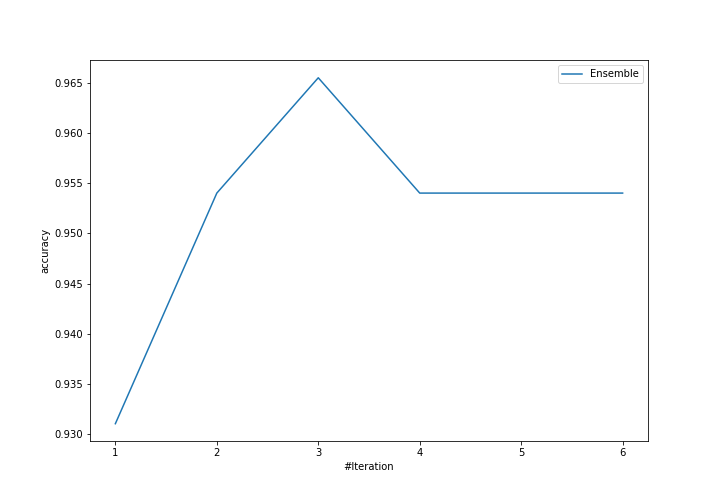
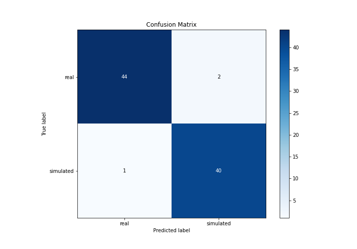
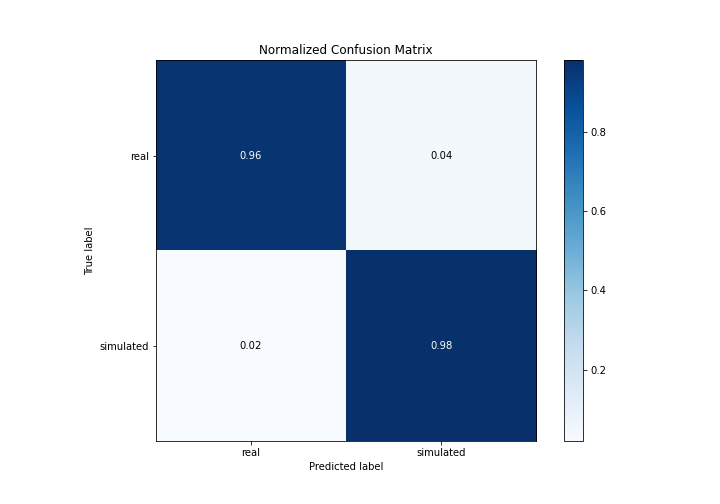
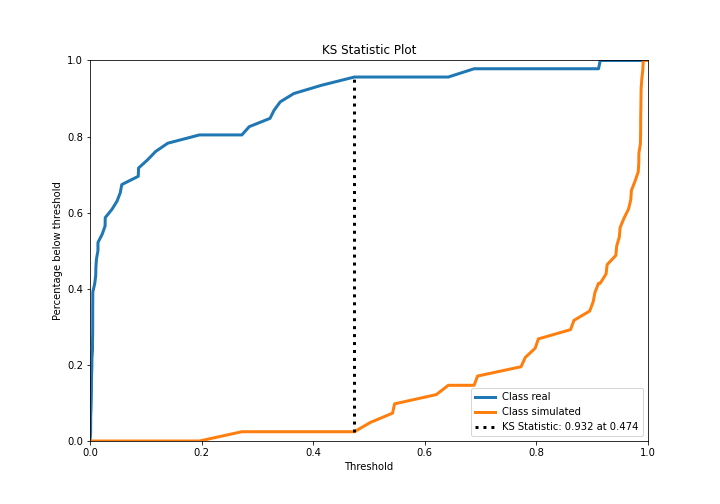
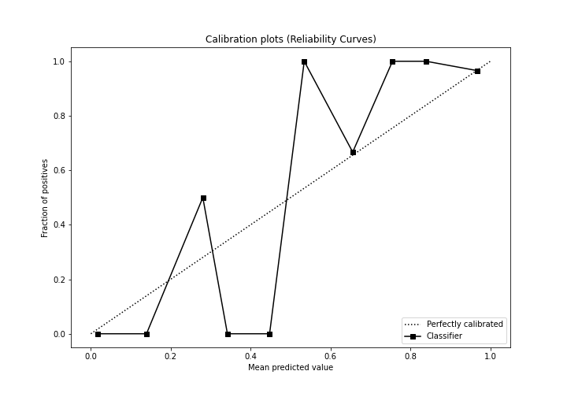
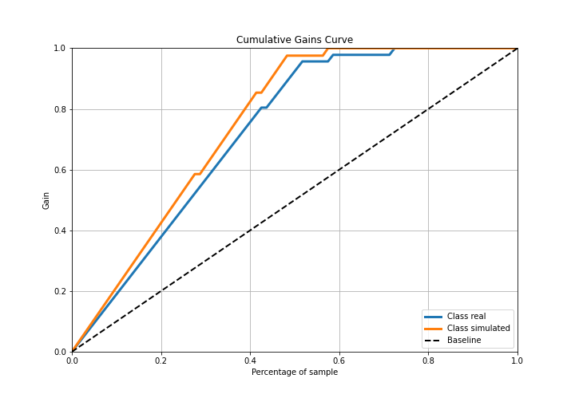

# Summary of Ensemble

[<< Go back](../README.md)

## Ensemble structure
| Model                   |   Weight |
|:------------------------|---------:|
| 4_Default_Xgboost       |        2 |
| 5_Default_NeuralNetwork |        1 |

## Metric details
|           |    score |     threshold |
|:----------|---------:|--------------:|
| logloss   | 0.17066  | nan           |
| auc       | 0.984093 | nan           |
| f1        | 0.963855 |   0.495574    |
| accuracy  | 0.965517 |   0.495574    |
| precision | 1        |   0.98793     |
| recall    | 1        |   0.000987861 |
| mcc       | 0.931145 |   0.495574    |

## Confusion matrix (at threshold=0.495574)
|                      |   Predicted as real |   Predicted as simulated |
|:---------------------|--------------------:|-------------------------:|
| Labeled as real      |                  44 |                        2 |
| Labeled as simulated |                   1 |                       40 |

## Learning curves

## Confusion Matrix

## Normalized Confusion Matrix

## ROC Curve

## Kolmogorov-Smirnov Statistic

## Precision-Recall Curve

## Calibration Curve

## Cumulative Gains Curve

## Lift Curve

[<< Go back](../README.md)
