# Summary of 2_DecisionTree

[<< Go back](../README.md)

## Decision Tree
- **n_jobs**: -1
- **criterion**: gini
- **max_depth**: 3
- **explain_level**: 2

## Validation
 - **validation_type**: split
 - **train_ratio**: 0.75
 - **shuffle**: True
 - **stratify**: True

## Optimized metric
accuracy

## Training time

11.9 seconds

## Metric details
|           |    score |   threshold |
|:----------|---------:|------------:|
| logloss   | 0.7646   |  nan        |
| auc       | 0.882664 |  nan        |
| f1        | 0.869565 |    0        |
| accuracy  | 0.862069 |    0        |
| precision | 0.816327 |    0        |
| recall    | 0.930233 |    0        |
| mcc       | 0.706174 |    0.456349 |

## Confusion matrix (at threshold=0.0)
|                      |   Predicted as real |   Predicted as simulated |
|:---------------------|--------------------:|-------------------------:|
| Labeled as real      |                  35 |                        9 |
| Labeled as simulated |                   3 |                       40 |

## Learning curves
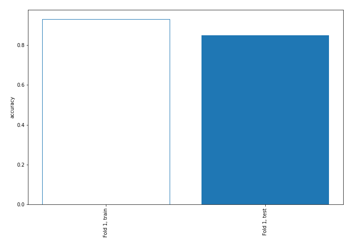

## Decision Tree 

### Tree #1
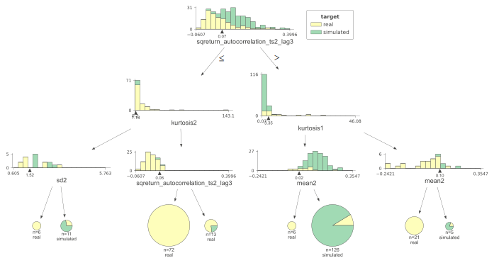

### Rules

if (sqreturn_autocorrelation_ts2_lag3 > 0.067) and (kurtosis1 <= 3.352) and (mean2 > 0.018) then class: simulated (proba: 91.27%) | based on 126 samples

if (sqreturn_autocorrelation_ts2_lag3 <= 0.067) and (kurtosis2 > 1.176) and (sqreturn_autocorrelation_ts2_lag3 <= 0.057) then class: real (proba: 100.0%) | based on 72 samples

if (sqreturn_autocorrelation_ts2_lag3 > 0.067) and (kurtosis1 > 3.352) and (mean2 <= 0.099) then class: real (proba: 100.0%) | based on 21 samples

if (sqreturn_autocorrelation_ts2_lag3 <= 0.067) and (kurtosis2 > 1.176) and (sqreturn_autocorrelation_ts2_lag3 > 0.057) then class: real (proba: 76.92%) | based on 13 samples

if (sqreturn_autocorrelation_ts2_lag3 <= 0.067) and (kurtosis2 <= 1.176) and (sd2 > 1.521) then class: simulated (proba: 72.73%) | based on 11 samples

if (sqreturn_autocorrelation_ts2_lag3 > 0.067) and (kurtosis1 <= 3.352) and (mean2 <= 0.018) then class: real (proba: 100.0%) | based on 6 samples

if (sqreturn_autocorrelation_ts2_lag3 <= 0.067) and (kurtosis2 <= 1.176) and (sd2 <= 1.521) then class: real (proba: 100.0%) | based on 6 samples

if (sqreturn_autocorrelation_ts2_lag3 > 0.067) and (kurtosis1 > 3.352) and (mean2 > 0.099) then class: simulated (proba: 80.0%) | based on 5 samples

## Permutation-based Importance
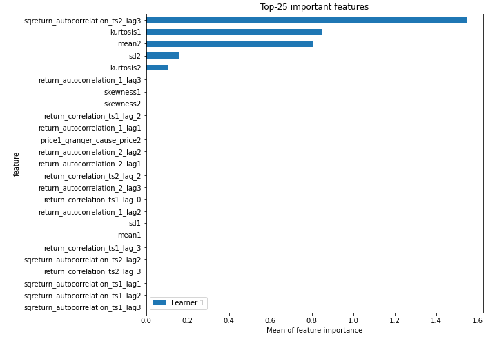
## Confusion Matrix

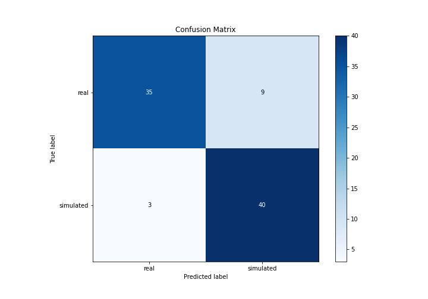

## Normalized Confusion Matrix

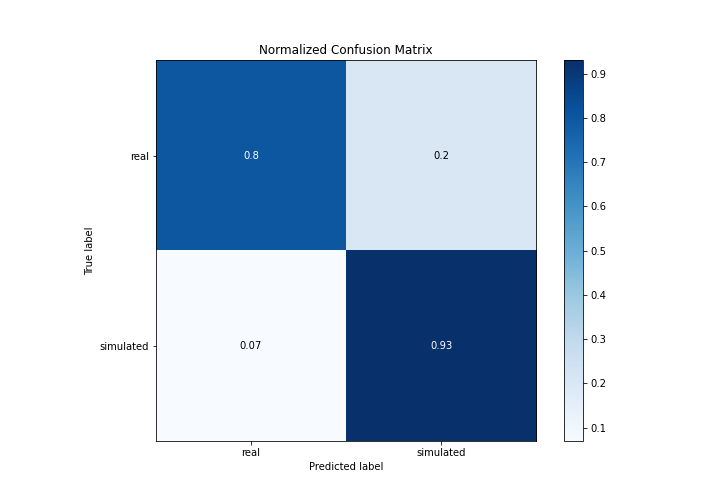

## ROC Curve

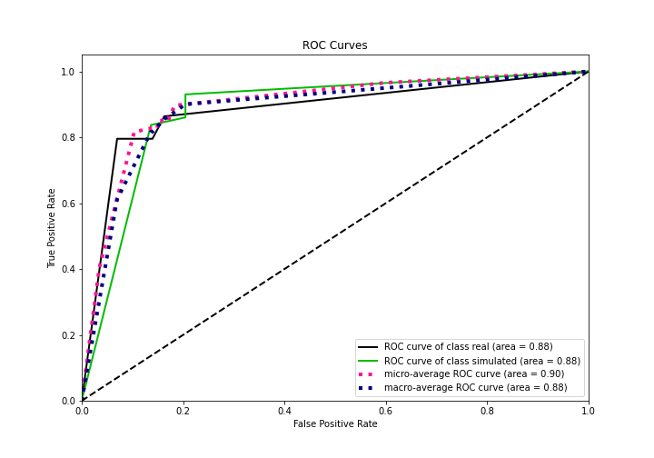

## Kolmogorov-Smirnov Statistic

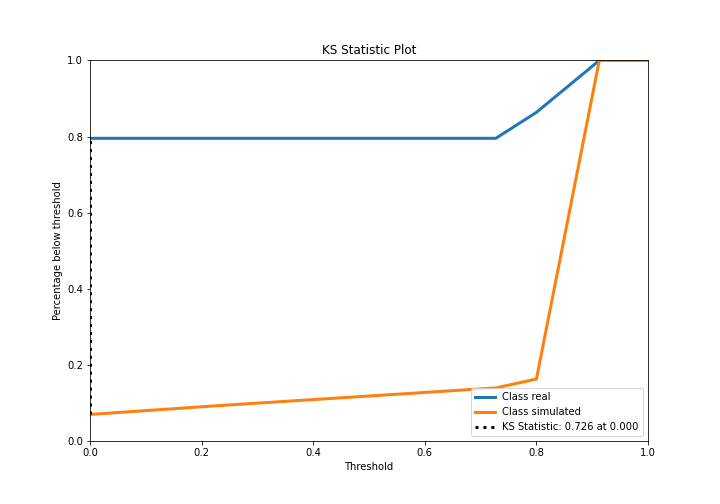

## Precision-Recall Curve

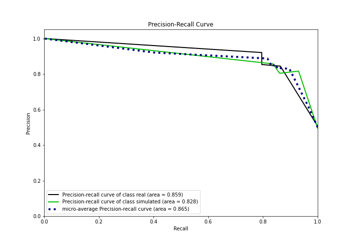

## Calibration Curve

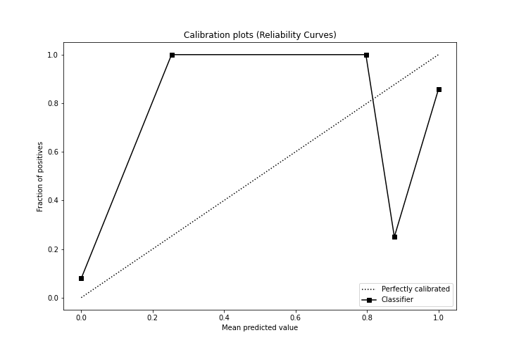

## Cumulative Gains Curve

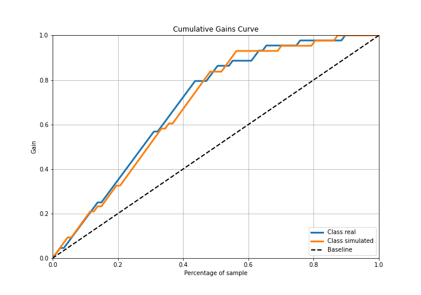

## Lift Curve

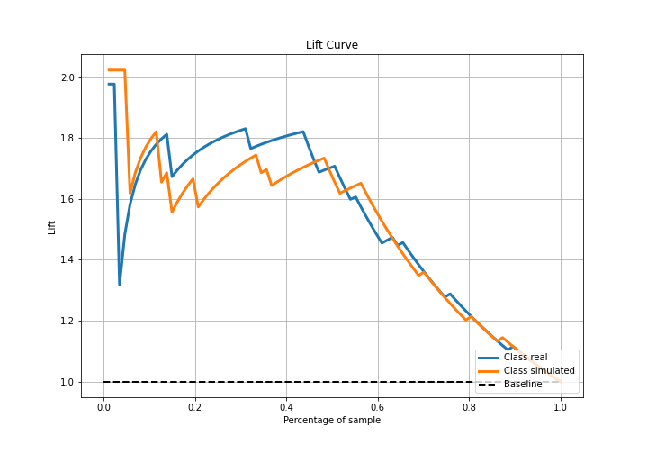

## SHAP Importance
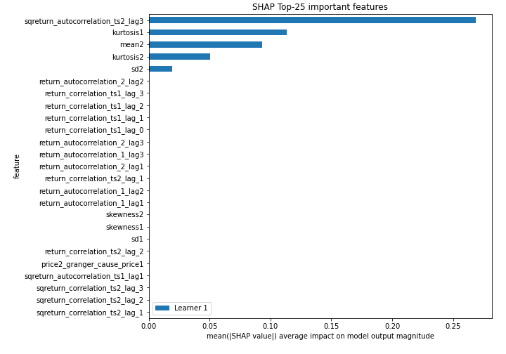

## SHAP Dependence plots

### Dependence (Fold 1)
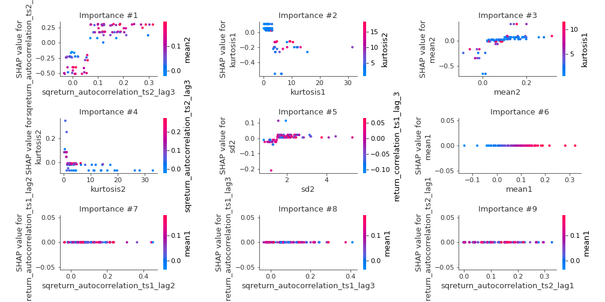

## SHAP Decision plots

### Top-10 Worst decisions for class 0 (Fold 1)
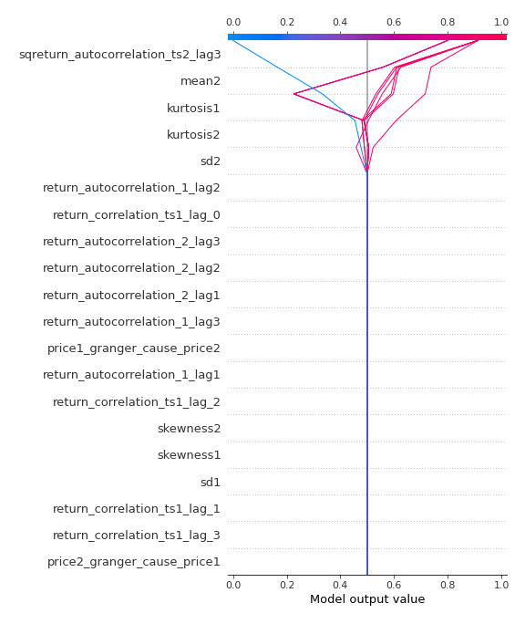
### Top-10 Best decisions for class 0 (Fold 1)
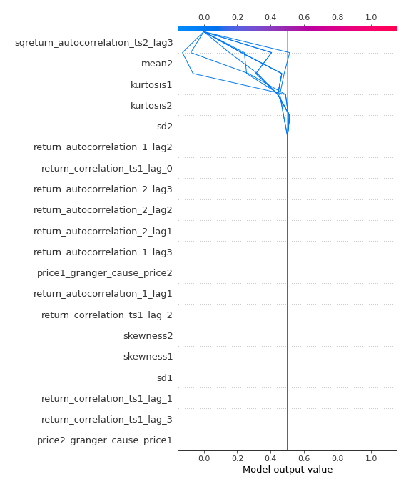
### Top-10 Worst decisions for class 1 (Fold 1)
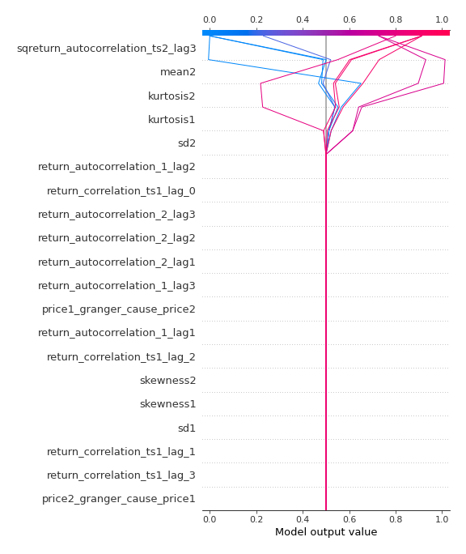
### Top-10 Best decisions for class 1 (Fold 1)
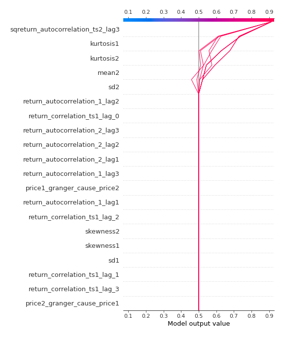

[<< Go back](../README.md)
