# Summary of 3_Linear

[<< Go back](../README.md)

## Logistic Regression (Linear)
- **n_jobs**: -1
- **explain_level**: 2

## Validation
 - **validation_type**: split
 - **train_ratio**: 0.75
 - **shuffle**: True
 - **stratify**: True

## Optimized metric
accuracy

## Training time

9.2 seconds

## Metric details
|           |    score |     threshold |
|:----------|---------:|--------------:|
| logloss   | 0.314159 | nan           |
| auc       | 0.956131 | nan           |
| f1        | 0.923077 |   0.545127    |
| accuracy  | 0.91954  |   0.545127    |
| precision | 1        |   0.821216    |
| recall    | 1        |   5.79146e-07 |
| mcc       | 0.844858 |   0.545127    |

## Confusion matrix (at threshold=0.545127)
|                      |   Predicted as real |   Predicted as simulated |
|:---------------------|--------------------:|-------------------------:|
| Labeled as real      |                  38 |                        6 |
| Labeled as simulated |                   1 |                       42 |

## Learning curves
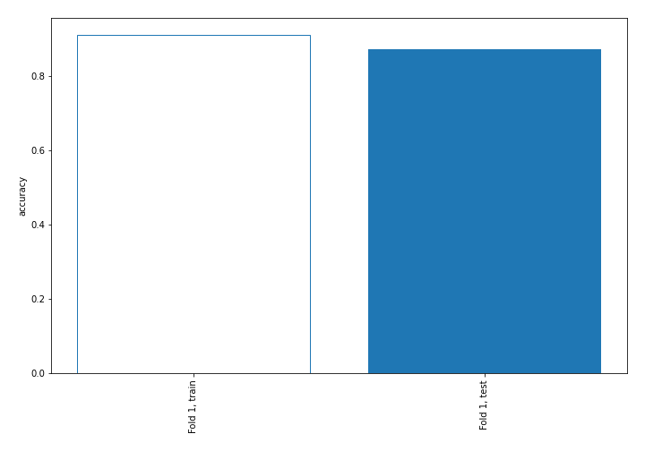

## Coefficients
| feature                           |   Learner_1 |
|:----------------------------------|------------:|
| mean2                             |   2.09548   |
| sqreturn_autocorrelation_ts2_lag3 |   1.82272   |
| mean1                             |   1.4568    |
| sqreturn_autocorrelation_ts2_lag1 |   1.21014   |
| sqreturn_autocorrelation_ts1_lag3 |   1.03015   |
| sqreturn_autocorrelation_ts2_lag2 |   0.945702  |
| return_autocorrelation_2_lag1     |   0.688485  |
| sqreturn_autocorrelation_ts1_lag1 |   0.670086  |
| sqreturn_autocorrelation_ts1_lag2 |   0.591694  |
| return_autocorrelation_1_lag3     |   0.485694  |
| return_correlation_ts1_lag_1      |   0.416329  |
| sqreturn_correlation_ts1_lag_1    |   0.416329  |
| sd1                               |   0.360335  |
| sqreturn_correlation_ts2_lag_1    |   0.345972  |
| return_correlation_ts2_lag_1      |   0.345972  |
| return_autocorrelation_1_lag1     |   0.298391  |
| return_autocorrelation_2_lag2     |   0.289207  |
| return_autocorrelation_2_lag3     |   0.247155  |
| return_correlation_ts2_lag_3      |   0.227785  |
| sqreturn_correlation_ts2_lag_3    |   0.227785  |
| sqreturn_correlation_ts1_lag_3    |   0.159016  |
| return_correlation_ts1_lag_3      |   0.159016  |
| return_correlation_ts2_lag_2      |  -0.0217381 |
| sqreturn_correlation_ts2_lag_2    |  -0.0217381 |
| return_autocorrelation_1_lag2     |  -0.0291515 |
| sqreturn_correlation_ts1_lag_0    |  -0.121436  |
| return_correlation_ts1_lag_0      |  -0.121436  |
| return_correlation_ts1_lag_2      |  -0.265335  |
| sqreturn_correlation_ts1_lag_2    |  -0.265335  |
| sd2                               |  -0.285747  |
| skewness2                         |  -0.359689  |
| price1_granger_cause_price2       |  -0.627914  |
| skewness1                         |  -0.683939  |
| price2_granger_cause_price1       |  -0.758815  |
| intercept                         |  -1.87588   |
| kurtosis2                         |  -2.83065   |
| kurtosis1                         |  -3.16594   |

## Permutation-based Importance
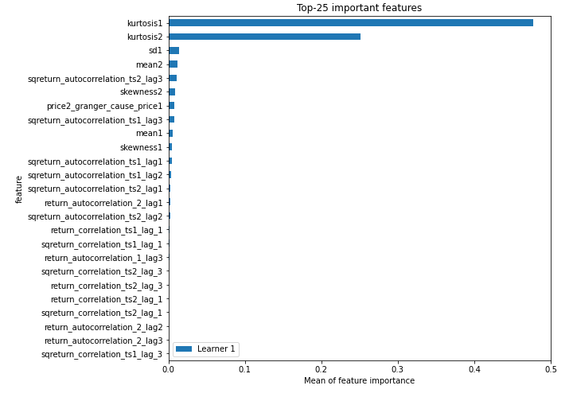
## Confusion Matrix

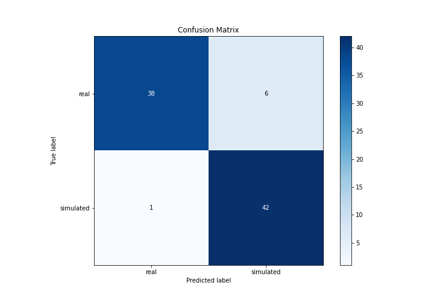

## Normalized Confusion Matrix

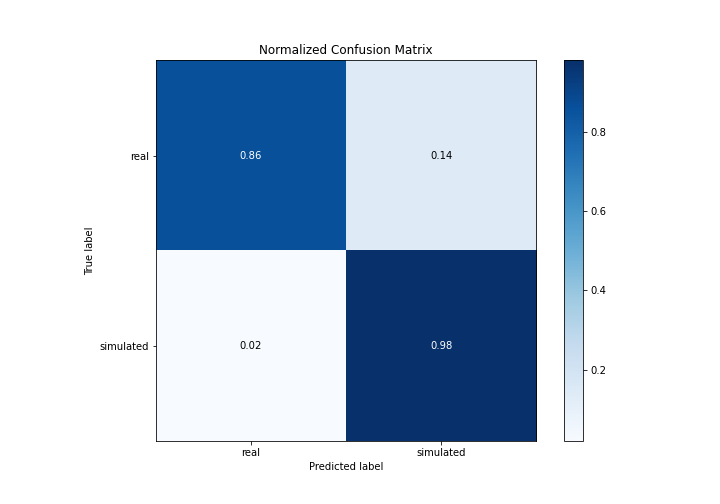

## ROC Curve

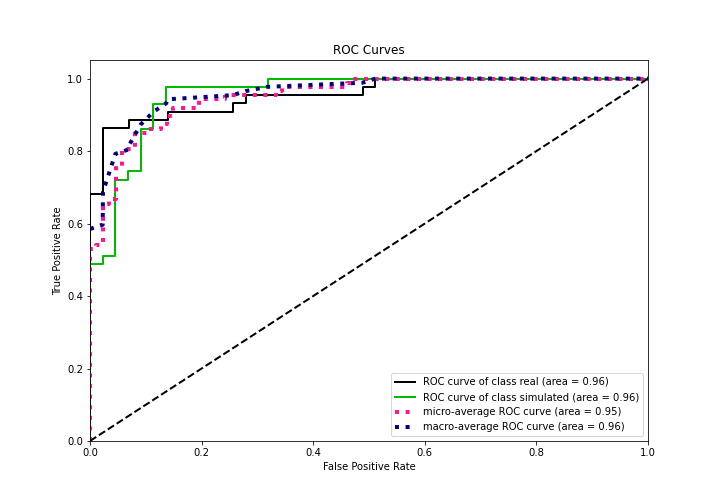

## Kolmogorov-Smirnov Statistic

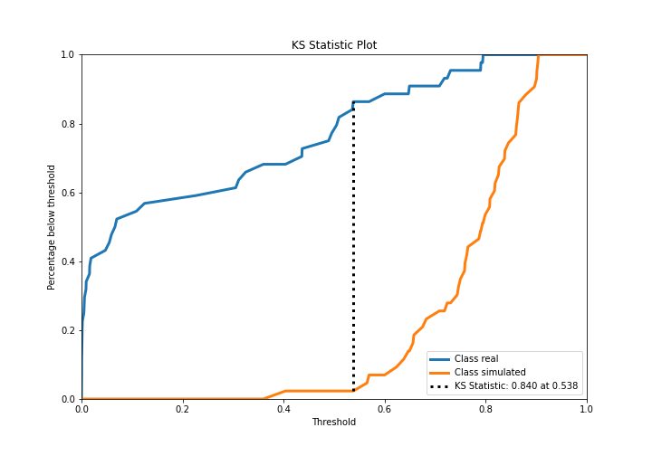

## Precision-Recall Curve

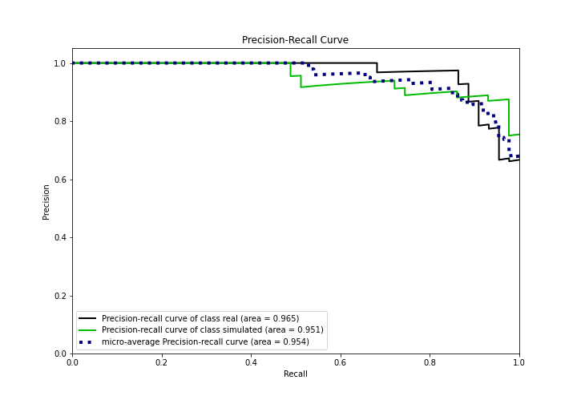

## Calibration Curve

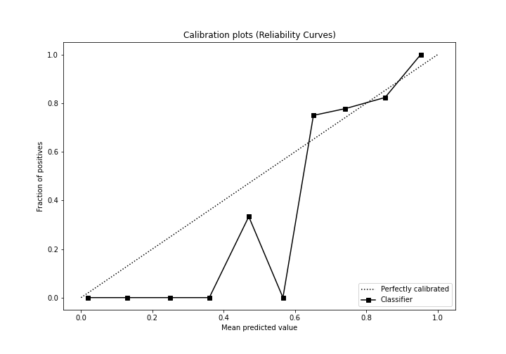

## Cumulative Gains Curve

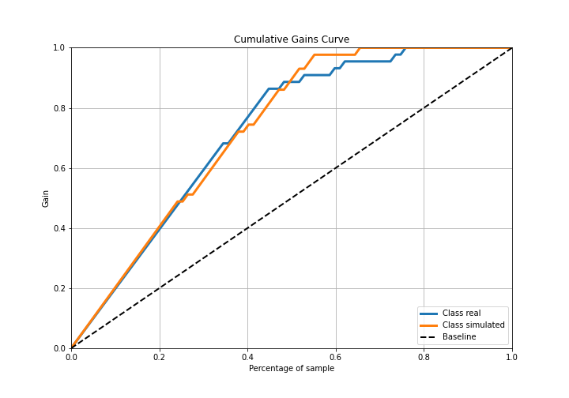

## Lift Curve

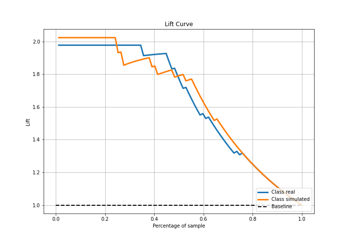

## SHAP Importance
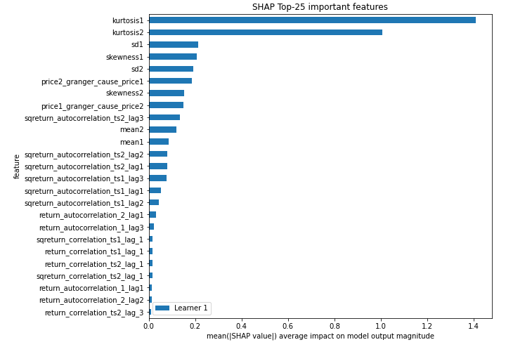

## SHAP Dependence plots

### Dependence (Fold 1)
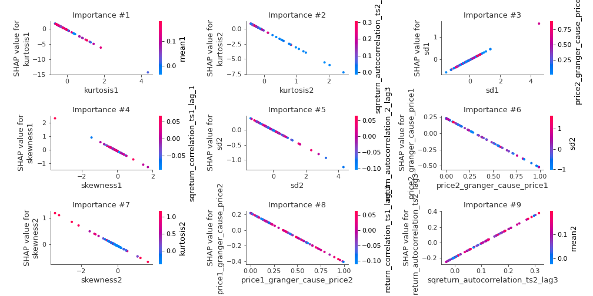

## SHAP Decision plots

### Top-10 Worst decisions for class 0 (Fold 1)
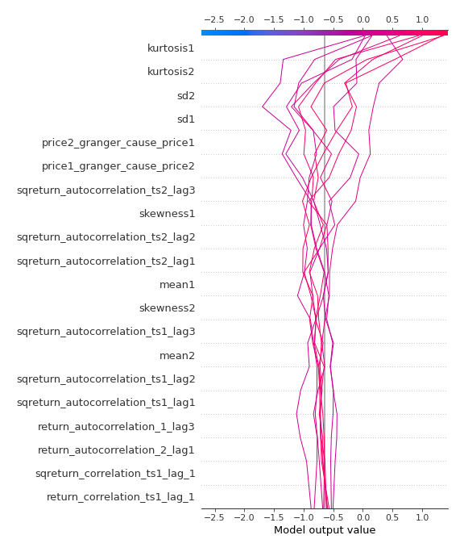
### Top-10 Best decisions for class 0 (Fold 1)
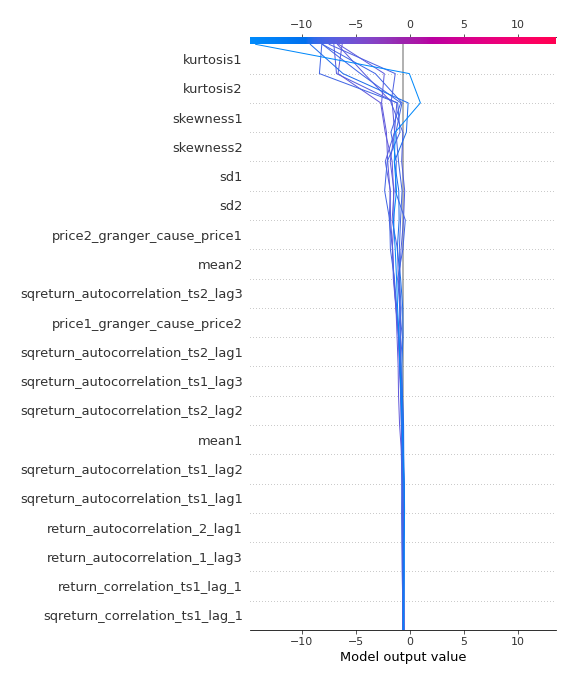
### Top-10 Worst decisions for class 1 (Fold 1)
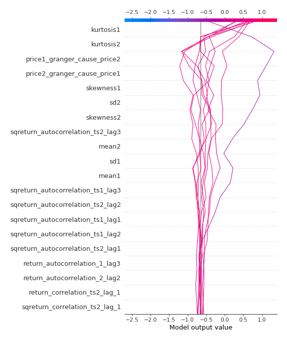
### Top-10 Best decisions for class 1 (Fold 1)
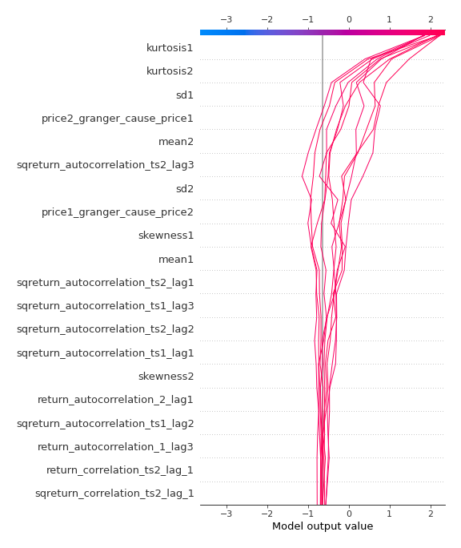

[<< Go back](../README.md)
