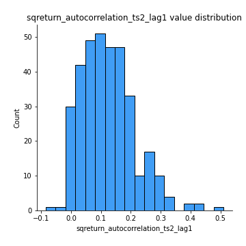

# Exploratory Data Analysis

[<< Go back](../README.md)
## Feature : target
- **Feature type** : categorical
- **Missing** : 0.0%
- **Unique** : 2
- **Count** :347
- **Unique** :2
- **Top** :real
- **Freq** :174

## Feature : mean1
- **Feature type** : continous
- **Missing** : 0.0%
- **Unique** : 347
- **Count** :347.0
- **Mean** :0.07467450444557393
- **Std** :0.08015793570522381
- **Min** :-0.22632637961920957
- **25%th Percentile** : 0.024010826559184694
- **50%th Percentile** : 0.07313935999969255
- **75%th Percentile** : 0.12142705263829423
- **Max** :0.37175100008111034

## Feature : mean2
- **Feature type** : continous
- **Missing** : 0.0%
- **Unique** : 347
- **Count** :347.0
- **Mean** :0.09374991585211916
- **Std** :0.08709842039359014
- **Min** :-0.24205418062825398
- **25%th Percentile** : 0.0482042237168355
- **50%th Percentile** : 0.09759060979637184
- **75%th Percentile** : 0.1481745863656092
- **Max** :0.35467233975026907

## Feature : sd1
- **Feature type** : continous
- **Missing** : 0.0%
- **Unique** : 347
- **Count** :347.0
- **Mean** :2.0695404892929217
- **Std** :0.8220925756801297
- **Min** :0.7470080772831957
- **25%th Percentile** : 1.5633557223705918
- **50%th Percentile** : 1.981551860590292
- **75%th Percentile** : 2.435387694761558
- **Max** :9.236766377527575

## Feature : sd2
- **Feature type** : continous
- **Missing** : 0.0%
- **Unique** : 347
- **Count** :347.0
- **Mean** :1.937855248687392
- **Std** :0.7668077395634089
- **Min** :0.6045560654117339
- **25%th Percentile** : 1.4054659100429183
- **50%th Percentile** : 1.8125579887164573
- **75%th Percentile** : 2.2594897280506716
- **Max** :5.762808157208253

## Feature : skewness1
- **Feature type** : continous
- **Missing** : 0.0%
- **Unique** : 347
- **Count** :347.0
- **Mean** :-0.15412054723080804
- **Std** :0.6090306575067992
- **Min** :-3.530116233761814
- **25%th Percentile** : -0.30475539284357767
- **50%th Percentile** : -0.12802272712456558
- **75%th Percentile** : 0.057859616710274855
- **Max** :2.5845963767725557

## Feature : skewness2
- **Feature type** : continous
- **Missing** : 0.0%
- **Unique** : 347
- **Count** :347.0
- **Mean** :-0.25534178864182955
- **Std** :0.8342735329781014
- **Min** :-8.801502855292393
- **25%th Percentile** : -0.37768186537505954
- **50%th Percentile** : -0.1462964219954336
- **75%th Percentile** : 0.04152506330145607
- **Max** :2.2606839051517187

## Feature : kurtosis1
- **Feature type** : continous
- **Missing** : 0.0%
- **Unique** : 347
- **Count** :347.0
- **Mean** :4.0717555495323206
- **Std** :5.866860271869761
- **Min** :0.07149361823522637
- **25%th Percentile** : 1.1946540620378299
- **50%th Percentile** : 1.9621195410040753
- **75%th Percentile** : 4.020109176018237
- **Max** :46.07507808162177

## Feature : kurtosis2
- **Feature type** : continous
- **Missing** : 0.0%
- **Unique** : 347
- **Count** :347.0
- **Mean** :4.992033747868234
- **Std** :10.39291447513146
- **Min** :0.15044486626750198
- **25%th Percentile** : 1.2253542609535182
- **50%th Percentile** : 2.1560704326812066
- **75%th Percentile** : 4.466753057909188
- **Max** :143.10871011533666

## Feature : return_autocorrelation_1_lag1
- **Feature type** : continous
- **Missing** : 0.0%
- **Unique** : 347
- **Count** :347.0
- **Mean** :-0.012741603743094451
- **Std** :0.06398349606717513
- **Min** :-0.20673896439036124
- **25%th Percentile** : -0.059130457774401915
- **50%th Percentile** : -0.01026901643249607
- **75%th Percentile** : 0.028472364700535307
- **Max** :0.14602096248093385

## Feature : return_autocorrelation_1_lag2
- **Feature type** : continous
- **Missing** : 0.0%
- **Unique** : 347
- **Count** :347.0
- **Mean** :-0.005732829514133625
- **Std** :0.05077425096085425
- **Min** :-0.13309283796645122
- **25%th Percentile** : -0.0409061214691733
- **50%th Percentile** : -0.0053551818745244525
- **75%th Percentile** : 0.026223954420436825
- **Max** :0.1561488228015672

## Feature : return_autocorrelation_1_lag3
- **Feature type** : continous
- **Missing** : 0.0%
- **Unique** : 347
- **Count** :347.0
- **Mean** :-0.007299918019360136
- **Std** :0.05550321014757546
- **Min** :-0.1940836867390813
- **25%th Percentile** : -0.044454010806710034
- **50%th Percentile** : -0.009180659248782374
- **75%th Percentile** : 0.0314523493830606
- **Max** :0.17805869530681923

## Feature : return_autocorrelation_2_lag1
- **Feature type** : continous
- **Missing** : 0.0%
- **Unique** : 347
- **Count** :347.0
- **Mean** :-0.013128084233562197
- **Std** :0.06368114656207496
- **Min** :-0.25075531010123286
- **25%th Percentile** : -0.04733774244306746
- **50%th Percentile** : -0.01302969649053556
- **75%th Percentile** : 0.023795685029265004
- **Max** :0.31863413537898483

## Feature : return_autocorrelation_2_lag2
- **Feature type** : continous
- **Missing** : 0.0%
- **Unique** : 347
- **Count** :347.0
- **Mean** :-0.004075993433920759
- **Std** :0.05581319466822752
- **Min** :-0.15323211089747296
- **25%th Percentile** : -0.04139557829164188
- **50%th Percentile** : -0.006065534172600531
- **75%th Percentile** : 0.02721319901347602
- **Max** :0.20974504043791217

## Feature : return_autocorrelation_2_lag3
- **Feature type** : continous
- **Missing** : 0.0%
- **Unique** : 347
- **Count** :347.0
- **Mean** :-0.010433260945581644
- **Std** :0.05428368945396178
- **Min** :-0.18615939113362714
- **25%th Percentile** : -0.04674551025180736
- **50%th Percentile** : -0.008369131258069509
- **75%th Percentile** : 0.025952347172220815
- **Max** :0.14757810721249157

## Feature : return_correlation_ts1_lag_0
- **Feature type** : continous
- **Missing** : 0.0%
- **Unique** : 347
- **Count** :347.0
- **Mean** :0.32908372594806107
- **Std** :0.11159685202812072
- **Min** :-0.027089510445801036
- **25%th Percentile** : 0.26867929906942595
- **50%th Percentile** : 0.33925725876563856
- **75%th Percentile** : 0.3934732899618092
- **Max** :0.7041861626832071

## Feature : return_correlation_ts1_lag_1
- **Feature type** : continous
- **Missing** : 0.0%
- **Unique** : 347
- **Count** :347.0
- **Mean** :-0.007228710133791753
- **Std** :0.052930758716544714
- **Min** :-0.1549695474991776
- **25%th Percentile** : -0.04351501295031175
- **50%th Percentile** : -0.006267544504129382
- **75%th Percentile** : 0.030292646666367908
- **Max** :0.15499424718508623

## Feature : return_correlation_ts1_lag_2
- **Feature type** : continous
- **Missing** : 0.0%
- **Unique** : 347
- **Count** :347.0
- **Mean** :-0.005538239713433526
- **Std** :0.050659101585404175
- **Min** :-0.14753438504007563
- **25%th Percentile** : -0.0410431843930677
- **50%th Percentile** : -0.005882160371179022
- **75%th Percentile** : 0.02929143979608237
- **Max** :0.13961174717976793

## Feature : return_correlation_ts1_lag_3
- **Feature type** : continous
- **Missing** : 0.0%
- **Unique** : 347
- **Count** :347.0
- **Mean** :-0.004652612491433529
- **Std** :0.05604086900686827
- **Min** :-0.15652036464758967
- **25%th Percentile** : -0.04745352457759388
- **50%th Percentile** : -0.006220813910020396
- **75%th Percentile** : 0.02786683349792246
- **Max** :0.1636773216468148

## Feature : return_correlation_ts2_lag_1
- **Feature type** : continous
- **Missing** : 0.0%
- **Unique** : 347
- **Count** :347.0
- **Mean** :-0.011151305726715154
- **Std** :0.05595153904434822
- **Min** :-0.2081139431093261
- **25%th Percentile** : -0.048045371365797895
- **50%th Percentile** : -0.00883613301997916
- **75%th Percentile** : 0.027429661312396297
- **Max** :0.15029176370550212

## Feature : return_correlation_ts2_lag_2
- **Feature type** : continous
- **Missing** : 0.0%
- **Unique** : 347
- **Count** :347.0
- **Mean** :-0.0023264826911190573
- **Std** :0.05092696662555675
- **Min** :-0.23751835475804678
- **25%th Percentile** : -0.034817003811317596
- **50%th Percentile** : -0.003994199611078405
- **75%th Percentile** : 0.0276458456414507
- **Max** :0.20772887392904255

## Feature : return_correlation_ts2_lag_3
- **Feature type** : continous
- **Missing** : 0.0%
- **Unique** : 347
- **Count** :347.0
- **Mean** :-0.0077398348171613
- **Std** :0.05483821003837337
- **Min** :-0.17564076057312866
- **25%th Percentile** : -0.03960956201968906
- **50%th Percentile** : -0.0082905484263069
- **75%th Percentile** : 0.02737385344349238
- **Max** :0.13998293503005874

## Feature : sqreturn_autocorrelation_ts1_lag1
- **Feature type** : continous
- **Missing** : 0.0%
- **Unique** : 347
- **Count** :347.0
- **Mean** :0.12520263660135733
- **Std** :0.09570634986733745
- **Min** :-0.06532118872798363
- **25%th Percentile** : 0.05749407521416887
- **50%th Percentile** : 0.10594348552776423
- **75%th Percentile** : 0.17627408912455927
- **Max** :0.49414293176447355

## Feature : sqreturn_autocorrelation_ts1_lag2
- **Feature type** : continous
- **Missing** : 0.0%
- **Unique** : 347
- **Count** :347.0
- **Mean** :0.11000644333632782
- **Std** :0.09278566865396666
- **Min** :-0.05419304650062953
- **25%th Percentile** : 0.038769371248873315
- **50%th Percentile** : 0.09426114116017689
- **75%th Percentile** : 0.16654687248752065
- **Max** :0.4522162366773919

## Feature : sqreturn_autocorrelation_ts1_lag3
- **Feature type** : continous
- **Missing** : 0.0%
- **Unique** : 347
- **Count** :347.0
- **Mean** :0.10032227407073918
- **Std** :0.09091265094840115
- **Min** :-0.06486026764840777
- **25%th Percentile** : 0.03238136596218329
- **50%th Percentile** : 0.08637341578403415
- **75%th Percentile** : 0.15557626207328568
- **Max** :0.44755937369538146

## Feature : sqreturn_autocorrelation_ts2_lag1
- **Feature type** : continous
- **Missing** : 0.0%
- **Unique** : 347
- **Count** :347.0
- **Mean** :0.12278107138249023
- **Std** :0.0885088585561616
- **Min** :-0.08520586663750691
- **25%th Percentile** : 0.05463656361338756
- **50%th Percentile** : 0.11307022889266426
- **75%th Percentile** : 0.171454252212426
- **Max** :0.510085647437958

## Feature : sqreturn_autocorrelation_ts2_lag2
- **Feature type** : continous
- **Missing** : 0.0%
- **Unique** : 347
- **Count** :347.0
- **Mean** :0.10761486075660844
- **Std** :0.09454582039669822
- **Min** :-0.04424883229120365
- **25%th Percentile** : 0.03142450760207626
- **50%th Percentile** : 0.0972967108200632
- **75%th Percentile** : 0.16741405078338814
- **Max** :0.45676817892778204

## Feature : sqreturn_autocorrelation_ts2_lag3
- **Feature type** : continous
- **Missing** : 0.0%
- **Unique** : 347
- **Count** :347.0
- **Mean** :0.10116309020313144
- **Std** :0.0863586648777644
- **Min** :-0.06065894750062144
- **25%th Percentile** : 0.027462534026058305
- **50%th Percentile** : 0.10062500620630117
- **75%th Percentile** : 0.15929392231177325
- **Max** :0.39963462440030695

## Feature : sqreturn_correlation_ts1_lag_0
- **Feature type** : continous
- **Missing** : 0.0%
- **Unique** : 347
- **Count** :347.0
- **Mean** :0.32908372594806107
- **Std** :0.11159685202812072
- **Min** :-0.027089510445801036
- **25%th Percentile** : 0.26867929906942595
- **50%th Percentile** : 0.33925725876563856
- **75%th Percentile** : 0.3934732899618092
- **Max** :0.7041861626832071

## Feature : sqreturn_correlation_ts1_lag_1
- **Feature type** : continous
- **Missing** : 0.0%
- **Unique** : 347
- **Count** :347.0
- **Mean** :-0.007228710133791753
- **Std** :0.052930758716544714
- **Min** :-0.1549695474991776
- **25%th Percentile** : -0.04351501295031175
- **50%th Percentile** : -0.006267544504129382
- **75%th Percentile** : 0.030292646666367908
- **Max** :0.15499424718508623

## Feature : sqreturn_correlation_ts1_lag_2
- **Feature type** : continous
- **Missing** : 0.0%
- **Unique** : 347
- **Count** :347.0
- **Mean** :-0.005538239713433526
- **Std** :0.050659101585404175
- **Min** :-0.14753438504007563
- **25%th Percentile** : -0.0410431843930677
- **50%th Percentile** : -0.005882160371179022
- **75%th Percentile** : 0.02929143979608237
- **Max** :0.13961174717976793

## Feature : sqreturn_correlation_ts1_lag_3
- **Feature type** : continous
- **Missing** : 0.0%
- **Unique** : 347
- **Count** :347.0
- **Mean** :-0.004652612491433529
- **Std** :0.05604086900686827
- **Min** :-0.15652036464758967
- **25%th Percentile** : -0.04745352457759388
- **50%th Percentile** : -0.006220813910020396
- **75%th Percentile** : 0.02786683349792246
- **Max** :0.1636773216468148

## Feature : sqreturn_correlation_ts2_lag_1
- **Feature type** : continous
- **Missing** : 0.0%
- **Unique** : 347
- **Count** :347.0
- **Mean** :-0.011151305726715154
- **Std** :0.05595153904434822
- **Min** :-0.2081139431093261
- **25%th Percentile** : -0.048045371365797895
- **50%th Percentile** : -0.00883613301997916
- **75%th Percentile** : 0.027429661312396297
- **Max** :0.15029176370550212

## Feature : sqreturn_correlation_ts2_lag_2
- **Feature type** : continous
- **Missing** : 0.0%
- **Unique** : 347
- **Count** :347.0
- **Mean** :-0.0023264826911190573
- **Std** :0.05092696662555675
- **Min** :-0.23751835475804678
- **25%th Percentile** : -0.034817003811317596
- **50%th Percentile** : -0.003994199611078405
- **75%th Percentile** : 0.0276458456414507
- **Max** :0.20772887392904255

## Feature : sqreturn_correlation_ts2_lag_3
- **Feature type** : continous
- **Missing** : 0.0%
- **Unique** : 347
- **Count** :347.0
- **Mean** :-0.0077398348171613
- **Std** :0.05483821003837337
- **Min** :-0.17564076057312866
- **25%th Percentile** : -0.03960956201968906
- **50%th Percentile** : -0.0082905484263069
- **75%th Percentile** : 0.02737385344349238
- **Max** :0.13998293503005874

## Feature : price2_granger_cause_price1
- **Feature type** : continous
- **Missing** : 0.0%
- **Unique** : 347
- **Count** :347.0
- **Mean** :0.29841738125964823
- **Std** :0.28904802130206725
- **Min** :8.316015479226624e-12
- **25%th Percentile** : 0.03805593655357083
- **50%th Percentile** : 0.21129739990744706
- **75%th Percentile** : 0.4908491009946698
- **Max** :0.9908384593913245

## Feature : price1_granger_cause_price2
- **Feature type** : continous
- **Missing** : 0.0%
- **Unique** : 347
- **Count** :347.0
- **Mean** :0.3327301390996952
- **Std** :0.2917320642492292
- **Min** :1.1398318102220108e-11
- **25%th Percentile** : 0.07118001710763183
- **50%th Percentile** : 0.25263716622550514
- **75%th Percentile** : 0.5700181513702063
- **Max** :0.9951398266867577

[<< Go back](../README.md)
