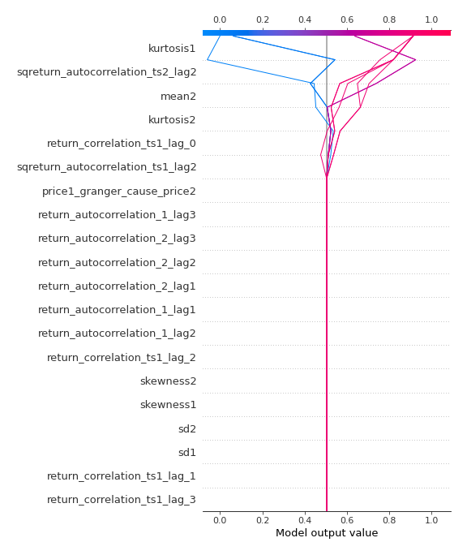

# Summary of 2_DecisionTree

[<< Go back](../README.md)

## Decision Tree
- **n_jobs**: -1
- **criterion**: gini
- **max_depth**: 3
- **explain_level**: 2

## Validation
 - **validation_type**: split
 - **train_ratio**: 0.75
 - **shuffle**: True
 - **stratify**: True

## Optimized metric
accuracy

## Training time

11.1 seconds

## Metric details
|           |    score |   threshold |
|:----------|---------:|------------:|
| logloss   | 0.654146 |  nan        |
| auc       | 0.875529 |  nan        |
| f1        | 0.863158 |    0.456349 |
| accuracy  | 0.850575 |    0.456349 |
| precision | 0.829787 |    0.774531 |
| recall    | 0.977273 |    0        |
| mcc       | 0.709844 |    0.456349 |

## Confusion matrix (at threshold=0.456349)
|                      |   Predicted as real |   Predicted as simulated |
|:---------------------|--------------------:|-------------------------:|
| Labeled as real      |                  33 |                       10 |
| Labeled as simulated |                   3 |                       41 |

## Learning curves

## Decision Tree 

### Tree #1

### Rules

if (sqreturn_autocorrelation_ts2_lag2 > 0.058) and (kurtosis1 <= 3.101) and (return_correlation_ts1_lag_0 <= 0.458) then class: simulated (proba: 91.27%) | based on 126 samples

if (sqreturn_autocorrelation_ts2_lag2 <= 0.058) and (kurtosis2 > 1.404) then class: real (proba: 100.0%) | based on 72 samples

if (sqreturn_autocorrelation_ts2_lag2 > 0.058) and (kurtosis1 > 3.101) and (mean2 <= 0.104) then class: real (proba: 93.75%) | based on 32 samples

if (sqreturn_autocorrelation_ts2_lag2 > 0.058) and (kurtosis1 > 3.101) and (mean2 > 0.104) then class: simulated (proba: 63.64%) | based on 11 samples

if (sqreturn_autocorrelation_ts2_lag2 <= 0.058) and (kurtosis2 <= 1.404) and (sqreturn_autocorrelation_ts1_lag2 <= 0.045) then class: real (proba: 85.71%) | based on 7 samples

if (sqreturn_autocorrelation_ts2_lag2 > 0.058) and (kurtosis1 <= 3.101) and (return_correlation_ts1_lag_0 > 0.458) then class: real (proba: 100.0%) | based on 6 samples

if (sqreturn_autocorrelation_ts2_lag2 <= 0.058) and (kurtosis2 <= 1.404) and (sqreturn_autocorrelation_ts1_lag2 > 0.045) then class: simulated (proba: 100.0%) | based on 6 samples

## Permutation-based Importance

## Confusion Matrix

## Normalized Confusion Matrix

## ROC Curve

## Kolmogorov-Smirnov Statistic

## Precision-Recall Curve

## Calibration Curve

## Cumulative Gains Curve

## Lift Curve

## SHAP Importance

## SHAP Dependence plots

### Dependence (Fold 1)

## SHAP Decision plots

### Top-10 Worst decisions for class 0 (Fold 1)

### Top-10 Best decisions for class 0 (Fold 1)

### Top-10 Worst decisions for class 1 (Fold 1)

### Top-10 Best decisions for class 1 (Fold 1)

[<< Go back](../README.md)
