# Summary of 3_Linear

[<< Go back](../README.md)

## Logistic Regression (Linear)
- **n_jobs**: -1
- **explain_level**: 2

## Validation
 - **validation_type**: split
 - **train_ratio**: 0.75
 - **shuffle**: True
 - **stratify**: True

## Optimized metric
accuracy

## Training time

10.0 seconds

## Metric details
|           |    score |     threshold |
|:----------|---------:|--------------:|
| logloss   | 0.370893 | nan           |
| auc       | 0.928647 | nan           |
| f1        | 0.886598 |   0.396625    |
| accuracy  | 0.873563 |   0.396625    |
| precision | 0.964286 |   0.730517    |
| recall    | 1        |   4.11047e-06 |
| mcc       | 0.763085 |   0.396625    |

## Confusion matrix (at threshold=0.396625)
|                      |   Predicted as real |   Predicted as simulated |
|:---------------------|--------------------:|-------------------------:|
| Labeled as real      |                  33 |                       10 |
| Labeled as simulated |                   1 |                       43 |

## Learning curves
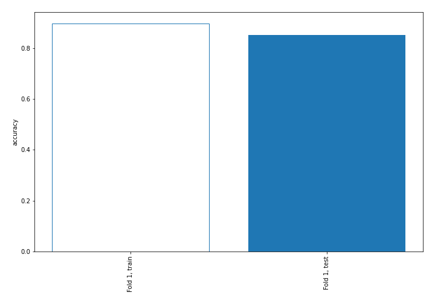

## Coefficients
| feature                           |   Learner_1 |
|:----------------------------------|------------:|
| sqreturn_autocorrelation_ts2_lag3 |   1.8939    |
| mean1                             |   1.78524   |
| mean2                             |   1.57061   |
| sqreturn_autocorrelation_ts1_lag3 |   1.53236   |
| sqreturn_autocorrelation_ts2_lag2 |   1.23317   |
| sqreturn_autocorrelation_ts1_lag2 |   0.836098  |
| return_autocorrelation_2_lag1     |   0.817493  |
| sqreturn_autocorrelation_ts2_lag1 |   0.790927  |
| return_autocorrelation_1_lag3     |   0.658653  |
| sqreturn_correlation_ts1_lag_1    |   0.562585  |
| return_correlation_ts1_lag_1      |   0.562585  |
| return_correlation_ts2_lag_3      |   0.555938  |
| sqreturn_correlation_ts2_lag_3    |   0.555938  |
| sqreturn_autocorrelation_ts1_lag1 |   0.432902  |
| return_autocorrelation_1_lag1     |   0.430037  |
| return_correlation_ts2_lag_1      |   0.426018  |
| sqreturn_correlation_ts2_lag_1    |   0.426018  |
| sd1                               |   0.361757  |
| sqreturn_correlation_ts1_lag_3    |   0.30613   |
| return_correlation_ts1_lag_3      |   0.30613   |
| return_autocorrelation_2_lag2     |   0.291718  |
| return_autocorrelation_2_lag3     |   0.206409  |
| return_autocorrelation_1_lag2     |   0.19282   |
| price1_granger_cause_price2       |   0.161178  |
| return_correlation_ts1_lag_2      |   0.0318154 |
| sqreturn_correlation_ts1_lag_2    |   0.0318154 |
| sd2                               |  -0.0942865 |
| return_correlation_ts2_lag_2      |  -0.186881  |
| sqreturn_correlation_ts2_lag_2    |  -0.186881  |
| skewness2                         |  -0.581968  |
| skewness1                         |  -0.772621  |
| return_correlation_ts1_lag_0      |  -0.775489  |
| sqreturn_correlation_ts1_lag_0    |  -0.775489  |
| price2_granger_cause_price1       |  -0.891735  |
| intercept                         |  -1.47565   |
| kurtosis1                         |  -2.59646   |
| kurtosis2                         |  -2.91053   |

## Permutation-based Importance
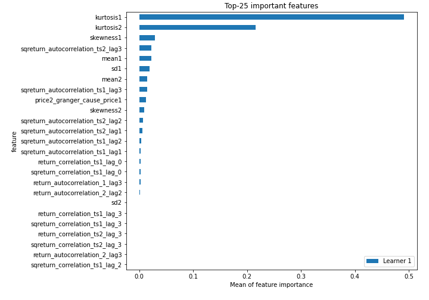
## Confusion Matrix

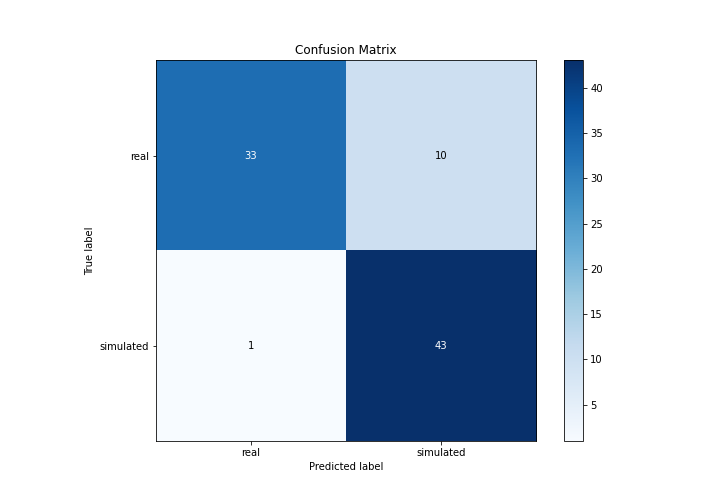

## Normalized Confusion Matrix

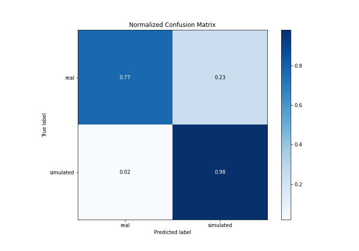

## ROC Curve

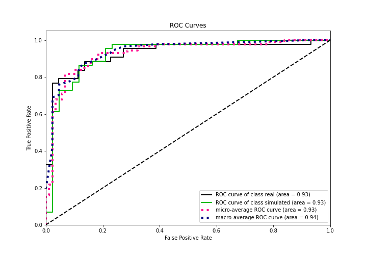

## Kolmogorov-Smirnov Statistic

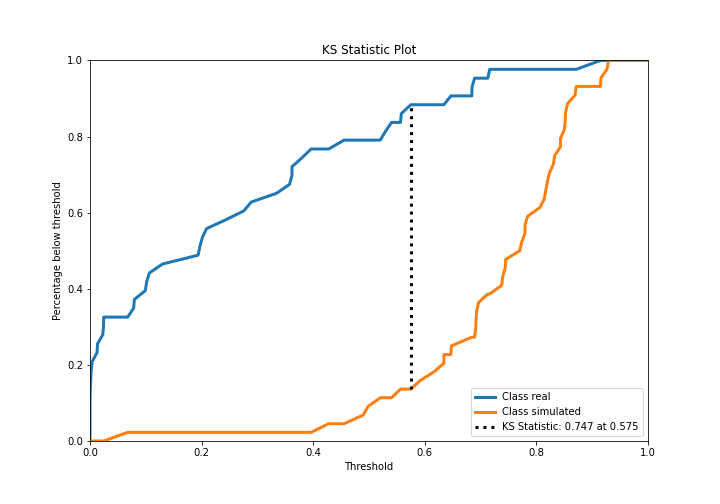

## Precision-Recall Curve

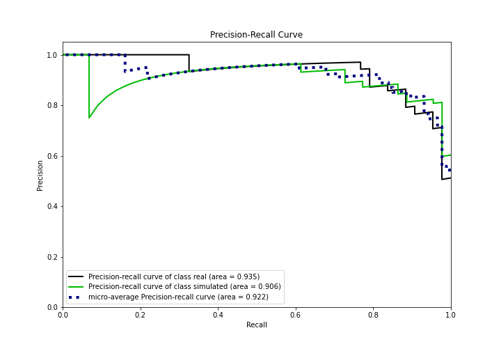

## Calibration Curve

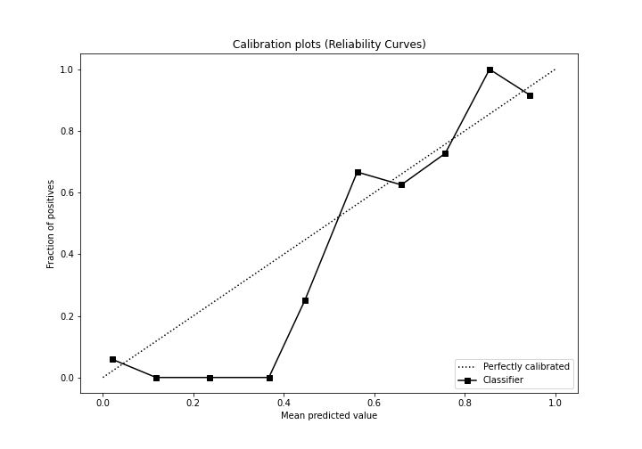

## Cumulative Gains Curve

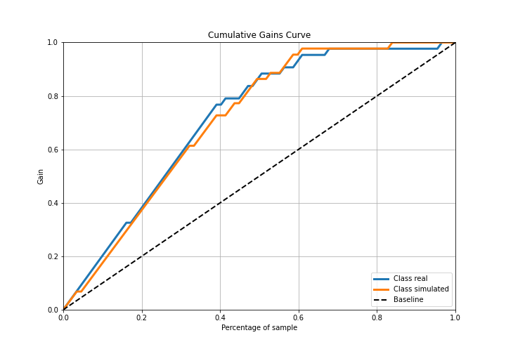

## Lift Curve

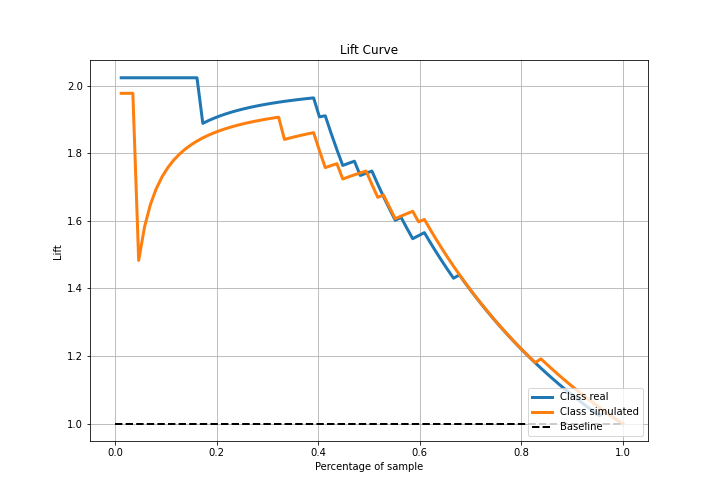

## SHAP Importance
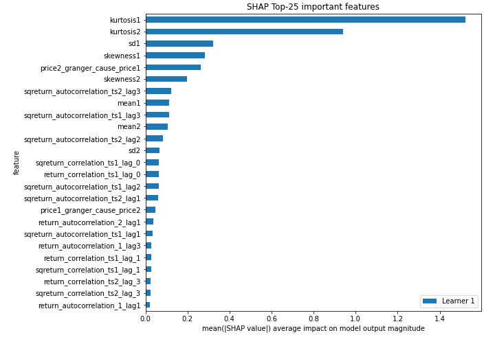

## SHAP Dependence plots

### Dependence (Fold 1)
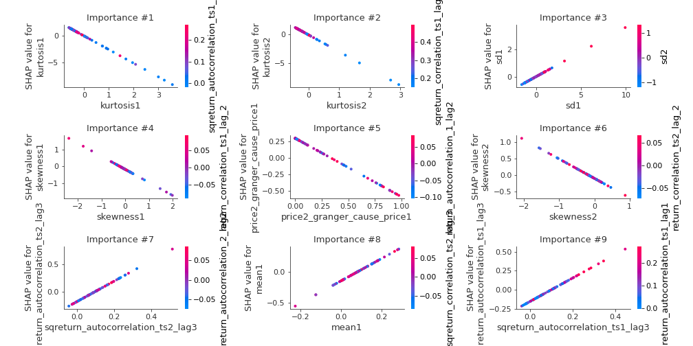

## SHAP Decision plots

### Top-10 Worst decisions for class 0 (Fold 1)
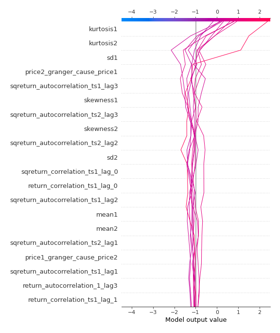
### Top-10 Best decisions for class 0 (Fold 1)
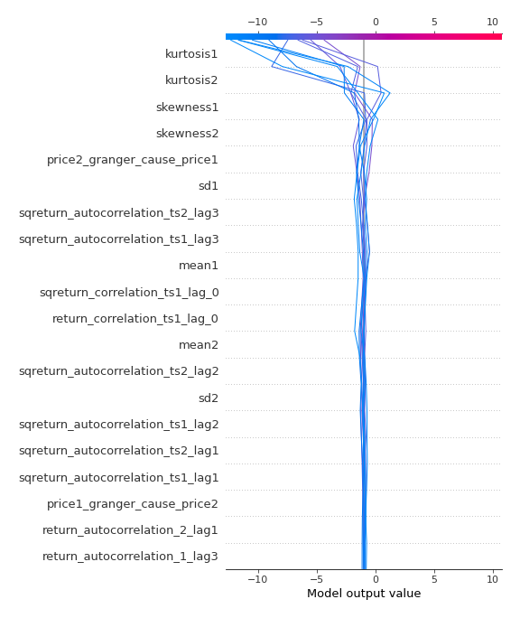
### Top-10 Worst decisions for class 1 (Fold 1)
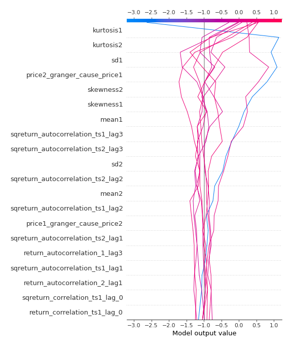
### Top-10 Best decisions for class 1 (Fold 1)
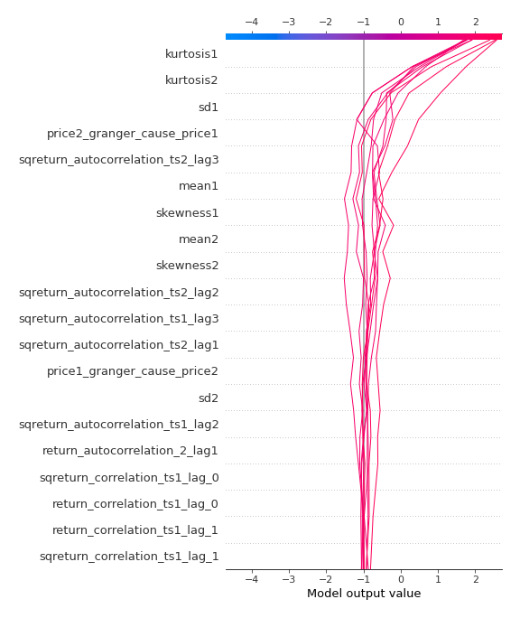

[<< Go back](../README.md)
