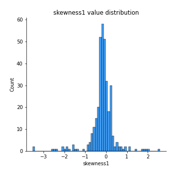
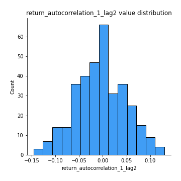

# Exploratory Data Analysis

[<< Go back](../README.md)
## Feature : target
- **Feature type** : categorical
- **Missing** : 0.0%
- **Unique** : 2
- **Count** :347
- **Unique** :2
- **Top** :simulated
- **Freq** :175

## Feature : mean1
- **Feature type** : continous
- **Missing** : 0.0%
- **Unique** : 347
- **Count** :347.0
- **Mean** :0.07650654055008381
- **Std** :0.07909663796021447
- **Min** :-0.22632637961920957
- **25%th Percentile** : 0.024668760548663776
- **50%th Percentile** : 0.07599321278730281
- **75%th Percentile** : 0.12147872437498455
- **Max** :0.3243165523728677

## Feature : mean2
- **Feature type** : continous
- **Missing** : 0.0%
- **Unique** : 347
- **Count** :347.0
- **Mean** :0.08922453465465618
- **Std** :0.08827698847480328
- **Min** :-0.24205418062825398
- **25%th Percentile** : 0.04736301018629635
- **50%th Percentile** : 0.09189277731522028
- **75%th Percentile** : 0.13761561147243734
- **Max** :0.31562159045349353

## Feature : sd1
- **Feature type** : continous
- **Missing** : 0.0%
- **Unique** : 347
- **Count** :347.0
- **Mean** :2.0520055436576725
- **Std** :0.840405813490122
- **Min** :0.7620831696941981
- **25%th Percentile** : 1.5557056605603534
- **50%th Percentile** : 1.9664697977920835
- **75%th Percentile** : 2.4084621460312734
- **Max** :9.236766377527575

## Feature : sd2
- **Feature type** : continous
- **Missing** : 0.0%
- **Unique** : 347
- **Count** :347.0
- **Mean** :1.9613225242547978
- **Std** :0.7602262918304866
- **Min** :0.5946276831553594
- **25%th Percentile** : 1.4387936309699558
- **50%th Percentile** : 1.8451285907111237
- **75%th Percentile** : 2.280030939072245
- **Max** :6.737618636746393

## Feature : skewness1
- **Feature type** : continous
- **Missing** : 0.0%
- **Unique** : 347
- **Count** :347.0
- **Mean** :-0.17121887155533436
- **Std** :0.6004742689173943
- **Min** :-3.530116233761814
- **25%th Percentile** : -0.30838211335958554
- **50%th Percentile** : -0.14608354912555882
- **75%th Percentile** : 0.04872401911556965
- **Max** :2.5845963767725557

## Feature : skewness2
- **Feature type** : continous
- **Missing** : 0.0%
- **Unique** : 347
- **Count** :347.0
- **Mean** :-0.246970816352988
- **Std** :0.7528843405810727
- **Min** :-8.801502855292393
- **25%th Percentile** : -0.38434666984334753
- **50%th Percentile** : -0.17837208764287218
- **75%th Percentile** : 0.007489829856255898
- **Max** :2.2606839051517187

## Feature : kurtosis1
- **Feature type** : continous
- **Missing** : 0.0%
- **Unique** : 347
- **Count** :347.0
- **Mean** :3.9304404997192695
- **Std** :5.828282655082633
- **Min** :0.03477879299249054
- **25%th Percentile** : 1.084371723974845
- **50%th Percentile** : 2.03598243949627
- **75%th Percentile** : 3.9672030656784054
- **Max** :46.07507808162177

## Feature : kurtosis2
- **Feature type** : continous
- **Missing** : 0.0%
- **Unique** : 347
- **Count** :347.0
- **Mean** :4.598584472077764
- **Std** :9.640033439700817
- **Min** :0.018790906903708215
- **25%th Percentile** : 1.3433906248715082
- **50%th Percentile** : 2.135598798018797
- **75%th Percentile** : 4.503783466735813
- **Max** :143.10871011533666

## Feature : return_autocorrelation_1_lag1
- **Feature type** : continous
- **Missing** : 0.0%
- **Unique** : 347
- **Count** :347.0
- **Mean** :-0.016332527045364517
- **Std** :0.06135294610681212
- **Min** :-0.2135576224968752
- **25%th Percentile** : -0.0575769364131829
- **50%th Percentile** : -0.012177952352187695
- **75%th Percentile** : 0.028988667672467966
- **Max** :0.12613053661542936

## Feature : return_autocorrelation_1_lag2
- **Feature type** : continous
- **Missing** : 0.0%
- **Unique** : 347
- **Count** :347.0
- **Mean** :-0.004850210023123528
- **Std** :0.05276278172628795
- **Min** :-0.146022473758531
- **25%th Percentile** : -0.038955739567435296
- **50%th Percentile** : -0.003864056723287816
- **75%th Percentile** : 0.03223659650655248
- **Max** :0.12993318557465194

## Feature : return_autocorrelation_1_lag3
- **Feature type** : continous
- **Missing** : 0.0%
- **Unique** : 347
- **Count** :347.0
- **Mean** :-0.001810693376080061
- **Std** :0.05319333500932879
- **Min** :-0.15806635192103805
- **25%th Percentile** : -0.03877652905905788
- **50%th Percentile** : -0.0023288159010365524
- **75%th Percentile** : 0.03304983599769274
- **Max** :0.17805869530681923

## Feature : return_autocorrelation_2_lag1
- **Feature type** : continous
- **Missing** : 0.0%
- **Unique** : 347
- **Count** :347.0
- **Mean** :-0.018392091158031244
- **Std** :0.060773899183756516
- **Min** :-0.25075531010123286
- **25%th Percentile** : -0.05902779074683106
- **50%th Percentile** : -0.014470613405157364
- **75%th Percentile** : 0.019532894055656055
- **Max** :0.16349871797309318

## Feature : return_autocorrelation_2_lag2
- **Feature type** : continous
- **Missing** : 0.0%
- **Unique** : 347
- **Count** :347.0
- **Mean** :-0.0018851940015180346
- **Std** :0.05254862854663465
- **Min** :-0.15323211089747296
- **25%th Percentile** : -0.03632408393701764
- **50%th Percentile** : -0.0019974644142670955
- **75%th Percentile** : 0.03290415035314268
- **Max** :0.18390332498361806

## Feature : return_autocorrelation_2_lag3
- **Feature type** : continous
- **Missing** : 0.0%
- **Unique** : 347
- **Count** :347.0
- **Mean** :-0.003251994428101202
- **Std** :0.05450954043863073
- **Min** :-0.1690220287141888
- **25%th Percentile** : -0.04091406326025242
- **50%th Percentile** : -0.002317429308838186
- **75%th Percentile** : 0.02903205822344037
- **Max** :0.17547372532420874

## Feature : return_correlation_ts1_lag_0
- **Feature type** : continous
- **Missing** : 0.0%
- **Unique** : 347
- **Count** :347.0
- **Mean** :0.33490033611917147
- **Std** :0.10813318794587007
- **Min** :0.005136598099876001
- **25%th Percentile** : 0.2788594355512054
- **50%th Percentile** : 0.3382726473002821
- **75%th Percentile** : 0.3903276733282981
- **Max** :0.7041861626832071

## Feature : return_correlation_ts1_lag_1
- **Feature type** : continous
- **Missing** : 0.0%
- **Unique** : 347
- **Count** :347.0
- **Mean** :-0.008718808591570293
- **Std** :0.05753852585890457
- **Min** :-0.16985510949917193
- **25%th Percentile** : -0.045763252511493435
- **50%th Percentile** : -0.0033191428202869475
- **75%th Percentile** : 0.02813996734343771
- **Max** :0.15499424718508623

## Feature : return_correlation_ts1_lag_2
- **Feature type** : continous
- **Missing** : 0.0%
- **Unique** : 347
- **Count** :347.0
- **Mean** :-0.0022110222328644044
- **Std** :0.05223755555573099
- **Min** :-0.21653581047581763
- **25%th Percentile** : -0.037845685256165815
- **50%th Percentile** : -0.0023637216128767524
- **75%th Percentile** : 0.031560596052201254
- **Max** :0.14316248384744532

## Feature : return_correlation_ts1_lag_3
- **Feature type** : continous
- **Missing** : 0.0%
- **Unique** : 347
- **Count** :347.0
- **Mean** :-0.0006852128976077646
- **Std** :0.054363074439636346
- **Min** :-0.12275228590862461
- **25%th Percentile** : -0.03907684758344908
- **50%th Percentile** : -0.0016003589285729638
- **75%th Percentile** : 0.03267853200636442
- **Max** :0.16861645909294573

## Feature : return_correlation_ts2_lag_1
- **Feature type** : continous
- **Missing** : 0.0%
- **Unique** : 347
- **Count** :347.0
- **Mean** :-0.013084791782479592
- **Std** :0.0580697694206862
- **Min** :-0.2081139431093261
- **25%th Percentile** : -0.04930406445102502
- **50%th Percentile** : -0.012340348427754905
- **75%th Percentile** : 0.026129357713608244
- **Max** :0.17208763791364762

## Feature : return_correlation_ts2_lag_2
- **Feature type** : continous
- **Missing** : 0.0%
- **Unique** : 347
- **Count** :347.0
- **Mean** :-0.002622447302380493
- **Std** :0.05057175522853997
- **Min** :-0.23751835475804678
- **25%th Percentile** : -0.038245055231943235
- **50%th Percentile** : -0.003086267508131413
- **75%th Percentile** : 0.03085599209090109
- **Max** :0.15388933426238696

## Feature : return_correlation_ts2_lag_3
- **Feature type** : continous
- **Missing** : 0.0%
- **Unique** : 347
- **Count** :347.0
- **Mean** :-0.0019991489100931715
- **Std** :0.05379185904762849
- **Min** :-0.16212823605110202
- **25%th Percentile** : -0.030820179677224578
- **50%th Percentile** : -0.0007513723605027245
- **75%th Percentile** : 0.03629657815945525
- **Max** :0.14719839106380214

## Feature : sqreturn_autocorrelation_ts1_lag1
- **Feature type** : continous
- **Missing** : 0.0%
- **Unique** : 347
- **Count** :347.0
- **Mean** :0.12005022586140843
- **Std** :0.09201638886988635
- **Min** :-0.06532118872798363
- **25%th Percentile** : 0.054079651383628816
- **50%th Percentile** : 0.10236875799897192
- **75%th Percentile** : 0.16896369877136075
- **Max** :0.49414293176447355

## Feature : sqreturn_autocorrelation_ts1_lag2
- **Feature type** : continous
- **Missing** : 0.0%
- **Unique** : 347
- **Count** :347.0
- **Mean** :0.11459003453288706
- **Std** :0.09296407379418603
- **Min** :-0.036488613749476824
- **25%th Percentile** : 0.04539351571805088
- **50%th Percentile** : 0.10137454890299608
- **75%th Percentile** : 0.1721942413270296
- **Max** :0.540735851444759

## Feature : sqreturn_autocorrelation_ts1_lag3
- **Feature type** : continous
- **Missing** : 0.0%
- **Unique** : 347
- **Count** :347.0
- **Mean** :0.10739850271932061
- **Std** :0.09002311296349344
- **Min** :-0.05313973583773816
- **25%th Percentile** : 0.03945154868107501
- **50%th Percentile** : 0.10040802789101516
- **75%th Percentile** : 0.1615427123263246
- **Max** :0.44742257574966515

## Feature : sqreturn_autocorrelation_ts2_lag1
- **Feature type** : continous
- **Missing** : 0.0%
- **Unique** : 347
- **Count** :347.0
- **Mean** :0.12255282045592894
- **Std** :0.08954174743510317
- **Min** :-0.04997282481431907
- **25%th Percentile** : 0.05283302737616993
- **50%th Percentile** : 0.11601201318324944
- **75%th Percentile** : 0.17350857915895462
- **Max** :0.510085647437958

## Feature : sqreturn_autocorrelation_ts2_lag2
- **Feature type** : continous
- **Missing** : 0.0%
- **Unique** : 347
- **Count** :347.0
- **Mean** :0.11161950886802162
- **Std** :0.09290752473381564
- **Min** :-0.051523884196217395
- **25%th Percentile** : 0.03719445972472185
- **50%th Percentile** : 0.09735478729559546
- **75%th Percentile** : 0.1705498003614746
- **Max** :0.4161185589245815

## Feature : sqreturn_autocorrelation_ts2_lag3
- **Feature type** : continous
- **Missing** : 0.0%
- **Unique** : 347
- **Count** :347.0
- **Mean** :0.1019303788487967
- **Std** :0.08654238910482988
- **Min** :-0.06082766359524085
- **25%th Percentile** : 0.03537486909969059
- **50%th Percentile** : 0.0931078839489695
- **75%th Percentile** : 0.1562317291132488
- **Max** :0.5122565870127205

## Feature : sqreturn_correlation_ts1_lag_0
- **Feature type** : continous
- **Missing** : 0.0%
- **Unique** : 347
- **Count** :347.0
- **Mean** :0.33490033611917147
- **Std** :0.10813318794587007
- **Min** :0.005136598099876001
- **25%th Percentile** : 0.2788594355512054
- **50%th Percentile** : 0.3382726473002821
- **75%th Percentile** : 0.3903276733282981
- **Max** :0.7041861626832071

## Feature : sqreturn_correlation_ts1_lag_1
- **Feature type** : continous
- **Missing** : 0.0%
- **Unique** : 347
- **Count** :347.0
- **Mean** :-0.008718808591570293
- **Std** :0.05753852585890457
- **Min** :-0.16985510949917193
- **25%th Percentile** : -0.045763252511493435
- **50%th Percentile** : -0.0033191428202869475
- **75%th Percentile** : 0.02813996734343771
- **Max** :0.15499424718508623

## Feature : sqreturn_correlation_ts1_lag_2
- **Feature type** : continous
- **Missing** : 0.0%
- **Unique** : 347
- **Count** :347.0
- **Mean** :-0.0022110222328644044
- **Std** :0.05223755555573099
- **Min** :-0.21653581047581763
- **25%th Percentile** : -0.037845685256165815
- **50%th Percentile** : -0.0023637216128767524
- **75%th Percentile** : 0.031560596052201254
- **Max** :0.14316248384744532

## Feature : sqreturn_correlation_ts1_lag_3
- **Feature type** : continous
- **Missing** : 0.0%
- **Unique** : 347
- **Count** :347.0
- **Mean** :-0.0006852128976077646
- **Std** :0.054363074439636346
- **Min** :-0.12275228590862461
- **25%th Percentile** : -0.03907684758344908
- **50%th Percentile** : -0.0016003589285729638
- **75%th Percentile** : 0.03267853200636442
- **Max** :0.16861645909294573

## Feature : sqreturn_correlation_ts2_lag_1
- **Feature type** : continous
- **Missing** : 0.0%
- **Unique** : 347
- **Count** :347.0
- **Mean** :-0.013084791782479592
- **Std** :0.0580697694206862
- **Min** :-0.2081139431093261
- **25%th Percentile** : -0.04930406445102502
- **50%th Percentile** : -0.012340348427754905
- **75%th Percentile** : 0.026129357713608244
- **Max** :0.17208763791364762

## Feature : sqreturn_correlation_ts2_lag_2
- **Feature type** : continous
- **Missing** : 0.0%
- **Unique** : 347
- **Count** :347.0
- **Mean** :-0.002622447302380493
- **Std** :0.05057175522853997
- **Min** :-0.23751835475804678
- **25%th Percentile** : -0.038245055231943235
- **50%th Percentile** : -0.003086267508131413
- **75%th Percentile** : 0.03085599209090109
- **Max** :0.15388933426238696

## Feature : sqreturn_correlation_ts2_lag_3
- **Feature type** : continous
- **Missing** : 0.0%
- **Unique** : 347
- **Count** :347.0
- **Mean** :-0.0019991489100931715
- **Std** :0.05379185904762849
- **Min** :-0.16212823605110202
- **25%th Percentile** : -0.030820179677224578
- **50%th Percentile** : -0.0007513723605027245
- **75%th Percentile** : 0.03629657815945525
- **Max** :0.14719839106380214

## Feature : price2_granger_cause_price1
- **Feature type** : continous
- **Missing** : 0.0%
- **Unique** : 347
- **Count** :347.0
- **Mean** :0.29045002929913943
- **Std** :0.289871179572424
- **Min** :2.5486295520790353e-09
- **25%th Percentile** : 0.030672464507435424
- **50%th Percentile** : 0.20368417081248466
- **75%th Percentile** : 0.4891254507886571
- **Max** :0.9751444951754648

## Feature : price1_granger_cause_price2
- **Feature type** : continous
- **Missing** : 0.0%
- **Unique** : 347
- **Count** :347.0
- **Mean** :0.3073491922850536
- **Std** :0.29337922084707174
- **Min** :6.61910694360793e-08
- **25%th Percentile** : 0.044980458731088996
- **50%th Percentile** : 0.2244123542631357
- **75%th Percentile** : 0.5480108305496374
- **Max** :0.9967266555450524

[<< Go back](../README.md)
