# Summary of 2_DecisionTree

[<< Go back](../README.md)

## Decision Tree
- **n_jobs**: -1
- **criterion**: gini
- **max_depth**: 3
- **explain_level**: 2

## Validation
 - **validation_type**: split
 - **train_ratio**: 0.75
 - **shuffle**: True
 - **stratify**: True

## Optimized metric
accuracy

## Training time

12.1 seconds

## Metric details
|           |    score |   threshold |
|:----------|---------:|------------:|
| logloss   | 0.508356 |  nan        |
| auc       | 0.868658 |  nan        |
| f1        | 0.893617 |    0.470581 |
| accuracy  | 0.885057 |    0.470581 |
| precision | 0.840909 |    0.781818 |
| recall    | 0.977273 |    0        |
| mcc       | 0.777173 |    0.470581 |

## Confusion matrix (at threshold=0.470581)
|                      |   Predicted as real |   Predicted as simulated |
|:---------------------|--------------------:|-------------------------:|
| Labeled as real      |                  35 |                        8 |
| Labeled as simulated |                   2 |                       42 |

## Learning curves
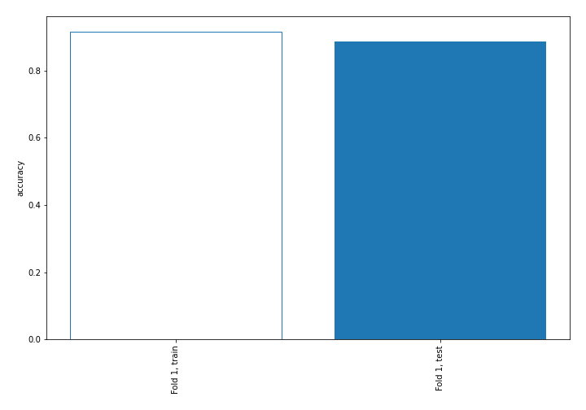

## Decision Tree 

### Tree #1
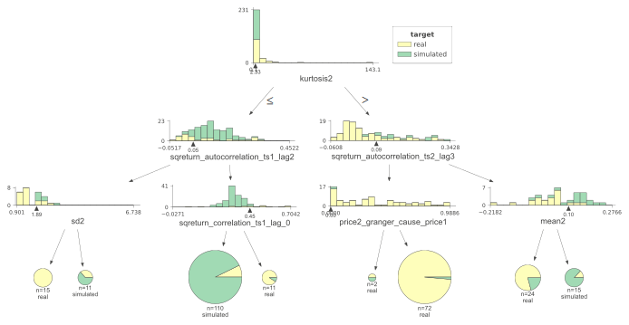

### Rules

if (kurtosis2 <= 2.332) and (sqreturn_autocorrelation_ts1_lag2 > 0.048) and (sqreturn_correlation_ts1_lag_0 <= 0.45) then class: simulated (proba: 92.73%) | based on 110 samples

if (kurtosis2 > 2.332) and (sqreturn_autocorrelation_ts2_lag3 <= 0.093) and (price2_granger_cause_price1 > 0.001) then class: real (proba: 98.61%) | based on 72 samples

if (kurtosis2 > 2.332) and (sqreturn_autocorrelation_ts2_lag3 > 0.093) and (mean2 <= 0.099) then class: real (proba: 79.17%) | based on 24 samples

if (kurtosis2 > 2.332) and (sqreturn_autocorrelation_ts2_lag3 > 0.093) and (mean2 > 0.099) then class: simulated (proba: 86.67%) | based on 15 samples

if (kurtosis2 <= 2.332) and (sqreturn_autocorrelation_ts1_lag2 <= 0.048) and (sd2 <= 1.889) then class: real (proba: 100.0%) | based on 15 samples

if (kurtosis2 <= 2.332) and (sqreturn_autocorrelation_ts1_lag2 > 0.048) and (sqreturn_correlation_ts1_lag_0 > 0.45) then class: real (proba: 90.91%) | based on 11 samples

if (kurtosis2 <= 2.332) and (sqreturn_autocorrelation_ts1_lag2 <= 0.048) and (sd2 > 1.889) then class: simulated (proba: 63.64%) | based on 11 samples

if (kurtosis2 > 2.332) and (sqreturn_autocorrelation_ts2_lag3 <= 0.093) and (price2_granger_cause_price1 <= 0.001) then class: real (proba: 50.0%) | based on 2 samples

## Permutation-based Importance
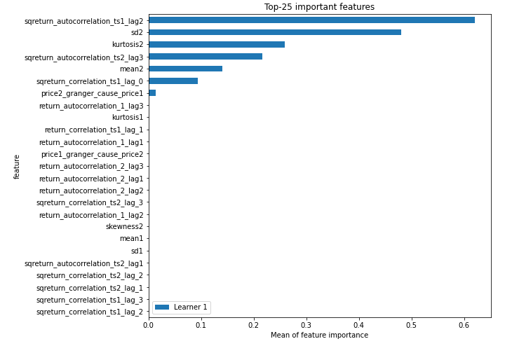
## Confusion Matrix

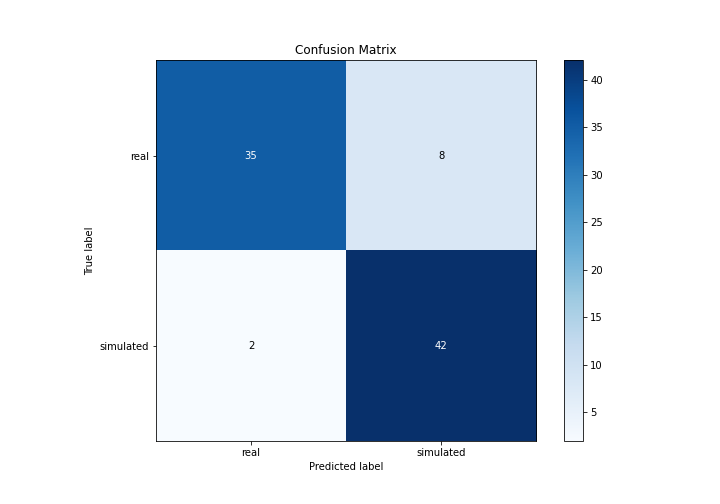

## Normalized Confusion Matrix

## ROC Curve

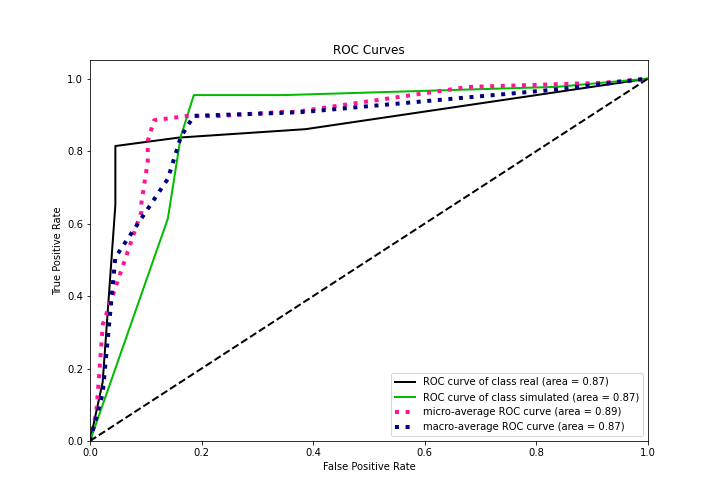

## Kolmogorov-Smirnov Statistic

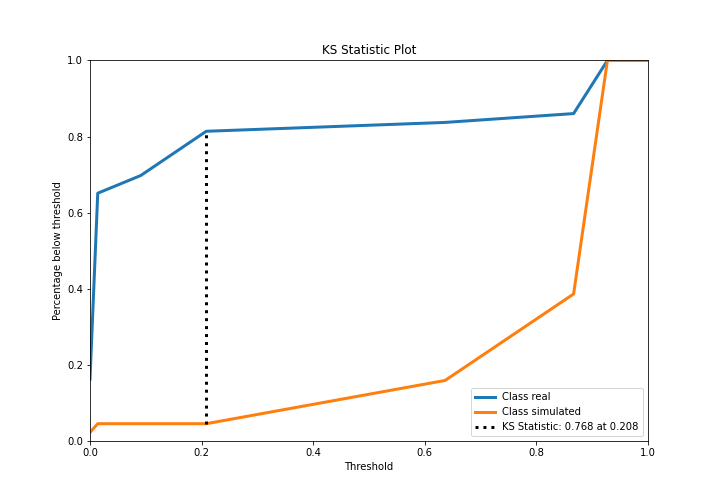

## Precision-Recall Curve

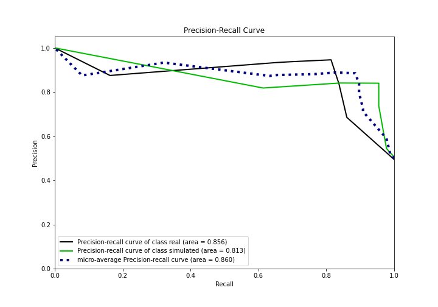

## Calibration Curve

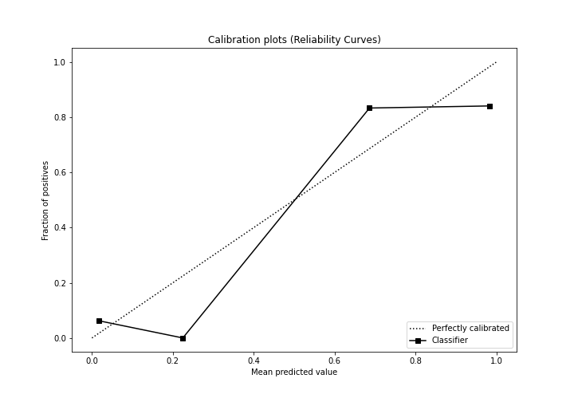

## Cumulative Gains Curve

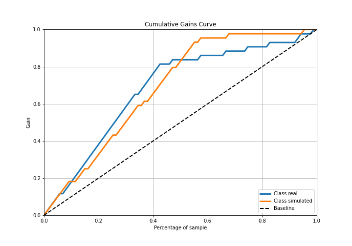

## Lift Curve

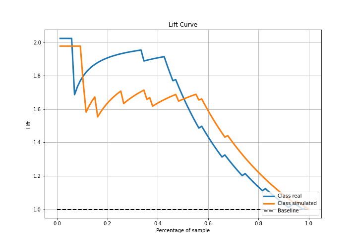

## SHAP Importance
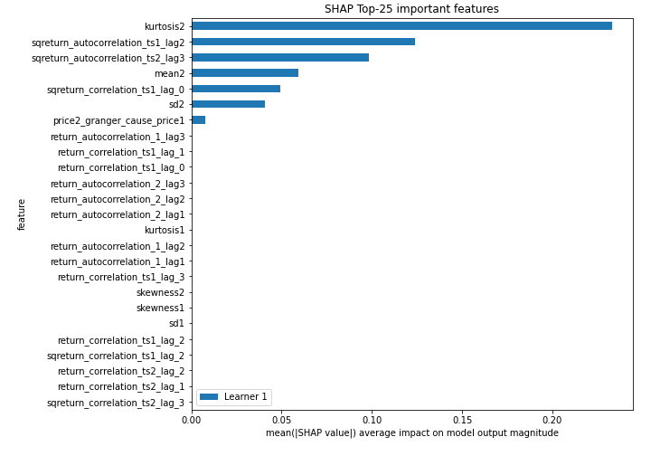

## SHAP Dependence plots

### Dependence (Fold 1)
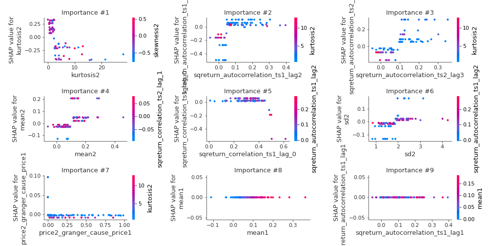

## SHAP Decision plots

### Top-10 Worst decisions for class 0 (Fold 1)
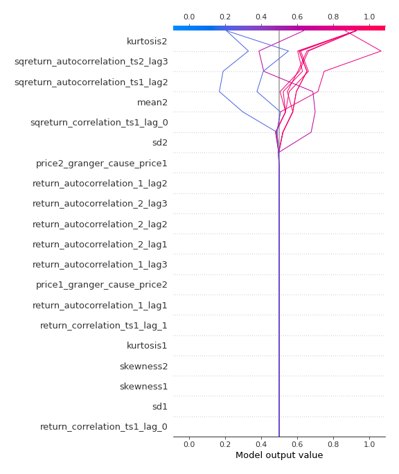
### Top-10 Best decisions for class 0 (Fold 1)
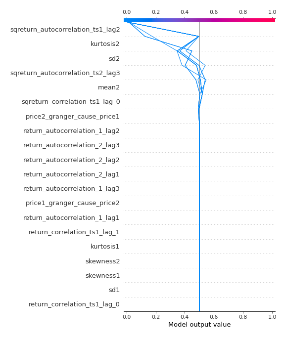
### Top-10 Worst decisions for class 1 (Fold 1)
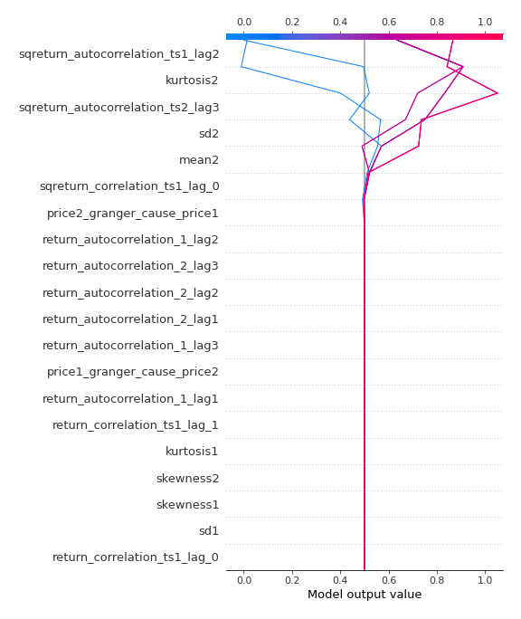
### Top-10 Best decisions for class 1 (Fold 1)
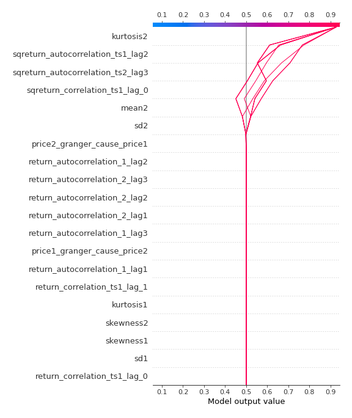

[<< Go back](../README.md)
