# Summary of 3_Linear

[<< Go back](../README.md)

## Logistic Regression (Linear)
- **n_jobs**: -1
- **explain_level**: 2

## Validation
 - **validation_type**: split
 - **train_ratio**: 0.75
 - **shuffle**: True
 - **stratify**: True

## Optimized metric
accuracy

## Training time

11.1 seconds

## Metric details
|           |    score |     threshold |
|:----------|---------:|--------------:|
| logloss   | 0.335413 | nan           |
| auc       | 0.957717 | nan           |
| f1        | 0.909091 |   0.611235    |
| accuracy  | 0.908046 |   0.611235    |
| precision | 1        |   0.880313    |
| recall    | 1        |   1.15582e-07 |
| mcc       | 0.816068 |   0.611235    |

## Confusion matrix (at threshold=0.611235)
|                      |   Predicted as real |   Predicted as simulated |
|:---------------------|--------------------:|-------------------------:|
| Labeled as real      |                  39 |                        4 |
| Labeled as simulated |                   4 |                       40 |

## Learning curves
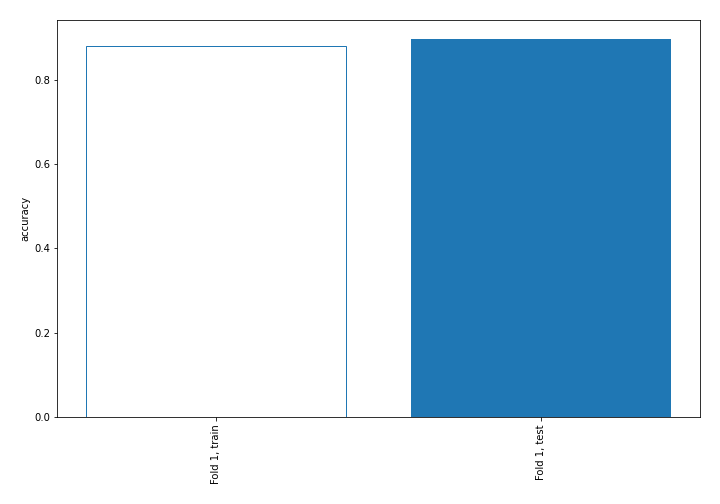

## Coefficients
| feature                           |   Learner_1 |
|:----------------------------------|------------:|
| mean1                             |   1.71635   |
| sqreturn_autocorrelation_ts2_lag3 |   1.64049   |
| mean2                             |   1.48556   |
| sqreturn_autocorrelation_ts1_lag3 |   1.10723   |
| sqreturn_autocorrelation_ts2_lag2 |   0.9337    |
| sqreturn_autocorrelation_ts2_lag1 |   0.84951   |
| sqreturn_autocorrelation_ts1_lag2 |   0.622769  |
| sqreturn_autocorrelation_ts1_lag1 |   0.584106  |
| return_autocorrelation_2_lag1     |   0.533423  |
| return_correlation_ts1_lag_1      |   0.492524  |
| sqreturn_correlation_ts1_lag_1    |   0.492524  |
| sqreturn_correlation_ts2_lag_1    |   0.487039  |
| return_correlation_ts2_lag_1      |   0.487039  |
| return_autocorrelation_1_lag1     |   0.448742  |
| sd1                               |   0.356739  |
| return_correlation_ts1_lag_3      |   0.337998  |
| sqreturn_correlation_ts1_lag_3    |   0.337998  |
| return_correlation_ts2_lag_3      |   0.315261  |
| sqreturn_correlation_ts2_lag_3    |   0.315261  |
| return_autocorrelation_2_lag3     |   0.292949  |
| return_autocorrelation_2_lag2     |   0.195214  |
| return_autocorrelation_1_lag3     |   0.114348  |
| return_autocorrelation_1_lag2     |   0.0977397 |
| sqreturn_correlation_ts1_lag_2    |   0.0431975 |
| return_correlation_ts1_lag_2      |   0.0431975 |
| return_correlation_ts2_lag_2      |  -0.0652694 |
| sqreturn_correlation_ts2_lag_2    |  -0.0652694 |
| sd2                               |  -0.159827  |
| price1_granger_cause_price2       |  -0.345326  |
| price2_granger_cause_price1       |  -0.348291  |
| sqreturn_correlation_ts1_lag_0    |  -0.650329  |
| return_correlation_ts1_lag_0      |  -0.650329  |
| skewness1                         |  -0.669946  |
| skewness2                         |  -0.757362  |
| intercept                         |  -1.56841   |
| kurtosis1                         |  -2.9898    |
| kurtosis2                         |  -3.17031   |

## Permutation-based Importance
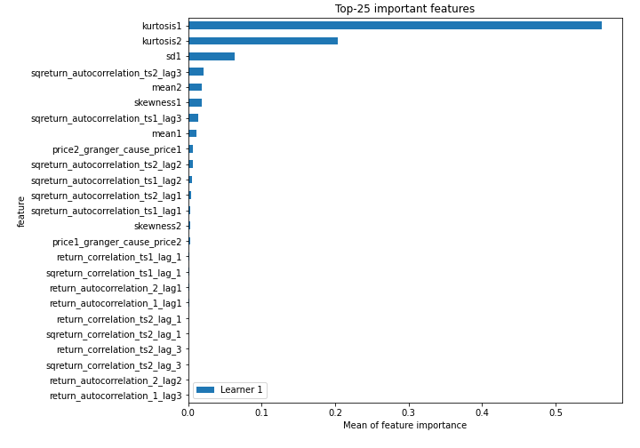
## Confusion Matrix

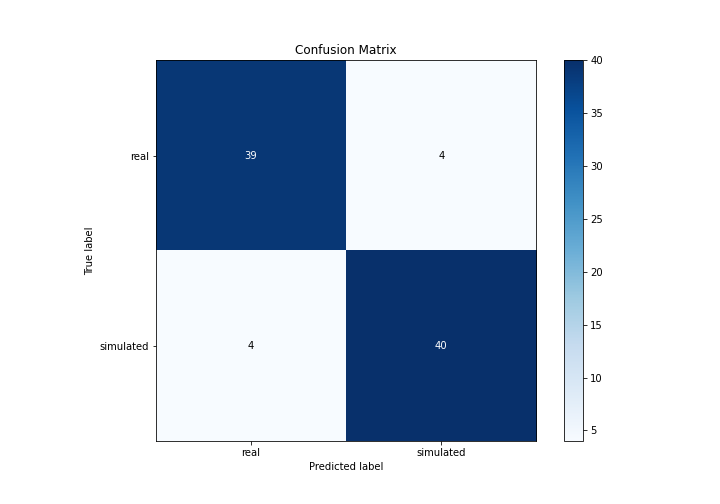

## Normalized Confusion Matrix

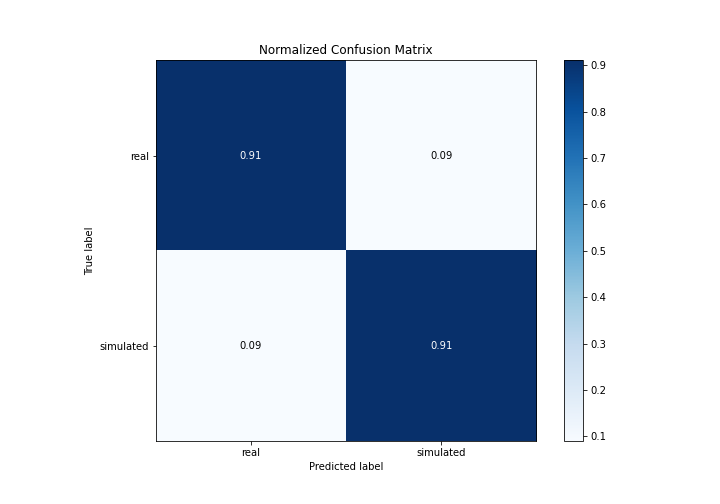

## ROC Curve

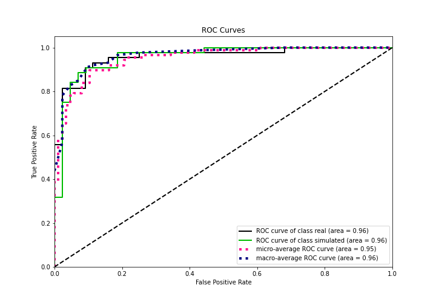

## Kolmogorov-Smirnov Statistic

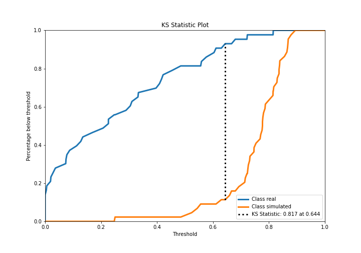

## Precision-Recall Curve

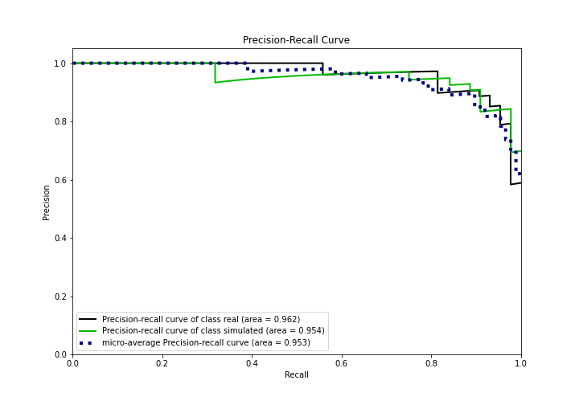

## Calibration Curve

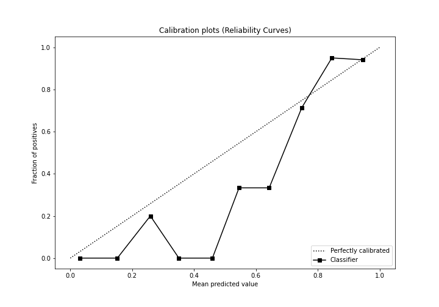

## Cumulative Gains Curve

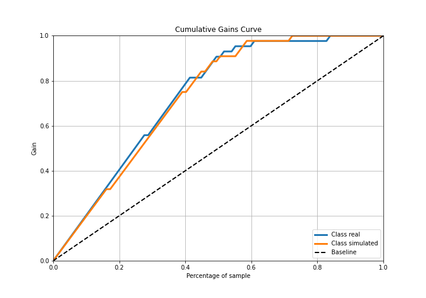

## Lift Curve

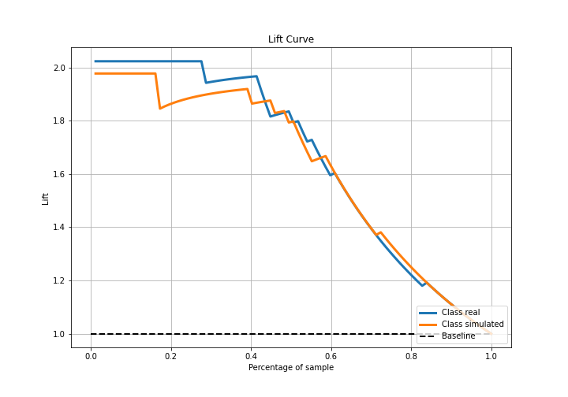

## SHAP Importance
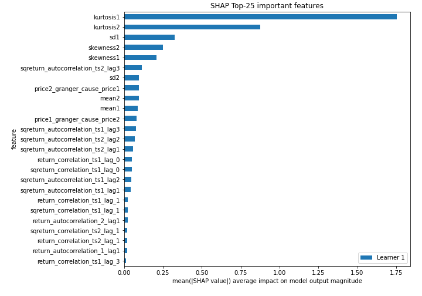

## SHAP Dependence plots

### Dependence (Fold 1)
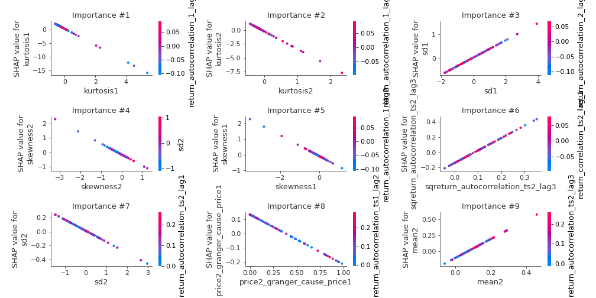

## SHAP Decision plots

### Top-10 Worst decisions for class 0 (Fold 1)
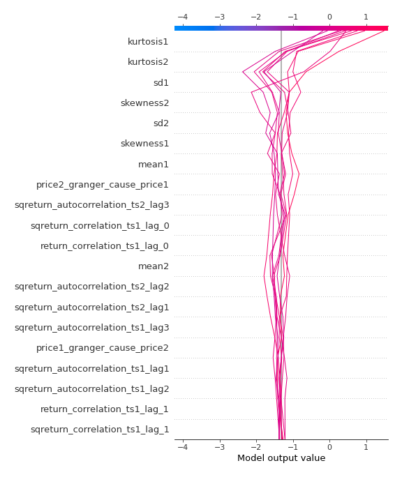
### Top-10 Best decisions for class 0 (Fold 1)
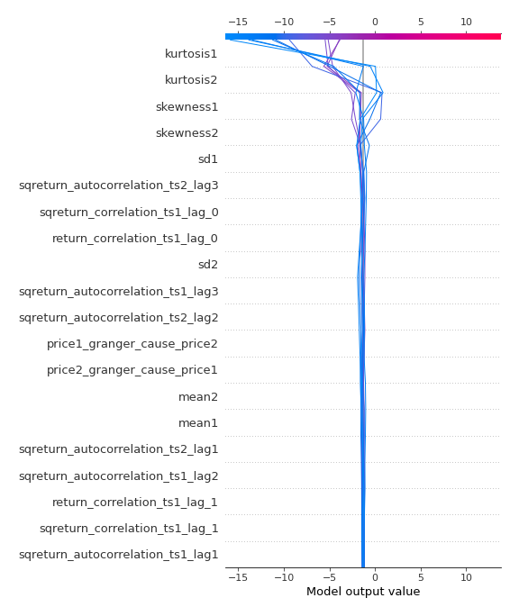
### Top-10 Worst decisions for class 1 (Fold 1)
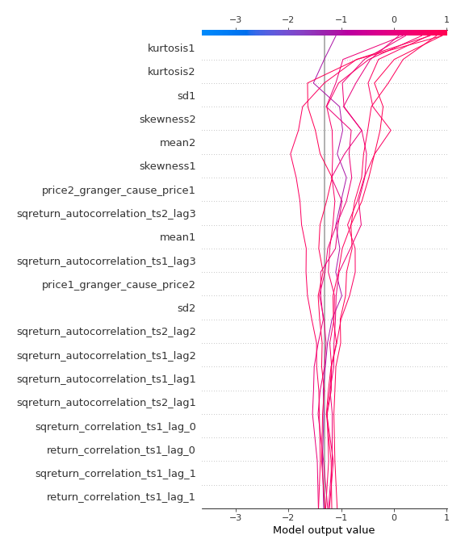
### Top-10 Best decisions for class 1 (Fold 1)
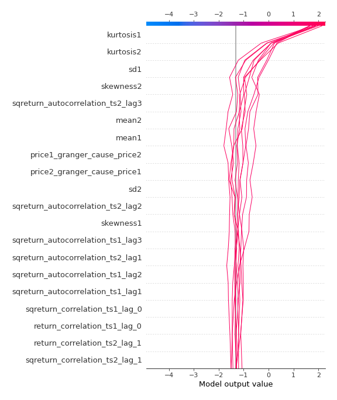

[<< Go back](../README.md)
