# Exploratory Data Analysis

[<< Go back](../README.md)
## Feature : target
- **Feature type** : categorical
- **Missing** : 0.0%
- **Unique** : 2
- **Count** :347
- **Unique** :2
- **Top** :simulated
- **Freq** :174

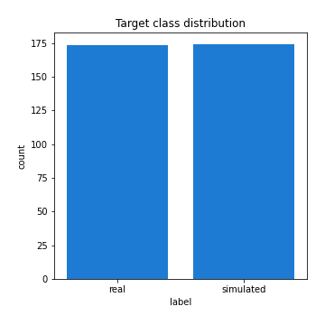
## Feature : mean1
- **Feature type** : continous
- **Missing** : 0.0%
- **Unique** : 347
- **Count** :347.0
- **Mean** :0.07947715692133529
- **Std** :0.07734013417425015
- **Min** :-0.17686457077756634
- **25%th Percentile** : 0.03222657492700924
- **50%th Percentile** : 0.0777365266701866
- **75%th Percentile** : 0.12151025848061145
- **Max** :0.37175100008111034

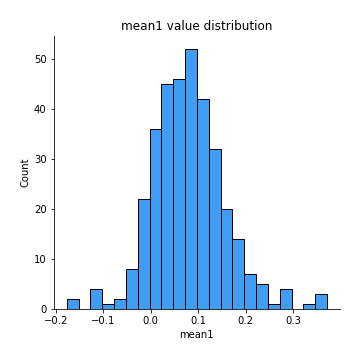
## Feature : mean2
- **Feature type** : continous
- **Missing** : 0.0%
- **Unique** : 347
- **Count** :347.0
- **Mean** :0.08560296227377234
- **Std** :0.08580135517345475
- **Min** :-0.21818165578778434
- **25%th Percentile** : 0.037218178796683515
- **50%th Percentile** : 0.0839811028073642
- **75%th Percentile** : 0.13671633812460826
- **Max** :0.45857999540327066

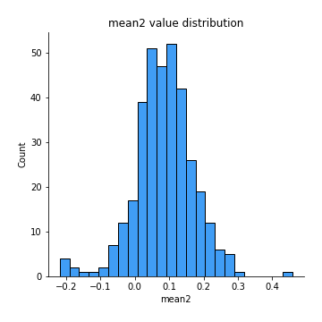
## Feature : sd1
- **Feature type** : continous
- **Missing** : 0.0%
- **Unique** : 347
- **Count** :347.0
- **Mean** :2.028546285669576
- **Std** :0.6683218839310913
- **Min** :0.7470080772831957
- **25%th Percentile** : 1.5365013404234233
- **50%th Percentile** : 2.009997360090074
- **75%th Percentile** : 2.4236965762203675
- **Max** :5.24521302455331

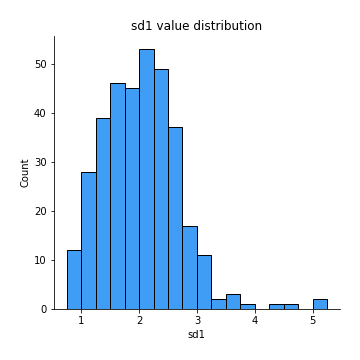
## Feature : sd2
- **Feature type** : continous
- **Missing** : 0.0%
- **Unique** : 347
- **Count** :347.0
- **Mean** :1.945182194919537
- **Std** :0.7308402671470325
- **Min** :0.8455946193085045
- **25%th Percentile** : 1.4353933284768834
- **50%th Percentile** : 1.8531298235326323
- **75%th Percentile** : 2.246737112693203
- **Max** :6.737618636746393

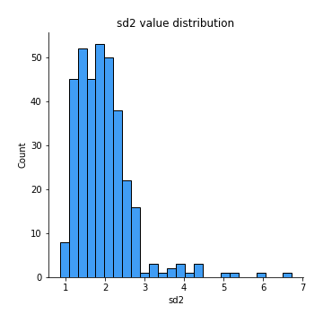
## Feature : skewness1
- **Feature type** : continous
- **Missing** : 0.0%
- **Unique** : 347
- **Count** :347.0
- **Mean** :-0.15245064843959305
- **Std** :0.6019906485355517
- **Min** :-3.530116233761814
- **25%th Percentile** : -0.31412770132589685
- **50%th Percentile** : -0.10994651477171735
- **75%th Percentile** : 0.037609168360401665
- **Max** :2.5845963767725557

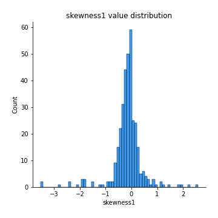
## Feature : skewness2
- **Feature type** : continous
- **Missing** : 0.0%
- **Unique** : 347
- **Count** :347.0
- **Mean** :-0.2299366764633928
- **Std** :0.7228462454107404
- **Min** :-8.801502855292393
- **25%th Percentile** : -0.3850535689965443
- **50%th Percentile** : -0.171344542956699
- **75%th Percentile** : 0.0367780161344851
- **Max** :2.123597625075353

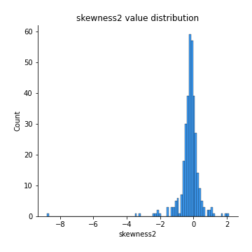
## Feature : kurtosis1
- **Feature type** : continous
- **Missing** : 0.0%
- **Unique** : 347
- **Count** :347.0
- **Mean** :4.013565868576198
- **Std** :6.121031782020649
- **Min** :0.03477879299249054
- **25%th Percentile** : 1.0986300748128772
- **50%th Percentile** : 2.01822690713719
- **75%th Percentile** : 3.769775825662267
- **Max** :46.07507808162177

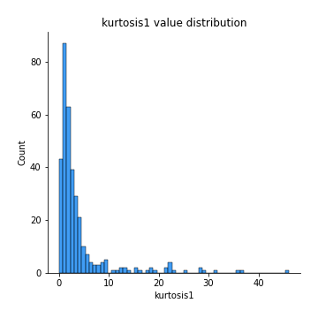
## Feature : kurtosis2
- **Feature type** : continous
- **Missing** : 0.0%
- **Unique** : 347
- **Count** :347.0
- **Mean** :4.108667260338225
- **Std** :9.113288557523017
- **Min** :-0.06535314846591778
- **25%th Percentile** : 1.2120416719389708
- **50%th Percentile** : 1.9723519343077203
- **75%th Percentile** : 4.063516554723738
- **Max** :143.10871011533666

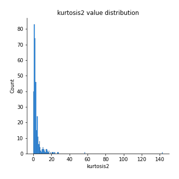
## Feature : return_autocorrelation_1_lag1
- **Feature type** : continous
- **Missing** : 0.0%
- **Unique** : 347
- **Count** :347.0
- **Mean** :-0.014956204616534985
- **Std** :0.05984801294340626
- **Min** :-0.2135576224968752
- **25%th Percentile** : -0.053863302735860624
- **50%th Percentile** : -0.009784351615468232
- **75%th Percentile** : 0.023320849012775556
- **Max** :0.12810656890648087

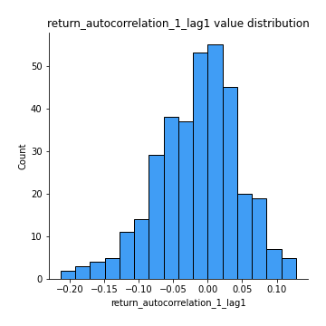
## Feature : return_autocorrelation_1_lag2
- **Feature type** : continous
- **Missing** : 0.0%
- **Unique** : 347
- **Count** :347.0
- **Mean** :-0.0067626267252993396
- **Std** :0.05411786745829826
- **Min** :-0.18381058860198976
- **25%th Percentile** : -0.040472335535848586
- **50%th Percentile** : -0.004499618911780746
- **75%th Percentile** : 0.02982964268661626
- **Max** :0.1561488228015672

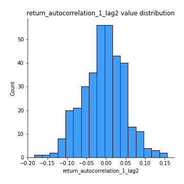
## Feature : return_autocorrelation_1_lag3
- **Feature type** : continous
- **Missing** : 0.0%
- **Unique** : 347
- **Count** :347.0
- **Mean** :-0.0019403156164796266
- **Std** :0.053073086110343885
- **Min** :-0.15117275786205733
- **25%th Percentile** : -0.03577816577818302
- **50%th Percentile** : 0.0015663593689978104
- **75%th Percentile** : 0.032882636020726136
- **Max** :0.17805869530681923

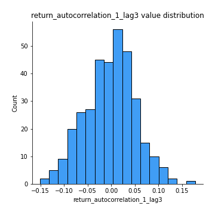
## Feature : return_autocorrelation_2_lag1
- **Feature type** : continous
- **Missing** : 0.0%
- **Unique** : 347
- **Count** :347.0
- **Mean** :-0.015420314546390252
- **Std** :0.059957950245946835
- **Min** :-0.24590087874039124
- **25%th Percentile** : -0.04490954468793276
- **50%th Percentile** : -0.011571756029946801
- **75%th Percentile** : 0.024881574232653265
- **Max** :0.16349871797309318

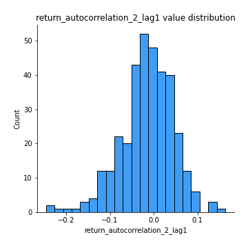
## Feature : return_autocorrelation_2_lag2
- **Feature type** : continous
- **Missing** : 0.0%
- **Unique** : 347
- **Count** :347.0
- **Mean** :-0.005962170844565797
- **Std** :0.05230248363824528
- **Min** :-0.16285734044368777
- **25%th Percentile** : -0.039082920160348186
- **50%th Percentile** : -0.007279153211559792
- **75%th Percentile** : 0.024258595368522203
- **Max** :0.1735398560230086

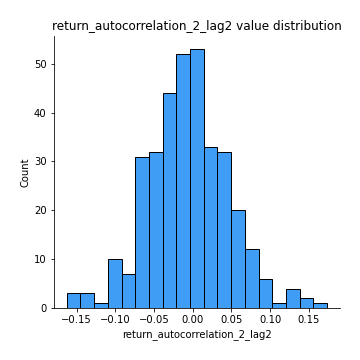
## Feature : return_autocorrelation_2_lag3
- **Feature type** : continous
- **Missing** : 0.0%
- **Unique** : 347
- **Count** :347.0
- **Mean** :-0.009996090333221951
- **Std** :0.05371268937332825
- **Min** :-0.1640511727074702
- **25%th Percentile** : -0.043249954606800894
- **50%th Percentile** : -0.010368326992393337
- **75%th Percentile** : 0.027083184416379538
- **Max** :0.13771173946805115

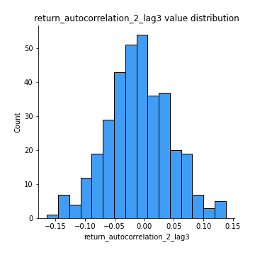
## Feature : return_correlation_ts1_lag_0
- **Feature type** : continous
- **Missing** : 0.0%
- **Unique** : 347
- **Count** :347.0
- **Mean** :0.33518309971381527
- **Std** :0.11077908222773762
- **Min** :-0.027089510445801036
- **25%th Percentile** : 0.27790215482159497
- **50%th Percentile** : 0.3427089342761286
- **75%th Percentile** : 0.3946485463878955
- **Max** :0.7041861626832071

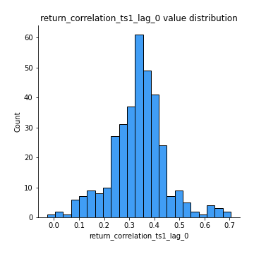
## Feature : return_correlation_ts1_lag_1
- **Feature type** : continous
- **Missing** : 0.0%
- **Unique** : 347
- **Count** :347.0
- **Mean** :-0.009780907647807953
- **Std** :0.05736301252401513
- **Min** :-0.16985510949917193
- **25%th Percentile** : -0.04595609286605576
- **50%th Percentile** : -0.007653034315001178
- **75%th Percentile** : 0.02985341187798687
- **Max** :0.17266120160997261

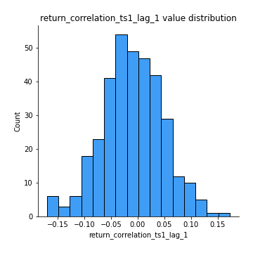
## Feature : return_correlation_ts1_lag_2
- **Feature type** : continous
- **Missing** : 0.0%
- **Unique** : 347
- **Count** :347.0
- **Mean** :-0.0032335224276139087
- **Std** :0.052812118637218845
- **Min** :-0.21653581047581763
- **25%th Percentile** : -0.03727793894210359
- **50%th Percentile** : -0.0038537794177983488
- **75%th Percentile** : 0.03214837089345851
- **Max** :0.176275253477609

## Feature : return_correlation_ts1_lag_3
- **Feature type** : continous
- **Missing** : 0.0%
- **Unique** : 347
- **Count** :347.0
- **Mean** :-0.001695952321093114
- **Std** :0.055637486081265446
- **Min** :-0.18212580738606673
- **25%th Percentile** : -0.040078659434824096
- **50%th Percentile** : -2.0355187240630035e-05
- **75%th Percentile** : 0.03665493001813791
- **Max** :0.1636773216468148

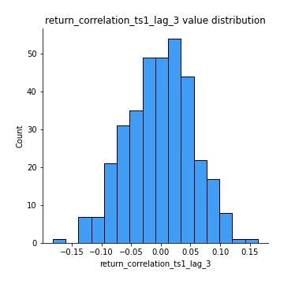
## Feature : return_correlation_ts2_lag_1
- **Feature type** : continous
- **Missing** : 0.0%
- **Unique** : 347
- **Count** :347.0
- **Mean** :-0.010830595399313823
- **Std** :0.056735305340193824
- **Min** :-0.2081139431093261
- **25%th Percentile** : -0.04294758152740767
- **50%th Percentile** : -0.009866335752524082
- **75%th Percentile** : 0.026998380544514596
- **Max** :0.16795470458451506

## Feature : return_correlation_ts2_lag_2
- **Feature type** : continous
- **Missing** : 0.0%
- **Unique** : 347
- **Count** :347.0
- **Mean** :-0.005459697129677773
- **Std** :0.05353321924206218
- **Min** :-0.23751835475804678
- **25%th Percentile** : -0.040708479168370615
- **50%th Percentile** : -0.004813328030331077
- **75%th Percentile** : 0.027167396961872037
- **Max** :0.20772887392904255

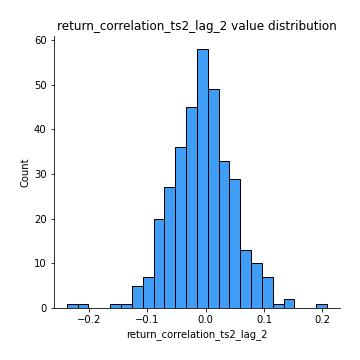
## Feature : return_correlation_ts2_lag_3
- **Feature type** : continous
- **Missing** : 0.0%
- **Unique** : 347
- **Count** :347.0
- **Mean** :-0.0034669947825171727
- **Std** :0.05565306375385409
- **Min** :-0.17564076057312866
- **25%th Percentile** : -0.033350116795373974
- **50%th Percentile** : -0.0031696992515712744
- **75%th Percentile** : 0.034287413811626005
- **Max** :0.12578577770423086

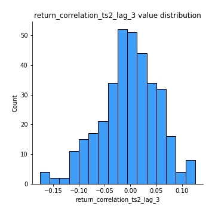
## Feature : sqreturn_autocorrelation_ts1_lag1
- **Feature type** : continous
- **Missing** : 0.0%
- **Unique** : 347
- **Count** :347.0
- **Mean** :0.11220926117895814
- **Std** :0.08873959291721602
- **Min** :-0.052978649713557625
- **25%th Percentile** : 0.04686416470648641
- **50%th Percentile** : 0.0986914417389
- **75%th Percentile** : 0.16332780031221716
- **Max** :0.49414293176447355

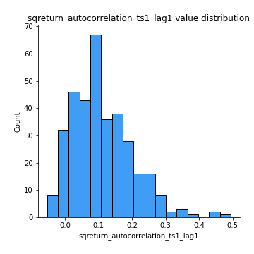
## Feature : sqreturn_autocorrelation_ts1_lag2
- **Feature type** : continous
- **Missing** : 0.0%
- **Unique** : 347
- **Count** :347.0
- **Mean** :0.10844345730384378
- **Std** :0.09003559170181995
- **Min** :-0.05165593255897504
- **25%th Percentile** : 0.037803004532887534
- **50%th Percentile** : 0.09268768950964823
- **75%th Percentile** : 0.16680411937498058
- **Max** :0.4522162366773919

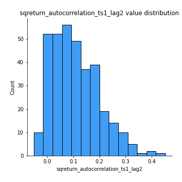
## Feature : sqreturn_autocorrelation_ts1_lag3
- **Feature type** : continous
- **Missing** : 0.0%
- **Unique** : 347
- **Count** :347.0
- **Mean** :0.09773636172339208
- **Std** :0.08529060165195045
- **Min** :-0.06486026764840777
- **25%th Percentile** : 0.02618239629085265
- **50%th Percentile** : 0.0918107213765081
- **75%th Percentile** : 0.15488339997364034
- **Max** :0.41030914918857014

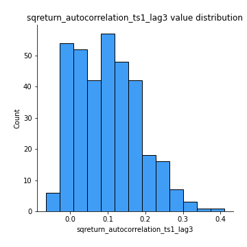
## Feature : sqreturn_autocorrelation_ts2_lag1
- **Feature type** : continous
- **Missing** : 0.0%
- **Unique** : 347
- **Count** :347.0
- **Mean** :0.11945769356276596
- **Std** :0.08482568279732265
- **Min** :-0.04997282481431907
- **25%th Percentile** : 0.05451755491809518
- **50%th Percentile** : 0.11513308631597265
- **75%th Percentile** : 0.16923010861408994
- **Max** :0.510085647437958

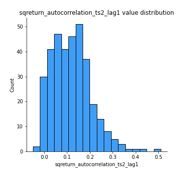
## Feature : sqreturn_autocorrelation_ts2_lag2
- **Feature type** : continous
- **Missing** : 0.0%
- **Unique** : 347
- **Count** :347.0
- **Mean** :0.10525030834779851
- **Std** :0.08907218658714867
- **Min** :-0.051523884196217395
- **25%th Percentile** : 0.03363347755698126
- **50%th Percentile** : 0.09443545090829754
- **75%th Percentile** : 0.16606047657776907
- **Max** :0.45676817892778204

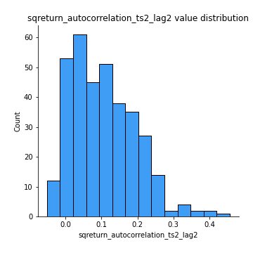
## Feature : sqreturn_autocorrelation_ts2_lag3
- **Feature type** : continous
- **Missing** : 0.0%
- **Unique** : 347
- **Count** :347.0
- **Mean** :0.10267016289014386
- **Std** :0.0876009347123692
- **Min** :-0.06082766359524085
- **25%th Percentile** : 0.02853700738447734
- **50%th Percentile** : 0.09971931109301782
- **75%th Percentile** : 0.15947935400888946
- **Max** :0.35181825554442

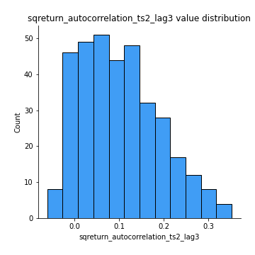
## Feature : sqreturn_correlation_ts1_lag_0
- **Feature type** : continous
- **Missing** : 0.0%
- **Unique** : 347
- **Count** :347.0
- **Mean** :0.33518309971381527
- **Std** :0.11077908222773762
- **Min** :-0.027089510445801036
- **25%th Percentile** : 0.27790215482159497
- **50%th Percentile** : 0.3427089342761286
- **75%th Percentile** : 0.3946485463878955
- **Max** :0.7041861626832071

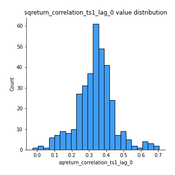
## Feature : sqreturn_correlation_ts1_lag_1
- **Feature type** : continous
- **Missing** : 0.0%
- **Unique** : 347
- **Count** :347.0
- **Mean** :-0.009780907647807953
- **Std** :0.05736301252401513
- **Min** :-0.16985510949917193
- **25%th Percentile** : -0.04595609286605576
- **50%th Percentile** : -0.007653034315001178
- **75%th Percentile** : 0.02985341187798687
- **Max** :0.17266120160997261

## Feature : sqreturn_correlation_ts1_lag_2
- **Feature type** : continous
- **Missing** : 0.0%
- **Unique** : 347
- **Count** :347.0
- **Mean** :-0.0032335224276139087
- **Std** :0.052812118637218845
- **Min** :-0.21653581047581763
- **25%th Percentile** : -0.03727793894210359
- **50%th Percentile** : -0.0038537794177983488
- **75%th Percentile** : 0.03214837089345851
- **Max** :0.176275253477609

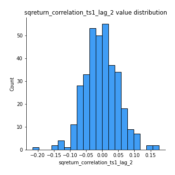
## Feature : sqreturn_correlation_ts1_lag_3
- **Feature type** : continous
- **Missing** : 0.0%
- **Unique** : 347
- **Count** :347.0
- **Mean** :-0.001695952321093114
- **Std** :0.055637486081265446
- **Min** :-0.18212580738606673
- **25%th Percentile** : -0.040078659434824096
- **50%th Percentile** : -2.0355187240630035e-05
- **75%th Percentile** : 0.03665493001813791
- **Max** :0.1636773216468148

## Feature : sqreturn_correlation_ts2_lag_1
- **Feature type** : continous
- **Missing** : 0.0%
- **Unique** : 347
- **Count** :347.0
- **Mean** :-0.010830595399313823
- **Std** :0.056735305340193824
- **Min** :-0.2081139431093261
- **25%th Percentile** : -0.04294758152740767
- **50%th Percentile** : -0.009866335752524082
- **75%th Percentile** : 0.026998380544514596
- **Max** :0.16795470458451506

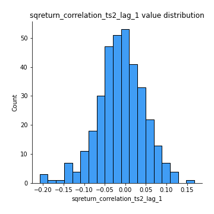
## Feature : sqreturn_correlation_ts2_lag_2
- **Feature type** : continous
- **Missing** : 0.0%
- **Unique** : 347
- **Count** :347.0
- **Mean** :-0.005459697129677773
- **Std** :0.05353321924206218
- **Min** :-0.23751835475804678
- **25%th Percentile** : -0.040708479168370615
- **50%th Percentile** : -0.004813328030331077
- **75%th Percentile** : 0.027167396961872037
- **Max** :0.20772887392904255

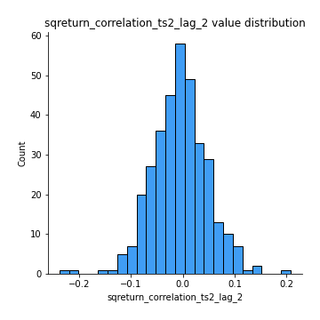
## Feature : sqreturn_correlation_ts2_lag_3
- **Feature type** : continous
- **Missing** : 0.0%
- **Unique** : 347
- **Count** :347.0
- **Mean** :-0.0034669947825171727
- **Std** :0.05565306375385409
- **Min** :-0.17564076057312866
- **25%th Percentile** : -0.033350116795373974
- **50%th Percentile** : -0.0031696992515712744
- **75%th Percentile** : 0.034287413811626005
- **Max** :0.12578577770423086

## Feature : price2_granger_cause_price1
- **Feature type** : continous
- **Missing** : 0.0%
- **Unique** : 347
- **Count** :347.0
- **Mean** :0.3156736712267261
- **Std** :0.3002364946807974
- **Min** :1.1505642493585304e-05
- **25%th Percentile** : 0.041587229823332315
- **50%th Percentile** : 0.2284290991659397
- **75%th Percentile** : 0.5495617530617543
- **Max** :0.9885712803689185

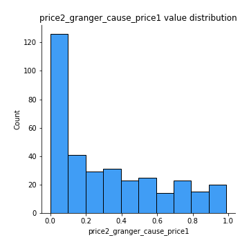
## Feature : price1_granger_cause_price2
- **Feature type** : continous
- **Missing** : 0.0%
- **Unique** : 347
- **Count** :347.0
- **Mean** :0.30024069538976783
- **Std** :0.2806013577191517
- **Min** :3.9310985860560525e-06
- **25%th Percentile** : 0.040553636675549745
- **50%th Percentile** : 0.2388163939322348
- **75%th Percentile** : 0.5121971172572328
- **Max** :0.9946397372010516

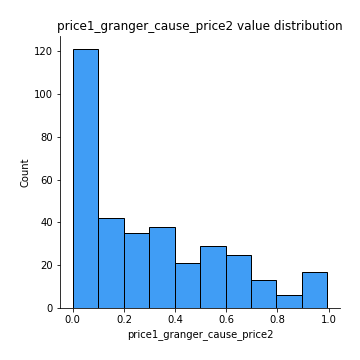

[<< Go back](../README.md)
