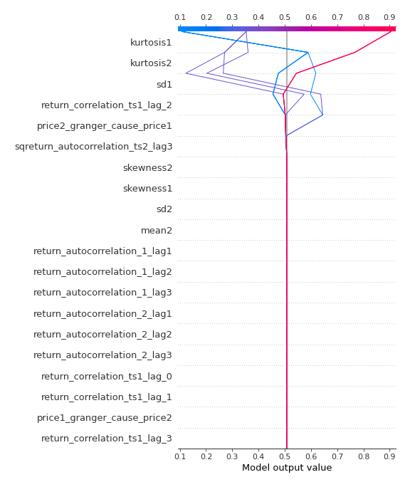

# Summary of 2_DecisionTree

[<< Go back](../README.md)

## Decision Tree
- **n_jobs**: -1
- **criterion**: gini
- **max_depth**: 3
- **explain_level**: 2

## Validation
 - **validation_type**: split
 - **train_ratio**: 0.75
 - **shuffle**: True
 - **stratify**: True

## Optimized metric
accuracy

## Training time

13.4 seconds

## Metric details
|           |    score |   threshold |
|:----------|---------:|------------:|
| logloss   | 0.904779 | nan         |
| auc       | 0.80814  | nan         |
| f1        | 0.808081 |   0.108108  |
| accuracy  | 0.793103 |   0.506435  |
| precision | 0.770833 |   0.506435  |
| recall    | 1        |   0.0123288 |
| mcc       | 0.588212 |   0.506435  |

## Confusion matrix (at threshold=0.506435)
|                      |   Predicted as real |   Predicted as simulated |
|:---------------------|--------------------:|-------------------------:|
| Labeled as real      |                  32 |                       11 |
| Labeled as simulated |                   7 |                       37 |

## Learning curves

## Decision Tree 

### Tree #1

### Rules

if (kurtosis2 <= 3.665) and (kurtosis1 <= 2.815) and (sd1 > 1.412) then class: simulated (proba: 90.48%) | based on 126 samples

if (kurtosis2 > 3.665) and (sqreturn_autocorrelation_ts2_lag3 <= 0.27) and (price2_granger_cause_price1 > 0.001) then class: real (proba: 98.63%) | based on 73 samples

if (kurtosis2 <= 3.665) and (kurtosis1 > 2.815) and (return_correlation_ts1_lag_2 <= 0.074) then class: real (proba: 89.19%) | based on 37 samples

if (kurtosis2 <= 3.665) and (kurtosis1 <= 2.815) and (sd1 <= 1.412) then class: real (proba: 64.71%) | based on 17 samples

if (kurtosis2 <= 3.665) and (kurtosis1 > 2.815) and (return_correlation_ts1_lag_2 > 0.074) then class: simulated (proba: 100.0%) | based on 4 samples

if (kurtosis2 > 3.665) and (sqreturn_autocorrelation_ts2_lag3 > 0.27) then class: simulated (proba: 100.0%) | based on 2 samples

if (kurtosis2 > 3.665) and (sqreturn_autocorrelation_ts2_lag3 <= 0.27) and (price2_granger_cause_price1 <= 0.001) then class: simulated (proba: 100.0%) | based on 1 samples

## Permutation-based Importance

## Confusion Matrix

## Normalized Confusion Matrix

## ROC Curve

## Kolmogorov-Smirnov Statistic

## Precision-Recall Curve

## Calibration Curve

## Cumulative Gains Curve

## Lift Curve

## SHAP Importance

## SHAP Dependence plots

### Dependence (Fold 1)

## SHAP Decision plots

### Top-10 Worst decisions for class 0 (Fold 1)

### Top-10 Best decisions for class 0 (Fold 1)

### Top-10 Worst decisions for class 1 (Fold 1)

### Top-10 Best decisions for class 1 (Fold 1)

[<< Go back](../README.md)
