# Exploratory Data Analysis

[<< Go back](../README.md)
## Feature : target
- **Feature type** : categorical
- **Missing** : 0.0%
- **Unique** : 2
- **Count** :347
- **Unique** :2
- **Top** :simulated
- **Freq** :176

## Feature : mean1
- **Feature type** : continous
- **Missing** : 0.0%
- **Unique** : 347
- **Count** :347.0
- **Mean** :0.07645539098872413
- **Std** :0.0754966283004312
- **Min** :-0.17686457077756634
- **25%th Percentile** : 0.02923216724711656
- **50%th Percentile** : 0.07279867275673294
- **75%th Percentile** : 0.12111922945205318
- **Max** :0.3612366374600757

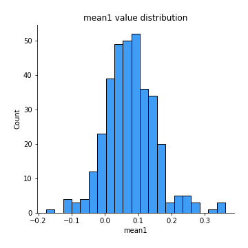
## Feature : mean2
- **Feature type** : continous
- **Missing** : 0.0%
- **Unique** : 347
- **Count** :347.0
- **Mean** :0.09087874558939844
- **Std** :0.08715873756200881
- **Min** :-0.24205418062825398
- **25%th Percentile** : 0.042586379972425356
- **50%th Percentile** : 0.08928014582805889
- **75%th Percentile** : 0.14537731008283175
- **Max** :0.37616608147096464

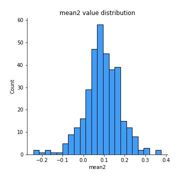
## Feature : sd1
- **Feature type** : continous
- **Missing** : 0.0%
- **Unique** : 347
- **Count** :347.0
- **Mean** :1.997487963739105
- **Std** :0.6492783727371201
- **Min** :0.7470080772831957
- **25%th Percentile** : 1.5063309776061045
- **50%th Percentile** : 1.9914248523621858
- **75%th Percentile** : 2.4387311642160476
- **Max** :5.078944219768741

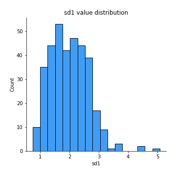
## Feature : sd2
- **Feature type** : continous
- **Missing** : 0.0%
- **Unique** : 347
- **Count** :347.0
- **Mean** :1.9299674442704862
- **Std** :0.7661450271381324
- **Min** :0.8455946193085045
- **25%th Percentile** : 1.4305335739348086
- **50%th Percentile** : 1.7690549378630431
- **75%th Percentile** : 2.2219501584794097
- **Max** :6.737618636746393

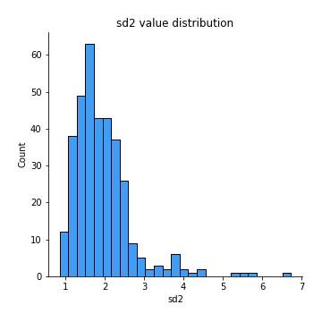
## Feature : skewness1
- **Feature type** : continous
- **Missing** : 0.0%
- **Unique** : 347
- **Count** :347.0
- **Mean** :-0.14189332821959966
- **Std** :0.5775707430329181
- **Min** :-3.530116233761814
- **25%th Percentile** : -0.3130395912545013
- **50%th Percentile** : -0.14201612541736675
- **75%th Percentile** : 0.04336459188868917
- **Max** :2.224942816365292

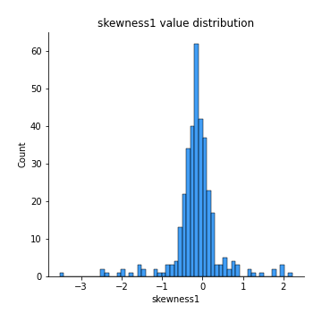
## Feature : skewness2
- **Feature type** : continous
- **Missing** : 0.0%
- **Unique** : 347
- **Count** :347.0
- **Mean** :-0.2122623446064174
- **Std** :0.648973327499886
- **Min** :-5.778144124281153
- **25%th Percentile** : -0.3741474908877353
- **50%th Percentile** : -0.16921757815194854
- **75%th Percentile** : 0.02722028728175563
- **Max** :2.2606839051517187

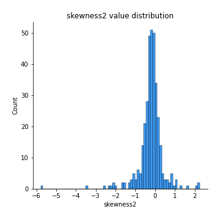
## Feature : kurtosis1
- **Feature type** : continous
- **Missing** : 0.0%
- **Unique** : 347
- **Count** :347.0
- **Mean** :3.7337267501356095
- **Std** :5.293338147900988
- **Min** :-0.04663888915476555
- **25%th Percentile** : 1.1059012563357022
- **50%th Percentile** : 1.8615660101512623
- **75%th Percentile** : 3.6777430951033687
- **Max** :35.56636016047202

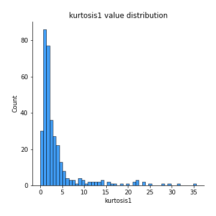
## Feature : kurtosis2
- **Feature type** : continous
- **Missing** : 0.0%
- **Unique** : 347
- **Count** :347.0
- **Mean** :4.177951573552505
- **Std** :6.5145189055089
- **Min** :0.10553352476973021
- **25%th Percentile** : 1.2699156530687996
- **50%th Percentile** : 2.143865025965661
- **75%th Percentile** : 4.1647721197714365
- **Max** :71.39844769176813

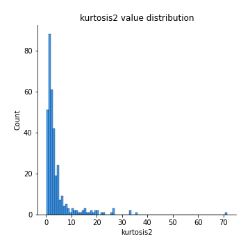
## Feature : return_autocorrelation_1_lag1
- **Feature type** : continous
- **Missing** : 0.0%
- **Unique** : 347
- **Count** :347.0
- **Mean** :-0.014669355896501033
- **Std** :0.06028430261607031
- **Min** :-0.20673896439036124
- **25%th Percentile** : -0.051157066666456884
- **50%th Percentile** : -0.010924040303621192
- **75%th Percentile** : 0.022506299921762354
- **Max** :0.15147717188059656

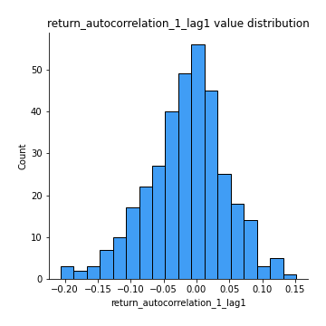
## Feature : return_autocorrelation_1_lag2
- **Feature type** : continous
- **Missing** : 0.0%
- **Unique** : 347
- **Count** :347.0
- **Mean** :-0.007328400697434332
- **Std** :0.05399927793300627
- **Min** :-0.14892249759609433
- **25%th Percentile** : -0.046092298384236834
- **50%th Percentile** : -0.003362474849857754
- **75%th Percentile** : 0.026904996227848706
- **Max** :0.1561488228015672

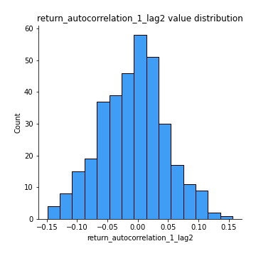
## Feature : return_autocorrelation_1_lag3
- **Feature type** : continous
- **Missing** : 0.0%
- **Unique** : 347
- **Count** :347.0
- **Mean** :-0.006225755875178179
- **Std** :0.05848302771989691
- **Min** :-0.1940836867390813
- **25%th Percentile** : -0.04192482331371623
- **50%th Percentile** : -0.006085767783600264
- **75%th Percentile** : 0.03075969210766649
- **Max** :0.17805869530681923

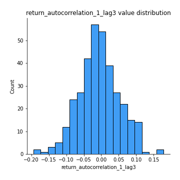
## Feature : return_autocorrelation_2_lag1
- **Feature type** : continous
- **Missing** : 0.0%
- **Unique** : 347
- **Count** :347.0
- **Mean** :-0.008309776426205532
- **Std** :0.06624359231913475
- **Min** :-0.25075531010123286
- **25%th Percentile** : -0.045611088232519886
- **50%th Percentile** : -0.006234344071383121
- **75%th Percentile** : 0.032970675570875616
- **Max** :0.31863413537898483

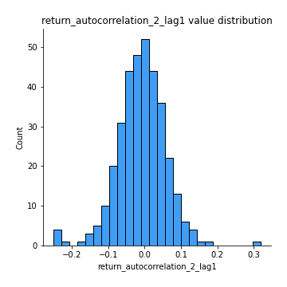
## Feature : return_autocorrelation_2_lag2
- **Feature type** : continous
- **Missing** : 0.0%
- **Unique** : 347
- **Count** :347.0
- **Mean** :-0.0038172812624566676
- **Std** :0.05853417598631148
- **Min** :-0.1495113937562178
- **25%th Percentile** : -0.04142676149465491
- **50%th Percentile** : -0.006553759882398217
- **75%th Percentile** : 0.03230167719009329
- **Max** :0.2147444772548326

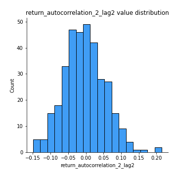
## Feature : return_autocorrelation_2_lag3
- **Feature type** : continous
- **Missing** : 0.0%
- **Unique** : 347
- **Count** :347.0
- **Mean** :-0.008070501087060724
- **Std** :0.05477271676537936
- **Min** :-0.1681172013237642
- **25%th Percentile** : -0.04338216747681338
- **50%th Percentile** : -0.008132249003620575
- **75%th Percentile** : 0.02731248190381996
- **Max** :0.1419999376914021

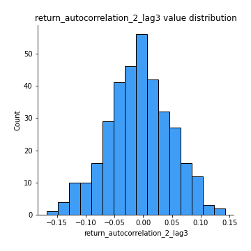
## Feature : return_correlation_ts1_lag_0
- **Feature type** : continous
- **Missing** : 0.0%
- **Unique** : 347
- **Count** :347.0
- **Mean** :0.3367361201631588
- **Std** :0.1090671148177776
- **Min** :-0.027089510445801036
- **25%th Percentile** : 0.2792115279827305
- **50%th Percentile** : 0.3438947143821985
- **75%th Percentile** : 0.3930364793771611
- **Max** :0.7041861626832071

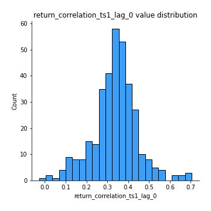
## Feature : return_correlation_ts1_lag_1
- **Feature type** : continous
- **Missing** : 0.0%
- **Unique** : 347
- **Count** :347.0
- **Mean** :-0.009294582019257333
- **Std** :0.05192208024396942
- **Min** :-0.1549695474991776
- **25%th Percentile** : -0.040914617616209396
- **50%th Percentile** : -0.0065776061526431175
- **75%th Percentile** : 0.0224615595684859
- **Max** :0.12885175952335462

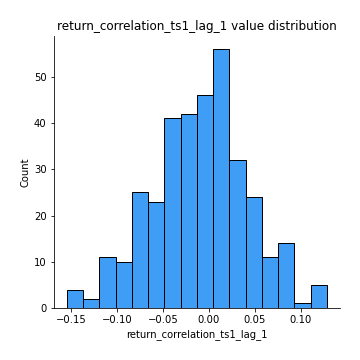
## Feature : return_correlation_ts1_lag_2
- **Feature type** : continous
- **Missing** : 0.0%
- **Unique** : 347
- **Count** :347.0
- **Mean** :-0.004959372651807667
- **Std** :0.05223438197455479
- **Min** :-0.12864410180561703
- **25%th Percentile** : -0.04232766911257793
- **50%th Percentile** : -0.00790984021372761
- **75%th Percentile** : 0.03620575350427839
- **Max** :0.130908341063118

## Feature : return_correlation_ts1_lag_3
- **Feature type** : continous
- **Missing** : 0.0%
- **Unique** : 347
- **Count** :347.0
- **Mean** :-0.006282775338504005
- **Std** :0.05389687278408724
- **Min** :-0.1400637163757908
- **25%th Percentile** : -0.04140844146655829
- **50%th Percentile** : -0.006171044904863622
- **75%th Percentile** : 0.029089039939470353
- **Max** :0.1422809271770942

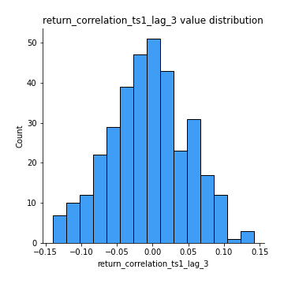
## Feature : return_correlation_ts2_lag_1
- **Feature type** : continous
- **Missing** : 0.0%
- **Unique** : 347
- **Count** :347.0
- **Mean** :-0.008559404941224162
- **Std** :0.0550657435630626
- **Min** :-0.2081139431093261
- **25%th Percentile** : -0.044298072864382074
- **50%th Percentile** : -0.008435086108704056
- **75%th Percentile** : 0.026766380451968715
- **Max** :0.17208763791364762

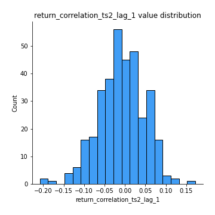
## Feature : return_correlation_ts2_lag_2
- **Feature type** : continous
- **Missing** : 0.0%
- **Unique** : 347
- **Count** :347.0
- **Mean** :-0.0054579470595498445
- **Std** :0.05471269587074158
- **Min** :-0.23751835475804678
- **25%th Percentile** : -0.04317170250944313
- **50%th Percentile** : -0.008284113659141279
- **75%th Percentile** : 0.022367429528683105
- **Max** :0.20772887392904255

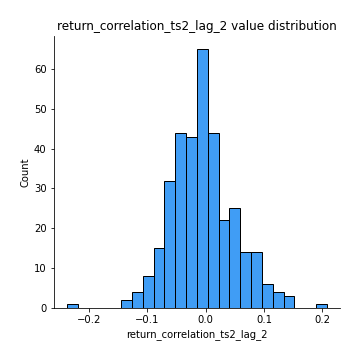
## Feature : return_correlation_ts2_lag_3
- **Feature type** : continous
- **Missing** : 0.0%
- **Unique** : 347
- **Count** :347.0
- **Mean** :-0.007099773407549349
- **Std** :0.053745032516347234
- **Min** :-0.17564076057312866
- **25%th Percentile** : -0.0402381462871122
- **50%th Percentile** : -0.006773721994886775
- **75%th Percentile** : 0.029390922254571867
- **Max** :0.12578577770423086

## Feature : sqreturn_autocorrelation_ts1_lag1
- **Feature type** : continous
- **Missing** : 0.0%
- **Unique** : 347
- **Count** :347.0
- **Mean** :0.11634594651311016
- **Std** :0.09162446291613634
- **Min** :-0.06532118872798363
- **25%th Percentile** : 0.05356667589795294
- **50%th Percentile** : 0.09959265989300904
- **75%th Percentile** : 0.16828066863866675
- **Max** :0.49414293176447355

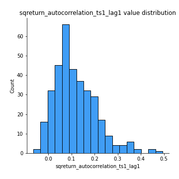
## Feature : sqreturn_autocorrelation_ts1_lag2
- **Feature type** : continous
- **Missing** : 0.0%
- **Unique** : 347
- **Count** :347.0
- **Mean** :0.10559046356849057
- **Std** :0.08896092257550382
- **Min** :-0.05419304650062953
- **25%th Percentile** : 0.03793280355094404
- **50%th Percentile** : 0.09599791728860291
- **75%th Percentile** : 0.15700229859463094
- **Max** :0.4522162366773919

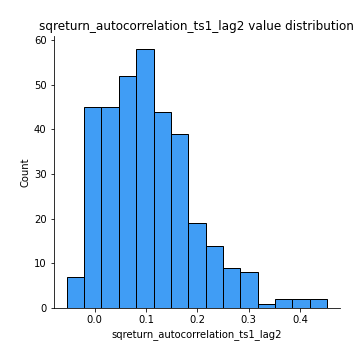
## Feature : sqreturn_autocorrelation_ts1_lag3
- **Feature type** : continous
- **Missing** : 0.0%
- **Unique** : 347
- **Count** :347.0
- **Mean** :0.09949970576404912
- **Std** :0.08844102190677638
- **Min** :-0.06486026764840777
- **25%th Percentile** : 0.03351516853956158
- **50%th Percentile** : 0.08344616139633744
- **75%th Percentile** : 0.1511567670183224
- **Max** :0.44755937369538146

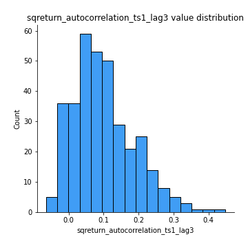
## Feature : sqreturn_autocorrelation_ts2_lag1
- **Feature type** : continous
- **Missing** : 0.0%
- **Unique** : 347
- **Count** :347.0
- **Mean** :0.11780327361421648
- **Std** :0.08613525471124034
- **Min** :-0.08520586663750691
- **25%th Percentile** : 0.0524425337114999
- **50%th Percentile** : 0.11089019727126138
- **75%th Percentile** : 0.172277895836694
- **Max** :0.4555123878092393

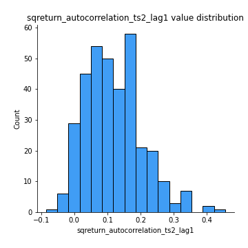
## Feature : sqreturn_autocorrelation_ts2_lag2
- **Feature type** : continous
- **Missing** : 0.0%
- **Unique** : 347
- **Count** :347.0
- **Mean** :0.108922730560721
- **Std** :0.09190587514185884
- **Min** :-0.04252777454900163
- **25%th Percentile** : 0.03784755123715608
- **50%th Percentile** : 0.09588899326715943
- **75%th Percentile** : 0.1655388857812203
- **Max** :0.5373432415582473

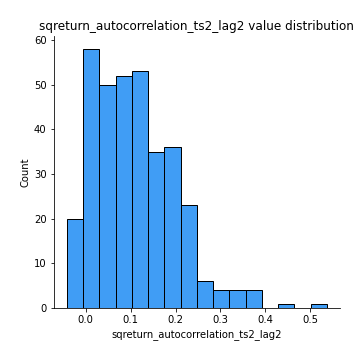
## Feature : sqreturn_autocorrelation_ts2_lag3
- **Feature type** : continous
- **Missing** : 0.0%
- **Unique** : 347
- **Count** :347.0
- **Mean** :0.10101931195593787
- **Std** :0.08859344624559443
- **Min** :-0.06082766359524085
- **25%th Percentile** : 0.03265171246681291
- **50%th Percentile** : 0.0931078839489695
- **75%th Percentile** : 0.1582360698523121
- **Max** :0.4995546833840105

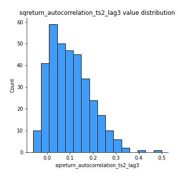
## Feature : sqreturn_correlation_ts1_lag_0
- **Feature type** : continous
- **Missing** : 0.0%
- **Unique** : 347
- **Count** :347.0
- **Mean** :0.3367361201631588
- **Std** :0.1090671148177776
- **Min** :-0.027089510445801036
- **25%th Percentile** : 0.2792115279827305
- **50%th Percentile** : 0.3438947143821985
- **75%th Percentile** : 0.3930364793771611
- **Max** :0.7041861626832071

## Feature : sqreturn_correlation_ts1_lag_1
- **Feature type** : continous
- **Missing** : 0.0%
- **Unique** : 347
- **Count** :347.0
- **Mean** :-0.009294582019257333
- **Std** :0.05192208024396942
- **Min** :-0.1549695474991776
- **25%th Percentile** : -0.040914617616209396
- **50%th Percentile** : -0.0065776061526431175
- **75%th Percentile** : 0.0224615595684859
- **Max** :0.12885175952335462

## Feature : sqreturn_correlation_ts1_lag_2
- **Feature type** : continous
- **Missing** : 0.0%
- **Unique** : 347
- **Count** :347.0
- **Mean** :-0.004959372651807667
- **Std** :0.05223438197455479
- **Min** :-0.12864410180561703
- **25%th Percentile** : -0.04232766911257793
- **50%th Percentile** : -0.00790984021372761
- **75%th Percentile** : 0.03620575350427839
- **Max** :0.130908341063118

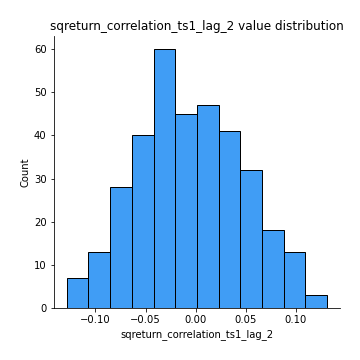
## Feature : sqreturn_correlation_ts1_lag_3
- **Feature type** : continous
- **Missing** : 0.0%
- **Unique** : 347
- **Count** :347.0
- **Mean** :-0.006282775338504005
- **Std** :0.05389687278408724
- **Min** :-0.1400637163757908
- **25%th Percentile** : -0.04140844146655829
- **50%th Percentile** : -0.006171044904863622
- **75%th Percentile** : 0.029089039939470353
- **Max** :0.1422809271770942

## Feature : sqreturn_correlation_ts2_lag_1
- **Feature type** : continous
- **Missing** : 0.0%
- **Unique** : 347
- **Count** :347.0
- **Mean** :-0.008559404941224162
- **Std** :0.0550657435630626
- **Min** :-0.2081139431093261
- **25%th Percentile** : -0.044298072864382074
- **50%th Percentile** : -0.008435086108704056
- **75%th Percentile** : 0.026766380451968715
- **Max** :0.17208763791364762

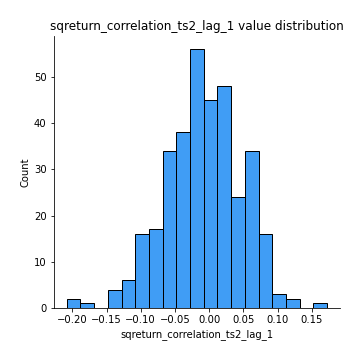
## Feature : sqreturn_correlation_ts2_lag_2
- **Feature type** : continous
- **Missing** : 0.0%
- **Unique** : 347
- **Count** :347.0
- **Mean** :-0.0054579470595498445
- **Std** :0.05471269587074158
- **Min** :-0.23751835475804678
- **25%th Percentile** : -0.04317170250944313
- **50%th Percentile** : -0.008284113659141279
- **75%th Percentile** : 0.022367429528683105
- **Max** :0.20772887392904255

## Feature : sqreturn_correlation_ts2_lag_3
- **Feature type** : continous
- **Missing** : 0.0%
- **Unique** : 347
- **Count** :347.0
- **Mean** :-0.007099773407549349
- **Std** :0.053745032516347234
- **Min** :-0.17564076057312866
- **25%th Percentile** : -0.0402381462871122
- **50%th Percentile** : -0.006773721994886775
- **75%th Percentile** : 0.029390922254571867
- **Max** :0.12578577770423086

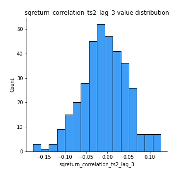
## Feature : price2_granger_cause_price1
- **Feature type** : continous
- **Missing** : 0.0%
- **Unique** : 347
- **Count** :347.0
- **Mean** :0.32460325519003386
- **Std** :0.2988247148105129
- **Min** :3.090249875820172e-13
- **25%th Percentile** : 0.045950885662933316
- **50%th Percentile** : 0.2655051161692139
- **75%th Percentile** : 0.543589087260733
- **Max** :0.9909881041135213

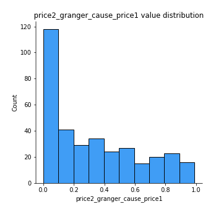
## Feature : price1_granger_cause_price2
- **Feature type** : continous
- **Missing** : 0.0%
- **Unique** : 347
- **Count** :347.0
- **Mean** :0.3361868850313
- **Std** :0.2899204766206558
- **Min** :4.5591053091502284e-08
- **25%th Percentile** : 0.05571623725164629
- **50%th Percentile** : 0.27429346242156877
- **75%th Percentile** : 0.571215961450511
- **Max** :0.9931598979390972

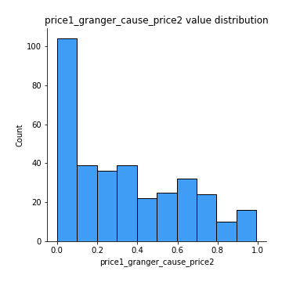

[<< Go back](../README.md)
