# Summary of 3_Linear

[<< Go back](../README.md)

## Logistic Regression (Linear)
- **n_jobs**: -1
- **explain_level**: 2

## Validation
 - **validation_type**: split
 - **train_ratio**: 0.75
 - **shuffle**: True
 - **stratify**: True

## Optimized metric
accuracy

## Training time

13.3 seconds

## Metric details
|           |    score |     threshold |
|:----------|---------:|--------------:|
| logloss   | 0.390701 | nan           |
| auc       | 0.915433 | nan           |
| f1        | 0.877551 |   0.593423    |
| accuracy  | 0.862069 |   0.593423    |
| precision | 1        |   0.840579    |
| recall    | 1        |   1.50352e-05 |
| mcc       | 0.743393 |   0.593423    |

## Confusion matrix (at threshold=0.593423)
|                      |   Predicted as real |   Predicted as simulated |
|:---------------------|--------------------:|-------------------------:|
| Labeled as real      |                  32 |                       11 |
| Labeled as simulated |                   1 |                       43 |

## Learning curves
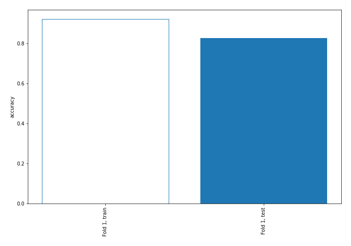

## Coefficients
| feature                           |   Learner_1 |
|:----------------------------------|------------:|
| mean2                             |   2.01137   |
| sqreturn_autocorrelation_ts2_lag3 |   1.56828   |
| mean1                             |   1.42126   |
| return_autocorrelation_1_lag3     |   0.870506  |
| sqreturn_autocorrelation_ts2_lag1 |   0.806447  |
| sqreturn_autocorrelation_ts1_lag3 |   0.801749  |
| sqreturn_autocorrelation_ts2_lag2 |   0.690151  |
| sqreturn_correlation_ts2_lag_3    |   0.645149  |
| return_correlation_ts2_lag_3      |   0.645149  |
| return_autocorrelation_2_lag1     |   0.616832  |
| sqreturn_autocorrelation_ts1_lag1 |   0.495367  |
| return_correlation_ts2_lag_1      |   0.48186   |
| sqreturn_correlation_ts2_lag_1    |   0.48186   |
| return_autocorrelation_2_lag3     |   0.4466    |
| sqreturn_autocorrelation_ts1_lag2 |   0.43522   |
| sd1                               |   0.420781  |
| return_autocorrelation_1_lag1     |   0.376821  |
| return_correlation_ts1_lag_1      |   0.262132  |
| sqreturn_correlation_ts1_lag_1    |   0.262132  |
| return_autocorrelation_1_lag2     |   0.258133  |
| return_correlation_ts1_lag_3      |   0.186885  |
| sqreturn_correlation_ts1_lag_3    |   0.186885  |
| return_autocorrelation_2_lag2     |   0.106472  |
| return_correlation_ts1_lag_2      |  -0.0221476 |
| sqreturn_correlation_ts1_lag_2    |  -0.0221476 |
| return_correlation_ts2_lag_2      |  -0.0404813 |
| sqreturn_correlation_ts2_lag_2    |  -0.0404813 |
| sd2                               |  -0.216181  |
| return_correlation_ts1_lag_0      |  -0.314939  |
| sqreturn_correlation_ts1_lag_0    |  -0.314939  |
| skewness2                         |  -0.383269  |
| skewness1                         |  -0.402585  |
| price1_granger_cause_price2       |  -0.485996  |
| price2_granger_cause_price1       |  -0.980595  |
| intercept                         |  -1.35785   |
| kurtosis1                         |  -2.8469    |
| kurtosis2                         |  -3.09506   |

## Permutation-based Importance
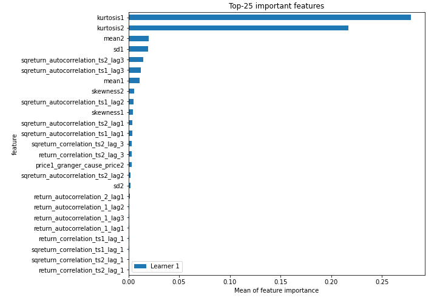
## Confusion Matrix

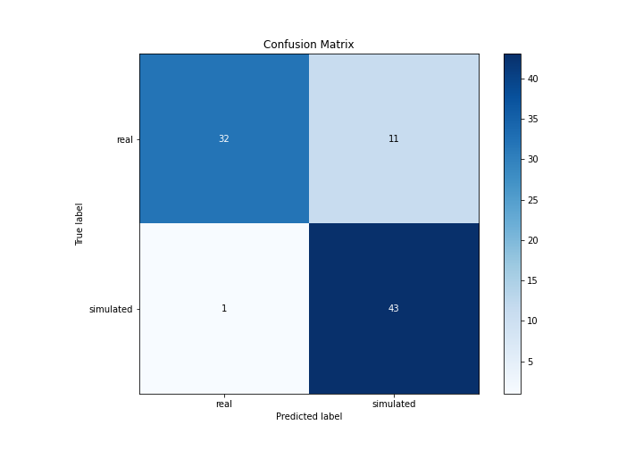

## Normalized Confusion Matrix

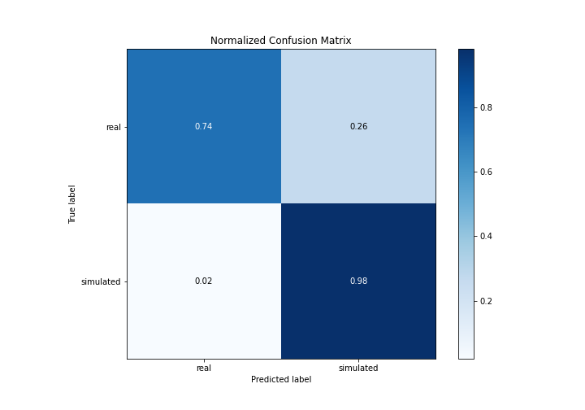

## ROC Curve

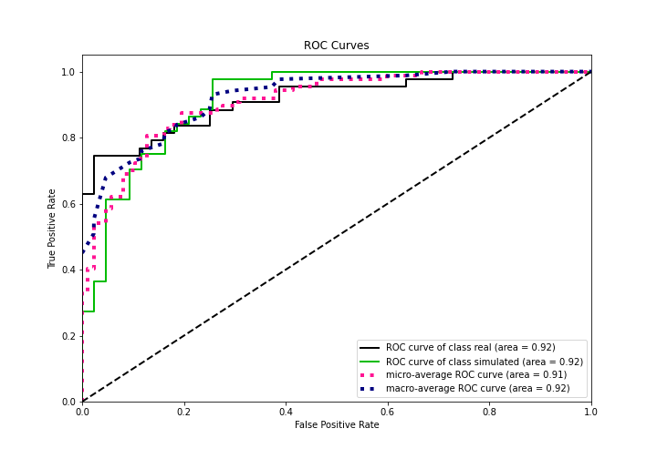

## Kolmogorov-Smirnov Statistic

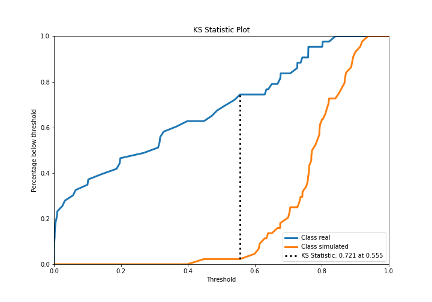

## Precision-Recall Curve

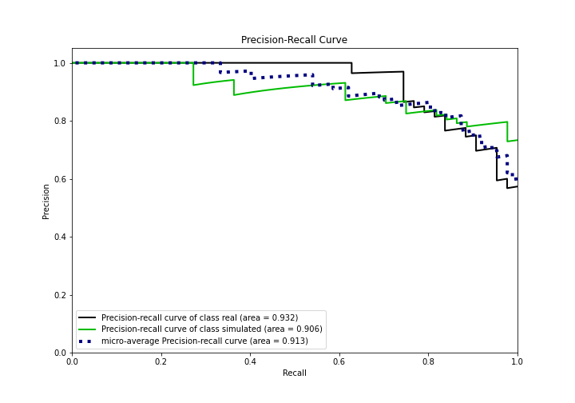

## Calibration Curve

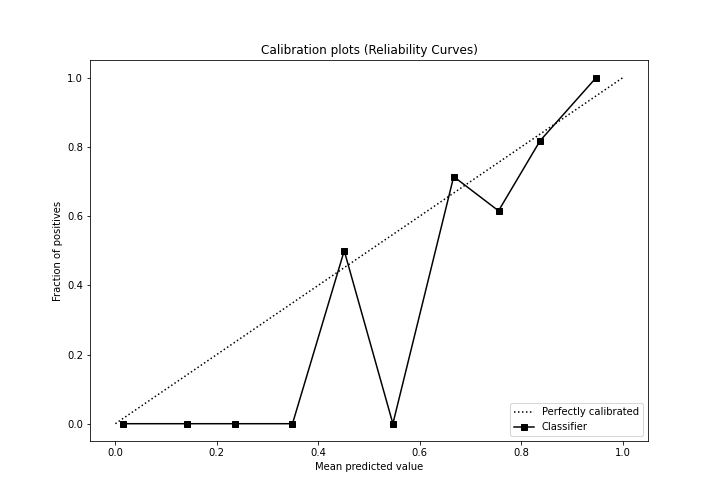

## Cumulative Gains Curve

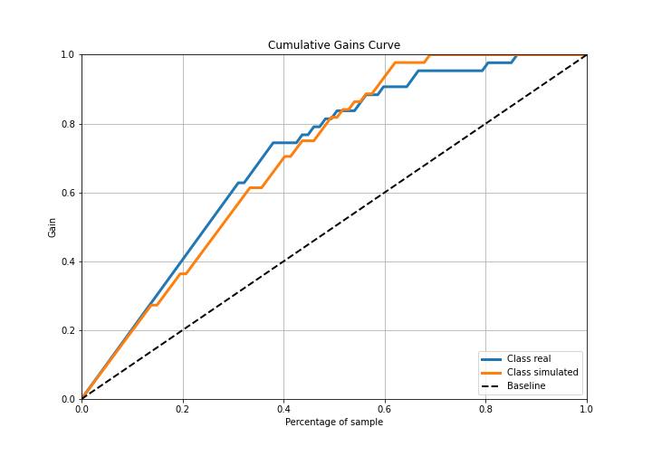

## Lift Curve

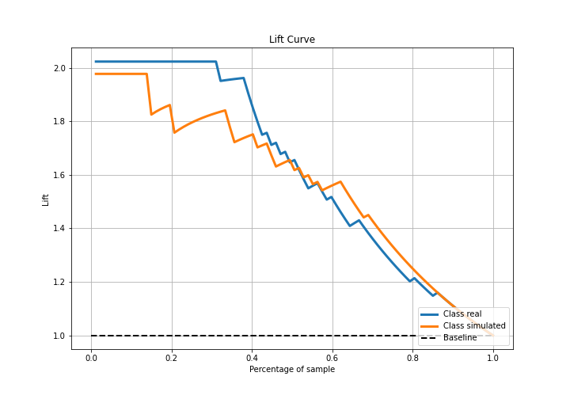

## SHAP Importance
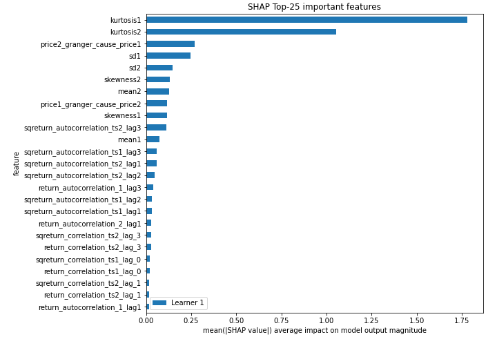

## SHAP Dependence plots

### Dependence (Fold 1)
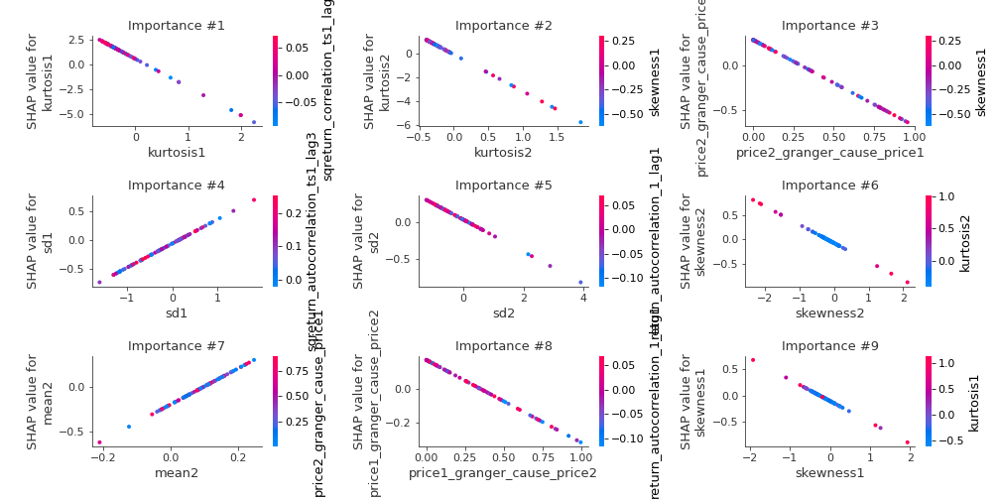

## SHAP Decision plots

### Top-10 Worst decisions for class 0 (Fold 1)
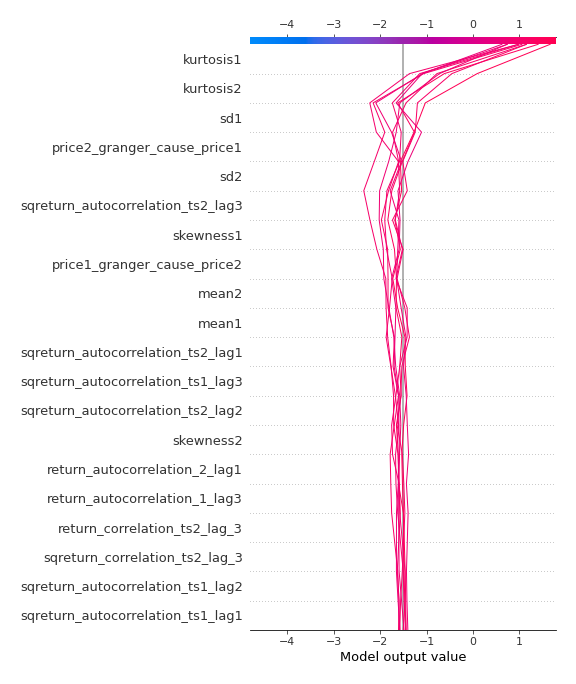
### Top-10 Best decisions for class 0 (Fold 1)
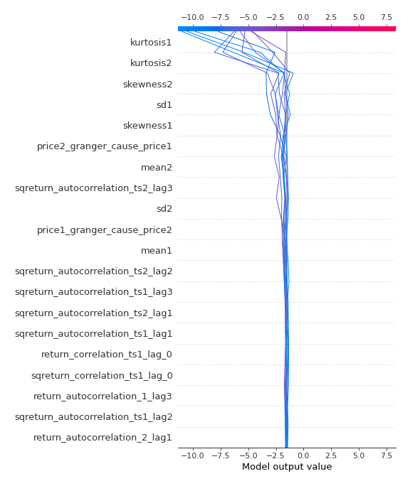
### Top-10 Worst decisions for class 1 (Fold 1)
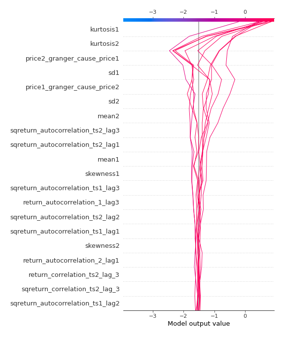
### Top-10 Best decisions for class 1 (Fold 1)
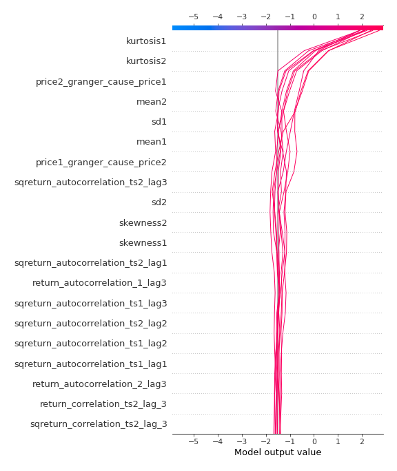

[<< Go back](../README.md)
